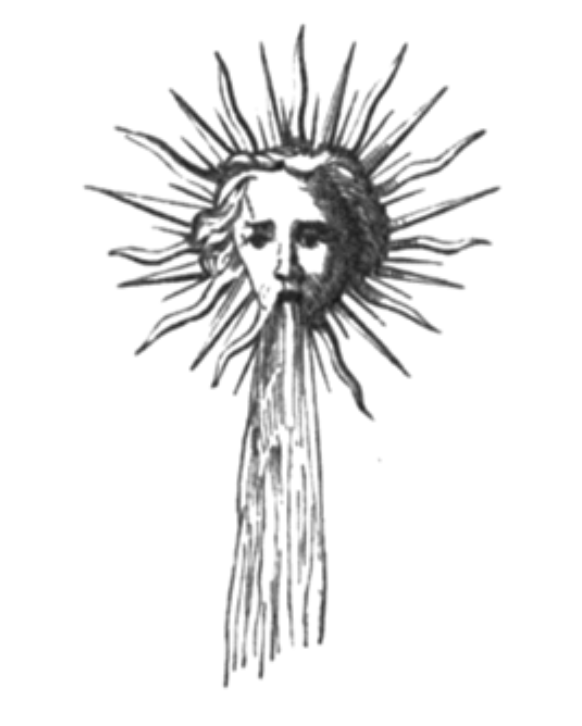

#  第一章

以上帝、慈悲者、施恩者、缓罚者、深富同情而圣洁者之名，本书为先知以诺所著。愿神祝福那永远深爱祂之人。阿门。

1\.  伊拿，马哈 — 加尔之子，为自己建造一座宫殿，柱立千条，高三百腕尺，野牛守护大门，宫内花木扶疏，有一庙宇。

2\.  伊拿在宫殿中央立一尊金像，人面、狮颈、牛身、鹰翼，以其为上帝形象，并颁令全国膜拜金像。

3\.  守夜人携妻儿与奴仆前来敬拜偶像，忘却了最初之神。人群自东西方蜂拥而至：洞穴居民；食鱼及爬虫、饮血并吸狮髓之人；食蛇之人；食甘蔗与蝗虫之人；食生肉之人。

4\.  亦有栖居树木与木筏上，猎鸟兽为食之人；食鸵鸟肉、犬乳、龟肉、甚至人肉之人，无不蜂拥至此王庙，在国王的神像前俯首膜拜。

太阳啊，祝福我的歌吧！
伟大的七重天之星，
主宰人间，统御各界，
穿越无垠，纵横宇宙。
噢，祢的光辉何其灿烂！
噢，普照天下的独一之神，
掌管著光的轨迹，
人间欢喜地仰望著祢。
噢，宇宙的荣耀，
祢乃公正、恩赐的至高天父，
愿我受启的灵魂赞美祢，
愿我的思绪歌咏祢的光辉。
祢乃无上光明，
祢的荣耀形象永照我心。
英雄们向祢祈祷，
祢亦不负其祈求。
东方喜迎祢高升的荣耀，
日正当中的光华如此壮丽；
当祢在璀璨的西方落下，
我们仍以爱与赞美仰望著祢。

5\.  夜里。我，以诺，只身留在庙内，对著金像静思。一阵暴雨袭来，雷电交加，阵阵不止，狂风呼号，吹掀了王庙圆顶，如注的旋风与雨泼洒入内。

6\.  瞧！一道闪光如天神落下，将金像从头到脚劈得粉碎，其宝冠破裂，权杖折断，如焦黑的尸体般倒地，支离破碎。雨声隆隆，将碎片冲刷殆尽。

7\.  眼见雕像被击垮在地，我不禁脱口：这便是我们膜拜的神明吗？神明竟向机运与风雨低头？祂无法预见风雨欲来，抵不住毁灭的恶击；祂在自己的家园中孤立无援，竟听凭空气的信使摆布。

8\.  而我，我该如何是好？我何须将自身的魂与灵，寄托在那非上帝之物上？

祢，在烈焰之中
教我领略祢的奥秘，
圣启充盈我心，
使我沐浴于光流之中。
永在之神啊！
请以静月的智慧披覆我，
照亮我深邃海洋般的灵魂，
使最幽深之处，亦能感知祢的光华。
我孤苦伶仃，始终只身一人，
感觉自己飘泊无依；
此岸是死亡，彼岸亦是死亡，
凄凉的云雾始终萦绕。
我徒劳地奋力接近永在之神，
在祈祷中永远追寻著祂，
但祂并未给我回应。
祂从未向我的灵魂
显现任何异象 ——
但我渴望一睹那至高无上之境。
天父啊，祢何时才赐给我？
我何时才能在庙宇中一睹圣容？
若能得见，我死而无憾，
因为我知道祢听见了我。
永恒的竖琴声
使我灵魂沉浸在泪水中；
光芒、微光与梦，
星空传来话语，
蒙蔽的双眼看见了异象，
感知到精微灵质的临在。
烈燄之光，火焰闪耀，
群星翻涌如浪，
那磁性的狂喜，
使我的魂与灵觉醒。

9\.  我离开那地方，渡河而过。我不再膜拜堤石。星光划破夜空，但我不再送上飞吻。我使灵高升至那独一之神。
我向祂寻求忠告与力量。
天，听啊，地，听啊，
所有美之子民，听啊：
宁可被所有人舍弃，
也不同流合污，成为恶者之王。
一切荣耀只归上帝。
夜幕离去，黑暗消散，
清晨来临，光芒复归，
当敬崇至高者；
没有人能与祂共享赞美。
上帝啊，让我们感谢祢的恩典，
夜夜日日，
在星空下，烈日下，
感谢祢赐予人间的一切。

10\.  此时，一位明艳胜过太阳的少女现身；她含笑说，来吧，此为命令。她领我走入荒野，那草木不生的无人之地。

11\.  入夜后，少女取袍立为帐篷，躺卧其中，并伸手唤我。她浑身散发如彩虹光芒。但我并未理睬，反而躺于沙地上，仰望星空。

12\.  她再度轻语：你是否已饥肠辘辘，几近昏厥？何不稍微进食？我答道：好的。于是她指著一只迷途羔羊说：何不宰羊食之？但我回答：不，我宁可饿死。这羊非我所有，牠走失了，主人可能正在找牠，我怎能窃食？我宁死也不吃。星辰照耀著我，而她帐篷上方的彩虹闪耀如昔。

13\.  天明，她起身上路，嘴角带著微笑，我跟随其后，尽管虚弱，但毫无怨言。我们步入荒野。夜幕渐落，瞧！路边有一瓶水。少女说：拿去喝吧。但我说：不，某位旅人不慎丢了水，也许会回头寻找，若找不到水，他恐将渴死。

14\.  入夜后，她又取袍立成帐篷。卧于篷中，并伸手唤我。但我仍不理睬，别开目光。我躺于沙地，直至天色微明。

15\.  此时，我见到一汪清泉，泉水凉如月光，还有一棵果实累累的枣椰树。我呼唤帐篷内的少女，但她并无回应，似乎仅有渐渐淡去的星辰对我低语。

16\.  我说：少女啊，莫非妳不是为传话而来？妳笼罩在神秘中，究竟是何人？我们在这沙漠已行走两日，妳未打破禁食，却仍如玫瑰绽放，散发满月般的光辉。如今上帝赐予我们粮食，看啊！妳仍不愿进食。

17\.  少女回道：以诺！我是你的灵中之灵，我洞悉、考验、也验证了你，现在我将离去。语毕，她离开了我，只身留下，孤单而疲倦地待在山中．星辰向我低语，光进入我心，我仿佛越过一片汪洋，置身于梦境之中。

美丽的祢啊！乘风而来，
越过万水，深入我魂：
让你明亮面容的阳光
照耀我全身。
我是什么？究竟为何物？ ——
罪恶一如棺衣裹覆，
我置身于恶人之中，
邪念孳生，劣根性深植于心。
我能走上前，对那土地的子民说：
「请跟我走」吗？ ——
日光在她脸上闪耀 ——

一切皆是天意。
