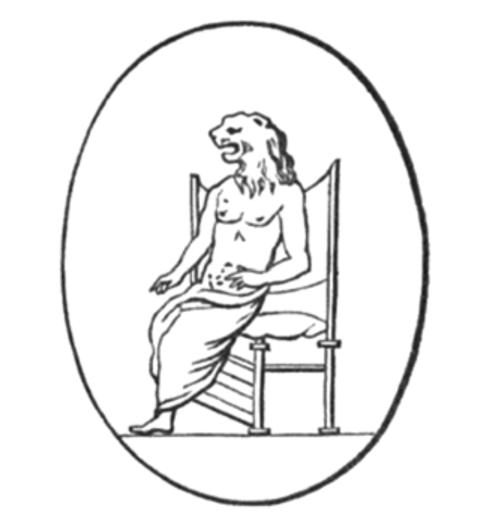

# 第七章

1.  揭露给以诺的话语：纯洁者如获祝福，在苦难之日得以存活；对邪恶不信神者则是障碍。我，以诺，与上帝同在；我答复上帝并与他对话，尽管我双眼被遮住，但仍看见一切；我见到天界的神圣异象。此皆为神圣诸狮神所展示的异象。



他们让我领悟万象，
使我充满理解，
我见到今日未发生
但未来将发生之事：
世世代代之后，
天界之子将光照大地。
我与他们交谈，并与
荣光现身的居民交谈，
是圣者和强者
人间的统治者。
在未来的日子里，他们将坐在锡安山上，
召集其军队，
展现出狮般的威力，
在天界之力的威严中。
万物将敬畏；
黑暗之子将惊骇不已，
万分恐惧，浑身颤抖，
被四散到大地尽头；
高山将陷入愁云惨雾，
丘陵将因羞愧而沮丧，
如蜂蜜般在火中熔化；
人世将被洪水淹没，
肉身后裔将因此消亡。
审判将响彻天际，
是的，义人亦将接受审判；
上帝的天平将权衡其功过。
但天堂之门为有德者敞开，
他们将归属上帝，幸福安居于祂的光中。
天界美丽者的光芒，
将彻底笼罩他们。
看哪，祂领数千圣人来临，
执行对恶人的审判；
罪人将因其罪孽受苦，
淫荡者将惊慌失措。
闪电在宇宙边界劈落，
传来隆隆雷声，
在黑暗中阵阵轰鸣，
见证那圣者的来临。