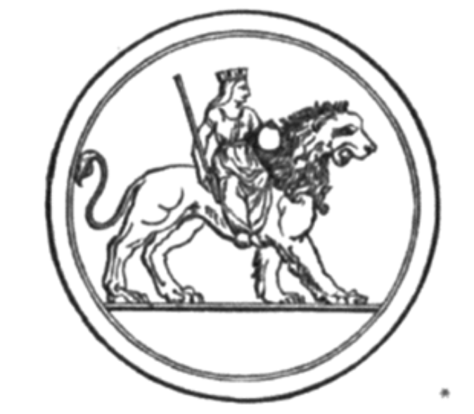

# 第八章

天界众生皆知天界的秩序；
星辰从不逸轨，
定时升起落下，
不违宇宙主宰之命。

高等智性体俯瞰大地，
洞察世间一切作为，
并记录事件起落，
从开始到最终的结局。
至高存有的每次显现，
皆出现于固定时期，
正如夏在冬之后来临，
云与露水滋润荒野。
当树木枯萎，叶片飘落，
美丽略显衰败之象，
他们深知万象终会更新，
娇嫩花苞将再绽光华。
当夏日来临，
焦干之地难以行走，
烈日攀岩亦不可行，
你欲寻求一处避暑绿荫，
此时树木将抽出新芽，
绿枝结出果实，庇荫众生。
那甜美阴凉的怡人树荫，
将取代冬日的枯枝。
此乃永生者的功业，
万象皆为祂所创，环环相转，
服从上帝，亘古不变；
在祂的统治下，万物更迭不息。
海化为水，水流入海，
周而复始，年复一年；
江海入河，河又入海，
万物流转，年年更新。