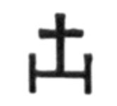
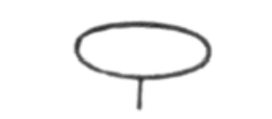

# 第十六章
我奉永恒者之命揭示真理。
吾儿啊，听我道来。
一个声音呼唤我，一个灵现身在我身旁；
我揭露之事皆须公开，
请聆听我口中之言。
亲爱的，请务求正直，
勿阳奉阴违，
勿与 三心二意 者为伍，
其巧舌如蛇蝎。
请坚守正直，矢志不移，
以真理为唯一伴侣：
她是从天而降的天使，
虽暂时栖居于尘世。
我深知不公存在，
诚然，它四处横行，
但即便是尘世，亦有报应，
罪人将被连根拔起。
让你的一切作为透露对主的敬畏吧，
报偿将唾手可得。
日出莫起，月落莫眠，
须先向圣名低头 诚服。
万灵中的至伟者，
天地智性的至高者，
众天界的首位者，
美与圣之泉源。
正义之主来自天界，
祂执行其圣律，
扫荡一切恶人，
使其在太阳面前消亡。
每座不洁之塔皆将崩塌，
与其看守者同受火刑，
种邪恶者乃播其祸因，
终将受刑而亡。
地狱燃烧的子宫容纳他们，
使其陷入黑暗与混乱，
从神圣临在面前遭驱逐 ——
火剑警告他们远离。
纯洁者将犹如从梦中醒来，
智慧大增，
罪人则将在剑下殒命，
亵渎者将受焚身之苦。
不信神者的恶孽将烟消云散，
邪恶者的居所将腐坏，
但伟大国王与审判者的殿堂
将永远耸立，威严永存。
生命的衣裳与万灵之主同在
纯洁恒久的光袍，
在祂面前，衣裳永不褪色，
衣裳的主人也光辉照人。
当先前的天界消逝，
新的天界取而代之，
纯洁者将在七重光芒中闪耀，
在主的光辉下，永享其壮丽。
无须哀叹时运不济，
万物皆有时，
真正的善人应挺身，
以美德，神圣与爱捍卫自己。
爱将在光瀑中
降临在真心爱人者身上，
他的道路将铺满玫瑰，
他将走在恒久的日光中。
从神秘异象，从圣灵，
我的灵魂有所领悟：
我从天碑中读到真理，
愿人类衷心接受。
吾儿，眺望多样的光之天界吧；
浩瀚的海洋与其丰富的宝藏，
岛屿、大陆、群山，
它们是从何而来？由谁建造？
谁令其熠熠生辉？
谁驱动其活动能量？
谁为其披上锦衣？
使一草一木皆威严壮丽？
难道非上帝 —— 那神圣存有，
那无限而智慧的光辉？
在凡人之中唯一的不朽者，
在消逝之中唯一的永恒者。

1\.  倾听我的声音吧，因为我所言乃是无人能述的上帝真理，此真理深藏我心，任何凡人皆无从述说。

2\.  我听见圣灵在天界合唱颂歌，声音轻柔，如香雾袅袅，上达天听。

3\.  汽球认识那圣者的你啊，要让心中充满神圣的思维，莫从不洁之事中追寻神圣，勿为世俗目的追求天上之物。上帝是永恒的，宇宙是永久的：上帝不受时间所限，宇宙则存在于时间中。上帝即是生命、光与爱，存在于光与暗之前，存在于永恒之外，可敬而孤高，无人能与祂匹敌，平起平坐。

4\.  上帝面前，众生平等，万物皆是上帝之子！凡人啊！莫忘记这条真理，要让真理铭刻于内心深处。晨起冥想，入夜反思：行走坐卧皆由此而发，生活始终不忘这条真理。

5\.  你可知悉上帝如何区分万物？试观树与鸟的差异，鸽子与孔雀的不同，榕树与玫瑰的区别。然而，人类有相同的骨架与体型，以相同的方式诞生，也以相同的方式离世，因此，要谨记在心：凡人皆是相同的。

6\.  创造天地的是那遍一至高力量、那至一的上帝：祂创造了海洋与风力，赋予闪电光芒。

7\.  宇宙乃上帝的气息，依重力、流体、离心力的法则运转，历经百万年岁月，而趋于十全十美。

8\.  上帝非太阳，但祂乃太阳之美；上帝非海洋，但祂乃海洋之壮阔；上帝非风，但祂乃风之迅捷；上帝非光，但祂乃光之辉煌。上帝为万物本质的源头，使万物神圣灿烂；因此，万物的圣洁荣光不过是祂的微弱映照，正是神的特质使万物生辉。

9\.  那至高存有乃生命、光与智慧，名为三位一体，实则为同一股能量。祂自微小的原子中铸造了一切存在、一切可见与不可见万物。

10\.  祂自翻腾的黑暗风暴中，从各冲突力量的混沌中，形成了明亮和谐的以太之海，宁静安祥，肃穆优美。

11\.  但当天界的和声响起，星辰、海洋、河流皆陶醉聆听；天空为此天籁欣喜，大自然与天界协奏。

12\.  那孕育宇宙的混沌，无形无质，亦无和谐能量，但能任意塑形，缩为理想比例。它无存在之起点，亦无从毁灭，而是不断转化：从中出现所有生存模式，物质的一切外在显化。

13\.  在宇宙尚未被塑造成美丽之前 ，上帝充盈著所有空间，无处不充满了无限智慧，直至那永恒心智开口。其后，神圣杰作形成， 灵光收摄于一个圆中 ，将新造物围成宏伟壮丽的球体，仿佛置于环中。

14\.  此宇宙充满生命，既有可见形体与形象之灵，亦有肉眼不可见、仅可见于阳光普照之界域的灵。

15\.  金星因受其他星球阻挡，在地球投下的金光阴影，好似这些在明亮之地游荡的稀薄以太光体。他们非男非女 —— 可任意改变外形，或为庄严威武的英雄，或为荳蔻年华的少女。

16\.  宇宙分为九圈，九个光芒四射的辉煌界域，其外是永恒上帝的天界，含纳著祂所创造的所有界域。

17\.  那天界分成三个空间：仅有上帝能居住的「空间之圈」；含括一切存在的「起因之圈」；万物皆能到达的「幸福之圈」。

18\.  但一切星空之美终将消逝，未来将不复存在；它们因火而变，随水复苏，恰如古时一般。上帝将自远方降临，踏平山脉，在祂脚下，群山让位，山谷变直，大地之柱倒塌，至高之神的声音将响彻天际。宏伟的天界为之震颤，海洋将升起惊涛骇浪。太阳消隐，月光尽失，但届时将无死亡，亦无毁灭，一切将焕然一新，转化得更加华美。

19\.  如同大地孕育花草树木，但本身既非树也非花，而是将其美含纳在树的种籽或青翠的花苞中；大海孕育贝壳与玫瑰，但本身既非贝壳也非玫瑰，而是将其美含纳在蔚蓝的宏大怀抱中；运转全宇宙的天父更是如此，祂是所有物种之灵的起源，众生源自祂，在祂之中，透过祂并借由祂而存在，但又与祂截然不同。

20\.  吾儿啊！要永远信仰上帝，寄托信念于祂，相信祂是公正的天父，必赐予每个造物应得的报偿。只要怀有信念，祂必不会令你失望。

21\.  人有灵、魂与肉身，三属性归于一形。灵非物质，不会消亡；肉身终有一死；居于两者之间的魂是芬芳精髓，既属尘世，亦属天界，能超越尘世到更高界域，惟无法进入至高之地。

22\.  上帝给予人良知，此守护天使告诉他何为正当，每当他心生邪念，良知就起而反抗。吾儿啊！让此天使成为你一生的向导。

23\.  人心中伟大辉煌的灵啊，你以肮脏大地的垃圾为食，向狮学习吧，牠宁可饿死，也不碰鬣狗遗留的残羹。

24\.  向往自由的灵终将获得解放，它望向以太天堂，渴望跃入那辉煌之中，从其肉身牢笼中解脱。

25\.  正如人死后，肉身将蜕变为新生形式，在花草虫蚁中茁壮，其灵更是如此，不朽的灵将进入有别于先前的存在形态。

26\.  上帝的十二化身乃十二座闪耀的山，散发宝石之光，中心燃烧著生命之火，其能量一如那熊熊烈焰，生生不息。

27\.  天父的殿堂即是宇宙，有十二个山域或十二座山，各山皆有一救世主，引领其浩大的追随者上升。

28\.  自十二口闪烁的纯水之井，流出十二条河。十二口井即救世主的灵，十二条河则为其福音。

29\.  天界有一本光之书，共十二章，每一章皆为一位转世救世主的圣洁福音。

30\.  上帝所订之圣律绝不更动分毫。人类的法律充满瑕疵，随时代而变，上帝的法则完美无瑕，永恒不变。

31\.  上帝是永恒的。人们称呼祂「恒久」并不正确。「永恒」无始无终，「恒久」则有开始，只是没有终结。

32\.  上帝派遣其真理的神圣信使至人间以及其他界域。 仰望满天繁星 ，所有星球上皆有其救世主。

33\.  正如人的生命需要新鲜空气，没有则消亡；灵与魂亦然，若无真理（即其生命）的源源灌注便会消亡。

34\.  上帝以那首位出生者为媒介，实现其神迹伟业。此为上帝之灵，恒久地使万象更新。

△
35\.  上帝的天堂界有一座泉，
橄榄树与棕榈树环绕四周，
太阳自其中央升起，
金色星光自那银色地带出现。
湛蓝的水面莹莹灿灿，
犹如孩童的深邃蓝眼。
涟漪在阳光下闪烁，
如千颗翠玉般耀眼。
上帝的朝圣者啊！你是否寻觅著此泉？
你是否想品尝那甘美泉水？
永恒的流浪者啊，跟随我，
我将带你前往绿色幽境。
看哪，太阳领我们前行，
太阳本身即是明路所在。
朝圣者啊，莫倒下，莫疲惫，
天堂之泉，近在眼前。
我们抵达此孤寂之泉时，
见一双眸美丽的少女，
她比破晓的曙光更温柔，
她的浅笑是夏日的玫瑰。
她洗净我们的双足，将浓郁的香水
倒进我们的手心与沾满风尘的发丝。
我们歇息时，她奉上甜酒，
那蜜饼之甜美，更胜仙馔。
36\.  你不可敬拜任何偶像，
你不可杀人，
你不可亵渎上帝之名，
你不可追逐已婚之妇。
你不可窃取他人财物，
你不可行不义之事 ——
此为我在天界听到的六大戒律，
来自那神圣不可侵犯者。
37\.  人类在山脚祭坛上
向风献祭，但徒劳无功，
人类的祭司挖掘沟渠，
唱法术召灵，亦是无用。
枪矛刺穿柔软的鹿皮兔毛，
掷枪的手何其可憎，
但不杀生之人，
面容将散发睡莲般的光辉。
38\.  吾儿啊！让这条真理在熊熊火焰中，深刻有力地刻划在你的灵魂中；唯有美德是真幸福，邪恶是无尽的悲惨之源。
39\.  所有恶起初脆弱，但生长茁壮后，最终连大能者亦无法克服；之后，恶在上帝与大地面前无耻横行，致使每个罪行都有辩护者。
40\.  上帝之名，含藏著一个伟大的奥秘， 除非出于神圣的目的，不得随意说出。必须在清晨日出之前、日落之后、用餐前以及休息前才能诵念。
41\.  灵来到上帝面前，其一切功德皆归上帝，他崇敬上帝为至高之主，自己则是祂的仆人，上帝为其唯一的主。

42\.  通往天界的路明亮美丽，散发著晶莹荣光；此乃以闪烁光芒铺就之路，阳光环绕，星光熠熠。但恶人无缘见之，它无法出现在其阴郁的目光中；它如七彩之弧般雄伟壮丽，但恶人眼中仅有黑暗与空虚。

43\.  天堂之地有一团金火，太阳每一运行，纯净之灵便穿火而过，因而其始终明亮，清新如花朵初绽。但若不慎，哪怕仅是一念之差，误入金火中心 —— 必在痛苦与混乱中被驱逐。

44\.  天界有一座星光之泉，美之灵于泉边沐浴，因而春青永驻，焕发光彩与一切圣洁。但若不慎，哪怕仅是稍一走神，踏入泉中 —— 其会当即化成一座流火之井。

45\.  尽管夙夜匪懈，人仍无法使自身变得彻底纯洁；那是否应索性罢手，自暴自弃？ —— 此举只会使他变得彻底不洁。

46\.  就如太阳的光芒散发著幸福与光辉，上帝给予的爱乃天堂有福者的喜悦。

47\.  上帝的纯洁天使能瞬间穿越天界，以闪电之翼翱翔，来去自如。

48\.  上帝喜隐蔽。渎神者看不见祂。耀眼的光辉围绕著祂。谁有幸见其容颜？祂是永恒、不可见、无所不在的，凡人的感官无法感知祂，连心智亦无法想像。一切存在皆无从理解其 祂 。

49\.  一切生命皆来自上帝，来自那宇宙天父。地球上的每个生命本质，皆蕴含恒久生命之火。

50\.  未来将出现另一界域，所有善人将生活在其阳光中。未来将有另一界域，所有恶人皆将在此凄凉悲泣。

51\.  不可见之灵驻留于肉身中，

如同和声驻留于笛中；
无人能见音乐，但音乐就在那里。
人见不到灵，但灵亦确实存在。
52\.  待肉身死亡，灵便化为其他样貌，依其习惯与意图，化身为其渴望的存在形式。
53\.  除非获准，儿子不应在父亲面前坐下；智者不应接受卑贱者的赠礼，受 肮脏的 黄金玷污。
54\.  日出之前，不应口出庸俗之语，应在神圣冥思中，默想使旭日升起的上帝。

55\.  婚姻是所有人的神圣义务，强壮者不应独身，留下子嗣继志述事者，乃幸福之人。
56\.  那不与丈夫共寝的女子，是纯洁无暇的处女吗？她如污水般肮脏，不配得其爱。
57\.  但贞洁的妻子是家族的荣耀，她养育子女，是男人的尘世灵魂、另一半与挚友、他所有幸福的泉源。

58\.  她以温言婉语，成为孤寂者的朋友、受压迫者的母亲，在疲惫的生命荒原中，是其喜悦与安慰的清泉。

59\.  编织、纺纱、刺绣的妇人之手是美丽的，她以亲情与温柔养育子女，将每个孩子当成心肝宝贝守护。

60\.  崇敬那神圣者，

此乃首要之责，
使心灵纯净，
遏止所有恶欲。
吾儿啊，要尊崇那全能之神。
唯有不惧神者才要恐惧，
唯有德行才蕴含智慧，
不敬神者愚不可及。
自我抬举，便是崇尚地狱，
敬拜至高者则能置身天界。
恶人永陷黑暗，
纯洁之人则获光之庇佑。
勿以圣名起誓；
勿向凡俗致敬；
你的灵若无法超越凡尘，
未来仍难脱俗世。
要努力认识上帝，
不识上帝，即不识自己；
若凡人知未来如何，
必惧于犯下罪行。
上帝乃一面闪耀之镜，
映照宇宙样貌，直至细微末节，
宇宙中的恶行，
无不现形在其清明光辉中。
 