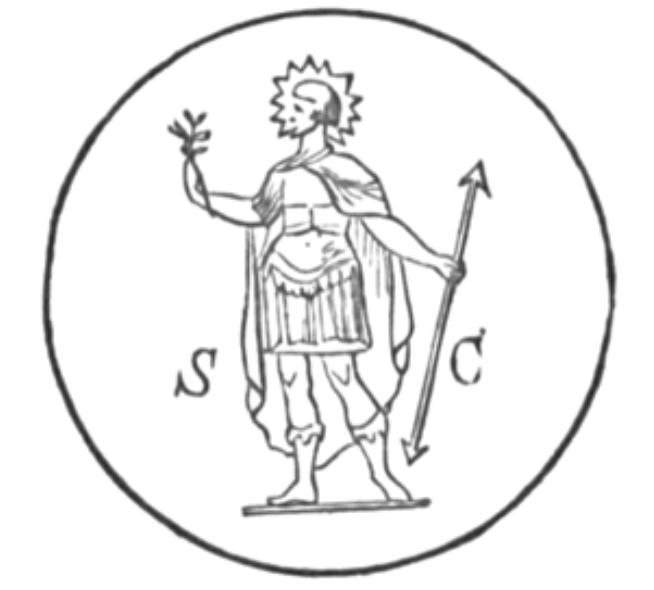

# 第十七章
此语方出，
一阵旋风将我卷上天空，
带往西方，
我见到许多奥秘。
一座铁山，一座铜山，
一座银山，一座金山，
一座液态金属山，
还有一座铅山。
我问那狮：
「我秘密看见的为何物？」
此问令牠一阵惊骇，
如地震扯裂大地。
狮答：「你所问及之事
是为那将到来者而铺设，
祂将掌管你们人间，
颠覆帝王的宝座。
等候吧，不久你就会知道，
你将如读一本书般尽窥全貌；
那秘密的时辰终将揭示，
在上帝所指定的时辰。
金银将变得一无是处，
铁剑铜甲将完全失效，
青铜、铅或任何金属亦然，
尽管恶人寄予希望。
但此处的每一座山
都是那将到者的仆人：
使人类承认真理，
在他宣扬的话语前俯首。

烈焰围绕的群山啊，
古树如深灰发丝，
溪流如白色海沫，
每个孔隙皆散发荣耀。
上帝的「太阳 - 牛」在你们的黑暗洞穴中
安歇，如隐匿未现的闪电；
众多大能圣者
对此神圣的奥秘沉思良久，
因此，在你尊贵的面前，
我应屈膝，感受那庄严影响力；
或许从你们的深处将出现
一位大地的帝王。
此为阿姆利塔湖 ——
其湖水将永远闪耀；
但水中有一条大蛇守望，
妄自接近者必遭不测。
泉水化为吞噬的烈焰：
大蛇千变万化。
接近此地的恶之子，
将如染疫般遭受重击。
他们将狂风猛击下，
遁入黑暗之谷，
他们再也品尝不到圣泉，
就像凡人无法于火中求生。
美丽的浪花与水波啊，
如天界的白足般闪耀，
我的魂随浪而起，向你涌升，
我向往与你交融。
蛇在你的胸口滑行，
鼓动火翼，
浸入你闪烁的美，
从触动中孕育新的美好。
牠们披雷复电，
从巨大的火炉中起身：
噢！但愿有此一刻，
我能沐浴在你明亮的怀抱中。
天主曾言：
「信使登上宝座之日终将来临，
届时纯洁者将戴上主教之冠，
选择自身的宫殿。
信仰我的人有福了，
天父将赐予他们喜乐，
中选之人将与他们同在，
如同父母与孩子同在。
我将装饰天界光辉灿烂的面容，
给予他们新的喜悦，
我将赐福于它，并以光彩将其披覆
即便只是为了那些圣人之故。
我也将改变地上各界，
使其转化为光明美好；
使子民们以全新的狂喜
看待世事。
渴望星空的圣者
将安居于星辰宫殿，
但不义者，撒旦的追随者，
将见不到那焕然一新的地上各界。
我凝视著他们的日常生活，
有如行尸走肉，
对不假思索者而言，他们似乎活著，
但在智者看来，他们与死去无异。
就如死尸不会如生者般行动，
耽溺逸乐者亦无法
与活跃灵质共处，
无法与运行的光明之灵同行。」
吾儿啊！当听上帝之律令，
此乃你必须奉行之令；
亦应认真思考我揭露的真理，
沉思其中的智慧。
你生于尘世肉身，
而此肉身将归于尘土。
生前的荣华富贵皆会消亡，
唯有天属之物能随你而去。
凡人所贪求之物，
皆与肉身一同消亡，不复可见，
但天之子所积之德，
将随其灵来到上帝面前。
海洋、山脉、森林、
星辰、日月皆将衰亡，
但善人的功德永不消逝，
其美好将恒久闪耀。