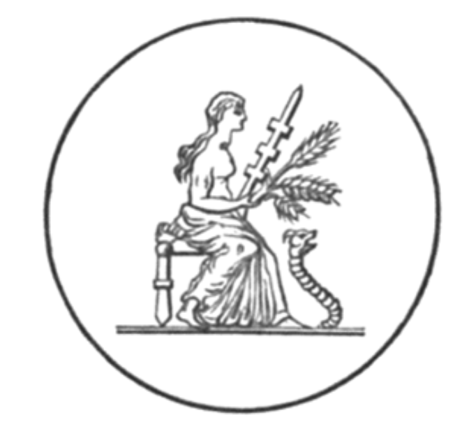

#  第二十六章

1\.  其后，他问：「谁愿前往？」一幅异象随之出现。

2\.  一个少女现身。她散发著青春光芒，远胜天界的众星之光。

3\.  少女生有双翼，袍长至足，雪白的翅膀闪烁著天界星辰的荣光。

4\.  她右手持棕榈枝，左手持神秘法杖，飘浮于紫光中。

5\.  他说：「你看。」我看见另一幅异象。

我们仿佛穿过了阴郁的黑夜，
进入晨曦灿烂的光辉里；
金云在荣耀的波浪中翻涌，
每朵云似乎都怀抱著一颗星。
甜美的嗓音吟唱圣歌，
轻柔的歌声如夏雨洒落，
从一座幽深洞窟中，
传出了大天使的颂歌。

6\.  他又说：「你再看。」异象倏然而过。先是一人站在天界，左臂外伸，右手持曲柄杖，掌心众星云集。

7\.  之后出现另一人，身穿星袍，戴著王冠，右手持鞭。

8\.  第三人的身影出现，如真理般光裸无暇。一条巨大星蛇游动手中，诸天因他的出现而辉耀灿然。

9\.  第四人是位英雄，散发出大天使的光辉；他呈跪姿，带著箭矢，右手持棍，左手捏碎三头怪。

10\.  第五人充满了青春与力量，右手持圣镰刀，左手握蛇头。他的双足带翼，以光速飞跃天际。四肢闪耀著璀璨荣光。

11\.  第六人现身，乃芬恩之后裔，立在天上的十字形中，表情肃穆。

12\.  在他之后，我见到一个可怖的半人半马。他拉弓射出巨箭。云朵纷纷惊恐退散。

13\.  接著我见到一对披星双胞胎，眉间、肩头、四肢皆缀满星光，其中一人拿琴，一人持箭。

14\.  接著是一个骇人形象，其头脸皆似人类，却有战马的腿与身体。他以征战姿态行进，全身笼罩于光辉之中。

15\.  第十一人是战士，著胸甲，持盾与锤矛。一位披星巨人，腰际闪闪发亮。

16\.  第十二人是位青年，眉心缀有一星，身体与四肢熠熠生辉。他倒持一瓮，瓮中的星光倾泻地面。他的荣耀数字是 12 乘以 9 。

17\.  天使告诉我：「十二。」又说：「十。」接著说：「光，荣耀，生命。」我听见天界传来圣歌，但我已迷失在奥秘之海中。

日之子啊！见见此碑文吧 ——
它烁烁生光，
微光落于字里行间，
黑云笼罩四周。
我见到一根美之权杖，
如优美的棕榈树般摇曳；
我见到一只强大的臂膀，
一落下死亡便降临。
一朵云再次飘过，
晶莹澄澈如水晶，
仿佛天界的日灵
吟唱起一首新歌：

你比人子更美丽，
恩典流入你的唇，
因此，上帝永远赐福于你。
准备好腰际的利剑吧，
大能者阿，
你气盖山河，权御天下。
在荣耀中英勇地出征，
为真理、顺从与审判，
你的右手教会你可怖的事。
你的箭矢锋利，
迅捷射进敌人心脏；
你的足下死伤无数。
国王啊，你的宝座将屹立不摇，
你治理王国的权杖，
是神圣的权柄。
你喜爱正直，
憎恶不公，
因此，上帝为你膏抹。
你的所有衣裳散发著
象牙宫殿的没药、芦荟、桂皮香，
你在这薰陶中变得美丽。

我望见一支战车队，
战车上载满战士，
他们乘风而来，从东方，
亦从西方与南方。
我听见战车辘辘，
地上的圣徒亦有察觉；
大地的柱基为之动摇，
轰隆之声震动传天。
车轮卷起旋风，
风驰电掣地前进，
如幼狮怒吼，
如怒海咆哮。
他们全数俯伏在地，
敬拜神圣的万灵之主。
圣徒们啊，你们获得福佑，心地纯洁，
你们的前途明亮而荣耀！
你们将生活在阳光之中，
在恒久生命的纯洁光束中，
你们将永生不朽。
圣徒们的寿命将永无止境，
他们心地光明，为人正直；
与宇宙之主同在者，必得安宁。
正如黑夜遁离之际，
太阳使真理升起，
在万灵之王面前，
永明之光将永恒照耀。
其后，我看见成千上万
不可计数的众灵，
站在天界宝座前，
和著琴声与笛声吟唱。
在天界宝座的四翼，
亦有其他灵围绕；
天使向我宣告
其名称、等级、阶层。
他们祝福并赞美荣耀之主。
第一个声音永远祝福祂；
第二个声音祝福信使，
以及真理的殉道者；
第三个声音柔声恳求
解放被束缚于尘世的人，
他们忧伤的心发出哭号，
哀求万灵之主；
第四个声音告诉撒旦们：
「滚吧，受诅咒者，
你们不准接近主，
你们玷污了律法。」
至高之神身边的灵
在四道雷声中说出此言；
我听见四者的声音，
如愤怒的复仇之海。