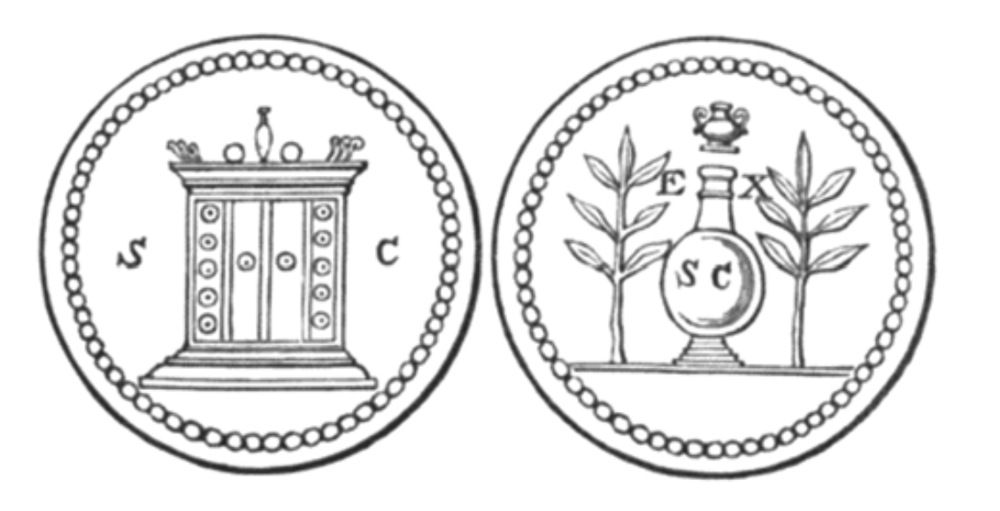

#  第二十八章
此花园绿意葱茏，草木扶疏，
芬芳圣树四处林立，
形形色色，缤纷多样，
如圣城般万紫千红。
善恶知识树
亦立于林中，
如一棵罗望子树，
结出状似葡萄之果。
其香气远播，
光芒四射，
「此树美不胜收，」我说，
「其外观何其怡人！」
其中一位璀璨之灵回答：
「这是善恶知识之树，
凡渴望变化的灵，
一旦取食，便立刻转生迁化。」
因为众灵皆出自上帝之手，
在宇宙间自由来去，
拥有充分的意志，
此处并非奴隶之地。
如同宇宙有光亦有暗，
美与丑同时存在；
依据永恒法令，
他们可任意倾向某一方。
只渴望美者，
必完全远离此树果实，
沐浴于神圣阳光下，
心满意足地生活在天国之梦中。
但渴望获得知识，
无论善恶之人，
他们将来品尝此树果实，
如同许多伟大的人曾经做过 。
其后，他们将步入他境，
因为唯有如此，方能获得知识，
但他们要付出庞大代价，
拥有此宝石将十分致命。」
「宝座前的至高之灵
永远不识人间滋味，
直到其置身人之处境，
体验人的所有思维演变。
此树生长在此，
为的即是那自由意志，
但凡渴望改变自身处境者，
一尝果实，即可如愿。
上帝是爱的散播者，
亦是生命与美的散播者，
但若无死亡带来变化，
幸福终将使人厌倦。」
听罢，我高举双手，
对那神圣伟大之神表示感谢：
主啊，王啊，祝福祢。
祢的威严伟大而圣洁。
诸界万物之主 ——
王中之王 —— 无边之上帝，
祢的统治、祢的智慧，祢的慈爱，祢的法律
将世世代代永存。
祢的统治将延续千秋万岁，
祢所创造的灵将朝光进化，
天界将永远是祢的宝座，
众星不过是祢的足凳。
祢无所不知，
祢无所不听，
无论在光明或黑暗中，
在祢面前，一切无所遁形。
祢照料众生，
满足万物所需，
无论何者趋向完美，
祢皆无所不备。
天上或人间，
无处不展现祢无边之爱，
无限宇宙中，
万物无不雨露均沾。
我见到三位光耀天使，
各自驱乘一辆马车，
一只金碗的幽影
在其眼前的远方闪耀。
光聚集在其上方的天穹，
太阳，星辰的金色荣光，
月光般的光束，
还有以太彩虹。
炽天使 —— 那些翱翔的王者 ，
浑身散发虹彩光辉，
个个闪烁著无数眼睛 ——
看啊！沿著光明之路，
智天使踏火而来 ——
来自那金色香坛，
在他们眼中，一股力量的灵
遍及广袤的无限宇宙。
你见过风暴中的太阳，
但他们庄严辉煌，犹胜一筹；
你见过战后的月亮，
但他们宁静皎洁，更有过之。
接著，座天使迅速飞掠，
脚下生风，
他们是太阳之王，
但其秘密，我暂且隐而不述。
星辰围绕著那双形者，
日光照耀著那六翼者，
其剑光在紫雾中闪烁 ——
权杖如橄榄树般挺拔。

一朵云飘来，将我攫起，
风带我从此天界高升，
落于一片圣地，
那里雷电四起。
我见到另一景象，
圣洁纯净的天界宫殿，
众灵于此赞颂上帝，
为人子求情。
艳阳下的天界四处游移，
洒落爱与美的露珠，
正直在他们眼前绽放，
光辉满溢，普照天下。
这无数耀眼的灵，
将历经千秋万世，永远闪耀，
他们安居在永恒者的羽翼下，
吟唱星辰的韵律。
他们站在祂面前，如 活生生的火焰 ，
如蜜之口，带来祝福，
双唇声声赞颂至高者，
浑身焕发著美德。
我渴望留在那里，
我的灵向往回归家园，
我亦曾如他们般，站在上帝面前。
因此，我颂扬祂的圣名。
祂是有福的，永享福泽。
星辉之地的主啊，
在宇宙形成之前，一切消逝之后，
大智大慧，永垂不朽。
何为地上？何为人间？
沉睡而不赞美上帝者将如何？
一切不过是遇冬枯萎的树叶；
他们曾存世，而如今不复存在。
但祢的光将赐福予
清醒站在宝座前之人，
他们歌颂纯洁之主，
祂使生命宇宙充满了爱。