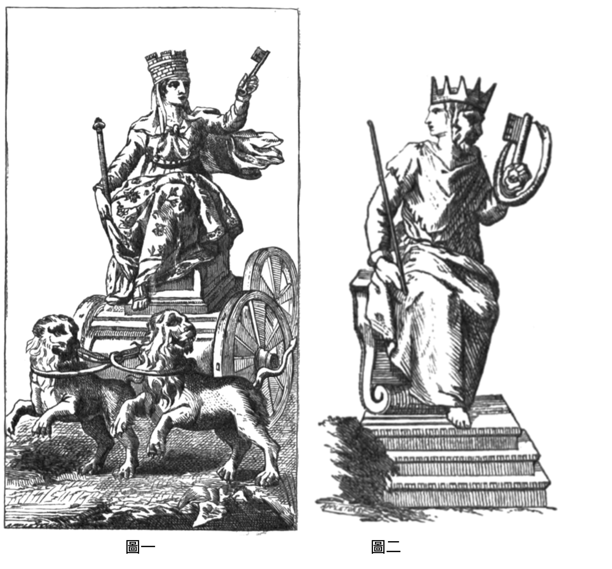
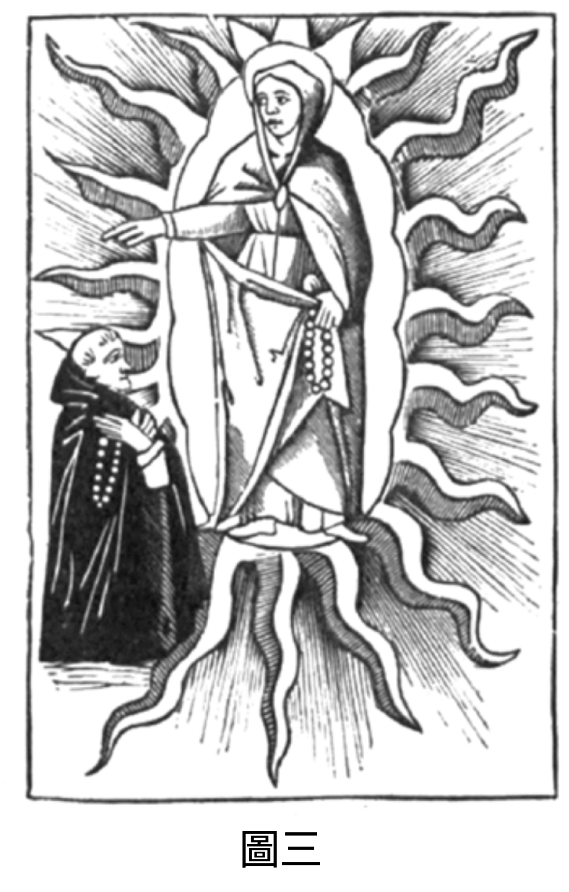
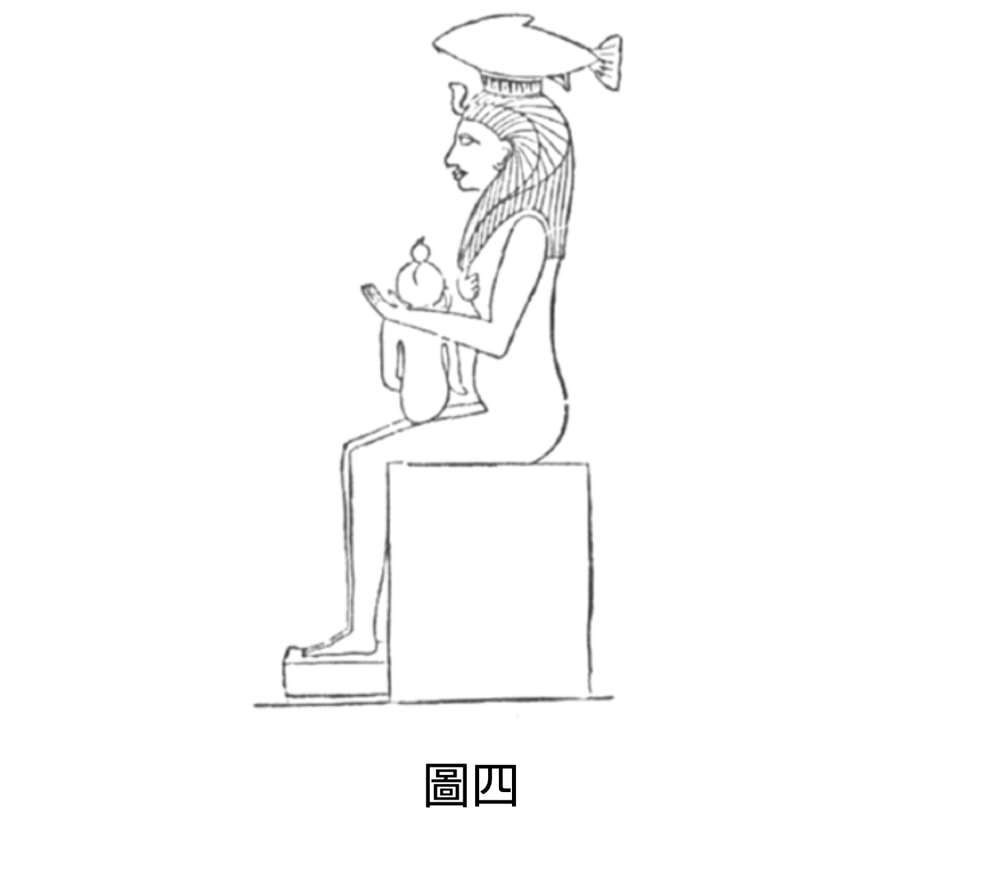
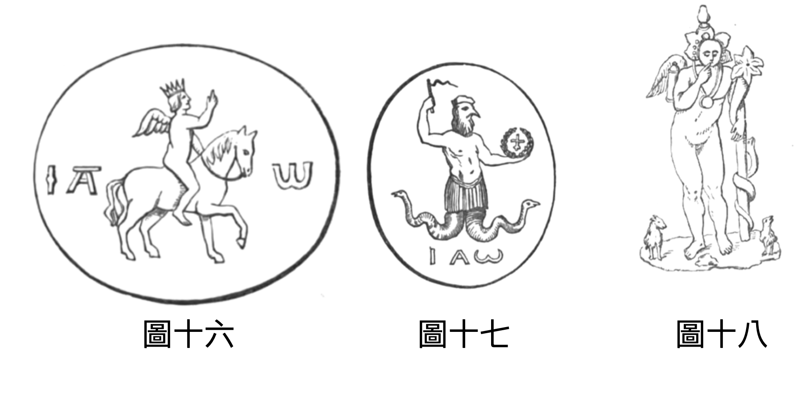
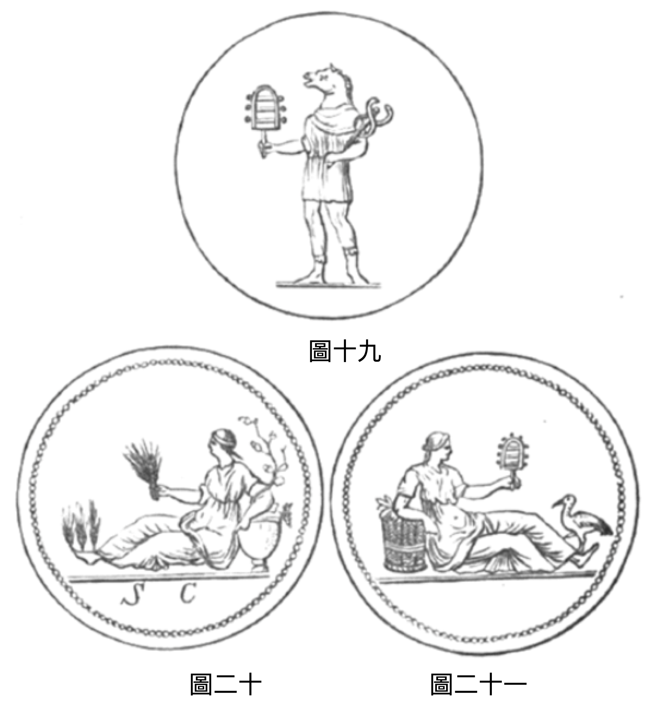
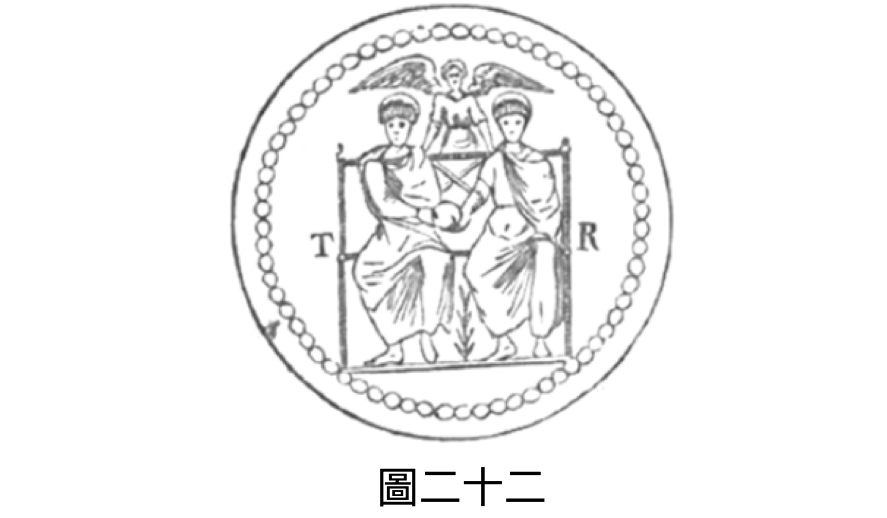
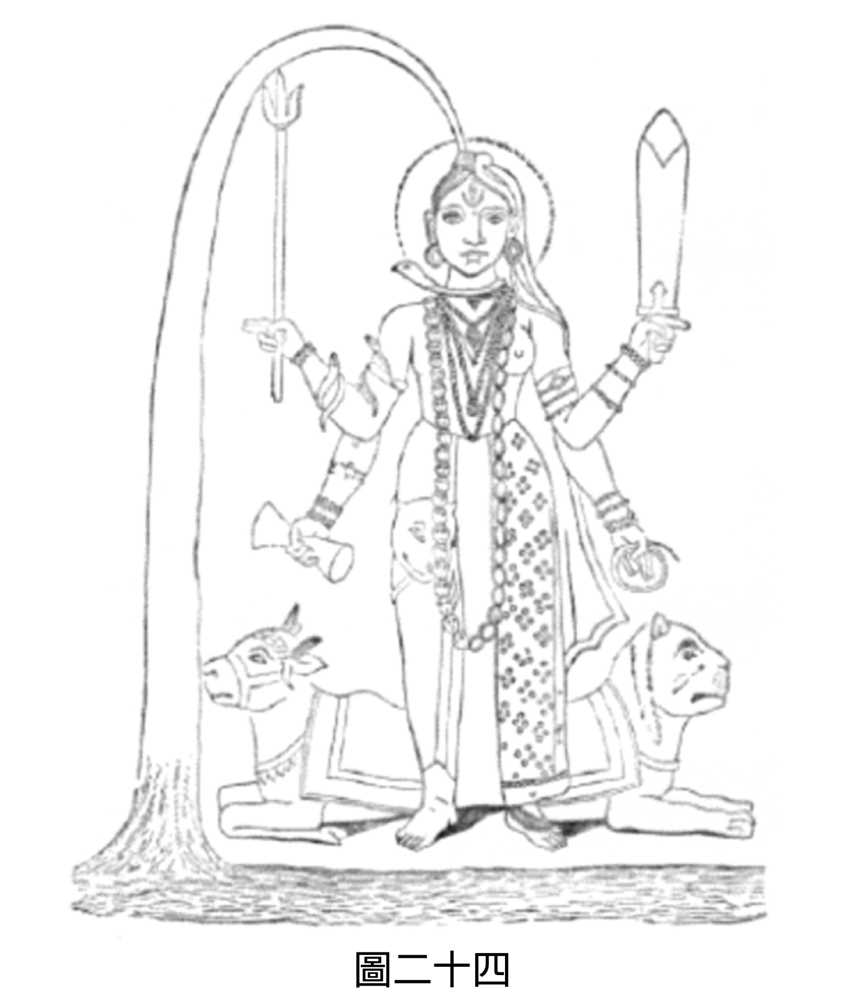
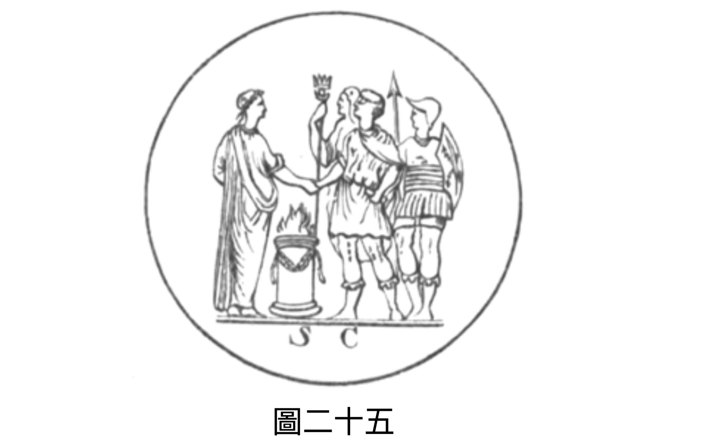
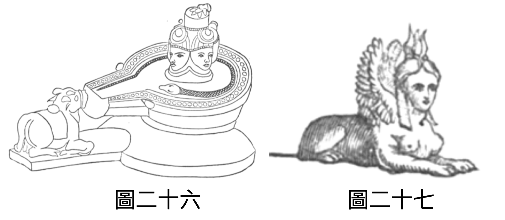
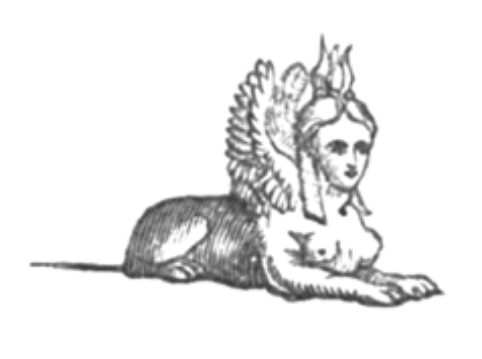

# 《以诺书》评注

1. 我们要检视以诺的异象是否与第一位信使 —— 欧涅斯的异象一致。两者之间有个需注意的区别：第一位信使的异象是单一且完整的；而第二位信使则有数个 异象 。欧涅斯，或称本初佛，以预言般的辉煌一瞥，洞见了从他自身时代 一 直到第十二周期、乃至更 遥远 的人类地球历史。而以诺则未获 得 此全景之恩宠， 只见 天 界 多样且不断变化的辉煌景象。 其 描述极为丰富，几乎取之不尽；没有哪本书能展现出 比这 更壮丽的天界景观。至于两者所详述的天界体制，当然没有分歧。如《启示录》中所 示 ，天界的等级体系主要包括： 1\.  至高无上的造物主上帝； 2\.  伊萨、伊西斯或圣灵，也称为阿尔卡、阿尔奇、活火、梅塔特罗诺斯， 这 两者共同构成了原始神学中的 Ao 、 Oa 或 Aleim 。有时他们是分开的：上帝为王，伊萨为后；有时又融合一起，如钻石中的光与物质，或如阳光与空气交融。 祂 向人显现时坐在宝座上，壮丽如钻石与烈焰红玉髓，这些意象传达了极致的 辉煌 、纯净与令人敬畏的荣耀；宝座周围常见天界 的 彩虹，以温和之姿加冕神圣君主 ，乃上帝 的象征。圣灵在另一种形态中，独立于至高主 而 存在，在后文出现。她被描绘为身披最纯净、最辉煌的光芒；饰以太阳、月亮、星辰，象征著知识和尊严。她 拥有 光彩服饰、高耸宝座（以第二颗光体为脚凳） ，其 冠冕不是钻石或红宝石，而是天上的群星，这一切都显示了她的伟大 ，以及 在天界之王心中的崇高地位。古希伯来人有时将  AO  读作  א ， תא （十字）象征上帝或男性原则， ת （ 三石门 ）象征女性 原则 。这可见于《光辉之书》、《巴希尔经》和《正义之门》。灵 （Ath） 加前缀 Ｎ， 则 是 全球常用的神名，与埃及（或更准确地说是非洲）的奈特 神 本质相同。这种二合一 的 本质 美丽而 伟大， 使 第一位信使起初无法直视其真容 ； 若 未 经 过 考验、 未验证其 尘世本性能 否 承受真实 的 荣耀， 那么 只能看到幻影的预示。正如人凝视太阳会失明，最终只见黑暗；即便是大天使之眼，若直视上帝的耀眼光辉，也 是 如此。

2\. 史威登堡曾见到这至美的灵，以「灵-太阳」的形象出现， 尽管 他不自知。他称之为「灵性太阳」，其光辉之耀眼，物质太阳 相比 不过是其微弱的映象。他说， 上帝 之爱与智慧是实体与形体，在天界中显现为「灵-太阳」，这不是上帝本身，而是上帝的最初、主要的散发物。此太阳的热是爱，光是智慧。 此 太阳看起来离天使有一段距离，并且位于适中的高度，如我们世界的太阳。

3\. 在另一处，他用古语「 上帝 之家」 来描述她。他说，有一日清晨醒来，「灵-太阳」显现于他眼前。天堂在下方， 其间 距离如物质太阳 与 地球 的距离 。与此同时，他听到无数不可言喻的天籁，最终汇聚清晰地表达了神圣的话语：「只有一位上帝； 其 居所是「灵-太阳」。」这些话语自天堂降至他所在的灵界，因距 离 源头已 遥 远， 因而无法 理解。其所含的「唯一上帝」神圣观念，堕落为「三位一体」的错误观念，认为有三位神。 物质太阳的所有光辉与温暖皆源自「灵 - 太阳」。须知，斯芬克斯有十二乳、戴十二瓣玫瑰冠，象征十二信使之圣母。我从基尔克神父的《埃及之谜》（第三卷 541 页）抄录了这一美丽象征图像 ， 类似形象也见于蒙福孔的著作中，以灯的形式出现，作为 传递「光」的 媒介（ 《 创世纪 》 1:3 ），即「灵 - 太阳」。此灯曾属于托斯卡纳大公。 

4\.  这种纯净的散发物（圣灵），埃及人称为奈特，示巴人称为莱赫姆，被视为力量与智慧之女神；她是 首位 源自至高者，也是唯一拥有部分祂伟大属性的存在。智慧是心智最高贵的品质，而神的心智则是智慧的极致完美，其所有属性皆为智慧之属性，其力量始终受智慧指引。因此，力量与智慧被视为神的属性，二者实为一体。贝洛娜、库贝勒、密涅瓦、狄安娜、伊什塔尔、巴瓦尼、奈特、维纳斯、刻瑞斯， 都只是 同一人格化的不同名称。希腊人与埃及人都认为她兼具雌雄两性，在现存精确记录的艺术品上（如第一卷折页插图）， 将 她描绘为拥有所有 的 象征， 包含了 创造、保存 和 毁灭的属性。读者会注意到人物胸前的蟹 —— 象征太阳信使， 自水中而出， 如同第一位信使欧涅斯；后文 会提到 奥维德指 的是 第九位救世主。另外 也 注意到 ， 每一 图像 皆为十字形（ T ），一位头戴启示录式的光环，另一 个 披 著 伊西斯面纱。六朵玫瑰象征那罗周期。在图 （一） 中，她被描绘成弗里吉亚的库柏勒，拥有《启示录》中圣灵的大部分特征 ： 头戴象征圣城的塔冠， 城墙如一颗颗 宝石。冠下披 著 面纱。后袍绣有各类花卉，象征诞生自太阳的诸灵。她坐于立方体上， 乃 天降 之 新城的形状。四轮战车由两只 「 神之狮 」 拉动 —— 即最尊贵的大天使，支撑 此 皇室本质。右手持权杖， 而 后将此 杖 赐予第十二信使（见《启示录》）；左手持钥匙，开启天与地的奥秘，纪载于圣书中。我用另一件古代雕刻复本来补充 ，图（二） 描绘 了 伊特鲁里亚的查德梅尔，拉丁的伊阿努斯或欧涅斯，希腊的信使，腓尼基的墨丘利。这与查塔里乌斯奇特的版画极为契合。他戴救世主冠，象征第一与第十二信使；一手持启示录异象中所见的测量杖（第 50 节），另一手持圣灵之钥，其幻影首次在天界显现时便持此钥（见第 43 节）。钥匙被永恒之蛇环绕，此处象征圣灵，她将其赐予第十二信使。由此我们也知，信使是拉著她战车的两只狮子，将她的真理传播给凡人。

5\.  下一阶层是宝座前的七灵，随后是七 位 持金灯者；这些大天使的力量与本质 极为 壮丽、光辉与美丽，如七颗最光彩夺目的太阳。用一个 贴近 东方思维的比喻来说，这七位 持 灯台者各自掌管著七个教会之一，毫无疑问，这 些 神圣团体的福祉 受到 所有天界阶层的深切关注。但其中主要含义是，他们是七个超然世界的首领， 而 高阶灵体生活在这些纯粹非物质之光中：即「灵 - 太阳」之光。由此可知，上帝透过 其 副摄政者管理各个层面，这些副摄政在各界 域 中担任的角色 ， 与降临下界的信使相同 ，作为 神圣真理的信使与执行者。因此， 信使也被描绘在七者之中 ， 仿佛从七者 的光辉与鼓励中汲取力量与美丽， 乃 使命所需，不时降临 到 需要他 的 存在和教导的漂泊层面。

6\.  这位信使被描绘为 「 人子 」 ；他是宇宙的象征，体现了其角色的普遍性；他在灵性上为双性、具双重本性，几乎所有神圣事物皆如此。因此，有些信使自认与至高者为一，这种大胆 宣告 正是基于本节。他从如太阳般的七 者 各得一颗星 —— 即一份礼物 —— 礼物最终成长为一位信使 ， 被无上威严环绕，先知误以为他是圣父而致敬。他对欧涅斯说话，话语显示巨大力量 ； 若 回顾 历代信使对凡人命运的影响，便明白为何 他 自居拥有广泛权柄。然而，我们必须记住， 此 非真实的存在，而只是一种象征或类型，为了当时的需要而被描绘出来， 经由 第一位信使向人类传达该阶层的尊贵地位，因为若要他亲自现身恐怕未必合宜。救世主固有的力量与卓越， 展现于 第四节的华丽象征。他们直接从云中 —— 即圣灵怀中 —— 散发而出，在她的指引与庇护下行事；完成使命后化为智天使。读者若能想象此幕及其角色，必 然 会承认 ， 不论荷马、但丁或希腊悲剧家之笔，都比不上此般崇高与美丽。阿拉伯人至今仍用 「 云 」 来称呼 圣灵 ， 并 称圣灵为 「 天水 」 ， 亦用来 形容极美之女子。 在 以诺第一章 之 前的象形文字中，圣灵亦被描绘为天水。若读者翻到本书首页的古代符号，便能 看见 救世主化身的美丽画面。在黄道十二 星座 —— 象征十二信使 —— 的中心， 上帝以王或父之姿出现，头戴日光环，右手持雷霆，左手倚宇宙权杖，脚踏星球的象征。圣灵在其左侧，右侧的信使正启程前往人间，以展翅婴儿为象征，飞向万有之母圣灵，寻求帮助与庇护。展翅之鹰象征 《 启示录 》 之鹰 —— 尼姆鲁德的鹰首神灵 —— 盘旋于地球， 此鹰 象征至高者的力量、能量与火焰，以及警觉的目光，密切注视救世主即将踏上的道路。这是古代艺术中最美、最有意义的纪念物之一。



7\.  在 图 （三） 中，圣灵立于火焰球体中央，一手持念珠，拉起伊西斯面纱；另一手似乎指向一位朝拜者，身著佛教或天主教祭司服，双手交叉祈祷。我认为这事实上是象征化身，由圣灵派遣执行神圣使命。此图出自 1582 年 在 威尼斯印制、获宗教裁判所许可的《圣母玫瑰经》。批准出版的教士们必然深知这些符号的真实含义；但如同共济会的高等阶层，他们并未向同道透露真正的奥秘。

8\.  接下来是最初七灵的另一番景象；这些灵被比作火灯，称为「 上帝 的七灵」。他们是直接侍立于至高宝座前的存在，构成古人所 谓 的 复仇 女神或主的大臣（见第29节）。其中四位见于第15节，一位见于第21节，另一位见于第33节，还有一位见于第39节；他们合一之声出现在第48、53、57节，随后大事发生。在第60节，米迦勒完成第一次审判。印度教称神圣七灵中 此 强 大 者为大阿修罗，被委以执行 其 法令。这些力量是天界上帝的信使，按神圣本能和神圣庇佑（如同加冕诸层面的信使）行王之旨。当恶人罪恶满盈，罪杯已满，报应之时便至，由七灵之一宣判正义。上帝永远幸福，不会有愤怒；祂也不会因眼泪或祈求而偏袒任何人；这些是软弱心智的特征，与至高者的观念不符。任何带有丝毫邪恶本质的存在，无法接近无瑕纯净的上帝， 其 荣耀之光将如炽热的火焰与钢铁，令有罪者无法承受 ，就算距离一千万亿英里也是如此 。因此， 恶者 不可能接近，实际上确实如此。我知道 这种 「上帝有位置」 的说法 会招致指责，但我必须承受此非议， 真正的概念是 「上帝无处不在而邪恶却无法靠近祂」 ， 因而一切都交由七灵处理，罪人无法逃脱他们的手掌。纵使 其 判决在世上 未立即生效，曾受其 诅咒同胞 没机会看见 ，即使痛苦被推迟， 恶人 似乎安然离世，也永远无法逃脱七灵无误的目光，终将由其中一位裁决。他们使有罪的君王被逐下王座，逐步追查盗贼与刺客，直到恶行受罚。每位依次被赋予审判权。柏拉图在《法律》第四卷说：「即便是轻率之言，也有最重的惩罚；因为 复仇女神是 正义的信使 ， 是监察者，掌管这些事物。」即使 是 最优秀的人也难以超越凡间与苦难之界；成为神明的考验极其严酷。赫西俄德描述复仇女 神 身著白衣 ，复仇女神 即七灵之一，或七灵的统称。

9\. 四个 活物 前后都是眼睛，象征全视的奥西里斯或上帝，位于七大能者旁；他们以众目监察无垠宇宙万象， 即时 向七灵报告何处需要正义，由七灵决定报应是立刻 到来 还是将来。柏拉图在《蒂迈欧篇》中称神为 活物 。亚里士多德亦曰：「我们称神为活著的、不可见的、最卓越的存在。」（ 《 形而上学 第十四卷第八章）第一位信使欧涅斯或乔达摩被称为大天使阶层之一（第一部292页）。二十四位古圣者环坐宝座，但他们并非宝座的常侍，之所以在异象中出现，是因为与人类历史密切相关，他们曾是原始教皇或族长 ，是欧涅斯之 前的苏丹。希腊人称之为「守护灵」，指具有神性、受尊崇者。赫西俄德称他们为「勇敢的、尘世的、凡人守护者」，披 著 黑暗 ， 行走人间，观察善恶，分配财富（《工作与时日》121行）同样的，第四节所述的四活物只是异象中四活物的另一面貌，而非天庭的必要或常设成员。

10\. 下一阶层是「 上帝 的七眼」（第28节），即七位信使，向四活物或 上帝 前七灵报告凡人的各种行为；四活物则监察物质与非物质的生命宇宙。由此可知， 即便信使已 拥有智天使的荣耀，仍关心尘世追随者的生活与进步 ，古圣者亦然 。 这些信使 以「七雷」 为 象征，用眼睛监察追随者的行为， 大 声宣告 人生 罪 恶 的公正判决。但这些天界之雷还有另一种解释，与前者并不矛盾， 并与 《启示录》所述的灵和谐一致， 此灵 有著多样化的形象，其创造者上帝也是如此。解释如下：潘 神 意为「一切」，是宇宙的古老象征，古代最有学问的思想家视 之 为先于一切神祇 存在 。 其 形象描绘了自然及其最初的粗犷面貌。所 著 的豹皮斑点象征繁星点点的苍穹；人格由各种对立的部分组成，兼具理性与非理性，既是人又是山羊，世界 也是如此 ，由掌管一切的心智和繁衍的元素组成，火与水，土与风。埃及与古希腊智者认为 潘神 无父无母， 是 与命运三女神同时诞生的魔神，优美的 象征 宇宙 源 自未知之力。但最重要的象征，是他不断吹奏 著 神奇芦笛，由七根长短不一的管组成，但彼此间比例精确，能产生最完美无误的和谐音乐，优雅地表达神圣和谐 的 本质。太阳系七大行星各自轨道不同、运行周期不同、体积不同，但其庄严运动产生了天体音乐，虽人耳不可闻，却为心灵所陶醉。故七雷可象征整个物质创造，由毕达哥拉斯 的 「七」 构成，有 各种组合、分化 与 倍增，是潘的神奇乐器， 是 其无误音符的和声， 也是 他所爱的对象 - 回声女神；七雷之声即万物之声，见证了至高者的存在，揭示时间子宫中 那 无误不变的事物。古代神话 学 家将七雷的救世主象征为七位舵手，驾船航行，船中央是犹大之狮，如《启示录》中 将信使 描绘位于七 持 灯者之 中 。昴宿星团即金牛座（巴力）头上的七星，象征 上帝 的七光体， 好似 永远在哭泣 ，并 被置于天球（或称星座图）之上， 以 纪念「七雷」，其基调为哀伤。伊阿努斯脚下有十二座祭坛，象征十二 位 救世主，信使 即 救世主，而祭坛中间有一位如人子的存在。见本卷前插图。以诺 的 异象多处提及天界音乐，最早由毕达哥拉斯向欧洲解释，教导行星运动产生 的 神圣和声，因距离太远 ， 人耳不可闻；维吉尔亦明确提及天体音乐：「他见到世界在天轴上旋转，七大天体发出永恒的和声。」 天体 如前述 的 象征性笛子，由七根场短不一的管组成，月亮 之 管最短，土星 之 管最长。笛子置于 一切之神 潘手中，切勿 将此 与乡野山神混淆；原始的潘代表太阳系之神，甚至至高神本身，是众神中最尊贵、最古老者。诗人们追随毕达哥拉斯，在每颗行星上安置一位歌者，吹奏芦笛或歌唱，象征各自 绕行 轨道时发出的旋律。芦笛预示第十二信使，其名字含义为「芦笛」，即神之祭司。

11\. 下一个神圣阶层是七位吹号天使 ，向 整个宇宙宣告七灵（即复仇女神）的审判。这些审判虽部分由这些天使执行，但主要由七金 碗 天使完成。炽天使是另一神圣阶层，主要职责是歌颂至高者的荣耀。第一位信使属此阶层。

12. 关于 《启示录》中与信使本人相关的部分， 无需加以分析， 因为那只属于异象；此处仅谈论全能者宫庭的均一外观，如神圣典籍所描绘 ： 背景充满无数神圣美丽的灵， 就算只是 凝视宝座及其上的存在，就能享受超越性的真理与幸福、喜悦与爱，这正是至福异象的魅力与精华。因此，在天界宫殿中可见：1. 七 持 金灯者；2. 七火灯；3.  上帝 的七眼；4. 七吹号天使；5. 七金碗天使；6. 炽天使；7. 智天使；8. 四活物；9. 二十四 位 古圣者。所有「七」之体系皆源于此， 频繁 出现在宗教与世俗文献中。斐洛称七为「完成之数」；纳赞齐安的格里高利称其为「有力之数」。共济会中，七人方成一会。读者可对比另一古老天界阶层划分：1. 座天使；2. 能天使；3. 主天使；4. 权天使；5. 力天使；6. 炽天使；7. 智天使；8. 大天使；9. 天使。须知，拉比称圣灵为质点（或和风），解释为智慧、神圣灵感； 上帝 的七灵称为七质点。 （ 《宁录》 II. 47 ） 另一相似的词意为狮，即信使或大天使。

13\. 迈蒙尼德说，天使的名称因其等级而异，因此有最高等级「神圣活物」、「轮、蛇或光辉之面」、「使节」、「极其光辉者」、「燃烧之火者」、「信使」、「神灵或大能者」、「神之子」、「如小孩者」、「天使人」。这十个名称对应十个等级，最高等级仅次于上帝本身，即「神圣活物」 ， 因 而 他们直接 立于 荣耀宝座之下。所有这些智性体都是活的，能辨识造物主，并以极高的知识认识祂：各自按其等级 划分 ，而非体量。然而，即便是最高等级也无法触及造物主的真理，因为其知识有限；但 仍 比下一级知道得更多。每一等级 直 至第十级，皆以 各自的知识认识造物主，乃 人类无法企及； 但 仍比不上 上帝 完全自知。「信使」、「神之子」和「天使人」在纯粹的毕达哥拉斯信仰中 ， 扮演重要角色，该信仰源自 欧涅斯 和以诺； 这些 在耶稣、奥维德，甚至维吉尔所属的共济会中亦为人所知， 这些光明之灵乃宇宙中活跃的低等存在， 特别关心世界与人类状况。泰勒在《保萨尼亚斯注》中说，有三类灵魂永远侍奉诸神。第一类为天使，第二类为魔，第三类为英雄。但无论 是 无形或有形自然中 ， 都不存在真空， 而是有著 深刻的联系， 将 低层面的顶点连接 至 下一 高 层面的低点。因此， 「本 质英雄 」 永侍 众 神 ， 无感无染 ，有异于 大多数被动污秽的人类灵魂， 两者之间 必有一类无感无染的人类灵魂下凡。古人称这些灵魂为英雄，与 「 本质英雄 」 极为接近。赫拉克勒斯、忒修斯、毕达哥拉斯、柏拉图等皆属此类灵魂，他们下凡既为利益他人，也是顺应必然性，因为 任何阶层 低于上帝永恒侍者 的灵魂 ，都必须下凡。这些英雄灵魂的特征是行为伟大、崇高壮丽；柏拉图在《法律》中说，我们应敬仰他们，并举行祭祀仪式以纪念 其 功绩。他们与其他人类灵魂相比，纯净无染，智慧超群，性情高尚，脱离物质倾向，易于回归理智 世 界 长久 生活；而非理性的灵魂则难以回归，或仅短暂回归。每一神明自上而下，皆产生自己的系列，包含多种不同本质。例如太阳产生 的力量有 天使性、守护神性、英雄性、精灵性等，每类皆具太阳特性；其他 诸神 亦然。所有这些力量都是诸神的永恒侍从。本质英雄 下一阶 的灵魂类别，直接管理人间事务，在习性或联合上为守护神，但本质上不是。关于天使本质，后文将有一位亲见者（非仅推测者）详述：即史威登堡。

14\. 以诺所用的座天使一词，对基督徒 而言似乎 陌生。亚略巴古的狄奥尼修斯描述了天使在上帝面前的排列顺序 ，此 神圣祭司将其分为三个三元组。最神圣的宝座 、 以及多眼多翼的生物，希伯来人称为智天使和炽天使；其次是能天使、主天使，但这 都 只是推测。座天使与炽天使同阶，但地位不如炽天使高，也不如 其 高贵壮丽。座天使如流星之辉，而炽天使则如照亮全空的闪电。布克斯托夫引自《犹太新年》：「你不可仿造我面前的大臣们， 他们在高处侍立我， 如座天使、炽天使、神圣活物及出行的信使。」在基督徒或彼得-保罗派中，我找不到关于哈斯玛灵的记载。他们是智天使阶层的灵，拥有火焰与阳光之翼；但在本卷中， 哪怕只是描绘 天界伟大 灵 质 的千分之一，篇幅也不够 。 因此，我不会 描述以诺所见的阿萨林和伊萨林，只需提到 这 对欧洲神学来说是陌生的。

15\. 如前所述，以诺的异象与欧涅斯的天界政体观并无冲突。在文本中， 此 第二位佛 眼见 风暴摧毁了偶像， 便 惊恐逃亡，经历了一场梦境或幻象， 这 常常 始于 深邃如海的 灵魂热情 ，如 同 史威登堡的部分异象 （非全部） 。一位美丽的处女， 象征 他自身被启发的 灵 质，或是神圣伊西斯亲自降临 到他 炽热思绪 的 漩涡 中 ，或是天界之灵的显现，引领他进入荒野，考验其本性。他战胜考验，也得到了安慰。这场梦的记载属于东方传说最古老的部分。

16\.  接下来有个灵 立 刻 召唤第二位信使， 不确定这 是否 就 是梦中处女， 此灵赐予 「十者」模糊预兆（始于第六章） ； 抑或这只是一场神圣的预言异象，信使被天界荣耀包围 ， 并受到神圣启示，心思与至高者同在。但无论预兆何时降临，其蕴含著最神秘、最富启发性的智慧，正如这位伟大先知所展现。第一卷序言 说道 ，圣灵揭开所披的面纱——凡人无法揭开——以谜一般的方式展现未来之人的异象。读者应知，以诺等高阶天使及信使既非男性亦非女性，能随意变换形态 ，不限于圣灵 ；因此，守望天使 也 可能以处女形象显现在神圣救世主眼前。上帝在祂存在的最初时刻（若可用此语形容永恒者），便以圣灵显现其荣耀 灵 质，成为AO；所有大天使亦被赋予 此 类能力。但我认为，彩虹显现代表 的是 本异象中的星 ， 指的是圣灵（第1节）， 尽管 神圣天使也可能呈现彩虹之色，其翅膀常有此辉煌色彩 ， 故有「闪耀蛇袍」之神话。

17\. 从以诺第一章的描述可知，他本 来 是圣殿受信任的祭司：是夜间守望者或最高级的天文学家。腓尼基人（凤凰的追随者）称这些人为天象观察者。他在天文学与科学上的卓越成就，足以证明他 是 当时智者中地位 最 高 的 。此观点可从后文得到印证。根据《西拉之子》44:16 说：「以诺蒙主喜悦，被接升天，成为各世代悔改的榜样。」此处所说的悔改，指他逃离圣殿与夜间守望者。宁录称：「那位族长非凡圣洁，在于他回归了 真正信仰，这在 当时处于腐败状态（第三部336页） 。 」即欧涅斯《启示录》中宣讲的信仰。宁录作者如何得知此事？他是否获知了高阶共济会的秘密？他是共济会成员吗？ 他 身为有地位的人，是否收到了大师的指点呢？《启示录》的博学作者常说，萨塞克斯公爵与他是英国仅 剩 知晓共济会秘密之人；他应再加一人， 尽管 那人并非会员。赫伯特对真正的《以诺书》一无所知，但他所猜测的内容，唯有在 此书 才找 得 到。 看到 真理在这些意想不到之处闪现 ，著实令人惊叹 。这位大学者 猜测 以诺与亚特兰蒂斯 之间的关系， 也同样令人惊叹，我在第一卷中多次提及。

18\. 以诺作为天象观察者之一， 遗留的 除其科学著作外，便是本页所附的 「 黄道十二 星座 」， 起 源 并非来 自埃及。其中一些图案确实与埃及 有关 ，但第二位佛如此 博学 ，取材自世界各地也不足为奇。中央的 「 唵-卜塔 」 与AO相似，但为何 基尔克 称其为「三形神」 ？莫 非他知道两条蛇象征 的是 从 AO 散发出的整个灵 之 生命 ？ 我不认为他知道，但 作为 学识渊博的耶稣会士， 谁又能知 在梵蒂冈会学到什么？他是否曾获准在梵蒂冈四处查阅 文献 ，发现了不允许外人接触、古代信使长久失传的著作？是否找到记载厄琉息斯秘仪的文献 ， 从而学到我首次公开的内容？这些问题如今已无从考证，我也无暇细读这位教会巨擘的著作。也许他确知某些真秘，若如此，便可解释 上 述 之事 ；彼得-保罗派的三位一体观念绝不可能启发此说。尽管如此，上帝的太阳形象 具有 鸽子 的 翅 膀、以及 象征活跃生命的蛇，与史威登堡所见「灵性太阳中上帝」的异象完全一致 ； 这 也 是 为何 不应轻率 的 否定 其 言论 。 我怀疑他是否研究过神话学， 其 思想要么源自此处，要么源自天界显现。

19\. 阿本尼菲写道：「阿德里斯，即信使（愿他安息），是塞特之后第一个用笔书写的人，阿德里斯自幼虔诚敬神，在美德上卓越非凡，远超他人。上帝立他为先知，赐予他三十本书， 并 继承了塞特所著之书及欧涅斯的奥秘文献。他也发明了缝纫、织布与精美服饰，并在这些工作中赞美并圣化上帝；每当休息 时 ，便仰望上帝，冥想奥秘，将其写入书中。阿德里斯年过四十时，至高者差遣他至该隐子孙 之处 。那时有巨人，生活极端堕落，沈溺于游戏、歌舞等享乐，与放荡女子淫乱无度，甚至与母亲、姐妹乱伦，无耻的与恶魔（梦魇、魅魔）交合。他们完全陷于偶像崇拜，受恶魔教唆制造偶像，仿照该隐子孙造了五尊偶像，名为Vad、Schuah、Iaaut、Iaauk、Nesran。崇高的上帝差遣阿德里斯教导敬拜 真神，如此 荣耀且受祝福，他召集众人，责备其恶行。这可见于《以诺书》中。」我引自基尔克的《埃及之谜》，可见这是根据真实的《以诺书》的一部分写成， 作者 必曾见过此书，且与辛凯卢斯的希腊残篇精神上极为一致。这与劳伦斯博士用的阿比西尼亚抄本相去甚远，但我很想 看看 麦枢机主教未出版的手稿。

20\. 许多关于天书的古老传说，源自 《 塞特之书 》 ，或许是基于《以诺书》第三章末或第十三章的内容。根据狄奥多罗斯·西库鲁斯记载，古时有一本用紫带捆绑的书，载有诸神的崇拜与荣誉，由一只鹰 交 到底比斯的祭司手中——底比斯可指任何圣殿之名——神圣的抄写员为纪念此事，头戴紫带与鹰翼。亚历山卓的克莱门斯也提到祭司头戴翅膀的事。他说，宗教游行时，神圣书记走在最前，头戴翅膀，手持书卷。鹰或鹫在神圣语言中意指来自太阳的灵；如同鱼最初象征第一信使，后来泛指十二圣使之一。见本卷伊西斯插图，与本卷前折页插图相呼应。 

21\. 以诺是以火为象征的使徒，火在 其 启示中扮演著极重要的角色。琐罗亚斯德 在研究 以诺 方面 多于 之 前的信使，因而火是其颂歌中一个重要特色。这是否神秘的 关联于 他自身「化为火焰」，我不深究，但 这 确实值得研究。俄耳甫斯（意为火舌或火口）是太阳之子，是第二 位 信使或其祭司在希腊所用的名号之一。若非如此，便是指琐罗亚斯德。在以诺之后，「火」成为了上帝的象征，尤其是在第五位信使宣讲之后更为普遍。哈格雷夫·詹宁斯先生在《玫瑰十字会士》中如此描述火的象征与普遍神化：「锡克教的火塔、印度教的穹顶和多层尖塔、佛教各派 直立塔楼 纵向排列的庙宇、僧伽罗人的宗教建筑、拜火教徒的直立火庙、意大利 的 钟楼原型、威尼斯圣马可塔楼、埃及火焰状或金字塔形（希腊语 「 火 」 之意）的建筑中，我们都能看到 此象征 反复出现。在穆斯林之地，宣礼塔在东方阳光下闪耀 ， 其 新月 双角，如同月亮、圆盘 ； 或 者是 西顿阿斯塔禄的双尖球体， 所罗门是 最具智慧的人类 ， 曾对这被禁止的崇拜产生邪恶的渴望；还有埃及人神秘的圆盘或圆环，反复出现，仿佛在所有占卜师和巫师的神殿额上留下印记 。 埃及充满深邃的哲学、智慧、神秘洞见和宗教，黑暗深渊中升起一位神明为其庇荫；所有穆斯林的宣礼塔 ， 其他月亮、圆盘、翅膀或角的象征——这些纪念碑或 象征 都见证了火的神化。这些还见证了詹宁斯先生未曾察觉的 更多含义 。每一座宣礼塔、方尖碑和火庙，都以独特的形状和形式，见证了 启示录权杖， 赐予 了 第十二位信使，以及 其 象征的普世主权与宗教权威。几乎所有东西方的神圣建筑都可见一斑，包括其曲线、象形文字和火焰舌、上帝与圣灵权杖，以及摩西权杖化为蛇。两者都以奇妙的形式，传达了「十」与「十二」的神秘奥秘 ，原属于原始时代的祭司 。 这 还见证了一种普世宗教，即 上帝信仰， 以火或△ 为象征 ，以及A与I（AO的首字母）。读者可参照本卷前附的折叠插图，对比权杖和节杖； 节杖 与伊斯兰宣礼塔顶端 的 新月 有著 相似形状。请注意，在埃及雕像中，第十二位信使的权杖常出现在 信使 象征手中： 此杖 盘绕著蛇，每一位救世主都持有它； 此乃 古波斯贤士、婆罗门祭司及古代德鲁伊的魔杖； 现今 彼得 - 保罗教会 中的 主教牧杖；在罗马钱币上，常以连锁螺线的形式出现。

22\. 第四章中的《天文学之书》只 是 残篇 ， 未能抵御时间的侵蚀，也无必要完整保留，因为在当今时代，天文学知识 大致上 已达到了人类实际应用所需的极致。以诺 已 留下榜样，激励后人追随其光辉而崇高的足迹。德拉蒙德博士说，埃及和迦勒底的祭司们在天文学上的成就，越是深入研究，越 是 令人惊叹。他们周期计算 的 极为精确，掌握 了 天文学最重要的知识 ；若能 公正探讨此问题 ，会发现这 是显而易见的（见《俄狄浦斯·犹太人》124）。在他之后，琐罗亚斯德将这门科学完善至极。他堪称「古代的牛顿」，只不过 其 天赋普遍远超牛顿。第七位信使也精通埃及所有学问，对天文学亦有深刻了解；约书亚时代的历法改革 （ 荒谬 的变成 「约书亚命令太阳静止」 ） 无疑归功于雅赫摩斯的才智，尽管这位伟人已在改革完成前去世。波菲利引述辛普利修斯称，「加里之强者」迦梨斯提尼在亚历山大攻占巴比伦时，曾从巴比伦寄给亚里士多德一份长达1903年的天文观测记录。巴比伦被亚历山大攻占约在耶稣诞生前350年， 若 加上1903年，则巴比伦人在第九位信使降临前约2250年就有天文观测。巴比伦的鼎盛辉煌 在 大流士 被 毁灭后 终结 （约耶稣诞生前600年），迅速衰落。见希罗多德与狄奥多罗斯·西库鲁斯。后者提及阿特拉斯的天球，狄奥根尼·拉尔修斯则 提到 穆萨伊奥斯的天球。帕拉墨得斯（意为「古代谋士」），据说生活在特洛伊战争时期：

「他发明了星辰的量测，
记录其运行、天体秩序、以及星座，
用 以标记无数星空的征兆，
判断航行与耕作的季节，
他首先发现了各行星的运行规律、距离与周期。」
辛普利修斯对 于 亚里士多德《天体论》的注释中，提到了迦梨普斯、欧多克斯、奥托利库斯和索西根斯的天球；这些都是启示 录 祭司的厄琉息斯名 称 。斯特拉波说，卢库卢斯攻占本都的西诺普城时，带走的宝物中有贝尔-奥鲁斯的天球。普林尼称，希帕恰斯拥有一只绘有星辰的天球。巴别塔据说是 由 夜间守望者建造的天文台；读者可以将深奥的天文学知识追溯至第二位信使时代，那时已取得了伟大的成就，甚至远至本初佛的周期。 

23\. 第二位信使深入了解星辰的秘密，以至于 其 名字与天球仪的发明联系在一起。不过，我认为他只是 加以 完善，而 非 发明。 当 他被称为阿特拉斯时，总以肩扛天球的形象出现，成为了一个象形符号，据说阿特拉斯支撑著天界。他在埃及的象征亦如此（见图 五 ）；见圣灵之六百。此象形文字见于基歇尔，意为「上帝」；也指永恒之蛇托举宇宙；还象征著名的「双蛇」象形文字，此双蛇散 源自 有翼圆球，代表微观宇宙的两位守护灵；众多古代徽章中 也 出现两狮、两孔雀、两鹰；还有缠绕信使神杖的两蛇。 这 还象征著活跃、炽热、蛇形生命力，从这个伟大的「O」中涌现，并充满广阔无垠的宇宙。上述形态可见于萨默塞特郡阿布里和斯坦顿·德鲁的巨型蛇形神庙。这一符号分解后，实为 AO。读者可将其对比于埃及神的象征，见图 （六） （同为AO，A与倒置的Ω融合）， 这 一眼看出 是《 启示录 》 中的AO，祭司们却将其曲解为阿尔法与欧米茄 等 无稽之谈。这些原始符号见于基歇尔的《埃及俄狄浦斯》第三卷第23页。但 这 还不及下述奇妙符号，常见于墨西哥象形文字中。图 （七 ）代表 AO，结合了印度野猪化身、斯堪的纳维亚的索尔 、 和威尔士亚瑟王的象征。 另一个墨西哥符号也 同样重要，代表印度的鱼化身，以及圣灵头上的埃及鱼（见折叠插图）。此处可见 AO 二合一，发出信使 ： 第一位信使、亚述的欧涅斯、《启示录》的神圣书记，其形象见第一卷。这些遗迹将西藏、印度、亚述和埃及的原始信仰与象征 ， 与英格兰关联起来。 我们在波斯纳克什 · 鲁斯坦和墨西哥奥科辛戈古庙上，也发现了同样的祭司符号。我希望将人类带回这一崇高而纯粹的信仰；我的灵魂每天都被太阳般明亮的异象充盈。如果这是一场梦 ， 我已为之献出毕生的心血 ； 若将这份努力用于其他领域， 我 许能赢得许多外在荣誉与财富 ， 但我并不看重 这些 ； 因此 我依然在梦中劳作，孜孜不倦。



24\.  在图 （九） 所示的亚述浮雕 中 （可能已有五千年以上历史）， 可见 两位鹰首灵 质 或大天使力量向宇宙致敬。宇宙被象征为一座圣殿或一棵神圣的树、一棵世界棕榈树、周围环绕著十三个燃烧的太阳或星辰 ，为 主要 的 花朵或果实，向四周发射光芒。 较高等的共济会中有「白鹰骑士」，正是 为纪念此景。这棵树或方舟象征天之圣灵。十三颗星代表十二位信使或卢库摩斯，从至高太阳（第十三颗星）汲取光芒，太阳以七重辉煌的光芒加冕宇宙的庄严支柱 —— 既是树又是柱 —— 其上方闪耀著史威登堡所见的「灵 - 太阳」，引领十二位最明亮的子女和大天使化身。这些卢库摩斯（山、奥密德或光之柱）是古伊特鲁里亚的救世主，其头衔与印度的摩奴类似。吗哪是天使的食物，事实上指摩奴信使，是所有饥饿者的生命之粮。其 他 类似词也 是 神圣共济会用语。这些中心图案反复出现于凯吕斯伯爵《古物汇编》第一、四卷的伊特鲁里亚精美陶瓶上，瓶上的女性形象否定了因曼博士所提出的观点。格温多 - 卢的黑鹰与此类似；但德鲁伊教在堕落时期， 恐怕 将亚述信仰中温和的祭品变为血祭或血赎，如保罗及其追随者所宣扬 的，在 加略山 上 非自愿的十字架牺牲。在 图（十） 浮雕中，我们看到第一、第二位信使（欧涅斯与以诺） 以 国王的形象、或做为人类微观宇宙的两大守护天使，向上帝致以神圣崇拜，即世界「柱 - 树」的守护者；两位鹰翼大天使站在一旁，是 两位信使 在世间的特定引导者与庇护者，仿佛以神圣预兆的光辉来赞美， 如我 曾体验过的那样，热切地崇拜造物主，被包围在  O  中，左手持有  A  或  △ ：有翼的 AO ；《启示录》中的鹰翼伊萨。在此，「柱 - 树」或  AO  被二十四位古圣者的星形或玫瑰形象环绕，头顶 是 「灵 - 太阳」，而她则被至高神的光辉与形象加冕，漂浮在光中，此光为「灵 - 太阳」的身体，手持圣灵的 △ 符号。

这些符号可见于凯吕斯《古物汇编》第一卷第 65 图中，鹰翼、鹰首狮子拉著爱神战车  ；在同书第二卷第 10 图中，埃及太阳船上 有 两只鹤或太阳象征 ，以及 神圣的 T ；又或者作为两只公鸡驾著一只狮子战车，雕刻于紫水晶上；或作为两只毛虫拉著海豚车； 或是 两只狮子部分托举著美丽的天后，以及她身上六个新月状的那罗角，如同 书中 第 90 、 118 图。 又或是 神秘之舟上的两位鹰首祭司，手持三柱，头顶鸽翼太阳 AO （同书第五卷第 12 图）；以及同书第四卷第 16 图中两只鳄鱼的精美雕塑。毛虫为何象征救世主？原因显而易见： 其 卑微、匍匐、完全属地的外表下，隐藏著美丽的蝴蝶形态，彩翼如虹 ；另外的象征包括 蛇、鲑鱼、圣甲虫、孔雀和垂死的海豚；这些象征意义读者在前几部分的中已熟悉。

25\.  迈克尔 · 格莱卡斯在其《编年史》 121 页中说： 「 据说，福音天使乌列尔位于群星之间，降临到塞特和以诺，教导他们岁月的长短、月份的变迁 、 以及年份的变化。 」 很可能指的是那罗周期。法布里修斯引述一位无名作家说，某些东方贤者从《塞特之书》中得知有一颗星，将预示新救世主的降临，于是选出十二位最受尊敬且学识渊博的同伴，负责观测 何时 出现，这些人被称为 「 贤士 」 。他们 居住于 一座山中，山内有一洞穴，四周树木环绕、泉水潺潺，他们在 此 沐浴并向上帝祈祷三天， 而后交接给 其他十二人。这样持续了好几代，直到他们看见那 星星， 宣告 著 第九位信使 的 诞生。于是，他们派出其中三人，跟随这颗星星两年，直到来到耶路撒冷。我已指出，耶稣熟知这些著作中揭示的许多神秘真理；事实上，他本身就是第七位信使的再生，精通埃及所有智慧（见《使徒行传》 7:22 ）。因此他多次提及自己的前世， 他在 天界与地上的显现中都属实。 「 我实实在在地告诉你们，在亚伯拉罕之前，我已存在。 」 （ 《 约翰福音 》 8:58 ）此话被彼得 - 保罗派完全误解和曲解。耶稣 暗示奥秘 给最亲密门徒（他常劝诫他们 「 不要把珍珠丢给猪 」《 马太福音》 7:6 ） ，并在私下传授密传宗教（《马太福音》 13:10,13,36 ； 17:9 ；《马可福音》 4:11,12 ；《路加福音》 8:10 ； 13:24 ；《马可福音》 4:34 ，与《约翰福音》 18:20 相矛盾））而在耶稣离世后，这些教导被铭记于心，基督教中出现了自称 「 塞特派 」 的教派，正如以皮法尼乌斯所述， 这 第九位信使被认为是塞特的再现，上帝允许他第二次降世以复兴天国真理。据说赛特曾受天使教导，被接到天界四十天；同样地， 据说 耶稣在旷野中受试探四十天，并在战胜试探者或控告者后，天使来服侍他。 访问 天界 时 ，塞特 变换圣容，充满光辉， 如后来的耶稣一 样 ，此后在世间也永远保留 此 道光辉。以皮法尼乌斯说，塞特被称为基督，即 「 受膏者 」 —— 在印度意为 「 纯洁者 」 。请注意，耶稣自知为第七位救世主的再现（以忏悔者身份），这解释 其 非凡的忍耐：他似乎只抱怨过两次 。 （ 《 马太福音 》 8:20 ； 17:46 ）还请注意，第一位卡比里雅赫摩斯与其再现 的 耶稣之间有趣关联，即星期二（火星日）为 「 耶稣日 」 。见福修《偶像论》 480 页，阿姆斯特丹 1641 年版，宁录第三卷 388 页引。可与前文第一卷 255 页提及的阿贝拉冯鲑鱼每年再现的神话对照。

26\.  我未曾得知，也未曾试图了解，是否有特定天使引导第二位信使游历他所见的大部分场景。他提到有不止一位天使与他交谈。但我认为最常向以诺显现的光辉灵，是阿拉伯人称为 「 忠信之灵 」 的加百列。波斯人以 「 天界孔雀 」 作 为 隐喻 ， 即 「 信使 」 之意；孔雀如鲑鱼、圣甲虫一样，是救世主的象征。缅甸人以孔雀或信使为国徽，视其为天地间的仲介者。毋庸赘言，这个最古老且开明帝国的国徽 ， 绝非源自欧洲；自厄琉息斯共济会消亡后，孔雀的象征仅见于东方。缅甸孔雀张开双翼成完美圆形，仿佛立于太阳之中，正如《启示录》所述（。缅甸国王名叫伊亚扎迪 · 伊亚扎，类似于阿齐兹、赫苏斯、耶稣等名字，他自称为旭日之王，暗指那罗周期 、以及 其化身大天使，按东方神学，他被视为活喇嘛 的 代表。耶兹迪库尔德人在秘密仪式中崇拜孔雀天使或信使。见费夫尔《土耳其剧场》 367 页，巴黎 1682 年版。在迪德隆，有一个希腊十字架的雕像，位于一个拱门中，旁边有两只孔雀，如亚述的两个鹰首神。十字架象征上帝，拱门象征圣灵，孔雀为救世主。此雕塑原作为十一世纪。莱亚德说（他并不知晓自己所谈的秘密象征），耶兹迪祭司随身携带著名的孔雀王。我请求卡瓦尔 · 尤素夫满足我的好奇心，他答应了，清晨带我去纳齐家。刚进门时，屋内光线昏暗，良久才看清那件盖著大红毯的物品。祭司们恭敬地靠近，鞠躬并亲吻其下的布角。一个明亮的铜或黄铜底座，上面立著一个粗糙的鸟形铜像，类似印度或墨西哥的偶像，而非公鸡或孔雀。其工艺颇具古意，但未见铭文等。然而，这些可怜的祭司及其更可怜的信众，对孔雀象征及其所蕴含的真理一无所知。莱亚德所绘 的 更像凤凰，但无论是凤凰还是孔雀，皆为救世主象征。根据穆斯林的说法，加百列将《可兰经》神圣章节传给 了 第十信使。他与米迦勒同属伊斯兰教所谓的莫卡雷邦阶层，常侍上帝宝座左右。其双翼横跨东西，足下晨光闪耀，荣耀难以言表。每位大天使皆可随意放大自身，光辉超越烈日极盛之时。

27\.  以诺所见天 界 奇观，使他深感必须摒弃一切对太阳或星辰崇拜的倾向，因此在第五章开篇即声明，所有崇拜只能以上帝为唯一崇高对象，其他皆不足取。读者应记得《启示录》第一部分第 13 节中提到的火红战马异象，本章亦提及。以诺在本章还谈到 获得自 天界力量的符号，其中一些收录于第一卷折叠插图。其中之一 是 带柄十字架。《启示录》中的  T  形十字（安卡）见于大英博物馆的狮首斯芬克斯手中，也见于世界各地古代遗迹。这些雕像手握一个环，上面连接著一个方形板，微微浮雕著三重十字架。奥鲁斯 - 阿波罗称，当埃及人被问及其含义时，称 此 为神圣 —— 即秘密与启示的奥秘。一种观点认为 这 象征复活或来世， 或 代表一体性。许多埃及神庙的平面布局 依据此型态 ；许多圣所或帐幕 也 是以此形状为蓝本设计，墓室的总体布局（如见于利科波利斯）也体现了仿制与组合的宗教规范。贝拿勒斯和马图雷亚的庙宇即为此形。埃及人与德鲁伊的祭坛多为  T  形，也有圆形与蛇形。古时 将此作为徽记， 如缅甸的孔雀与印度的鱼一样。下端延长则为埃及旗帜，作为各城徽章的支撑，如莱昂托波利斯的狮子、潘诺波利斯的山羊。波斯古旗（见沙普尔雕刻）为十字架，三上臂各加一球。旗帜自古为埃及、中国、缅甸的神圣之物，极具宗教象征。基歇尔著作中有幅图画 ，长柄十字上悬著带 角 的 蛇，众所周知，这是创造性智慧或造物神的象征，也是希腊与伊特鲁里亚精美卷轴的起源，实为埃及风格。索尔之锤为  T  形，该神本身有时以巨型  T  （由树干与树枝构成）形象出现。 T  形似乎专门献给埃及托特。赫耳墨斯的方形神像即以此为模型制作。荷鲁斯手持的十字架（饰以戴胜鸟的头）与主教、朝圣者所用者相同。金星符号即带柄十字 ： 十字与圆圈。直线与圆圈  IO  的结合，象征爱情；基歇尔称希腊字母  Φ 本为象形文字，常见于奖章上，意指自然、女阴或吸引力；与 τ 结合为 φτ ，构成普塔、或以诺欧普塔特征，即宇宙的运动之灵或二合一  AO 。古代金星确实象征哲学家所谓的 「 爱 」 、磁力或吸引力，其符号显然意在表达此功能；尤其如许多人所言， T  为生殖力的象征。有时圆圈被三角形或 △ 替代，象征世界激发之火及女性生殖力。 T  字奉献给荷鲁斯，如 同 厄洛斯，是埃及的金星之子、自然之子或圣灵之子，是爱、光与热之神，是从混沌原卵中诞生的金翼美神。这些奇妙留 存 的符号 ， 证明了带柄十字自古即 为 神圣与启示 录 的 纪念物 。



28\.  在祭司的绘画和雕塑里，手中除带柄十字外，还有两种常见图案：一为四点突出的卵形，另一为三角形。这些图案明显具有护符或抽象神秘性质。埃及哲学有一重要教义：在自然太阳被创造、并流出物质光之前，存在著永恒无处不在的智力之火与源泉，三角形或金字塔极好地表达了这一点，至今画家、神学家、化学家仍以其为象征。 此为 长者奥西里斯、造物主，是原初水的配偶，如希腊的火神与维纳斯，万物由其结合而生，首先诞生荷鲁斯 —— 生命与爱的光明神，道德与智力之光。但埃及人误以为光只与上帝有关，实则也指原初光、「灵 - 太阳」、圣母， △ 为其象征，亦为父神之符号。火焰呈金字塔形，泉水亦然，故金字塔与 △ 皆为上帝与圣灵的象征，二者结合为古印度共济会符号  ✡ ，即  AO 。火与水、上帝与圣灵，是埃及神学与哲学的首要原则。前两图已说明，最后一图不言自明 —— 即伊西斯，女性或被动原则；迦勒底的混沌，卡巴拉的阿尔格，哲学家所谓包容一切的原始水。 看看 象形文字就能理解其 含义 ：这是混沌之卵，万物的母体与容器。其椭圆的焦点处在一条线上，从侧面延伸出四个点。 此 数学形 式 非常贴切的表达了四个基本世界的孕育。托特名字的字母组合（由三个 T 底部相连 ，图 十二 ）至今仍为共济会 「 皇家拱门之宝 」 。共济会源远流长，大金字塔曾是一个大会所。见瓦尔皮《古典杂志》第二十卷。斯蒂芬斯在中部城市遗迹中，发现了以诺的圆球与有翼蛇，也发现了希腊十字与启示录的  T  字。第三部分所列大部分符号，在斯蒂芬斯著作中皆可见。物质宇宙在秘仪中以十字象征 （图 十三 ） ： △ 为火， ▽ 为水， ▷ 为空气， ◁ 为土。五点三角形象征著中国古代对天之五诫的服从，这也是佛教的五戒。以诺说，这些厄琉息斯主义的象征，皆由高阶灵 所 赐予。我们应当对其怀有崇敬之心，即便最具智慧者也应谨慎，不应轻易 的 否定自己一时难以理解的符号与象征。

29\.  以诺在第七、九、十章讲述了夜间守望者的历史，并描述了他对子孙的使命。他见到罪恶之谷，一片如《启示录》所述的火湖，或如德鲁伊教 的 恶魔之城 ，是 深渊之水下的火海。在这些章节中，详尽地了解到欧涅斯或称本初佛的祭司阶层 ， 是如何背离神圣使命：他们作为神之子，如许多伟大教阶 ， 常因欲望而堕落，贪恋财富，与人之女（即恶人后裔）通婚。此处神之子是指忠于上帝的人，「使人和睦的人必称为神之子」（马太福音5:9,45），并非天使或灵体，这只是《宁录》作者荒谬的想法，更非任何人专属的称号。基于此，希伯来（非摩西）律法要求犹太人永远只与本族通婚，不与外族结亲 ； 这一禁令为整个希伯来民族埋下了死亡、腐败与衰败的种子，致使无一犹太人不带疾病。 一个拥有如此多优良品质、美德和成就的民族 ，受彼得罗保罗派的迫害 ， 以及近亲繁殖导致的血统腐化， 从而 放弃拉比的教导，弃用理性。任何希伯来人都会为其民族 一百年来 的进步感到自豪，其中开明 的人则 对 严苛法律感到遗憾，他们 禁止与非犹太人通婚。在第九位信使时代，他们极为腐败； 而在 第十二位信使时代，他们与自诩美德的彼得-保罗派迫害者不相上下。迷信与奴役使其堕落，知识与自由将使其复兴。愿他们在获得自由后，拥抱知识。我不敢祈祷他们 会 将 知识与自由 结合，因为我了解 其顽固 信仰。

30\.  以诺在 本章提及狮神。整个非洲因受狮神庇护 ， 而 被 称为里奥诺伊 ； 狮神所属的天界阶层与救世主相同。浪漫派作家有时将「里奥涅斯」这个名字用来指代康瓦尔郡本身（即亚瑟王的故乡——在 梅 林的预言中被称为「康瓦尔的野猪」），有时则用来指代位于康瓦尔与欧洲大陆之间的那片土地 ，在亚特兰提斯大洪水中淹没 。几乎每本古代的书，都能发现英国与东方宗教和传统的关联。「里奥涅斯」指波斯密特拉教的狮子（正如贤士所言的智天使狮子）、狮神、迦勒底的红狮。埃及与埃塞俄比亚人称巴比伦为狮子。密特拉教狮子据说无母且生于石头，此石即圣灵。波菲利称此狮为光明、太阳之子，即太阳化身为人。这将密特拉或智天使之狮与欧涅斯《启示录》中的犹大之狮关联起来。

32\. 第九章进一步介绍了夜间守望者的历史、伟大民族的教阶 、 及其掌握并泄露的深奥秘密。宁录称，这些人已染上 狂热宗教， 以马为象征，因此被比作嘶鸣的马，举止极为放荡：男女混乱，老妇比青年更淫，父女、母子乱伦，父子难辨。与此同时，他们使用各种乐器，喧闹声直冲圣山之巅。 百名赛特派受 这些诱惑，违背誓言，下山与该隐女儿结合，生下古代巨人。他们在高级秘仪中学到并泄露的秘密之一是Akao。此词与启示录中的神秘 AO 密切相关，意义极为深奥，如 同 琐罗亚斯德的 「 阿胡那瓦尔 」 与婆罗门的唵 「 AUM 」 。AO 指诸水，或指神圣本体。此词古老且极富神秘色彩。爱尔兰语AOS意为树与智慧，即圣灵；AOD（去d发音）为太阳名，也 是 火与光 之 女神维斯塔之名；Ao，火之女神，有人将其 类比于 印度的雅度。阿拉伯语Om-Ar-Ao，常加于神名之前，被称为不可译之词， 也 与此相关。希望今后不 要 再有人提彼得-保罗派的阿尔法与欧米茄荒谬说法。杜布瓦神父引述《往世书》中有云：「吠陀所规定的一切仪式、火祭 、 及其他庄严净化仪式 ， 终将消逝，唯有唵一词永存，因为 这 是万物之主的象征。」唵即O，上帝的象征，永恒之环；M为圣灵之符号，也是印度圣灵摩耶之首字母，/\/\为波浪或水的组合图案。唵倒读时，O为圣灵象征，女阴、「灵-太阳」与自然之环，/\/\为永恒之蛇或神。这些符号皆美丽而富哲理。威尔金斯引自《薄伽梵歌》122页称，除唵符号外，还需加上「那」与「实在」，方成神秘神名。阿拉伯信仰中，知晓神名者可洞悉异国之事， 役使 精灵，掌控风与季节，治愈蛇咬、瘸腿、盲疾等。婆罗门称那罗周期  为 「秘密中的秘密」。

33\. 以诺 并不适于 现代哲学家；他在第九章称新生人类如夏日繁树般繁茂。这与所有传统一致，甚至与奥丁之园或伊甸园幸福时代的古老观念相符。读者可将地球最初时代（由二十四古圣者或欧涅斯 之前的 苏丹统治）与赫西俄德的描述对比，再决定是否相信 该时代只有 猿猴，如达尔文及其可憎猿类所宣扬的。生活在耶稣前近千年 的古诗人说道 ，人类诞生后，黄金时代随之开启，这是不朽者的珍贵礼物，他们视克 罗 诺斯为君王。那时人类如诸神般生活，无忧无虑，无劳无苦。无有衰老，四肢永保活力，无病痛之苦。当消融的时刻来临，死亡如睡眠般温和，无恐惧。万福齐至，大地自发丰收， 有著 和平、幸福与快乐为伴 。 （见《工作与时日》108节，第三部分454页）

34\. 洪堡论及地球另一端的民族时，谈道羽蛇神 的 统治时期是阿纳瓦克人的黄金时代。那时所有动物与人类和谐共荣：大地不经耕种便能产出丰硕的收成；空中充满了众多鸟类，其 美丽的 歌声和羽毛受到赞赏。但 此幸福世界没有持续很久，如同萨图恩统治时间短暂 。哥特人认为，世界最初 的 居民超越凡人，居于金光闪闪的宏伟厅堂，充满爱、光与友谊，连最普通的器皿也由黄金 制 成，故称黄金时代。纯洁的幸福很快被污染：某些女子 从 巨人之国而来， 进行 诱惑 而 败坏原初的纯洁。高阶共济会士奥维德也以同样的语言 ， 描述黄金时代的普遍共感。他说， 彼时的 信仰与正义无需法律约束，人们履行职责的动机并非出于恐惧，也不存刑罚。无需在铜版上刻下威吓律法 ， 以遏制恶行。罪犯不必在法官前颤抖，生命安全无需法律保障。树木尚未被用来造船远航，凡人安居故土。 城市 无城墙 而 安然无恙，无需士兵维持和平。大地无需耕耘自生万物，人们以野果、橡实为食。四季如春，和风暖花自生， 接踵而至的丰收 ，无需耕种。奶与蜜之河处处流淌，橡树中蜂蜜自溢（见《变形记》第一卷，第一部分167、168页）。史威登堡说，睿智的欧涅斯派（即本初佛信徒）绝不食肉，仅以谷物、果实、豆类、蔬菜、奶酪为食，杀生食肉被视为野蛮。但在随后的时代，人们开始变得如野兽般凶猛，甚至更凶 残 ，开始杀戮并食用肉类。以诺著作中多有此类古老传统 。 与其将人类 的 起源归 因 于林中群猴或穴居猿类，不如 审视 这些记载 ， 更能安慰堕落的人性。若 猿猴的 理论为真，便会认同荷马（《伊利亚特》17:446）所言：

「 人在 是 所有受造之物中最悲惨、最孤独的。 」
正如教宗所翻译的：
「 啊，世上何物比人更卑微，
在尘土中呼吸或爬行，
有什么可怜的生物比人更脆弱、更不幸或更盲目？ 」
难怪相信此「魔鬼学说」者，常绝望自尽。

35\. 第十章出现一个不凡的表述：「人的魂之灵」。佛教哲学据此区分「智力之灵」与「感知之魂」。 《 路加福音 》 亦云：「我魂尊主为大，我灵以救主为乐。」（1:46-47） 《 希伯来书 》 亦言：「甚至能刺入剖开灵与魂。」（4:12）约瑟夫说：「上帝以尘土造人，赋予其灵与魂。」（《犹太古史》卷一第二章）《使徒宪章》称：「你造了他的身体，又从无中为他预备了灵魂，赐予五感官，然后，你将心智置于感知之上，作为灵魂的引导者。」（卷七34章）伊格那修说：「在肉体、灵魂、 心 智中。」（致费城教会）安东尼纳斯写道：「身体、灵魂、心智；身体属感官，灵魂属欲望，心智属思想。」（卷三26节）贾斯汀说：「魂在体内，身体无魂则死，因为身体是魂的居所，而魂是灵的居所。」（《复活残篇》）塔提安说：「我们认识两种灵：一种称为魂，另一种高于魂，是上帝的形象与样式。」阿西那哥拉说：「他造人包括不朽之魂与身体，同时赐予心智。」（《复活残篇》11节）最后，爱任纽说：「众所皆知，我们的组成包括取自尘土的身体，和从上帝而来的灵。」有人认为，人死后的灵被包裹于「魂」的精微体内，直到最终脱离轮回 ； 这称为「自辉之体」，自发光，无需太阳，如在天界中。此知识源自信使之书，尤其是《启示录》与《以诺书》，皆为秘仪所用。犹太人与彼得-保罗派对此 一 无所知， 在 其圣书中无此记载，唯 《 路加福音 》 有引述。但路加是谁？他真是犹太人吗？还是罗马一位伪祭司，假冒了使徒的名字？当今任何有理智且研究过 此 主题的人，都不会相信使徒们写了任何福音书，尽管其中包含一些关于耶稣的真相。

36\. 第十二章记述了以诺奉命去劝诫堕落之灵。若 能 了解以诺是位佛，此 段 与霍尔韦尔《有趣的历史事件》第二卷9页所述婆罗门传统极为相似。他说，部分天使群体叛变，被逐出上帝的面前及天界， 遭 永远放逐，但因忠诚天使群体的代祷，最终动了慈心，将永刑改为惩罚、净化、洗涤 ； 在 顺服 后，重获 先前 因不服从而失去的席位。上帝在忠诚天使大会上宣布惩罚、净化与洗涤的过程，颁布不可更改的法令，命 令 梵天下凡，向被放逐的罪灵传达造物主的慈悲与决断。梵天遵命，降临罪灵，宣告神的慈悲与不可更改的判决。其经文如下记载（由受启发的霍尔韦尔 所 译），仿佛作者手边 有 此第二佛之书：「一切静默时，永恒者再次发言： 『 你，梵天（即化身），披我荣耀，执我权能，下至最下层的惩罚与净化之域，将我所言与所判，告知叛逆之灵。 』 梵天立于宝座前曰： 『 永恒者，我已照你的吩咐去做…… 。』 」

37\. 德·热贝兰的《原始世界》中，有一幅颇具趣味的古老图案，取自一尊雕像的腰带部分，值得一提。其中刻画了刻瑞斯（圣灵）与其女普洛塞庇娜（堕落灵魂）的故事。女神乘坐半月形船车，由龙（炽天使）拉著，龙手持火炬或火舌。她飞驰寻找被冥王劫走的女儿，即堕入尘世地狱或死亡之手的灵魂。赫拉克勒斯（救世主）引领队伍，众人奔向云端宝座上的神。周围有十二块长方石板或短柱，刻有十二星座，代表圣灵藉著十二信使，贯穿四季与所有界域，致力于引导那些迷失和偏离的灵魂——她的女儿们——回到上帝的天界面前（第四卷第7图）。但此复归必须自我实现。上帝或上帝的智慧决不会出于恩典或宽恕 ， 而 直接 提升任何堕落的本性。若上帝为一人如此，便须为众人如此才公平，自由意志将被永远废除。每个堕落灵魂必须自我提升，否则永陷泥沼。这正是第二位信使对被囚堕落者所宣告的，也是本初佛或欧涅斯《启示录》的主要信条之一。有 些 人认为上帝 怎么 如此不公或残忍，但若思考罪恶 是多么 可憎——如习惯性说谎、伪善、贪婪、残忍（如贩奴者）——或许会认同，未悔改者永不 得 见上帝。

38\. 本章及第十五章提及的「阴影之地」 是 由六位天使 掌管 （部分 由 上帝面前七天使中的三位）。我们可以得出结论，属七天使的 会 警觉地观察 到， 真正忏悔的时刻何时到来，以及失足者何时值得 再次 被接纳。

39\. 对于第二位信使后续所见的壮丽景象，我无需赘言。无数愚人和疯子会嘲笑超凡世界 怎么会 有山川、流水、树木、花园；但我并非为他们而写。也有疯子质疑灵体为何穿著华丽长袍与冠冕，认为灵体应永远赤裸。对这些人我不做争辩，正如 智者 不会与疯人院的人争论。仅需说明 ， 天父 数不尽的居所显现， 无边无际，让人心中浮现宇宙壮丽与美好的灿烂景象 ；凡 经历炼火、进入光明与永生的纯洁灵魂 ， 将迎来 此 荣耀。正如我之前所说，《启示录》中的思想超越尘世，必然受天启影响。任何诚实的读者或评论者，只要将所谓犹太或外邦的「神启之书」与真正的《启示录》与《以诺书》相比，必会承认前者充满愚蠢与丑陋，而后二者每一句话都洋溢著来自上帝的生命、美丽与光辉。其崇高性可与世上任何事物媲美；读之令人心醉，激发人 们 渴望配得再度参与 此 境界。与 之 相比，国王的宝座何其卑微； 《 圣经 》 诸书 是多么 荒谬、残酷与恐怖 ， 画面何其可鄙。奥利根说，任何有理智的人 ，难道 会相信在创世第一、第二、第三日，有晨有昏却无日月星辰、第一日甚至无天？谁会相信上帝如农夫 般， 在伊甸园东边种树，种下生命树， 只要 以牙齿咀嚼即可得生；而吃另一树便知善恶？上帝在乐园中行走，亚当藏于树下，谁会不知这些都是比喻？然而，主教与神父们在编辑所谓《圣经讲解》时，却将这些全当事实，毫无寓意。令人悲哀的是，在所谓「开明时代」，竟有数以百万计的人被高级神职人员要求相信这些荒唐故事，只因犹太人曾信过。可他们的信仰带来了什么？耶稣时代，犹太教已极其 腐败 ，如今彼得-保罗派同样如此。巴西利德派认为犹太人的神即撒旦， 其 宠儿皆为世上最恶之人；为推翻其权势，至高神派一位天使以鸽子形态进入耶稣体内，耶稣遂征服撒旦之国。此信仰为成千上万最开明者所持，读者可见其包含真理，虽非全部真理；这正是第九位信使在私下共济会聚会中 ， 密授门徒的秘密教义， 《 新约 》 屡有记载。西门·马格斯正是从这些透露的暗示得到启发。

40\. 第十九章的「磁石异象」值得注意。 这 揭示了据称 是 牛顿最早发现的伟大理论——万有引力，维系著宇宙。宇宙本身就是一块巨大的磁石或火石。群星、太阳、地球、月亮皆遵循磁力法则运行。 在那遥远的年代能够获得这样的知识，本应令人惊讶；然而，一切惊异终究都湮没于对〈启示录〉的沉思之中。 阿特拉兹托举天界，意指磁石或火石维系 著 宇宙。由此产生了朱庇特·拉皮斯的崇拜——宇宙的磁石神，维系万物。古代神话对此多有深奥论述。宁录说，磁性光芒皆汇聚于大伊利阿斯特的灵魂之中，正如人体神经与血管的活力 ， 皆源于大脑或心脏。因此，凡享有生命者皆居于祂之中，祂也居于 万物 之中，复活 后的 永生 指的是 灵魂永远归于大伊利阿斯特之灵魂。磁石与朱庇特·拉皮斯皆有隐义，正如罗杰·培根的神秘格言：「此石非石 。 」意即「此乃 上帝 」 。 我相信，在许多高级共济会中，圣灵与上帝合一亦以磁石为象征。我们知道，圣灵以白石 为 象征，具磁性，有时为钻石，象征其纯洁；因此 在 原始习俗和传统 中 ，每个犹太人——乃至东方人——都佩戴钻石 ，视 为宗教义务。这是伟大母亲圣灵的象征。

41\. 犹太人的「暗号」原指圣灵与宇宙磁石， 而 懂得朱庇特·拉皮斯涵义的厄琉息斯希腊人，在密会中用 这 来表示「 我崇拜 」与「 石头 」；火石内隐 藏著 火，是共济会兄弟间的密符，只需举起燧石即能相认。至今高级共济会成员（大宗师身边的两三人）仍用「暗号」一词，普通会员则不知其义，真正的奥秘被刻意隐藏起来，只以为与《士师记》12:6有关。 所 佩戴的钻石仿佛闪耀出最纯净的天界之火与光芒，源自《启示录》最早的语言与隐喻。佩西诺斯曾供奉一块陨石，被视为大母神的天降圣像，从而将「暗号」 关联于 西贝勒与朱庇特·拉皮斯。罗马人在耶稣降生前约 600 年，派使节向帕加马王阿塔罗斯索要此像，国王应允，在罗马为其建庙，每年举行盛大节日 ， 称为「大伊萨」，以纪念这位伟大的女神，后来称她为「奥普斯」。伦敦石（位于坎农街）以及西敏寺的命运之石，都是神圣之石 「拉皮斯」、磁石和「暗号」的例子。

42\. 如我之前暗示的，西门·马古斯极有可能与耶稣属 同 一个秘密团体。《使徒行传》 第 八章十节记载：「众人，无论尊卑，都听从他说： 『 这人即是神的大能者。 』 」西门 自称是神， 身边有一位名叫海伦娜的女子， 被视为 希腊与蛮族 所争夺 的那位海伦，从至高天降临与他相会。他宣称她是「最初智性」，源自他的心智，而后通过她创造了天使与大天使。海伦娜受神 的 意志感孕后，从天界逃离，来到宇宙的下界，诞生了能天使，却不知其父 是 造物主。这些神灵担心她若离开，他们便不再被视为她的后裔，于是将她禁锢在身边。她受尽侮辱与贬低，最终堕落为人形，受肉体之苦 。 在她所扮演的诸多女性形象中，最著名的便是祸害普里阿摩斯的海伦。 西门 为了拯救这 只 迷失的羔羊，解救她脱离能天使的暴政， 西门身为 伟大天父降临人间，找回她后，又著手解救人类脱离这些天使 的 掌控。 西门 为了迷惑那些邪灵 而 化身为人。以上便是特土良对这位异端领袖的记载。我们是否能完全信任他，或任何彼得-保罗派教会的说法，尚且存疑；上述内容或许 只 有少许 事实 ，但可以肯定的是，西门掌握了大量真理及厄琉西斯最神秘的奥秘。他将海伦等同于圣灵便是 个 证明。他还称她为塞勒涅，即月亮。他若 是没读过 真正 的 《启示录》，又怎能知晓如此多的奥秘？我想无需再提醒读者，不要相信《使徒行传》作者关于西门的种种传说。关于这些奥秘，在《 启示录 》前三部分中已有详尽阐释。

43\. 在第二十五章中，第二位信使看到了救世主降临的奇妙模式。这部分内容不存在于劳伦斯大主教所出版的《以诺书》版本，但在埃塞俄比亚文 的版本 中确实存在，而且其语言与大主教所译之书极为相似，任何学者都不会怀疑这是《以诺书》的一部分，只是被某位祭司或狂热者 修改， 从 这位 崇高导师的异象中分离出来，并以以赛亚的名义出版——事实上， 已 经有大约六本 福音书 以 以赛亚 命名； 其署名的第一本著作到最后一本相隔了数百年，各部 福音书 有著相异的 语言和风格。雅各布天梯的创世神话正是以此为基础 。 （ 《 创 世纪》 二十八章十二节）

44\. 第二十六章 所示的是 信使的异象，之前则是圣灵的异象。她即是圣母阿斯特赖亚或阿斯塔尔特，天界神圣无瑕 的 AO 或 IO，是拥有十二乳房的天界斯芬克斯，象征十二位救世主。盖尔说，Io 即朱诺，是其缩写，或源自 Iao，即上帝之名。希罗多德称 ， 伊西斯形象为女性，带牛角，如希腊人描述 的  Io。由此可见，希腊的 Io 与埃及的伊西斯为同一神祇，而两者又与腓尼基的阿斯塔尔特同源。卢西安称阿斯塔尔 特 为月亮，斐洛-比布鲁斯与苏伊达斯则称她为金星。在非洲，她被称为乌拉尼亚。据狄翁记载，在德鲁伊时代，她被称为「众母之母」。她亦名伊什塔尔。

 

45\.  沃修斯认为巴尔蒂斯又名狄俄涅，即朱诺与月亮，是天后， 也是 阿拉伯的基乌恩。亚述人以尼波之名崇拜她。斯特拉波说波斯人称她为阿奈蒂斯，其圣日为萨卡——此词源自印度教，意为「神圣之日的狮子」。她象征 著 刻瑞斯或印度的吉祥天女，被称为「在上」，或者「太阳之妹」。桑德福德说，拉克坦修斯曾言：「诗人所言皆为真理，只是以表象与阴影加以掩饰。」这种表象尤 其存在 于众神之名。他指出，诗人的谎言不在于所言之事实，而在于名字。实际上，他们深知这些虚构 之物 ，神职人员更是心知肚明，只是对普通人秘而不宣。《基督降世记》第一卷。埃及的信使如 同 其母圣灵手持棕榈枝。

46\. 埃拉托斯特尼谈及处女座时说：关于此星座众说纷纭，有人认为是刻瑞斯，有人认为是伊西斯，或阿特加蒂斯，或命运女神；但他们都将此女 性 画为无头。为何如此？因为上帝是她的头，当此头置于圣母之肩时，便象征「二合一AO」。奥维德 按照惯例， 凭其共济会知识对此作了隐晦暗示：

「是牛还是公牛，难以分辨；前部可见，后部隐藏。」

帕西法厄（意为「全照」）爱上公牛并生下弥诺陶洛斯，象征圣灵爱慕至高者，并生出信使及其他太阳或天界神灵。

47\.  在图 十五 中，我们看到同一位圣母被太阳光辉环绕，月亮如银带缠绕其腰间，仿佛漂浮在天界云中，怀中抱著信使， 以 生命之乳与真理之酒哺育。 其 额上戴 著 多重三位一体的帝冠，荣耀的光环环绕，光芒之盛仿佛太阳本身。她即是「灵 - 太阳」。年轻的信使同样戴有太阳光环。她飘逸的长发象征其后裔 ，乃 一切被造的 灵 质与生命。英曼说，基督教的圣母与圣婴 对应 于伊西斯与荷鲁斯 ，圣母也对应于 伊什塔尔、金星、朱诺及其他被称为「天后」、「神之配偶」、「天界圣母」等异教女神。请读者参看前文第6页的圣灵图版，可见其胸前有圣甲虫，即太阳信使 ； 当圣灵并非怀抱婴儿信使时，则用此象征。



48\. 第二十六章 再次呈现 天界信使降临人间的 景象 。 在 黄道带及天文星图中 ， 某些星座正是以此启示为基础，很可能出自以诺之手。哈格雷夫·詹宁斯说， 十二星座 在某种意义上是创世史或神圣 戏 剧的十二幕。东方一些清真寺有十二座宣礼塔，十二在伊斯兰神学中频繁出现 。 （见《玫瑰十字会》，235页）印度神话中有十位信使，实则应为十二位。埃及祭司规定，国王神龛上应有十顶王冠，每顶冠上置一蛇，即眼镜蛇 ； 象征 著 将死者的魂与灵托付于十 位守护信使 ，他们 位于 神与人之间。在本卷折页 的圣灵 图 像 中 ， 额头上可见此蛇 ，似乎还有 鱼（象征信使）安于四朵莲花杯上，虽对此我不甚肯定。鱼在埃及为圣物，正如罗马教会信徒以其为圣餐。食鱼代表与信使及其母亲相通，他们曾化为鱼以避邪灵。 

49\. 这些显现后来被绘于第二位信使的天球仪上，收藏于厄琉西斯洞窟的密室。1. 牧夫座，即欧涅斯或乔达摩，后称本初佛或智慧、第一位信使。牧夫座有54颗星，被称为大角星和北护者，为神之子与最美者。「北护者」意为「方舟与北方的守护者」，处女座（圣灵）与此辉煌星座同时相对升起。《约伯记》提及此。古希腊人称此星座为狼，象征「太阳之光 」 ，彼得-保罗派的路加源于此。希伯来人与埃及人称之为「犬」、「吠者」。拉丁人亦称牧夫座为犬，即祭司之意。此星据说是北半球距离地球最近的恒星。欧涅斯常与北方相 关 。这位信使出现在蒙福孔出版的奇弗莱特珍品中（图 十六 ），题为「I.AO」，有两重含义：1. 广泛流传的上帝称呼；2. 首位宣告AO者。他如《启示录》中的欧涅斯戴冠，出征且必胜 ； 长著大天使之翼，初看似裸童，细观则为成人，极为奇妙。贝格另有一宝石， 有著同样的 象征 （图十七） 。 主要是象征 上帝，其次方面 象征 第一信使本初佛。鸡首象征他是太阳周期之子；右手持卡比里鞭， 为 第九信使驱逐圣殿里商人时所用（ 《 约翰福音 》第 二章十五节）；左手持念珠或橄榄环，呈双T十字，底部又成一T，实为三重 T。铭文有IO、AO、IAO，两蛇或两鹰、两神灵为其支持者，贯穿于无限之中。2. 车夫座，名字因双关而 改 变，希腊人称为御夫座，即战车手法厄，有66颗星，为信使之子，即信使。御夫座一词可能源 自 于以诺乘火马车升天的古老神话。宁录 第 三卷23页称，他对 至高者 有著完全的信赖， 因而极蒙悦纳， 被接升天。这与以利亚的经历相似，或许以诺隐没 时伴随著火焰异象，与 法厄 相同 。3. 蛇夫座，又称阿斯克勒庇俄斯，即伏羲。蛇缠其身，象征谨慎、警觉、医术与永生。罗得岛人崇拜太阳，视蛇夫为福尔巴斯，如爱尔兰的圣帕特里克，消灭肆虐 该 地的蛇类，并杀死巨龙，即阿波罗所杀的巨蟒。罗得岛人出海前必祭 拜 福尔巴斯。伏羲 可 见于斯邦的奖章，脸孔完全是中国人的样子，手指置于唇上，如哈普克拉底斯，示意奥秘之静默，头戴火焰冠，倚《启示录》权杖（图 十八 ），生命之蛇缠 绕 其上，权杖亦冠以同样的那罗符号。 其 翅膀象征大天使的身分，颈悬地球像，象征自天而降。右为羊（潘神象征），左为鸡（太阳象征），中有白石（圣灵象征）。肩上箭袋象征语言与征服，也是太阳标志。4. 武仙座、海克力士、或印度信使布里古，据说他取得金苹果后渡过埃韦努斯河（意为太阳或金星之水，见《启示录》第69节）5. 英仙座，神之子，右手持神秘之剑克律萨俄尔，左手持美杜莎之首或 《启示录》 之匣。在征讨戈耳工时，普鲁托赠 与 隐形头盔，密涅瓦 赠与 明亮如玻璃之盾，信使赠与翅膀与匕首。此星座有59颗星，银河环绕其旁，星光灿烂，展现造物主之伟力。6. 仙王座，即埃及托特，卡西奥佩亚之夫，阿拉伯人称其为「王子-祭司」。托特见于贝格三枚奖章（图 十九、二十、二十一 ），第一枚为犬首，右手持叉铃（ 象征 宇宙、天体音乐与贞洁），左手持 缠 蛇权杖。在 左 边奖章中，圣灵（最神圣的刻瑞斯）倚神秘水泉，泉旁生树， 即 《启示录》第7节所述 之 伊撒神圣枝条。六朵花象征那罗周期，花瓶象征磁石。右手持 的 麦穗象征信使，右足旁三穗象征卡比里，践踏邪庙而使万物丰收。 右 边奖章中，她向朱鹭（ 象征 托特）献叉铃，托特倚其足，身旁有篮，象征大地生机， 其 中生出 六瓣花 。7. 人马座，或雅赫摩斯，又名太阳基督，以音乐与医术著称，善射， 被 神列入星座。8  与  9  是 双子座，卡斯托尔与波鲁克斯，即老子与耶稣，也称哈普克拉底斯与赫利托梅米翁，两者为伊西斯与奥西里斯之子，曾寻金羊毛  （即《启示录》）。 在 暴风中，火焰环绕其首，风暴即止。保罗乘船 前 往马耳他时，船徽即为双子（《使徒行传》二十八章十一节），显示作者具共济会或厄琉西斯知识。 老子与耶稣身为 神之子，戴星冠帽，象征半个蛋或世界，为众生降世。这些信使在天 界 加冕，登上太阳宝座（即金色宝座）， 记录于 厄琉息斯奖章中。圣灵（首位天使阿扎德·巴赫蒙）为其加冕，宝座上有十字、橄榄与神秘TR （图二十二） 。10. 穆罕默德。11. 猎户座或成吉思汗，埃拉托斯特尼引 用 自赫西俄德 ， 称 成吉思汗 能在海上行走  ， 如履平地，此为救世主特征。细读 《 新旧约 》 ，圣经人物被赋予大量神话特征，说明作者借用了周边民族的神话。猎户座 的星辰 组成人形，持剑，为神之子，受戴安娜（圣灵）所爱。猎户座是著名猎人，是阿特拉斯或以诺门下弟子，升天成星：

「光辉猎户，披金甲。」

据说猎户座在地上失明，东行至太阳处复明 ； 每个灵魂在世皆盲，唯至太阳（至福之境）方见真光（见第二部《太阳宫传奇》279页）。猎户座为最辉煌星座，有两颗一等星，数颗二等星，位于金牛与双子之南，三颗二等星成直线，称「三王星」，象征成吉思汗，《启示录》称 他为 「万王之王」，统治了最多的国王。猎户座位于赤道，右手持权杖，似欲攻击金牛（象征偶像崇拜），一足踏狼头，右肩红星 为 参宿七，象征卡比 里 金星。12. 宝瓶座为 此 周期 的 信使，据说为「普拉玛塔·伊萨」之子，或 美泉之子 甘尼美得， 之 后 替 神斟酒，皆为救世主象征。其倒出的液体为甘露，即天界灵药，闪烁的光芒源自磁瓶。每当 宝瓶座 升起 ， 必有天鹰座先导，预示著 此 神侍显现

。他又称塞克洛普斯，是个天界称号。此象征性的人见于凯吕斯所载伊特鲁里亚画作（《古物集》第二卷第23图），如欧涅斯般穿水而行，手持神秘之瓶，旁有萌芽权杖。伊特鲁里亚人 在描绘 宝瓶座的太阳 时，将其置 于十二祭坛之上，象征第十二信使。埃及黄道带称 此 为卡诺布斯，又名马翁、蒙，皆为太阳称号。甘尼美得被视为宝瓶座原型，传说此巨人践踏大地，海洋 从 其足下涌出。宁录称，圣经人物常见于希腊神话，但 有著不同的 名称与伪装（第四卷87页）。以斯拉称 此 为「从海中出来之人」。红衣主教诺里斯在《叙利亚-马其顿年鉴》中载有两枚奖章（图 二十三 ），一为人鱼托著圣灵，戴月冠，持启示录权杖与王冠；一为人鱼托圣灵，持鸽与权杖。此信使持 著 七管牧神笛与启示录权杖。红衣主教 也另 载两枚奖章，见本书序言，一枚三位一体象征 著 「从海中出来 者 」为卡比里。此形象又见于尼姆鲁德雕刻， 描绘 印度毗湿奴与亚细亚大衮，即信使化为鱼。福音书中的渔夫与「得人如得鱼」即源于此神话。施洗者约翰常与水相关，实 则 彼得-保罗派用来象征希伯来的约拿 、 以及亚述第一位信使欧涅斯。见第二卷折页中央人物及同卷第21节之类比， 这与 欧涅斯、印度毗湿奴 、及 巴比伦信使 有关 ，其巨像现藏大英博物馆。

50\. 阿斯克勒庇俄斯是最广泛流传 、用以 象征信使 的 名 字 ，是太阳神阿波罗与科罗尼斯（圣母伊萨）之子。他在提提安山（乳山）由母羊阿玛尔忒亚哺育（潘神的女性 面 或圣灵形态），眼中 的 闪电令牧羊人惊惧。他是猎人，曾 引 起众神之母阿尔西诺伊的欲望，但他以贞洁之心逃避。无路可逃时，他效仿奥利根 自阉 （见 《 马太福音》十九章十二节），后在生命之浴中 恢复 男子气概。他的音乐与体育知识源自土星半人马（祭司-马-牛），后转为人马奇隆。他曾复活俄里翁、希波吕托斯、廷达罗斯、格劳库斯、卡帕纽斯、吕库尔戈斯与埃里菲勒， 意思是 他将前代英雄或神灵的律法、真理、哲学与宗教带回人间。以利亚与以利沙 也 曾 使孩童与青年 复活（即使人改过自新），治愈毒草； 以利亚 乘火车火马消失于人前。据说耶稣曾参与 复活 拉撒路的骗局（雷南亦半信此说，虽自称崇拜耶稣），但我坚信他并未如此，这实为对耶稣的诽谤， 耶稣 只是被拉撒路及其家族设计所骗。若公正 的 研究第九信使生平，断不信他会自愿参与此事。 很 遗憾雷南竟 会如 此暗示。见斯科特《耶稣生平》。请记住，我在不同地方谈及 《 新旧约 》 的神迹故事时，并非视其为真事，而是作为 神话， 反映当时神性事务 的 观念。

51\. 阿斯克勒庇俄斯的最大能力在于复活死人（见《马太福音》十章8节，《路加福音》七章22节，《马可福音》九章26节，《约翰福音》十一章25节）； 因而注定要牺牲自己， 如 同 耶稣。苏格拉底临终时向他祈祷，并命人献上一 只 公鸡，象征 太阳之子，未来将 降临 并 唤醒「沈睡诸父」，特以公鸡祭祀 ， 以取悦光明之源。请勿忘记，公鸡的啼鸣（即太阳之声）唤醒了彼得的悔悟；此象征与共济会 的 隐喻极具深意，显示作者所知奥秘。居比勒、美狄亚、海伦娜、阿匹斯、佩翁、阿波罗、奇隆与阿斯克勒庇俄斯 的医疗属性 （多为救世主象征），不仅仅是源自「治愈灵魂」的隐喻，更源自生命树之果， 乃 治愈一切疾病与衰老、赋予永生的灵药。

52\.  读者可 发现多处暗示了 卡比里  ( 以雷霆掩饰真容的强大天使 )  ，尤其在第六与二十六章，显现为复仇之杖、以蛇剑惩恶、践踏罪人如泥（ 《 以赛亚 书》 十章六节）。《希伯来书》 第 一章七节： 「 祂使其信使如风，其大臣如火焰。 」 请注意，《启示录》第二节中神圣信使口吐双刃剑。在底比斯出土的一座纪念碑上， 阿努比斯身披铠甲，手持长矛刺杀蛇首蛇尾怪兽， 如同基督教画中的圣米迦勒与圣乔治（勒努瓦，《梅斯之龙》，载 于 《凯尔特学院纪要》二卷十一页）。此怪象征罪恶，被卡比里击毙。拉比说，神将自己的名「全能者」赐予米迦勒， 乃 上帝秘密的保管者。卡巴拉学者为避免直呼神名，改用「梅塔特隆」，其字母数值与「全能者」同为314，意为「神的恩赐」。他 另 一名 为 「斯凯南」，卡巴拉解释为牛、鹰、狮、人。这 一切 都与《启示录》 的 精神一致，第二位信使早已将 此 部神秘经典的教义深植心中。此词与希伯来文「伟大」相关。古代雕塑、手稿、绘画中常见此剑。神秘诗人诺努斯称之为「猎户之剑」，即亚伦与 赫尔墨斯 ·库勒尼奥斯之杖。这是圣殿骑士的剑，在共济会中， 在 成为启蒙者后，需放下第十二信使之杖，改持剑。此为巴比伦红十字剑，东方剑骑士的徽章，耶稣在埃及时或 许 属此团体。锡克教传说中，戈文德大师在火旁祈祷，火焰中出 现 闪电之剑，圣人被其光芒所震慑，剑随即升天， 等到 更伟大的卡比里之灵来临时 会 再现。为何这些《启示录》和以诺的神话 ， 会出现在印度最偏远的地区 ？这著实让人感到好奇，而我已充分解释 。这些都证明以诺为第二佛，确立了我所揭示的秘密。俄耳甫斯、以诺或乔达摩的祭司，称这些卡比里为「挥舞铜臂的库瑞忒斯，是天界、地上、海上的救世主，驱灾者， 是 披甲舞者，震动大地，发怒时降下风暴 ；他们是 诸王， 是 奥林匹斯的天界双子。」（第38颂）他们亦 被 称为光、火、焰，曾为第二信使以诺之名。卡比里化为女性时 被 称 为 克洛托、拉刻西斯、阿特洛波斯。希伯来文「信使」也意为、剑、树枝，皆与救世主相关，似为「救世主」的变体。 

53\.  图 （二十四） 为印度教卡比里 AO ，对应于金星卡比 里 。此为「二合一者」形象，持救世主权杖、卡比里之剑，太阳公牛象征和平信使，太阳 之 狮象征卡比里。 此图 右侧将上帝呈现为太阳，左侧为月亮，披星袍象征夜晚。 这 与史威登堡异象中「上帝为日月」之说相符。头戴太阳光环，蛇缠颈，右腿有猫或豹首——在埃及象征 中，指的是此伟大力量 能洞察无尽深渊 的 黑暗。水自头顶喷涌，活化宇宙，水自右侧（阳性）流出，表明上帝为万物之造物主。泰勒斯称水为万物 本源 ，而上帝是心智，以水造物（见西塞罗《神性论》一卷十节）。同理， 处女阿斯特赖亚 代表圣灵，面容庄严美丽，手持天平（象征正义）与剑（卡比里降临与复仇法则）。密涅瓦雕像也持镜（宇宙）与矛。

54\. 三位卡比里在南美广大王国中亦为人所知，其宗教源自《启示录》与《以诺书》。这三位 包括 维齐洛波奇特利、特拉卡韦潘库埃克斯科津、和帕马尔顿，为神灵感孕的凡人之子，受神命降世。其母怀孕时，亲族欲杀之，腹中传来声音：「母亲莫怕，我将拯救你，使你得大荣誉，我亦得荣耀。」卡比里在宏伟神庙中受崇拜，每年三、九、十五月举行三大祭，每四年、十三年及每世纪初亦有庆典。 其 神像巨大，坐于蓝色长凳，四角有四蛇 ； 额头蓝色如毗湿奴， 有著金色 面具，象征他虽为惩罚者，实为仁慈审判官。头顶有鸟，盾上有T，身缠金蛇。他们将圣灵称为托南青，意为「我们的母亲」。史威登堡亦 描述过 卡比里力量：天界有时出现一只巨大裸臂，能粉碎一切，地上的岩石 也难逃一劫 。有一次此臂向我伸来，我感知其能将我骨头碾碎。另一次  ，他斥责污灵时说：「小心那 只 有时在天界出现的手，象征神力，若现于你们面前，必令你们惊惧至死。」果然，手突然出现，众人惊恐逃窜，许多人昏厥如死。卡比里力 量 的显现极为奇妙。史威登堡虽见异象，却不知其真义，自《启示录》时代以来，也没有人真正明白过 这些含义 。 图（二十五） 的奖章（引用自贝格）为三位卡比里化身武士或英雄，圣灵在启示录天坛上 为其 加冕。穆罕默德在前 ， 持伊斯兰旗，雅赫摩斯持「小书」，成吉思汗盾上有雷霆，象征无上英勇。S.C.为「圣卡比里」之意。折页图中可见最古老墨西哥神像，是位卡比里救世主，引用自基尔赫《埃及之谜》第一卷424页。此像原始粗犷，取自梵蒂冈古抄本，其神秘象征如下：头为方形，目光炯炯，耳为狼耳，口有獠牙，象征卡比里、狮、猪化身、海中利维坦，即「龙-卡比里」。雅赫摩斯在《约伯记》提到「可怖的利维坦之齿」（四十一章十四节）。鼻为新月，下巴为太阳圆环，其下有三点，象征三位一体力量，在Ｍ下方为永恒与水之蛇（象征圣灵）。他有六手，右四左二 ， 两手持祭瓶，右瓶放射磁焰，左瓶三舌火焰。左耳下为鸡头，象征太阳。胸前 是某种 披肩，左臂三环，余臂饰 以 玫瑰花，象征圣灵与二十四位古圣者。左四臂为卡比里，右二臂为救世主，故为救世主卡比里，如同第十二位信使或印度二合一者，兼具双重属性。基尔赫认为周围动物头象征黄道十二 星座 ，但我认为 这象征他是 尘世及其万物之主。兔 首 下有十字，两侧是太阳符号。象足代表他在圣灵中非常强大，为印度教象征。右臂下为全视之眼，左臂下为吐舌人头，象征时间与年份，亦为「阳物-女阴」。奥西里斯或太阳神的象征之一是眼睛。哲学家萨卢斯特称太阳为天眼， 此人的 神话知识无可置疑。西霍尔 意思是 救世主奥西里斯，指晨曦、天眼 、 或《启示录》七眼，其子 乃 信使 ， 被称为马图提努斯；「晨之子」是高阶神灵或大天使之名。在全视之眼与右腿下方为猫， 是 埃及 的 圣灵象征。猫瞳形态多变，有时圆形，有时椭圆，有时细长，似月相，故奉为圣灵、伊西斯及其子之圣物。猫对面为蛇首剑杖，无象形文字。阳性能量以粗T结尾，下方为三重太阳符号，此符号出现十次则象征十位信使（见第9节）。请读者比较此墨西哥神 在 印度 的 形象，看看多少细节是一致的 ，并思考看看， 在地球上最遥远、最对面 的两个 地区中， 竟 有著相似 的 信仰特征，是否证明有一个共同的起源，也就是《启示录》?



55.谈到第二十七章「树之异象」，这些树后来成为祭司神圣语言中的象征，存在于秘密科学和神秘谜语中，只保留给大祭司和启蒙者。在共济会字母表中，每个字母代表一种树。祭司以锡或 金制的 叶片秘密通信。此秘密后称为「知识之树」 。 非启蒙者不得食用此 树 ，违者死刑，即被逐出一切宗教与社会权利。有时宇宙以此 为 象征，称为「世界树」。树右侧是 男 性形象的上帝，左侧女性形象则是圣灵 ； 蛇缠世界树与球形苹果，象征化身教导 世人， 使世界更纯净。另一说法 是 ，蛇缠世界树 代表 上帝支撑并包容宇宙万物，向男女献上美丽的赫斯珀里得金苹果，象征此世界是为 人类的 存在与享受而造的。犹太人或其祖先 也曾见过此象征，存在于 东西方最古老雕刻中，遂据此创作创世纪神话， 现代人们嘲笑 其荒诞，正统派亦希望能将之剔除。印度著名的「圣蛇-林伽-圣牛」亦有同样象征 （图二十六） 。永恒之蛇缠绕 著阴 性象征 物，即 生命之泉，化为太阳，成就史威登堡所谓的「灵-太阳」，泉为月亮或女性象征。物质太阳以公牛象征，由泉中诞生，朝拜其生命之源 ，指的是 物质太阳朝拜灵之太阳。泉中央涌出多个头 ， 象征万物之「母-海洋」。泉中生出生命树——世界树，另一蛇缠其上，头枕顶端莲花， 莲花 象征圣灵。此为 这些象征的真义，被 宣教士粗俗语言所误解。

56\.  基于 此 以及《启示录》，几乎所有宗教体系中都可见知识树，所有天堂中皆有生命树。故印度、波斯、北欧、凯尔特、德鲁伊皆有神圣树林。印度苦行者常在榕树下修炼。阿卡迪亚人于林中祭神，梅拉记载 阿波罗神庙存在于 切米斯岛湖 的 漂浮林木 中 。圣皮埃尔说：植物的声音不可忽视，风吹时多有独特音调，与生长 的 环境相 契合 或对比。印度河岸 的 竹林随风摩擦，似船行声；山顶 的 肉桂荚随风吹动，如磨坊声；白杨叶在林中如溪流潺潺。草地与森林在微风中如海浪拍岸。古人听到这些神秘之声，便以为橡树中有神谕，山林中住有仙女与树精。莫里斯说婆罗门喜 爱 巨树浓荫，瓦伦西亚勋爵记载印度至今仍有神树崇拜。布坎南博士在《缅甸宗教论》中说，四大岛各有神树，此树 随 世界 诞生 ，至世界终结。《启示录》亦被称为树。尤维纳尔有句难解诗：「树之女祭司，天界忠实信使 。 」（第六卷543行）我认为此树即《启示录》或《以诺书》，古时视为魔法书， 而 女祭司 是 犹太或异教女先知，得厄琉西斯秘密。宁录说库柏勒即方舟，亦为神秘白蜡树或梅利娅，首代人类即由此生（见《论不可思议之事》第3、6章）。普林尼 称 树为神庙（第十三卷），此处应指森林。狄奥多罗斯与卢西安记载埃及神圣树林。卡巴拉学者以生命树象征十二星座（十二信使），阿拉伯人以果树象征星空。见基尔赫《埃及之谜》第二、三卷。《启示录》中生命树生于街道，每月结十二果。到了后世 ， 果树象征星空，果实象征星座。波斯古天文碑多绘果树，象征天界与圣灵。卡巴拉的十个质点排列如树，象征宇宙体系、神与生命树。伪经《夏娃福音》载生命树每月结一果，即金苹果。

57\. 最后 总结 ，《启示录》的最大奥秘在于那罗周期，信使依次显现。现今知晓真正《启示录》 并拥有它的人 ， 是 现任教皇庇护九世。在那座浩瀚古老的梵蒂冈图书馆深处，藏有无数珍贵文献（外人无法进入此宏伟宝库，连神职人员亦需 受到 信任 才 可进入），其中包括历代佛或救世主的神圣启示，并添加了注解和评注，涵盖了神学中最深奥的秘密。如今正值第十二周期， 即 第十二信使的时代，如 该 教皇所知，是真正导师显现之时。读者会发现，在我发表真正的《启示录》之后，罗马首次提出召开一次普世大公会议，并宣称教宗是无谬误的 ， 即宣称 他是 本周期预言中的信使。这已为事实，未来当《启示录》 的 真正形式被普遍接受时，教廷或以此为据，宣称马斯泰·费雷蒂是乔达摩所预言的本时代信使。乔达摩被欧洲人称为 欧涅斯 ，是伟大本初佛，作为人类最初导师，象征「人类之父」。教皇此举类似于亚历山大、尤利乌斯、奥古斯都、君士坦丁等，他们知晓真正《启示录》后，自称太阳与月亮之子（太阳散发物），渴望被视为从天而降的神祇崇拜。对于此僭越，耶稣会与教会必将赋予其合法性， 然而信使应另是 他人。若非梵蒂冈深知真正《启示录》已现，那罗周期已明，断无此举。我特此记载，以供研究宗教知识者参考，尤其是尚未重视那罗周期者。若能深思此事，便能明白 这是个 有力 的 证明 ，代表 我所著诸卷 确实 有神圣真理，首次向世人公开自创世以来隐藏的奥秘。

58\.  我多次提及史威登堡，相信读者 也 乐见于 阅读 更多他著作的摘录。我之所以补充这些，是因为这有助于阐明本书内容，并可 以看到近代奇异先知是如何呼应 最早时代的神使，甚为有趣。我在此引用 史威登堡 的内容都是 真实情况 ：至于他所见的其他事物是否确有其事，我并不保证。这位伟大先知 的灵魂 有时会被天界最纯净的光辉所照亮，仿佛沐浴在神圣的庇佑之下，被特别派 来 的神灵教导最神圣的真理；但也有些时候，他受困于紊乱的心智，被愚蠢至极的迷雾和幻象所欺骗 。 或许如他所认为，这些幻象是由邪恶的灵体所 制造 ，或仅仅是病态想象的产物。他自己也曾坦言，灵体常常试图欺骗他，但 他 不 清楚受骗的程度； 更确切地说， 是被 自 身 的幻想 所骗 。史威登堡曾见过多个天界、多个灵界、多个尘世星球， 遍布于无限空间中， 如无数珍珠、翡翠或钻石般。他以不同的角度和不同状态来观察。总 是 有人对一切都吹毛求疵， 因而 有必要在此说明，天堂及天界的景象从来都不是一成不变的。 好比环绕世界的天空 自创世以来，从未保持完全相同的画面，天界的全景 也从未 呈现出完全一致的景象，无论是在地球上，还是在至高的幸福之境。今日所见，既非以往所见，也不会再现。上帝喜爱奇妙的多样性；祂每天、整日都在绘 制 新的、美丽的、完美的画卷。因此，如果原初佛（第一位信使）所见与以诺不同，或后者所见又与欧涅斯不同，这都无关紧要。每个人都描述了自己所见，所见皆如其所述。若引文中某些画面与其他信使的记载有出入，也无妨。画面本 来 就会不断变化，并将永远如此。这种永恒而迷人的多样性，正是天界福乐的源泉之一。常人说：天堂总是一样的，太单调了，久而久之我们会厌倦 ； 这是霍勒斯 · 沃波尔讥讽过的话。可怜的自负小人！他和其他人都错了，因为天界神圣景象总在变化，天使们自身也展现出不同且极其美丽的形态。感官至上的人可能无法理解，但对于天界的子民和相信《神之书》的人来说，这却是确定无疑的。我还要声明，我并非史威登堡派，因为我知道他有时也会 有错误的 教导；但 一切真理我都乐于收集， 并为读者的益处奉上。史威登堡派 本可以成为一种有影响力、传播真理、强大的宗教， 宣扬史威登堡的教义，阐释他所教导的神圣美好之事，并像卫斯理宗那样设有主席和大会；但 实际上 他们没有中央权威，每个人各行其是。我仅有三次参加他们的礼拜，都未 曾 听到关于史威登堡 的内容 或他发现的辉煌真理， 而 只是稀释版的保罗主义和三十九条信纲，毫无吸引力，也无法教化会众。正如尤维纳利斯所言： 「 全城的人都崇拜狗，却无人敬仰狄安娜。 」 史威登堡派饮用加利利迦拿的水，却缺少能将水变为美酒的人。若无此人，此派终将衰亡。经历此事后，我再未前往。尽管如此，史威登堡派整体上极为开明，这点与大多数教派不同。本文中许多引文均采自怀特所著的《史威登堡传》， 对于 所有想了解这位伟人者 ， 此书 极为推荐 。

