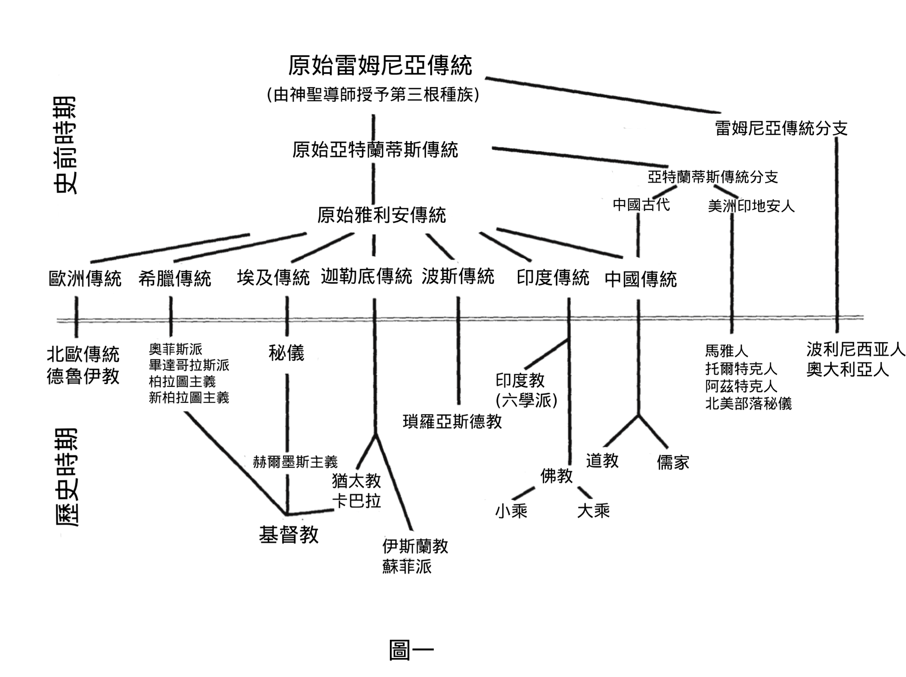

#  第一章：神秘学派

神智学（Theosophy）被称为「智慧宗教」。这个词源自希腊语「神」（ theos ）和「智慧」（ sophia ），意指「诸神的智慧」。传统认为，在人类初期，这种神圣智慧由一个超人类的种族带到尘世，此种族的领袖们被后人铭记，成为神祇和神话中的传奇英雄。这些伟大存在教导人类最初的科学、艺术和哲学知识，并为世界文化奠定了基础。

据说在最一开始，神圣智慧是公开传授给第一批人类。直到第四根种族，也就是亚特兰蒂斯人时期，这种智慧才对众人隐藏。之所以保密的原因，布拉瓦茨基如此解释道：

『最初的、半神性的、纯净而灵性的第一批人类种族 …… 拥有「神的真理」，并且遵循这些真理和理想而生活。他们守护著这些真理，世间几乎没有邪恶，因此不可能滥用这些知识和真理。然而，人类逐步进化、逐渐堕入物质世界，同样也是「真理」，也是「神」的法则之一。随著人类发展，每一代人都变得更加世俗、更加物质化，每一个短暂自我的个体性开始显现出来。人格的自私促使人类滥用自己的知识和力量。自私是一座人类建造的房屋，其窗户和门永远敞开，让各种罪恶进入人的灵魂 …… 因此，有必要将神圣的知识和力量逐渐从人类手中收回，随著每一个新的人类周期到来，这些知识和力量就愈成为危险的双刃剑，其恶的一面不断威胁著他人，而善的一面却只自私地用于自身。有一些少数「受拣选者」，其内在本性未受外在肉体成长的影响，成为了这些奥秘的唯一守护者，将知识传授给最适合接受的人。』（《文集》， 14:40-41 ）

因此，从那时起，「受拣选者」便建立起神秘学派，为值得之人保存智慧教义。

在现今第五根种族或称雅利安种族的早期阶段，文明的主要中心位于中亚。最主要、最古老的神秘学学派在此处维持和传承。随著雅利安人向古代世界各地扩展，雅利安的启蒙者在重要文明中心建立了神秘学学校。启蒙者指导人们建立诸多古代庙宇和纪念碑。雅利安人后来扩展到了亚特兰蒂斯后裔居住的地区，该地区实践著自身的神秘主义传统。雅利安启蒙者于是与这些更古老的种族融合，建立神秘学学校，以适应当地的文化和社会条件。如此一来，原本统一的智慧宗教在不同地区演变为无数传统。雅利安人越过喜马拉雅山南下后，智慧宗教变成了印度古老的婆罗门教。在波斯，这成为了祆教，后来在琐罗亚斯德改革下演变为琐罗亚斯德教。而在埃及，「国王-启蒙者」于金字塔和宏伟寺庙中传授智慧宗教，这些建筑至今仍是建筑奇迹，据说奠定于亚特兰蒂斯人的基础之上。图（一）展示了原始智慧传统的扩散过程，以及由此繁衍的众多神秘思想学派。

因此，在古代世界，启蒙者为值得之人建立了神秘学校，而广大民众则在这些学派周围，发展出了充满神话与迷信的民间宗教。随著文明的衰落，人类进入了所谓的黑暗时代，或称「迦梨时代」，这些密传学派变得愈发隐秘，逐渐从公众视野中消失。这在西方尤其如此，因为罗马天主教会对此并不容忍，使得启蒙者必须完全隐藏起来，避免公众的审视。诸如玫瑰十字会和共济会等秘密社团，在整个中世纪乃至现代，始终保存著智慧宗教的教义。 

在 大约释迦牟尼佛的时代发生了一场改革运动，涵盖了全球所有传统密传学派，并在十四世纪藏传导师宗喀巴的一生中开花结果。辛尼特（ A. P. Sinnett ）如下描述此努力过程：

『当佛陀化身于世时，在其影响下，开悟者的体系才变得凝聚和紧密。世界上各个时代都有开悟者；但有时分散各地，有时隐居四处，有时聚集在某个国家，有时又转向其他国家。需要记住的是，开悟者的知识与力量并不总受道德启发，而佛陀在其最新和最高组织中，注入了崇高而真诚的道德。事实上，佛陀对于神秘世界的改革，是他伟大牺牲的结果 —— 佛陀在离开尘世后，本可享受完全应得的涅槃祝福，却选择自我牺牲，再次承受轮回的负担（注一），以便更彻底地完成任务，为人类带来更大的利益。（《密传佛教》，第 132-133 页）

佛陀的第三次转世是宗喀巴 （注二）—— 十四世纪伟大的藏传高僧、改革者。他在这一世专注于开悟者团体的事务，当时主要聚集在西藏。自古以来，西藏有一个特定的秘密地区，除了受启蒙的修行者外，任何人都无法知晓或接近，普通百姓和外来者都无法进入。在佛陀时代，开悟者团体的首选居所并非西藏，是后来才如此。过去的大圣者们分布在世界各地。然而，文明的发展产生了难以承受的磁场，到了十四世纪，原本分散的神秘学者已普遍向西藏迁移。当时神秘知识和力量的传播更广泛，超出人类所能承受的安全范围。因此，宗喀巴致力于将这些知识和力量纳入严格的制度和法律之下。

他不是去恢复过去不合理的种姓排他制度，而是为开悟者制定了一套详细的行为准则：追求神秘知识的人，必须具备最高道德原则、最崇高奉献精神，才能留在神秘学团体之中。（《密传佛教》，第 138 页）

注一：  我们现在正涉足一片极为神圣的领域。关于佛陀后续转世的一些线索，可见于《佛陀之谜》和《佛陀的「转世」》，收录于所谓的《秘密教义》第三卷。（参见《文集》第 14 卷，第 388–407 页）

注 二 ：  这并不完全正确，因为在辛尼特撰写《密宗佛教》时，他不知道佛陀还有其他的转世。（参见《佛陀的转世》）

注三 ：这段文字写于 1883 年。据说布拉瓦茨基夫人在 1890 年曾告诉詹姆斯 · 摩根 · 普赖斯，大师们已经开始撤离西藏（见「真理与诚实」，《加拿大神智学家》 1931 年 7 月第 12 期，第 139 页）。

在这项改革后，秘密团体得以统一并组织成一个集中的联盟，受最高启蒙者的认可和领导，给予新的指导方针来规范其活动。（见《神智学》， 1938 年 1 月。）其中一项指示是将神秘学的光明重新带回西方世界，这是自公元前一世纪就在做的努力。（《文集》第 12 卷，第 120 页；第 14 卷，第 294-295 页）此任务会在每个世纪的最后二十五年进行。布拉瓦茨基夫人如下描述了此任务：

『宗喀巴的戒律中有一条，要求阿罗汉在每个世纪的特定周期内，尝试启迪世人，包括「白色蛮族」。』（《文集》第 14 卷，第 431 页）

下方 简要的列举从十四世纪至今，每个世纪最后二十五年的事件，似乎印证了此计划：

14 世纪：
克里斯蒂安 · 罗森克鲁茨创立玫瑰十字会兄弟团

15 世纪：
创立佛罗伦斯柏拉图学院
印刷术传入欧洲
哥伦布发现「新大陆」
帕拉塞尔苏斯诞生，是名医学改革者

16 世纪： 
阿克巴在印度活动 
第一出「莎士比亚」戏剧出版 
奠定了基础以复兴玫瑰十字会 
焦尔达诺 · 布鲁诺试图通过新柏拉图主义调和天主教与新教

17 世纪 ：
牛顿《自然哲学的数学原理》出版 
皇家学会初创时期 
玫瑰十字会在美洲建立

18 世纪  ：
共济会改革运动，由圣日耳曼伯爵和迦梨奥斯特罗所领导 
梅斯梅尔教授磁疗 
马丁主义的创立 
美利坚合众国的诞生

19 世纪 ：
布拉瓦茨基、奥尔科特和贾奇创立神智学会 
大菩提会成立 
黄金黎明赫尔墨斯教团成立

20 世纪 
？？？？？

布拉瓦茨基做了十九世纪最重要的努力，并受到奥尔科特、贾奇及其他人的协助。近几个世纪以来，布拉瓦茨基是首位公开揭示「智慧宗教」部分教义的人，包括人类组成与行星体系的七重结构、轮回、因果报应（业力）、以及灵性进化等教义，加以公开供大众阅读。她还引用了世界各地的神圣典籍，以支持「智慧宗教」所提出的主张；也将几位伟大启蒙者的性格与事迹公诸于众，并传达他们的信息。对于渴望踏上心灵与灵性发展之路的人，布拉瓦茨基也阐明了需具备的资格与指导原则。

若要评价二十世纪末所做的努力，或许还太早，但可以关注到第十四世达赖喇嘛及其他大乘佛教导师在全球范围内的影响。可以合理推测，人类未来到底能获得多少的帮助，取决于目前已吸收了多少前几个世纪传授的教义。本学习手册的编写目的，正是为了提供一个简明扼要、虽不尽完善、但尽量全面的教义要点总结。

## 参考书目：

贾奇，《神智学之海》，第一章「神智学与大师」

克诺赫，《神秘学校》

辛尼特，《神秘世界》，第一章「神秘主义与其开悟者」

辛尼特，《密传佛教》，第一章「密传导师」

## 问题思考：

1\.  你认为「神秘学学校」这个词是什么意思？

2\.  为什么在中世纪时期，秘传组织需要保持隐密？

3\.  据说佛陀对启蒙者或开悟者团体进行了什么改革？

4\.  为什么即使在神秘学团体内部，有时也需要改革？这个观点让你感到意外吗？

5\.  你认为开悟者们在创立神智学会时，承担了什么样的风险？

6\.  古老的智慧是如何传递给人类的？请用你自己的话描述，从史前时代到现代，密传思想是如何演变的。

7\.  你认为在上个世纪末，有出现新的灵性动力迹象吗？

8\.  世界主要宗教传统中，有哪些共同的意念？
