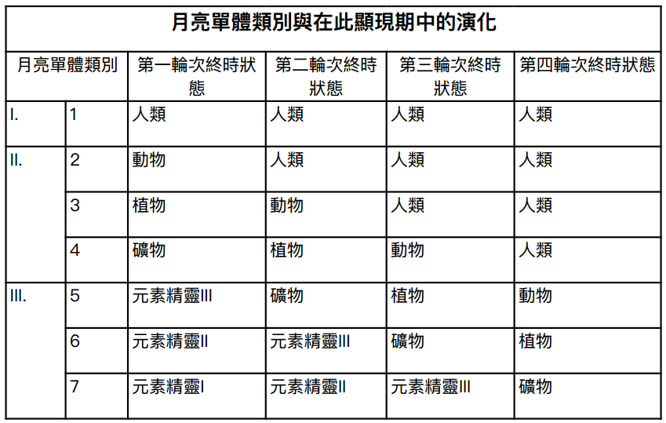
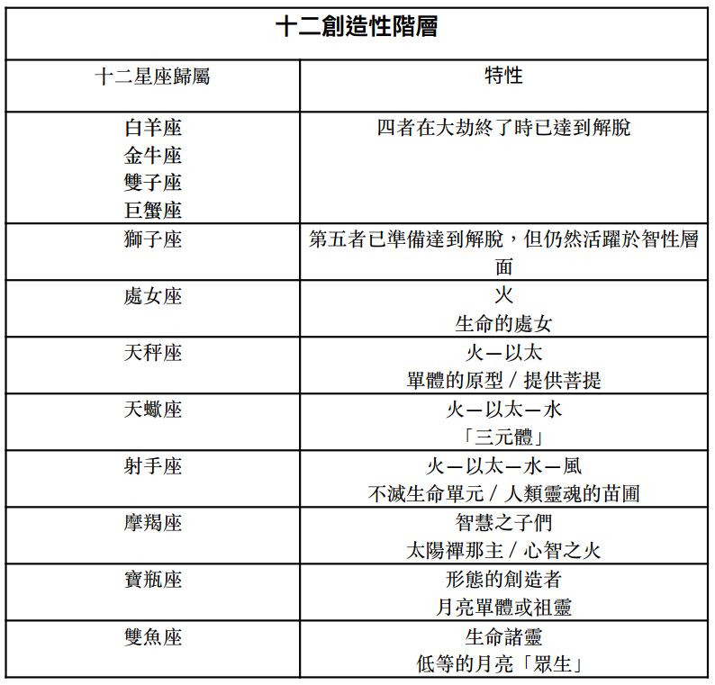

#  附录二：月亮单体的发展进程

单体在七元链中循环，并根据各自的进化阶段、意识和功德，分为七个等级或阶层。（《秘密教义》，卷一，第 171 页）

当行星链的 A 星球准备就绪时，来自月亮链的第一类单体会投生在最低界中，之后依次类推。在第一轮次结束后，只有第一类单体能够达到人类的发展阶段，因为第二类单体到达星球的时间较晚，来不及进化到人类阶段。因此，第二类单体只有在第二轮次才能达到初步的人类阶段，依此类推，直到第四轮次中期。到了第四轮次，人类阶段将会完全发展 ， 「通往人类界的大门」也会关闭；从此以后，「人类」单体的数量，即处于人类发展阶段的单体，将不再增加。此时还尚未达到人类阶段的单体，由于人类持续进化而被远远甩在后头，只有在最后第七轮次结束时，才能达到人类阶段。因此，他们不会成为此链上的人类，而是在未来显现期中形成新的人类，并在更高等的链上成为「人」，作为业力补偿。对此，只有一个例外 …… （同上， 1:173 ）

众单体大致可以分为三大类：

1\.  最为进化的单体（诸月神或印度所谓的「祖灵」），其职责是在第一轮次中，以最为空灵、朦胧和初始的形态，依次经历矿物、植物和动物三重循环，以便能够披上新行星链的本质并与之同化。这些是最早在第一轮次 A 星球上达到人类形体的存在（若能将「形体」这个词用在几乎是主观领的域中）。因而在第二和第三轮次中，他们引领并代表著人类元素，并在第四轮次开始时，演化出「影体」给第二类单体（即紧随其后的单体）。

2\. 第二类单体 在前三个半轮次中最先达到人类阶段，并成为人的单体。

3\. 第三类是 落后的单体；由于业力障碍，这些单体在本轮次周期内将无法达到人类阶段 …… （同上， 1:174-5 ）

最为进化的的单体（即「月亮单体」）在第一轮次中就到达了人类的胚芽阶段；到了第三轮次末期，成为地球上的人类，但仍非常空灵，并在「休止期」内留在这个星球上，作为第四轮次未来人类的种子，因而在第四轮次开始时，成为人类的先躯者。其他单体则要到后来的轮次中，才进入人类阶段，也就是在第二轮次、第三轮次、与第四轮次前半段。最后，发展最为迟缓的单体 —— 即在第四轮次中间转捩点仍处于动物形态的 —— 在本次显现期中将无法成为人类，只有在第七轮次结束时，才达到人类的边缘。在休止期后，先驱者（在这些轮次结束时处于领导地位的人，或称人类的始祖或种子人类）会引导他们进入新的行星链。（同上， 1:182 ）

在下降的尺度中，每一轮次都重演前一轮次，只是更为具体。在三个高等层面上，每个星球都是前一个空灵星球的复制品，只是更加粗显、更物质化，直至我们的第四星球（即地球） …… 因此，很明显，在地球当前轮次或生命周期中，所谓的人类「起源」，必须与前一轮次有著相同的地位和顺序，只在时间与细节上相异，以符合当地条件。每一轮次的工作分配给了不同的「造物主」或「建筑师」群体，不同星球也是如此；也就是说，每个星球都在特殊的「建造者」、「守望者」 、各种 禅那主的监督和指导下进行。其中有个特殊的阶层被委派「创造」人类；在本轮次中，他们造出了「影子人」，如第三轮次中更高、更具灵性的群体所做的。（同上， 1:232-3 ）

在前几轮次中，统治的诸君已完成自身在地球及其他世界的周期。在未来的显现期中，他们将升入比此行星世界更高的体系；进行替补的是我们人类中「受拣选者」 —— 即在艰难进步道路上开拓前行的先驱者。在下一个大显现期时，将见证此周期的人类成为新一代人类的导师和引导者。新一代人类的单体此时可能还囚禁在动物界中最聪慧的物种内，处于半觉知状态，而其低等原则在植物界最高等物种中活化。（同上， 1:267 ）

