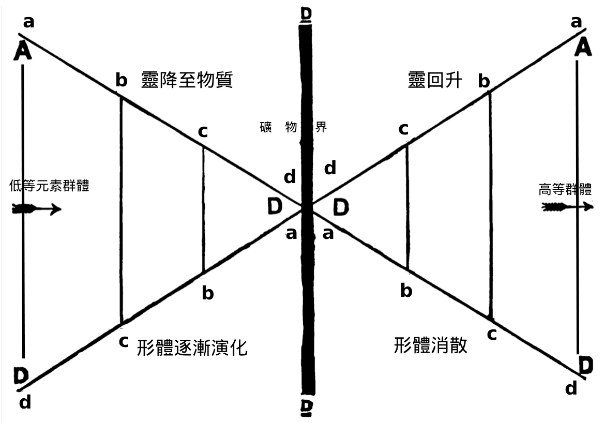

#  第一章

我們正如署名所示，僅僅是兩位學生，並無更高的稱謂，稱為「樂於交流的學習者」也行。我們認為，對我們而言的難題，很可能也是他人的難題，同為學生應互相扶持，共同跨越學習路上的坎坷。在閱讀《秘密教義》時，往往會被其廣博的學識、豐富的例證、繁多的題外話、和大量的文學典故所困惑，甚至感到暈眩。天神與精靈、禪那佛與鳩摩羅、瑜伽與周期、薩堤爾與苦行者、煉金術士與修行者、摩奴與單體，這些名詞如同炫目的幻影在眼前旋轉。經過數小時的努力，唯一確切的收獲可能只是一陣頭痛。我們發現，最有效的學習方法是專注於某一主題，鍥而不舍地追溯它在全書中的脈絡，堅定地在這兩卷書中追尋蹤跡，不被各種誘人的岔路和美麗的林間小徑所分心，直到將此主題從頭到尾梳理清楚，所有相關內容一目了然，明晰、具體、易於理解。或許你還記得普羅透斯的千變萬化形態，只要能牢牢抓住他，直到他恢復本來面目，就能獲得最有趣的信息。同樣地，在追尋《秘密教義》中變幻莫測的主題時，只要你能堅持到底，必定能有所收獲。

我們第一部分筆記將聚焦於「七輪次」，目標是追蹤單體在漫長旅程中的足跡——首次降臨到本行星鏈第一顆星球上、開始第一輪次的旅程，最終在勝利的輝煌中消失。在詳細研究之前，也會先簡介宇宙演化的基本原則，全面理解這在顯現期中的運作。

#  活動的周期 

【引文若僅注明卷數和頁碼者，均出自《秘密教義》。】

在自然界的各個層面上，都可見規律性的交替：醒與睡、晝與夜、活動與休息、生與死。「上者如下」；大宇宙如此，小宇宙亦然。因此，在神秘學者的眼中，存在也分覺醒活動的白晝、與沈睡休息的黑夜；宇宙生命先是流向有形的宇宙，又回歸於無形的「無物」；正如印度教寓言中所謂「梵天的晝與夜」，是無限一切者的呼出與吸入。 「這是遍一生命，永恒、無形，卻無處不在，無始無終，以規律的周期性顯現，在兩周期之間則是『非存在』的黑暗奧秘；無意識，卻又是絕對的意識；不可覺知，卻是至一自存的實在；『對感官而言是混沌，對理性而言是有序宇宙。』它唯一的絕對屬性，即它自身——永恒、不息的運動——在密傳術語中被稱為『偉大氣息』，即宇宙的永恒運動，體現在無限、無處不在的空間之中。」（第一卷第 2 頁）我們知道，它必然存在，否則一切都不會存在、也不可能存在；但面對它的奧秘，人類的思想是無能為力、徒勞無功的——「沈默比言語更顯敬意」。

一個活動時期稱為「顯現期」（ Manvantara ），一個休息的時期稱為「休止期」；這兩者無盡地交替循環。「分化的黎明」（第一卷，第 1 頁）即顯現期白日的黎明；從那一刻起，演化不斷進行，直到周期完成，休止期之夜到來而休眠。此處是學生遇到的第一個難題。在秘密教義中，萬物都被視為具有七重面向，同一個詞不只適用於整體，也適用於構成整體的七個子部分。顯現期字面意思是「兩個摩奴之間」 (Manu-Antara) ，我們稍後會提到，「根摩奴」對應的是輪次，而「次摩奴」對應各個星球。因此，次顯現期指單一星球的生命期，主顯現期指七星球一輪次的周期，宇宙顯現期則是指宇宙的生命期。隨著我們更深入的講解，這些時期的概念會變得清晰；目前只需明白，顯現期代表一個活動的時期，且在學習之初時，最好不要將這與任何具體的年數相關聯。

同理，在《秘密教義》中，我們經常讀到「摩奴」、「禪那佛」、「禪那主」等詞，這些都是通用的名稱，而非指某一個具體個體。例如，摩奴意為「思考者」，只是「神之思想」的人格化概念（第一卷，第 63 頁）摩奴指的是處於新進化周期開端的人類，無論是大周期還是小周期。學生常常感到困惑的是，一開始讀到「摩奴」是七大種族的首領，後來又發現「摩奴」只是某單一種族的首領，相對次要；或者，在理解了顯現期是兩個摩奴之間的時期後，又突然發現此顯現期中其實有十四位摩奴。但實際上，這七對摩奴標志著大顯現期中較小的顯現期。「禪那主」一詞與「天神」同義，指的是高等的靈性存在，而「佛」則意為「智者」；「禪那佛」的含義類似於「智慧諸主」，而這類存在又分為許多不同的類別和等級。「禪那主」則意為「天神諸主」。我們在使用這些密傳名稱時，盡量在一開始就給出對應詞，學生之所以感到困惑，往往是因為沒有意識到，同一思想會用不同名稱來表達——有時是希臘語，有時是印度語，有時是藏語。密傳哲學不等同於外傳佛教或婆羅門教，因此學生讀到的內容，很可能與其他人的說法相矛盾。比如瑞斯·戴維茲是位博學的東方學家，研究的是某一宗教的外傳教義，但我們探討的是一切宗教根源的秘密教義。當遇到不同之處時，應牢記這一點，尤其是數字上的差異。

至於《秘密教義》中關於宇宙進化論的大綱是否為真，無法向當今一般大眾證明，這就好比試圖直接證明四維空間的深奧數學理論。「事物就是如此演化的，」上師說：「若你願意並能將自己提升到我們的視野，你就能自己發現答案。以你現在的狀態，無法直接獲得這些知識：我們教義中較為簡單的部分，人人皆可自行檢驗和證明；但對你而言還是超出了能力。你可以把這視為一種理論、假說，或者也可以暫時擱置不理，只專注於我們教義中關於地球的部分。」前言至此結束，我們繼續講述——

#  宇宙 顯現期的黎明

「永恒、不可見的遍一生命」即將在空間與時間中顯現。它就是絕對者，印度教稱之為「實在」，吠檀多學派稱之為「梵」，佛教稱之為「本初佛」，卡巴拉學派稱之為「無限」，黑格爾及其學派稱之為「絕對存在」與「非存在」。這就是那「無所不在、永恒、無限且不變的原則，不可能對其進行任何推測，因為它超越了人類的想像力，任何人類的表達或比擬都顯得渺小。它超出了思想的範圍和能力，用《蛙氏奧義書》的話來說，「不可思議、不可言說」……此本質超越一切有制約的存在，而有意識的存在只是其受制約的象徵。」（第一卷，第 14 、 15 頁）神秘學稱它為「無因之因，無根之根」，以試圖描繪那不可想像者。「在秘密教義中，使用兩種面向來象徵它：一方面，它是絕對的抽象空間，代表純粹的主觀性，人類心智無法從概念中加以排除、或單獨理解它；另一方面，它是絕對的抽象運動，代表無制約的意識。

即使是西方思想家也已表明，我們無法覺知無變化的意識，而運動最能象徵變化，是變化的本質特徵。至一實在的運動面向也稱為『偉大氣息』，此象徵已足夠形象化，無需進一步解釋。」（第一卷，第 14 頁）這就是《秘密教義》的第一個基本公理，因此其哲學本質上是泛神論的。

在假定了不可思議、與我們無聯繫的絕對生命後，接著討論顯現期開始時的周期性宇宙生命。印度教徒用一個空白的圓圈來象徵梵，並在圓圈中央加上一點，以象徵「原初質」，即物質的根源，舒巴羅稱之為「一種面紗，覆蓋於無制約絕對實在之上」。吠檀多學派則將此術語指梵的一個面向：「從邏各斯的客觀角度來看，梵看起來是原初質。」（第一卷，第 10 頁，注釋）

周期性生命再次覺醒時，首先分化的是第一邏各斯或稱未顯現的邏各斯（希臘術語），藏語稱為金剛持。此最初散發物是佛教徒所謂的至高佛，是第一因，是哈特曼所謂的「無意識」——是「從遍一未知黑暗中射出的明亮光芒」。

「他作為一切奧秘之主，自身無法顯現。」於是從第一邏各斯散發出第二邏各斯，即顯現者——金剛薩埵，被詩意地稱作第一邏各斯的「金剛心」，被送入顯現的世界。這是「靈 - 物質」，即生命，即宇宙之靈。（參見第一卷第 16 頁、第 571 頁。）這就是吠檀多學派所謂的「阿特曼」，赫爾墨斯哲學家所謂的「天上人」，是各宗教中創造之神——造物主、埃及人的奧西里斯、瑣羅亞斯德教的阿胡拉·馬茲達、印度教的四面梵天。（見第 110 頁）這是萬物賴以形成的基質，也是活化萬物的生命。因此，「神秘學家……追溯宇宙中每一個原子，無論是聚集的還是單一原子，皆追溯到至一統一體，或稱宇宙生命」；他們不認為自然界中存在任何「無機物」；他們不認為存在任何死物……「生命粒子的波動」只有在「靈性遍一生命」的理論下才可理解，此理論認為有一個獨立於物質的普遍生命原則，在我們意識層面上表現為原子能量。」（第二卷第 672 頁）「生命之火存在於一切事物之中，沒有一個原子缺少它。」（第二卷第 267 頁）這種「靈 - 物質」在宇宙中以七種不同狀態顯現：第一與第二階段為亞物質的元素精靈界，第三為塵世界，第四為星光界，第五為心智界，第六為靈性界，每一界都有其自身的原質，萬象皆由此構成。最高的第七種狀態即邏各斯自身。（見第二卷第 737 頁）對神秘學家而言，所謂「靈」與「物質」，或一般所謂的無形與有形，不過是同一宇宙「靈 - 物質」的兩極，是「生命 - 基質」的雙面統一體。若要了解各個階段或「層面」的物質特性，我們先需發展出相應的感官，如同當前一般人只能研究第三階段物質。

假設宇宙是一個球體，那麼宇宙周期便是從「靈性之極」沿下降弧運行到「物質之極」；再從「物質之極」沿上升弧返回到「靈性之極」。由於「生命 - 基質」是一體的，此過程表現為：一開始的空靈形態逐漸結晶並凝聚為粗重物質形態，物質又再逐步升華、稀化，回歸至空靈形態。因此，在我們當前的顯現期中，此進程穿越了四個層面上的七個星球：前三個星球代表「下降至物質」，第四個星球達到最大密度，也是轉折點，後三個星球則象徵「再上升至靈性」（參見第一卷第 153 頁右側圖表）。這就是「進化與返本」，是宇宙的互補法則——「一種永恒的螺旋式進展，向物質深入的同時，靈相應地被遮蔽——儘管二者本為一體——隨後則是反向升回至靈，戰勝物質。」（第二卷第 732 頁）

如果學生能清晰理解此核心概念，應用於大大小小的週期中，儘管有些細節上的差異，但仍能減輕理解上的困難。這把鑰匙能幫助理解宇宙演化、行星鏈、星球、種族以及個體演化。關於星球演化的對應關係，某位上師曾極為清晰的闡述：「共有七個界。第一組包括三個階層的元素精靈，或稱新生的力量中心——此乃原初質分化的第一階段到第三階段——從完全無意識到半感知。第二組更高的類別，涵蓋了從植物界到人類的各個界；礦物界則是「單體靈質」進化能量的中心或轉折點。因此，進化鏈的七個環節包含了元素精靈界的三個階段、礦物界、物質界的三個階段。靈向物質的下降，相當於物質進化上升；從物質性最深處（即礦物界）重新上升，回歸到原先的狀態，同時具體的有機體逐步消散，直至涅槃——即已分化物質的消失點。也許一個簡單的圖示會幫助我們理解。」（見第 56 頁）

AD  這條線代表靈逐漸進入具體物質的過程，逐步被遮蔽；下方  D  點表示礦物界的進程所在，從其初始的 d 最終凝結到 a；圖左側的 c、b、a 是元素精靈進化的三個階段，也就是靈性沖動所經歷的三個連續階段（通過元素精靈——這方面允許透露的信息極為有限），而後被囚禁於最具體的物質形態；而右側的 a、b、c 則是有機生命的三個階段——植物、動物和人類。靈被完全遮蔽後，就是其極性對立面——徹底完善的物質，此思想通過  AD  和  DA  兩條線來表達。箭頭顯示了進化沖動進入漩渦的行進路線，並再次擴展到絕對者的主觀性中。中間最粗的  DD  線代表「礦物界」。（引自《神智學五年》，第 276-278 頁）

學生會注意到上描的主旨思想是一致的，並能應用於不同的較小進化周期中；多樣性中的一體性是密傳教義的主旋律。若學生能始終把握這一主旋律，就能輕鬆理解其中複雜的合聲。

到目前為止，我們已經模糊地領會到「絕對者」作為「一與全」的存在，第一邏各斯是最初的散發物，繼而又散發出第二邏各斯，由此演化出宇宙的基質與生命，在秘傳哲學中稱為第三邏各斯。然而，要完善此「萬物之初」的過程，僅有基質和生命的分化還不夠：意念必須先於形體的形成。因此，從邏各斯中「發出七位……禪那佛，稱為無父母者。」這些佛是原始單體，來自無形世界——無形界（ Arupa ， rupa 為形， a 為無）。（第一卷，第 571 頁）

這七位佛合稱為宇宙心智或「智性」，即「宇宙世界之魂」、宇宙意念、也稱為「偉大菩提」。（第 16 頁）他們整體上是宇宙意念或宇宙心智，顯現為七種智性體，「是原初七者，智慧之龍的最初七氣息。」（第五頌）他們「又進一步產生」了「熾熱的旋風」——宇宙電，是「其意志的使者」；宇宙電「是駿馬，思想是其騎手」；宇宙電是「潛在的創造力」，是「人格化的電性生命力」。在地球層面上，宇宙電就是廣義上的電力，是一切電磁現象中顯現的原則。「顯現智慧（或稱宇宙心智）的作用，由宇宙無數靈性能量中心所代表，是宇宙心智的映象——即宇宙意念，以及伴隨這種意念的智性力量——在客觀上成為佛教秘傳哲學中的宇宙電。宇宙電沿著阿卡沙的七重原則運行，作用於顯現的基質或稱「遍一元素」……使之分化為各種能量中心後，啟動了宇宙進化的法則；而這個法則，遵循宇宙心智的意念，產生了已顯太陽系中各種存在的狀態。」（第一卷，第 110 頁）

從每一位禪那佛依次散發出七位菩薩，展開七重演化，在宇宙中形成了所謂造物活動的中心。此中心演化出一個「行星鏈」，是由七個星球組成的環，成為生命進化的舞台，生命的沖動源自此中心，進化法則也由此獲得指引。從行星顯現期的黎明到黄昏，這股強大且具指導性的能量主宰著所有變化的現象，體現在一切形體中，但本質是遍一的。

此時便從無形界（即無形體、超物質的世界）進入了有形界，乃遍一實在在時空中的映像。我們現在將注意力集中在單一的行星鏈上，自然是指我們地球所屬的行星鏈，其進化過程已足夠複雜，無需討論其他行星鏈，更不用說其他太陽系了。

——兩位秘傳課程的學生
