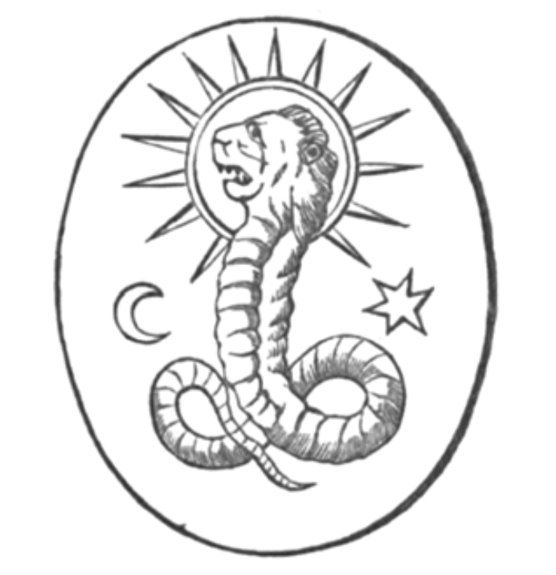

#  第三章

1.  我的魂被圍裹，我的靈陷入雲霧，光芒閃過，模糊的身影向我招手，耳畔響起輕聲呢喃。我彷彿聽見瀑布的聲音，樂器聲此起彼落。其後，一切歸於寂靜，如星夜靜語般安祥。

如一棵閃電擊裂的樹，
如一座由天劈倒的塔，
如被海水吞噬的船 ——
我的靈亦是如此。
海洋向遠方延伸，
如永恆朦朧形影，
廣袤的水域荒野：
廣大無邊的空間。
多彩的微光，明亮的閃光，
越水而來，一如天鵝，
或如火翼之鷹，
或展燄翅的熾天使。
每座高峰皆如光髯，
松樹與橡樹皆化為火柱，
天使高聲歌唱：
「祂來了 —— 偉大者來了。
去召喚神聖會眾，
那暗海住民，
命他們飛去迎接國王，
那披星衣的後裔。」
浪啊！火焰浪濤！
你對我的靈魂說什麼？
火浪竄高聳立，開口道：
「你不可立於我面前！」
我在我山洞中俯身，
嘴唇觸碰那晶瑩的溪流，
群山翻湧於雲霧中；
水流在黑暗中旋轉激盪。
一道光閃過，一股顫動的榮耀
將我裹入漩渦，
山鷹載著我
飛向一個黑暗之地。
美之頌歌迴盪，
我的靈狂喜不已，
光彩奪目的火鳥
掠過身邊 —— 但萬籟寂靜。
三天三夜過去了，
星辰輪替了三遍，
風雨侵襲了三回，
我在孤寂中歇息，禱告。
我知曉那光輝之眾的數目，
那神秘的歐因（ Ouein ）；
火之子；智慧之聲；
明白上帝是至一的。
我崇敬祢，至高的統治者，
藍寶石帶之主。
山脈回應了：
「要明白，上帝是至一的」
我聽到海浪說：
「樹葉生長凋落，人間更迭亦是如此：
城市消隕，沙漠興起，
荒野在歲月中流逝，
森林取而代之，
平原讓位給海洋，
海洋又逐漸乾涸，
凡人世代亦如是，
生老病死，不留痕跡。」
我目睹四大時代：
氣之時代，水之時代
火之時代，土之時代，
逐一掠過我眼前。

此時，獅頭蟒蛇說：
「看啊，我已向你顯露智慧，
展示天界的力量，
引你踏上通往眾神之路，
毀滅不過是重生的序曲，
死不過是生之門廊，
連真理也必須重塑。」
我見到天燃起純淨之火，
地陷入深淵，
那圓球墜落，
毀滅的時刻近在眼前。
一山高過一山，
一丘低過一丘，
大樹從頭傾倒，
墜入裂縫與鴻溝。
我的聲音顫抖，
驚叫出聲：
「看啊！地球 —— 它毀滅了，
如一顆流星墜落消逝。」
蛇扶我起身：
「你為何哀嘆，我的靈魂之子？」
我道出自己所見，
透露了眼前異象。
他說：「你所見的皆將發生，
此乃真實異象，
毀滅將至，
地球終將墜落。
振作吧，向主禱告，
求萬靈之主饒恕，
讓人類免於遭難，
當天上落下雷電。
天界萬物之主，
王中之王 —— 世界的上帝。」
主啊，王啊，祝福祢，
威嚴萬能的偉大之神，
祢的統治，祢的王國，祢的光之寶座，
將綿延千秋，萬代永存，
諸天界皆為祢的所在，
地球世世代代是祢的足凳。
因為祢乃造物主，君臨一切，
萬象盡在祢的力量內，
祢擁有不變的智慧，
她永遠在你寶座旁，也在你面前。
祢無所不知，無所不曉，
祢無所不見，無所不聞，
在祢面前，萬物無所遁形。
因為祢洞悉一切：
你天界的諸靈有所逾越，
審判將降於凡人肉身。
當宇宙運行之理
逐漸老朽衰弱，
祢吐聖言，話語躍出
看啊，那美便重歸如新，
如冬去春來的高貴樹木，
顯露其力量榮光。
宇宙如強大棕櫚樹，
也不斷更新。
但是，主與偉大的王啊，
請應允我的祈求，
願祢話語承諾地上的追隨者，
願人類不會完全滅絕，
世間不會渺無人煙，
不會永受毀滅威脅。
如果邪惡子民消亡，
就讓正直廉潔之族來此，
永遠繁衍後代。
主啊！請勿別過臉去。
就如風吹火揚，
火星與閃光持續上升，
中心之光更是如此，
那光始終照耀。
獅頭蟒蛇說：「我的靈魂之子啊，
請觀此書，
乃天界如露水般所滴淬而成，
細讀其中內容，
領悟字裡行間。」
於是我仔細閱讀，
理解人類的諸多成就，
以及所有地上子民
世世代代的功績。
我讚美主，榮耀之王，
鬼斧神工的天地造物者，
我尊崇主的持久毅力，
以及祂賜予子民的福氣。
我起身，我祈禱，我哭泣，
我上前，仰望上天，
凝視太陽的光耀軌跡，
星辰羅布於傍晚的天空。
此時，我意識到另一聲音，
是銀光耀頂者的聲音，
那天界的至高美善者，
有著寶座的多變彩虹。
光沫飛旋其上，
火流奔流足下，
閃電從中迸射，
黑暗中，渦流默默流淌。
他能跨越火焰界限，
踏入神聖界域，
如銀箭穿越其中 ——
如豎琴的琴音飄揚。
看啊！我告訴你，他的純白本質，
即使僅染上一抹黑暗的陰影，
也會沉入水流消失：
一根髮絲的重量，便足以令其下沉。
國王、奴隸、路邊的乞丐，
在河岸上皆平等。
人的功德愈高，
上帝賜予的報償愈大。
人間之治不同於天界之治，
曾乞討者，在靈性上無須乞求，
每個人都是平等的，
各自獲得相應的報償。
渴望通過的帝王，
被拋入無垠空間，
帝王最低下的僕人，
卻乘光翼飛進天使界。