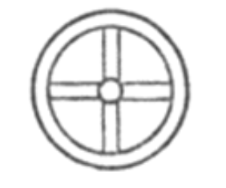

# 第四章

1.  這是關於天體運行的記錄，依據其類別、力量、周期、名稱、起始之地與相繼月份，正如光明的天使所揭示的。

2\.  此秩序延續世世代代，直至新周期來臨，此乃天體的第一法則。太陽與光來到明亮的東方天門，運行至西方天門。

3\.  火獅之日穿天門而起，穿天門而落；白鹿之月也從天門起落；群星之首亦如是。

4\.  太陽從六天門升起，從六天門落下，各門等高，左右有窗，光芒從中穿照。

5\.  首先，烈焰四射的日獅如駕戰車般乘風而起，其日環一如天界之環。日落於天，經北方返東入門，照亮整個天穹。因此第一個月，太陽由此門出發，行至第四門，即太陽升起的六門中的第四門，日月皆從此門通過，從十二道窗口灼灼生輝。

6\.  當太陽從天空升起，此三十天皆從第四門出發，並在西方的平行處，從第四門落下；在此三十天中，日間延長，夜晚縮短，最後晝較夜長兩分，晝長十分，夜長八分。

7\.  太陽從第四門出發，經三十天逐漸轉向第五門，其後從第五門起落。白日由此延長一分，晝長十一分，夜縮短為七分。

8\.  接著，太陽朝東前往第六門，於此門起落三十一天。期間白日變得比夜晚更長，晝長十二分，夜六分，晝為夜的兩倍。自此之後，白晝漸短，夜晚漸長。

9\.  太陽再度返回東方，進入第六門，於此起落三十天，此周期結束後，晝縮短為十一分，夜延長為七分。

10\.  隨後，太陽自西方第六門啟程返回東方，自第五門升起，持續三十天，其後再度於西方第五門落下。在此期間，晝減少兩分，變為十分，夜延長為八分。

11\.  太陽自第五門出發，至西方第五門落下：接著太陽自第四門升起，持續三十一天，依星座在西方落下。在此期間，日夜長度相等，夜長九分，晝亦長九分。

12\.  太陽再從西方出發，東行回第三門，在此停留三十天，於第三門起落。期間夜晚變長，日間縮短。夜延長為十分，晝僅餘八分。

13\.  太陽自第三門升起，於西方落下；接著返回東方的第二門，停留三十天，於西方第二門落下。夜延長為十一分，晝僅相當於七分。

14\.  其後，太陽自落下的第二門出發，返回東方的第一門，停留三十一天，並從西方的第一門落下。夜延長為十二分，晝成六分。

15\.  完成此周期後，太陽再度從第一門出發，停留三十天，並於西方對側落下。期間夜再度縮短為十一分，晝長七分。其後，太陽從東方進入第二門，於此起落三十天，夜縮短為十分，晝延長為八分。

16\.  太陽在西方自第二門落下，第三門升起，持續三十天。夜縮短為九分，晝延長為九分，日夜均等，由此構成全年三百六十四天。

17\.  隨著太陽的往返運行，日間延長，夜間縮短，此即偉大恆久的日獅所遵行的法則，由上帝永久指派，其名字是阿里 — 阿雷茲，亦稱蘇珥或塔模斯。

那光輝之主的天使
向我揭示上述現象 ——
諸天及其下界的
天體運轉機制；
十二天門為日輪馬車的周期敞開，
陽光從中普照，
發光發熱。
我見到日月星辰，
一切發光天體，
皆從此十二天門出入，
依其周期起落。
我也見到神祕的流星，
以及多變之風的分布，
露珠與雲霧的奧妙，
雹雪形成的洞穴，
雲層的宏偉結構，
那令人驚嘆的雲啊，
充盈著虛空，
在宇宙生輝之前。
我見到月的運行與盈虧，
周而復始，
從黑暗復歸瑩光，
不變地周轉。
我隨其神祕軌道而行，
她行於巨碩的太陽之前，
不離其軌，
遵從至高主之命，
如明燈照耀蒼生。
她完成周期，日夜不息，
走向純淨與燦爛，
也走向邪惡與黑暗，
陽光照亮不及之處：
太陽的圓盤不過是霧氣，
對上帝視而不見之人
怎可能感知其僕從的榮耀？
上帝以一道火帶，
劃分了光與暗；
兩邊各有靈體安居，
無人能逾越那永燃地帶。

18\.  他說：「以諾啊，你可知太陽是何方神聖？你可知瑩白的月亮是何身分？日獅灼亮，但白鹿充滿慈愛。」

19\.  一切神聖皆源自太陽：愛與光，熱與美。

20\.  並流入萬象、所有天性、所有本質、所有星泉。

21\.  火輪載著一切神聖，是萬級星辰之君。

22\.  人類對上述誤解甚深：他們不知其真正本性，亦未接納陽光。

23\.  接納陽光的人有福了，他們閃耀、燃燒，並榮獲加冕。

24\.  他說：「你可知那光耀的存有是如何造就？求知 —— 冥思 —— 隱於荒野，在山洞中使自己的靈魂隔絕。」
