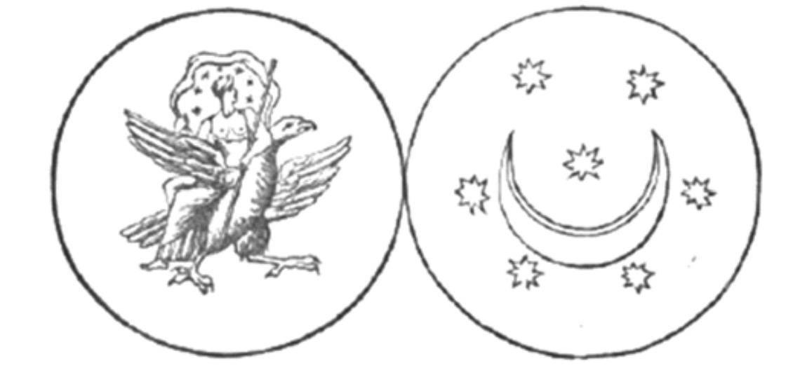
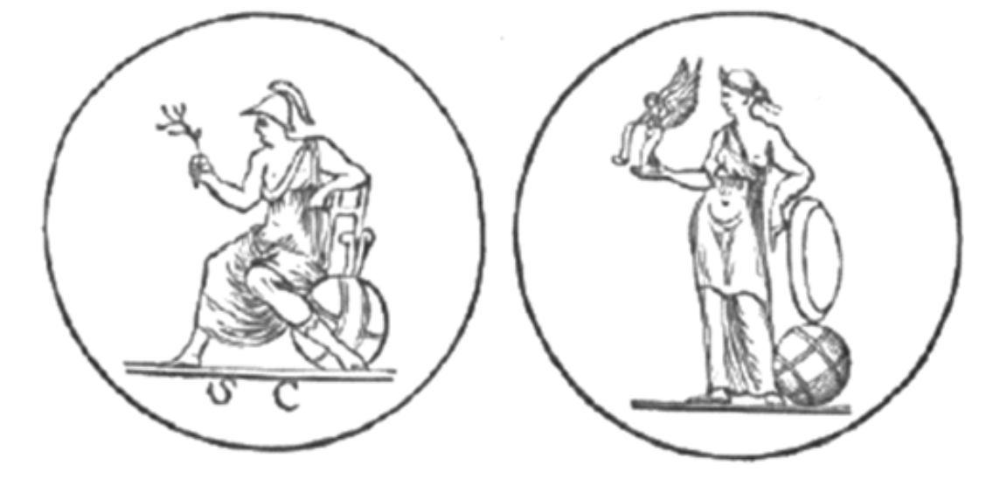

# 第五章
你是何其壯麗啊，太陽！
但我不會俯首敬拜你；
妳是何其皎潔啊，月亮！
但我的魂也不崇拜月輪。
我見過你們在光中震顫，
彷彿你們有生命，
但我明白你們僅是屬臣，
上帝是你們的神聖主人。
祂才是我的君王，
我將在祂的寶座前俯首，
但不敬拜那常伴天主左右的彩虹之靈
那。
但妳啊，月亮，僅是她的足凳，
而你啊，太陽，不過是她的面紗。
你們只是她的長袍披掛 ——
我豈應敬拜一件衣裳？
我在小祕林中見到一座聖壇 ——
天父的聖壇；
我將在此獻上我的心，
唯有祂，才是我俯首敬拜的對象。

我見到光的榮耀，雲的空靈優美，太陽居於中央，兩道彩虹圍繞左右，對面還有第三道彩虹。但在兩道彩虹的極遠盡頭，受到中央太陽明亮映射，強烈光線與金色光輝彷若三日並照，但其實僅有一個。

看啊！我見到火紅駿馬的異象
越過海面，
在朝露、雨雪、霜寒中，
大步流星，奔馳而過。
山峰也擋不住牠們，
牠們揚起雙翼翱翔，
黑色的腳下雷霆萬鈞，
雙瞳如星似火。
我聽聞其名，
銀色的雲門敞開，
牠們奔下幽谷，
如疾流的火河。
他向我展示了光之秘密，
及其羽翼承載的審判，
這些光依本質之主的意志，
為賜福而發光。
閃電的祕密揭露於我眼前：
它們如天缽研磨般咬牙，
當烏雲在其面前飄過，
可聽見其憤怒的鼻息。
其鳴響是為和平與祝福，
依法則帶來審判，
罪人一聽見並知悉其到來，
便躲入洞穴與地窟。
諸天無處不散發神聖之美，
巡行其中的光輝亦然：
那美存在於磅礡的秩序中，
存在於其廣袤交織的軌道中，
其美與秩序皆來自
祂，最初者，
至一之神，超天界之火 ——
萬古之源。
其後，我看見
每道黑暗光芒隱藏的祕密，
我掌握閃電的源頭，
其霹靂中蘊含祝福與沃土。
受三重祝福的你，
地上的純潔之靈啊，
一切美好事物的知識，
皆來自你的主與天父。
你將存在於日光中，
在恆久生命的光輝中，
那光芒將照耀世世代代，
榮耀恆久不變。

1\.  在那之後，另一靈上前來與我交談，為我揭示最初與最後的祕密：諸天的奧祕，地上的奧祕，以及萬物之始，並告訴我諸天之靈的區分。有些靈掌管風，而上帝依其力道與長處，將風劃分為不同等級。

2\.  他向我展示月光的力量，及其盈虧的調節，透露她在天上的諸多名字，其一是阿松 — 亞，其二是艾布拉，其三是別納西，其四是伊拉耶。他描述星辰的分類與名字，及其各類等級。他向我展示閃電如何劈落，雲如何立即聽命，雷聲又是如何靜止，以及閃電再起時的能量。

3\.  雷電為一體，但亦是兩股不同的力量，並非同一個靈運作，但仍水乳交融，不可二分。當閃電落下，雷聲隨之出現。引導之靈停下歇息，直到一段時間過去。

4\.  他向我展示雷電是如何如受韁繩約束，並受靈的力量驅使，劃破廣闊的天際，彷彿箭從弓出。

5\.  我見到彷彿沐浴於七重光彩中的古聖者：揮舞榮耀之翼的智天使、光之熾天使與座天使、燃燒著純火的星形焰天使、天使長與指揮天使。天使形態多樣，不可勝數，其歌聲與音樂迴盪宇宙。

6\.  光海流過眼前，奔向遙遠無垠的遠方。雪白的海岸上，豎立著塔樓、尖塔與方尖碑。

之後，他給我 徵兆 ，
揭示了在天父之書中
以及全能之靈的
每個奧妙寓言，
所有隱藏智慧的
象徵與祕密。
誰不會為此心軟？
誰的本性不會為此觸動？

宇宙之光啊！
我何時才能與祢團聚？
我何時才能回到那古老之地，
那初始之愛的天堂樂土？
在那樂土，宏偉的三美一體
閃耀著潔白光輝，
身披天堂的鑽石之光，
手持金光弓箭。
在海洋中央
萬千黑浪沖擊下，
他們圍繞著升起的火壇
俯身，祈禱、歌唱。
彩虹自海上升起，
但聖靈在美好中閃耀，
海浪躍起銀色浪尖，
她喜悅與平和吹拂萬物。
神祕之室揚起頌歌，
宇宙之主胡的歌，
火焰力量般的驅動
流向所有生靈。
它們本性隨火焰能量跳動，
充滿喜悅與平靜的智慧，
圍繞著力量的白石，
其表面是聖靈之鏡。
大能者啊，小如塵埃，
榮耀者啊，大過宇宙，
我們的主，我們的上帝，我們的神祕天父，
我們僅信仰祢。
祢是生命，祢是光，
祢化形為透明的日光，
萬水之主！諸界之主啊！
祢是偉大，古老，無限。
我見到天界顯現一幅神聖景象。
祂問：「誰欲前往？」
一聲雷鳴回應。
炫目的烈焰包裹著宇宙，
宇宙在閃電的掌心顫動。
「聽啊，聽啊，」雷說道，
「主的枝子無比美麗。
唯有祂亙古不變，
祂的果實乃恆久的榮耀。」

