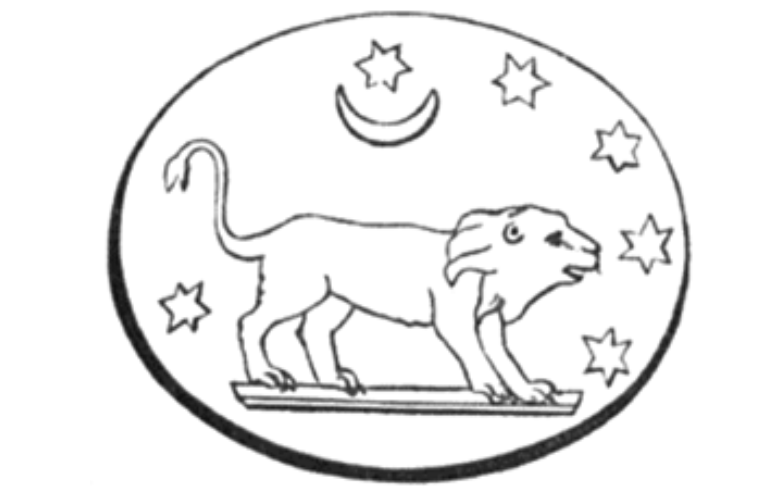

# 第七章

1.  揭露給以諾的話語：純潔者如獲祝福，在苦難之日得以存活；對邪惡不信神者則是障礙。我，以諾，與上帝同在；我答覆上帝並與他對話，儘管我雙眼被遮住，但仍看見一切；我見到天界的神聖異象。此皆為神聖諸獅神所展示的異象。



他們讓我領悟萬象，
使我充滿理解，
我見到今日未發生
但未來將發生之事：
世世代代之後，
天界之子將光照大地。
我與他們交談，並與
榮光現身的居民交談，
是聖者和強者
人間的統治者。
在未來的日子裡，他們將坐在錫安山上，
召集其軍隊，
展現出獅般的威力，
在天界之力的威嚴中。
萬物將敬畏；
黑暗之子將驚駭不已，
萬分恐懼，渾身顫抖，
被四散到大地盡頭；
高山將陷入愁雲慘霧，
丘陵將因羞愧而沮喪，
如蜂蜜般在火中熔化；
人世將被洪水淹沒，
肉身後裔將因此消亡。
審判將響徹天際，
是的，義人亦將接受審判；
上帝的天平將權衡其功過。
但天堂之門為有德者敞開，
他們將歸屬上帝，幸福安居於祂的光中。
天界美麗者的光芒，
將徹底籠罩他們。
看哪，祂領數千聖人來臨，
執行對惡人的審判；
罪人將因其罪孽受苦，
淫蕩者將驚慌失措。
閃電在宇宙邊界劈落，
傳來隆隆雷聲，
在黑暗中陣陣轟鳴，
見證那聖者的來臨。