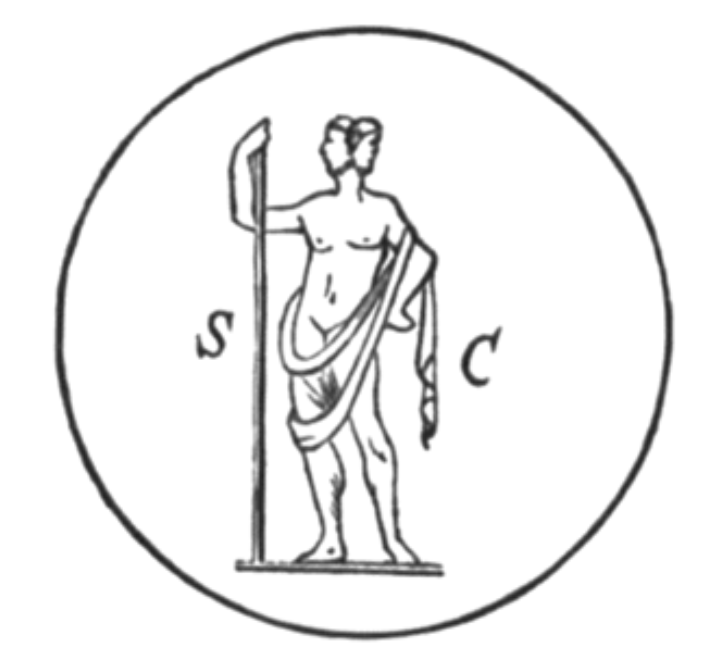

# 第十三章

1\.  我轉身望向另一方，見到一座熊熊燃燒的深谷，谷中的君王、教宗、大能者皆受枷鎖緊縛，無重量的鋼鐵鐐銬。

2\.  我問此地的天使：「受鐐銬者為何人？為何受縛？」他答道：「他們是阿撒瀉勒之子、地獄之子，已被定罪，因此動彈不得。他們來此為其罪行接受重懲，因為他們已臣服於邪惡。」

3\.  國王，教宗，大能者們啊！但願位高權重的你們，能看見這幅景象！但願你們能親眼見到那榮耀寶座上的全能之主！

4\.  他們遊蕩於懲罰與黑暗之間，哀痛、哭泣，懊悔，身陷銅鍊與鐵釘的羅網。他們壽命已盡，但審判之日仍遙遙無期。他們大聲呼喚那鷹，但牠充耳不聞；呼喚那蛇，那水中的利維坦；呼喚那閃耀七重光彩的獅神；呼喚那聖光，映射出太陽所有閃爍的光。他們也呼喚所有光耀天使，但無一傾聽他們的呼求。

5\.  天空之上的水域開啟，星宿下的泉水噴湧，黑暗陰鬱的海面上，傳來七十個七次雷電的鳴吼，將我的靈魂震入冰丘，化為滴雪。

上帝啊，祝福祢的聖名，
祢叱吒風雲，
祢劃海定岸，
祢告訴群山：「止於此。」
我在山洪中、
在狂風驟雨中聽見祢，
當森林如蘆葦般折腰，
當祢的手翻天覆地。
我知道祢是一個可怕的存在，
一夜陰霾 —— 一片黑海；
如閃電旋落，轟然巨響 ——
使空氣之子俯身啜泣。
為何心地邪惡者企盼
祢讓他們升入天堂？
為何血液汙穢者以為
他們能與光明純潔者一樣上升？
我見到一位上帝的天使，
名為拉結爾，
他安臥於一條閃耀小溪旁，
一見我便走上前來。
他翻開一本明亮如火的書
字裡行間寫著種種奧祕；
他將書放進我手裡，說：
「此乃天界法則。」
我凝視那銀白書頁，
標記與符號閃耀著藍寶光輝；
我滿懷驚奇與敬畏，
看那隱藏者的多樣圖像。
封面上的星辰似在游移，
旋火捲起漩渦，
我將書捧在手上，
宛如將太陽握於掌心。
書頁瑩瑩燦燦，
充溢沒藥與乳香，
那初始之人亦接受過此書，
在他從白晝墜落至黑夜之際。

一聲高呼傳來：
胡德阿里，胡德阿里，
那是火焰的聲音，
如閃電劃過天際。
隨後，對面傳來聲音：
凱德阿里，凱德阿里
我的靈魂燃燒起來；
帶我去那神聖聖所。
一道閃光，一片光雲，一抹榮耀，
一陣光與壯麗的旋風，
一曲最甜美的音樂，
萬千琴聲合鳴 ——
她的美光芒四射，
如晨星，如圓月，
那光輝燦爛的圓環 ——
我仰望 —— 融入了一片海洋。
然後，我自海洋升起，
光與火之女
隨琴聲舞動，
海浪是芳香的花園。
就如陽光穿雲迸射，
榮光灑落水面，
從她的晨眼中，
閃爍著愛的美好。
七光之靈啊，
祕火的持炬人啊，
群星合唱團的王后啊，
請以神祕之光祝福我。
吾兒啊，塵世的榮耀僅是虛影，
要避而遠之，因為那是邪惡，
但要瞻仰天界的壯麗，
讓你的心永遠上進。
上帝以長袍及冠冕妝點天界，
使其光芒萬丈，美侖美奐。
我告訴你，因為我親眼見過
出現在不朽異象中；
天界的金手將我抬起，
帶我升入樂土，
甚至進入無盡之域，
那銀河宇宙的中央星辰。
其乃無限者之域，
那最初、最偉大、最神聖者，
上帝與其力量皆居於此，
祂的聖靈常駐於榮光中。
那十大光耀天使，或存在層面，
在那奇妙的一刻立於我面前，
我見到無數個生動景象，
天界中栩栩如生的神聖形象。
我見到上帝本質的全美代表，
純潔而美好，
祂的天國盡在眼前，
那燦爛中充滿了和諧與光。
那三元力量的奧祕，
生命、智力、與靈，
在上帝的聖火本質中閃爍，
我的心靜靜融化。
星辰在我眼前永恆周轉，
在火焰中不停流轉；
上帝之靈散播生命，
如杯中的甜美甘露。
我來到一條火河，
它流入一片汪洋，
我見到洪流滔滔：
死亡之流，毀滅之流。
還有蒸氣與夜晚，陰影與靜默，
以及深淵的一切奧祕。
我來到肉身投生之處，
我望見永冬的群山，
冰川滾滾奔流，
穿越萬千懾人瀑布。
誘人褻瀆者將囚禁於此，
他們唆使人走上歧途，
以此向撒旦獻祭，
嘲笑崇敬至一神的行為。
但他們與其信徒將同受審判，
在世間惡人受苦的那一日。
羊追隨著狼般的牧羊人，
步入通往死亡的牧場。
其中有兇惡的怪獸，
古怪不馴的動物，
鳥類奇形怪狀，
樣貌與叫聲皆南轅北轍。
遠處的黑色河谷中，
我見到否定上帝的罪人。
他們驅趕並將彼此扔進
下方的黑暗淵藪中。
萬靈之主並未懲罰他們，
祂是宇宙之愛：
所有時地的萬般惡行，
皆是自食惡果，自作自受。