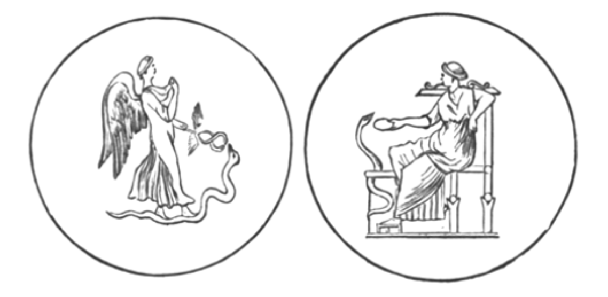

#  第二十章
我望見遠方的萬靈之王，
頂如白雪，
身旁立有一身影，
面容彷彿為人。
他的容顏充滿慈悲，
如聖靈之貌，
手中握雷，
閃電在其腳下閃爍。
我向其中一靈
請教這位人子的身分：
「他是何人？來自何處？
為何他站 在亙古常在者身旁 ？」
他回道：
「真理屬此人子：
智慧存於他心中，
他揭示隱祕之事。
萬靈之主准許他
擁有高階信使的特權。
他乃晨星，
他的降臨為喜樂之源。
你眼前的人子
將使國王從床上起身，
喚醒寶座上的高位之人，
勒住傲慢者的韁繩。
他打斷罪人之牙，
使君主失權黜位，
因為他們拒絕上帝，
不甘屈身敬主。
他將 踩踏巨人之臉，
直到他們陷入混亂 ；
他將重擊他們，使其羞愧難當，
落入恥辱的深淵。
黑暗將成為其歸處，
與毒蠍同眠，
他們將無法再現於人間，
而是湮沒於許多時代。
他們所尊崇並非天父知名，
他們褻瀆了那美麗者，
他們舉手搖頭
拒絕那至高者，那天界聖者。
他們視人民如糞土，
於光天化日下大行不公，
他們只在邪惡中強大 ，
看啊，邪惡誘使他們邁向毀滅。
他們亦崇拜偶像，
由奴隸之手鑄造，
他們否認上帝為至高統治者，
將那聖者逐出廟宇。
他們處決堅守信仰之人，
心懷聖名之人，
但 善良誠實之人的祈禱
已 直達主的門前。
義人之血從地上升起
來到萬靈之王面前。
有著聲音，永不停息的聲音，
穿入萬物審判者的耳裡。
天界聖者聚於一處，
齊唱讚美與祈求的頌歌，
他們呼喚神聖的正義之主
目睹那被殺害之人的血。
但願純潔者的祈禱不會落空，
能 帶來有益的結果 ；
但願耐心不會磨盡，
邪不勝正，惡不敵善。
夜晚幾已化為黎明，
日光熒熒，照耀著遠方湖面；
美麗的身影乘浪漂浮，
如熾天使般光彩萬千。
他們戴著閃耀頭盔，
雙足與肩膀生翼；
他們在幸福與美中來去，
在如織的星空中歌唱。
我跟隨著，隨其來到初始之泉，
在水波中重拾光華；
龍與鷹在此守護著
不朽的青春之泉。

我見到寶座上的亙古永在者 ——
那榮耀與光之寶座；
天書將在祂面前掀開，
書中載滿至高法則。
上帝天界的所有光輝，
所有至高的力量，
所有活物與純粹智性體，
皆圍立於審判者的寶座旁。
善人的心將欣喜，
因為圓滿之日已臨，
上天聽見了聖徒禱告，
義人之血並未白流。
罪惡的隊伍耀武揚威，
但閃電之手將其遏止，
上帝永恆不變的聖律，
宣告了迫害者的命運。
其後，正直之泉將湧現，
那泉水來自智慧之井，
飲泉解渴之人將享有知識，
與天堂的住民同在。
屆時人子將出現，
立於閃耀的萬靈之主前，
他的名字將被高聲宣揚，
於艮古常在者面前。
在太陽與星座尚未被命定之前 ，
或其軌道底定之前；
在天界的星辰未形成之前
或光明聽到指令之前，
萬靈之主心中
已知悉人子的祕密。
* * * * 
* * * * 
他將成為所有義人的支柱
扶持他們度過難關；
他將成為萬族之光，
所有遭難者的希望。
塵世住民將無不等待他，
依他的命令行事；
祝福遣他下凡的主，
歌頌萬靈之王。
你想知道他的名字嗎？
他名乃索希歐胥，救世主；
他來到人世，
就如晨光普照大地。
從上帝面前出發，
成為前往憂愁諸界的信使；
他將永遠存在，直待工作完成，
他將與主同在。
他隱匿於上帝的光輝下，
但他來自那神聖至一，
向在黑暗中渴求的人
揭示萬靈之主的律令。
他自最初便祕密地存在；
他隱藏著 —— 那藏身者；
連光耀的智天使
也不知其神祕之名。
他握著指揮權杖，
揮舞征服之劍，
讓全世界俯首，
其教宗與君主現身。
在使徒臨世的日子，
塵世國王與大能者
過去在罪惡中登上王位，
將在神聖信使面前無地自容。
除了承上帝之命的他，
誰能拯救自己的靈魂免於消亡？
那心地邪惡者的本性
如火中之草，水中之鉛。
他們將在純潔者面前焚身，
在神聖者面前沉落，
從此普世的毀滅中，
無一可逃脫或獲救。
萬靈之主的劍，
將浸滿其不潔之血，
信使將帶他們去接受懲罰 ——
其罪行所應得的惡報。
黑暗籠罩我們四周，
連星空寶座也隱於霧中，
雲霧如輪旋轉，
火水在此交融。
山靄遮蔽了每顆星辰，
如旋風般揚起；
雷聲隆隆，閃電綻光；
但我們仍持續前行。
十二石直豎如柱，
間隙中可見火光，
在未經雕琢的石壁中 ——
每一石皆印有光耀天使之形象。