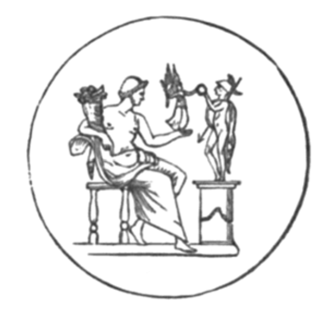

#  第二十六章

1\.  其後，他問：「誰願前往？」一幅異象隨之出現。

2\.  一個少女現身。她散發著青春光芒，遠勝天界的眾星之光。

3\.  少女生有雙翼，袍長至足，雪白的翅膀閃爍著天界星辰的榮光。

4\.  她右手持棕櫚枝，左手持神祕法杖，飄浮於紫光中。

5\.  他說：「你看。」我看見另一幅異象。

我們彷彿穿過了陰鬱的黑夜，
進入晨曦燦爛的光輝裡；
金雲在榮耀的波浪中翻湧，
每朵雲似乎都懷抱著一顆星。
甜美的嗓音吟唱聖歌，
輕柔的歌聲如夏雨灑落，
從一座幽深洞窟中，
傳出了大天使的頌歌。

6\.  他又說：「你再看。」異象倏然而過。先是一人站在天界，左臂外伸，右手持曲柄杖，掌心眾星雲集。

7\.  之後出現另一人，身穿星袍，戴著王冠，右手持鞭。

8\.  第三人的身影出現，如真理般光裸無暇。一條巨大星蛇游動手中，諸天因他的出現而輝耀燦然。

9\.  第四人是位英雄，散發出大天使的光輝；他呈跪姿，帶著箭矢，右手持棍，左手捏碎三頭怪。

10\.  第五人充滿了青春與力量，右手持聖鐮刀，左手握蛇頭。他的雙足帶翼，以光速飛躍天際。四肢閃耀著璀璨榮光。

11\.  第六人現身，乃芬恩之後裔，立在天上的十字形中，表情肅穆。

12\.  在他之後，我見到一個可怖的半人半馬。他拉弓射出巨箭。雲朵紛紛驚恐退散。

13\.  接著我見到一對披星雙胞胎，眉間、肩頭、四肢皆綴滿星光，其中一人拿琴，一人持箭。

14\.  接著是一個駭人形象，其頭臉皆似人類，卻有戰馬的腿與身體。他以征戰姿態行進，全身籠罩於光輝之中。

15\.  第十一人是戰士，著胸甲，持盾與鎚矛。一位披星巨人，腰際閃閃發亮。

16\.  第十二人是位青年，眉心綴有一星，身體與四肢熠熠生輝。他倒持一甕，甕中的星光傾瀉地面。他的榮耀數字是 12 乘以 9 。

17\.  天使告訴我：「十二。」又說：「十。」接著說：「光，榮耀，生命。」我聽見天界傳來聖歌，但我已迷失在奧祕之海中。

日之子啊！見見此碑文吧 ——
它爍爍生光，
微光落於字裡行間，
黑雲籠罩四周。
我見到一根美之權杖，
如優美的棕櫚樹般搖曳；
我見到一隻強大的臂膀，
一落下死亡便降臨。
一朵雲再次飄過，
晶瑩澄澈如水晶，
彷彿天界的日靈
吟唱起一首新歌：

你比人子更美麗，
恩典流入你的唇，
因此，上帝永遠賜福於你。
準備好腰際的利劍吧，
大能者阿，
你氣蓋山河，權御天下。
在榮耀中英勇地出征，
為真理、順從與審判，
你的右手教會你可怖的事。
你的箭矢鋒利，
迅捷射進敵人心臟；
你的足下死傷無數。
國王啊，你的寶座將屹立不搖，
你治理王國的權杖，
是神聖的權柄。
你喜愛正直，
憎惡不公，
因此，上帝為你膏抹。
你的所有衣裳散發著
象牙宮殿的沒藥、蘆薈、桂皮香，
你在這薰陶中變得美麗。

我望見一支戰車隊，
戰車上載滿戰士，
他們乘風而來，從東方，
亦從西方與南方。
我聽見戰車轆轆，
地上的聖徒亦有察覺；
大地的柱基為之動搖，
轟隆之聲震動傳天。
車輪捲起旋風，
風馳電掣地前進，
如幼獅怒吼，
如怒海咆哮。
他們全數俯伏在地，
敬拜神聖的萬靈之主。
聖徒們啊，你們獲得福佑，心地純潔，
你們的前途明亮而榮耀！
你們將生活在陽光之中，
在恆久生命的純潔光束中，
你們將永生不朽。
聖徒們的壽命將永無止境，
他們心地光明，為人正直；
與宇宙之主同在者，必得安寧。
正如黑夜遁離之際，
太陽使真理升起，
在萬靈之王面前，
永明之光將永恆照耀。
其後，我看見成千上萬
不可計數的眾靈，
站在天界寶座前，
和著琴聲與笛聲吟唱。
在天界寶座的四翼，
亦有其他靈圍繞；
天使向我宣告
其名稱、等級、階層。
他們祝福並讚美榮耀之主。
第一個聲音永遠祝福祂；
第二個聲音祝福信使，
以及真理的殉道者；
第三個聲音柔聲懇求
解放被束縛於塵世的人，
他們憂傷的心發出哭號，
哀求萬靈之主；
第四個聲音告訴撒旦們：
「滾吧，受詛咒者，
你們不准接近主，
你們玷汙了律法。」
至高之神身邊的靈
在四道雷聲中說出此言；
我聽見四者的聲音，
如憤怒的復仇之海。