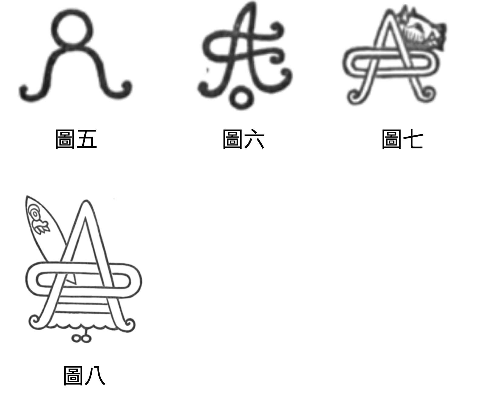
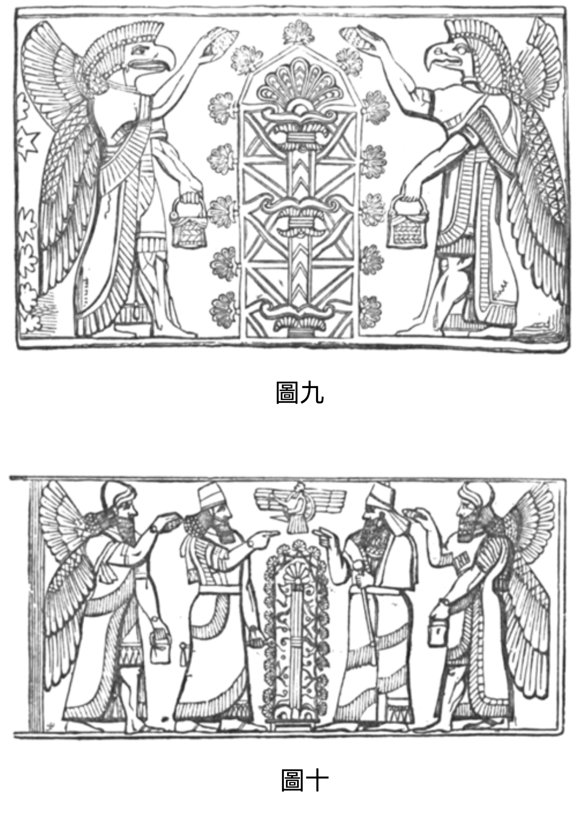
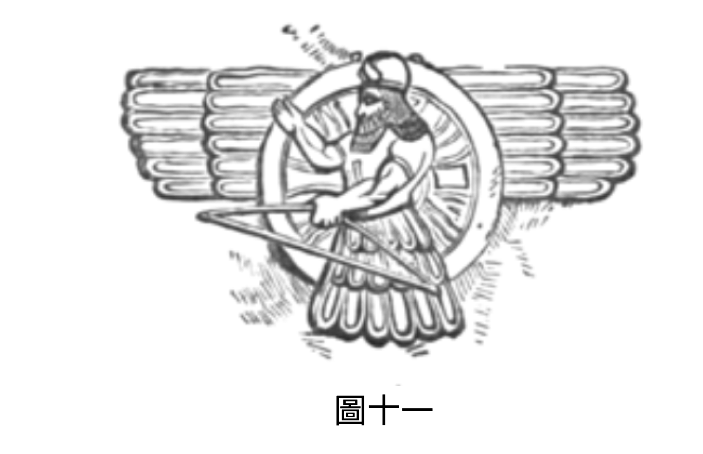
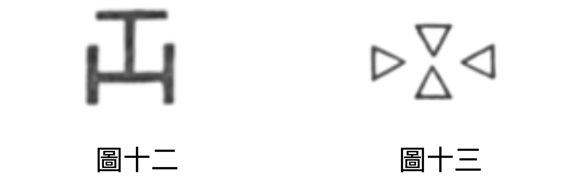
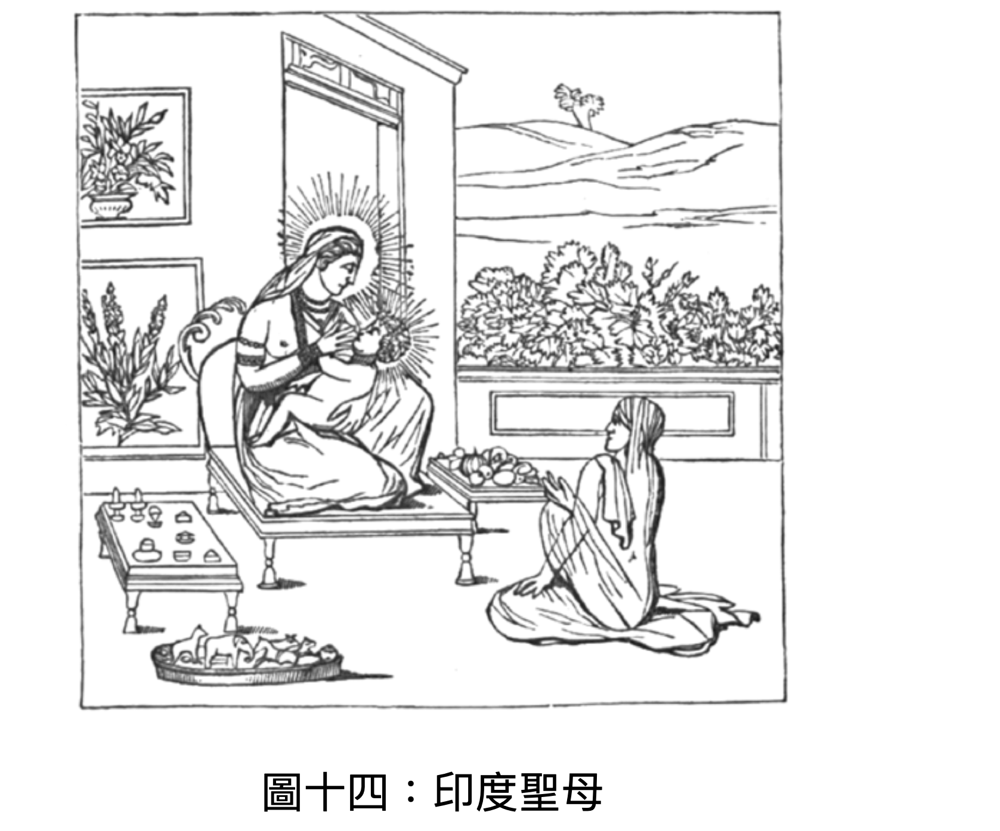
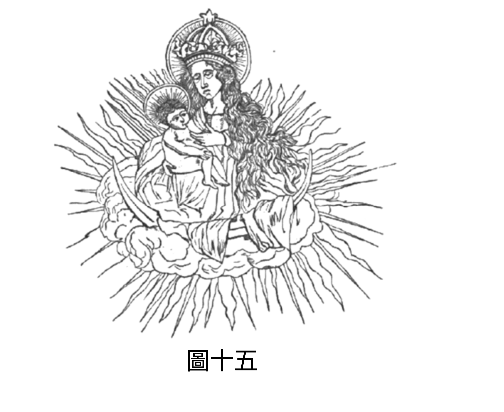
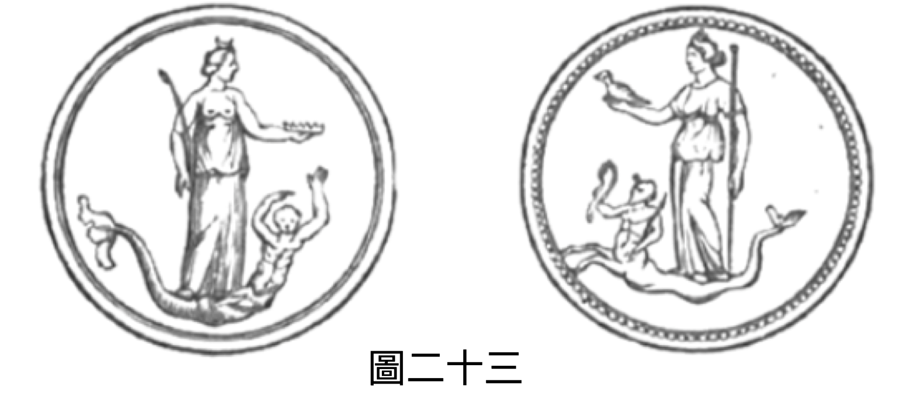

# 《以諾書》評註

1. 我們要檢視以諾的異象是否與第一位信使 —— 歐涅斯的異象一致。兩者之間有個需注意的區別：第一位信使的異象是單一且完整的；而第二位信使則有數個 異象 。歐涅斯，或稱本初佛，以預言般的輝煌一瞥，洞見了從他自身時代 一 直到第十二周期、乃至更 遙遠 的人類地球歷史。而以諾則未獲 得 此全景之恩寵， 只見 天 界 多樣且不斷變化的輝煌景象。 其 描述極為豐富，幾乎取之不盡；沒有哪本書能展現出 比這 更壯麗的天界景觀。至於兩者所詳述的天界體制，當然沒有分歧。如《啟示錄》中所 示 ，天界的等級體系主要包括： 1\.  至高無上的造物主上帝； 2\.  伊薩、伊西斯或聖靈，也稱為阿爾卡、阿爾奇、活火、梅塔特羅諾斯， 這 兩者共同構成了原始神學中的 Ao 、 Oa 或 Aleim 。有時他們是分開的：上帝為王，伊薩為后；有時又融合一起，如鑽石中的光與物質，或如陽光與空氣交融。 祂 向人顯現時坐在寶座上，壯麗如鑽石與烈焰紅玉髓，這些意象傳達了極致的 輝煌 、純凈與令人敬畏的榮耀；寶座周圍常見天界 的 彩虹，以溫和之姿加冕神聖君主 ，乃上帝 的象徵。聖靈在另一種形態中，獨立於至高主 而 存在，在後文出現。她被描繪為身披最純凈、最輝煌的光芒；飾以太陽、月亮、星辰，象徵著知識和尊嚴。她 擁有 光彩服飾、高聳寶座（以第二顆光體為腳凳） ，其 冠冕不是鑽石或紅寶石，而是天上的群星，這一切都顯示了她的偉大 ，以及 在天界之王心中的崇高地位。古希伯來人有時將  AO  讀作  א ， תא （十字）象徵上帝或男性原則， ת （ 三石門 ）象徵女性 原則 。這可見於《光輝之書》、《巴希爾經》和《正義之門》。靈 （Ath） 加前綴 Ｎ， 則 是 全球常用的神名，與埃及（或更準確地說是非洲）的奈特 神 本質相同。這種二合一 的 本質 美麗而 偉大， 使 第一位信使起初無法直視其真容 ； 若 未 經 過 考驗、 未驗證其 塵世本性能 否 承受真實 的 榮耀， 那麼 只能看到幻影的預示。正如人凝視太陽會失明，最終只見黑暗；即便是大天使之眼，若直視上帝的耀眼光輝，也 是 如此。

2\. 史威登堡曾見到這至美的靈，以「靈-太陽」的形象出現， 儘管 他不自知。他稱之為「靈性太陽」，其光輝之耀眼，物質太陽 相比 不過是其微弱的映象。他說， 上帝 之愛與智慧是實體與形體，在天界中顯現為「靈-太陽」，這不是上帝本身，而是上帝的最初、主要的散發物。此太陽的熱是愛，光是智慧。 此 太陽看起來離天使有一段距離，並且位於適中的高度，如我們世界的太陽。

3\. 在另一處，他用古語「 上帝 之家」 來描述她。他說，有一日清晨醒來，「靈-太陽」顯現於他眼前。天堂在下方， 其間 距離如物質太陽 與 地球 的距離 。與此同時，他聽到無數不可言喻的天籟，最終匯聚清晰地表達了神聖的話語：「只有一位上帝； 其 居所是「靈-太陽」。」這些話語自天堂降至他所在的靈界，因距 離 源頭已 遙 遠， 因而無法 理解。其所含的「唯一上帝」神聖觀念，墮落為「三位一體」的錯誤觀念，認為有三位神。 物質太陽的所有光輝與溫暖皆源自「靈 - 太陽」。須知，斯芬克斯有十二乳、戴十二瓣玫瑰冠，象徵十二信使之聖母。我從基爾克神父的《埃及之謎》（第三卷 541 頁）抄錄了這一美麗象徵圖像 ， 類似形象也見於蒙福孔的著作中，以燈的形式出現，作為 傳遞「光」的 媒介（ 《 創世紀 》 1:3 ），即「靈 - 太陽」。此燈曾屬於托斯卡納大公。 

4\.  這種純凈的散發物（聖靈），埃及人稱為奈特，示巴人稱為萊赫姆，被視為力量與智慧之女神；她是 首位 源自至高者，也是唯一擁有部分祂偉大屬性的存在。智慧是心智最高貴的品質，而神的心智則是智慧的極致完美，其所有屬性皆為智慧之屬性，其力量始終受智慧指引。因此，力量與智慧被視為神的屬性，二者實為一體。貝洛娜、庫貝勒、密涅瓦、狄安娜、伊什塔爾、巴瓦尼、奈特、維納斯、刻瑞斯， 都只是 同一人格化的不同名稱。希臘人與埃及人都認為她兼具雌雄兩性，在現存精確記錄的藝術品上（如第一卷折頁插圖）， 將 她描繪為擁有所有 的 象徵， 包含了 創造、保存 和 毀滅的屬性。讀者會注意到人物胸前的蟹 —— 象徵太陽信使， 自水中而出， 如同第一位信使歐涅斯；後文 會提到 奧維德指 的是 第九位救世主。另外 也 注意到 ， 每一 圖像 皆為十字形（ T ），一位頭戴啟示錄式的光環，另一 個 披 著 伊西斯面紗。六朵玫瑰象徵那羅周期。在圖 （一） 中，她被描繪成弗里吉亞的庫柏勒，擁有《啟示錄》中聖靈的大部分特徵 ： 頭戴象徵聖城的塔冠， 城牆如一顆顆 寶石。冠下披 著 面紗。后袍繡有各類花卉，象徵誕生自太陽的諸靈。她坐於立方體上， 乃 天降 之 新城的形狀。四輪戰車由兩隻 「 神之獅 」 拉動 —— 即最尊貴的大天使，支撐 此 皇室本質。右手持權杖， 而 後將此 杖 賜予第十二信使（見《啟示錄》）；左手持鑰匙，開啟天與地的奧秘，紀載於聖書中。我用另一件古代雕刻複本來補充 ，圖（二） 描繪 了 伊特魯里亞的查德梅爾，拉丁的伊阿努斯或歐涅斯，希臘的信使，腓尼基的墨丘利。這與查塔里烏斯奇特的版畫極為契合。他戴救世主冠，象徵第一與第十二信使；一手持啟示錄異象中所見的測量杖（第 50 節），另一手持聖靈之鑰，其幻影首次在天界顯現時便持此鑰（見第 43 節）。鑰匙被永恒之蛇環繞，此處象徵聖靈，她將其賜予第十二信使。由此我們也知，信使是拉著她戰車的兩隻獅子，將她的真理傳播給凡人。

5\.  下一階層是寶座前的七靈，隨後是七 位 持金燈者；這些大天使的力量與本質 極為 壯麗、光輝與美麗，如七顆最光彩奪目的太陽。用一個 貼近 東方思維的比喻來說，這七位 持 燈台者各自掌管著七個教會之一，毫無疑問，這 些 神聖團體的福祉 受到 所有天界階層的深切關注。但其中主要含義是，他們是七個超然世界的首領， 而 高階靈體生活在這些純粹非物質之光中：即「靈 - 太陽」之光。由此可知，上帝透過 其 副攝政者管理各個層面，這些副攝政在各界 域 中擔任的角色 ， 與降臨下界的信使相同 ，作為 神聖真理的信使與執行者。因此， 信使也被描繪在七者之中 ， 彷彿從七者 的光輝與鼓勵中汲取力量與美麗， 乃 使命所需，不時降臨 到 需要他 的 存在和教導的漂泊層面。

6\.  這位信使被描繪為 「 人子 」 ；他是宇宙的象徵，體現了其角色的普遍性；他在靈性上為雙性、具雙重本性，幾乎所有神聖事物皆如此。因此，有些信使自認與至高者為一，這種大膽 宣告 正是基於本節。他從如太陽般的七 者 各得一顆星 —— 即一份禮物 —— 禮物最終成長為一位信使 ， 被無上威嚴環繞，先知誤以為他是聖父而致敬。他對歐涅斯說話，話語顯示巨大力量 ； 若 回顧 歷代信使對凡人命運的影響，便明白為何 他 自居擁有廣泛權柄。然而，我們必須記住， 此 非真實的存在，而只是一種象徵或類型，為了當時的需要而被描繪出來， 經由 第一位信使向人類傳達該階層的尊貴地位，因為若要他親自現身恐怕未必合宜。救世主固有的力量與卓越， 展現於 第四節的華麗象徵。他們直接從雲中 —— 即聖靈懷中 —— 散發而出，在她的指引與庇護下行事；完成使命後化為智天使。讀者若能想象此幕及其角色，必 然 會承認 ， 不論荷馬、但丁或希臘悲劇家之筆，都比不上此般崇高與美麗。阿拉伯人至今仍用 「 雲 」 來稱呼 聖靈 ， 並 稱聖靈為 「 天水 」 ， 亦用來 形容極美之女子。 在 以諾第一章 之 前的象形文字中，聖靈亦被描繪為天水。若讀者翻到本書首頁的古代符號，便能 看見 救世主化身的美麗畫面。在黃道十二 星座 —— 象徵十二信使 —— 的中心， 上帝以王或父之姿出現，頭戴日光環，右手持雷霆，左手倚宇宙權杖，腳踏星球的象徵。聖靈在其左側，右側的信使正啟程前往人間，以展翅嬰兒為象徵，飛向萬有之母聖靈，尋求幫助與庇護。展翅之鷹象徵 《 啟示錄 》 之鷹 —— 尼姆魯德的鷹首神靈 —— 盤旋於地球， 此鷹 象徵至高者的力量、能量與火焰，以及警覺的目光，密切注視救世主即將踏上的道路。這是古代藝術中最美、最有意義的紀念物之一。



7\.  在 圖 （三） 中，聖靈立於火焰球體中央，一手持念珠，拉起伊西斯面紗；另一手似乎指向一位朝拜者，身著佛教或天主教祭司服，雙手交叉祈禱。我認為這事實上是象徵化身，由聖靈派遣執行神聖使命。此圖出自 1582 年 在 威尼斯印制、獲宗教裁判所許可的《聖母玫瑰經》。批準出版的教士們必然深知這些符號的真實含義；但如同共濟會的高等階層，他們並未向同道透露真正的奧秘。

8\.  接下來是最初七靈的另一番景象；這些靈被比作火燈，稱為「 上帝 的七靈」。他們是直接侍立於至高寶座前的存在，構成古人所 謂 的 復仇 女神或主的大臣（見第29節）。其中四位見於第15節，一位見於第21節，另一位見於第33節，還有一位見於第39節；他們合一之聲出現在第48、53、57節，隨後大事發生。在第60節，米迦勒完成第一次審判。印度教稱神聖七靈中 此 強 大 者為大阿修羅，被委以執行 其 法令。這些力量是天界上帝的信使，按神聖本能和神聖庇佑（如同加冕諸層面的信使）行王之旨。當惡人罪惡滿盈，罪杯已滿，報應之時便至，由七靈之一宣判正義。上帝永遠幸福，不會有憤怒；祂也不會因眼淚或祈求而偏袒任何人；這些是軟弱心智的特徵，與至高者的觀念不符。任何帶有絲毫邪惡本質的存在，無法接近無瑕純凈的上帝， 其 榮耀之光將如熾熱的火焰與鋼鐵，令有罪者無法承受 ，就算距離一千萬億英里也是如此 。因此， 惡者 不可能接近，實際上確實如此。我知道 這種 「上帝有位置」 的說法 會招致指責，但我必須承受此非議， 真正的概念是 「上帝無處不在而邪惡卻無法靠近祂」 ， 因而一切都交由七靈處理，罪人無法逃脫他們的手掌。縱使 其 判決在世上 未立即生效，曾受其 詛咒同胞 沒機會看見 ，即使痛苦被推遲， 惡人 似乎安然離世，也永遠無法逃脫七靈無誤的目光，終將由其中一位裁決。他們使有罪的君王被逐下王座，逐步追查盜賊與刺客，直到惡行受罰。每位依次被賦予審判權。柏拉圖在《法律》第四卷說：「即便是輕率之言，也有最重的懲罰；因為 報應女神是 正義的信使 ， 是監察者，掌管這些事物。」即使 是 最優秀的人也難以超越凡間與苦難之界；成為神明的考驗極其嚴酷。赫西俄德描述復仇女 神 身著白衣 ，報應女神 即七靈之一，或七靈的統稱。

9\. 四個 活物 前後都是眼睛，象徵全視的奧西里斯或上帝，位於七大能者旁；他們以眾目監察無垠宇宙萬象， 即時 向七靈報告何處需要正義，由七靈決定報應是立刻 到來 還是將來。柏拉圖在《蒂邁歐篇》中稱神為 活物 。亞里士多德亦曰：「我們稱神為活著的、不可見的、最卓越的存在。」（ 《 形而上學 第十四卷第八章）第一位信使歐涅斯或喬達摩被稱為大天使階層之一（第一部292頁）。二十四位古聖者環坐寶座，但他們並非寶座的常侍，之所以在異象中出現，是因為與人類歷史密切相關，他們曾是原始教皇或族長 ，是歐涅斯之 前的蘇丹。希臘人稱之為「守護靈」，指具有神性、受尊崇者。赫西俄德稱他們為「勇敢的、塵世的、凡人守護者」，披 著 黑暗 ， 行走人間，觀察善惡，分配財富（《工作與時日》121行）同樣的，第四節所述的四活物只是異象中四活物的另一面貌，而非天庭的必要或常設成員。

10\. 下一階層是「 上帝 的七眼」（第28節），即七位信使，向四活物或 上帝 前七靈報告凡人的各種行為；四活物則監察物質與非物質的生命宇宙。由此可知， 即便信使已 擁有智天使的榮耀，仍關心塵世追隨者的生活與進步 ，古聖者亦然 。 這些信使 以「七雷」 為 象徵，用眼睛監察追隨者的行為， 大 聲宣告 人生 罪 惡 的公正判決。但這些天界之雷還有另一種解釋，與前者並不矛盾， 並與 《啟示錄》所述的靈和諧一致， 此靈 有著多樣化的形象，其創造者上帝也是如此。解釋如下：潘 神 意為「一切」，是宇宙的古老象徵，古代最有學問的思想家視 之 為先於一切神祇 存在 。 其 形象描繪了自然及其最初的粗獷面貌。所 著 的豹皮斑點象徵繁星點點的蒼穹；人格由各種對立的部分組成，兼具理性與非理性，既是人又是山羊，世界 也是如此 ，由掌管一切的心智和繁衍的元素組成，火與水，土與風。埃及與古希臘智者認為 潘神 無父無母， 是 與命運三女神同時誕生的魔神，優美的 象徵 宇宙 源 自未知之力。但最重要的象徵，是他不斷吹奏 著 神奇蘆笛，由七根長短不一的管組成，但彼此間比例精確，能產生最完美無誤的和諧音樂，優雅地表達神聖和諧 的 本質。太陽系七大行星各自軌道不同、運行周期不同、體積不同，但其莊嚴運動產生了天體音樂，雖人耳不可聞，卻為心靈所陶醉。故七雷可象徵整個物質創造，由畢達哥拉斯 的 「七」 構成，有 各種組合、分化 與 倍增，是潘的神奇樂器， 是 其無誤音符的和聲， 也是 他所愛的對象 - 回聲女神；七雷之聲即萬物之聲，見證了至高者的存在，揭示時間子宮中 那 無誤不變的事物。古代神話 學 家將七雷的救世主象徵為七位舵手，駕船航行，船中央是猶大之獅，如《啟示錄》中 將信使 描繪位於七 持 燈者之 中 。昴宿星團即金牛座（巴力）頭上的七星，象徵 上帝 的七光體， 好似 永遠在哭泣 ，並 被置於天球（或稱星座圖）之上， 以 紀念「七雷」，其基調為哀傷。伊阿努斯腳下有十二座祭壇，象徵十二 位 救世主，信使 即 救世主，而祭壇中間有一位如人子的存在。見本卷前插圖。以諾 的 異象多處提及天界音樂，最早由畢達哥拉斯向歐洲解釋，教導行星運動產生 的 神聖和聲，因距離太遠 ， 人耳不可聞；維吉爾亦明確提及天體音樂：「他見到世界在天軸上旋轉，七大天體發出永恒的和聲。」 天體 如前述 的 象徵性笛子，由七根場短不一的管組成，月亮 之 管最短，土星 之 管最長。笛子置於 一切之神 潘手中，切勿 將此 與鄉野山神混淆；原始的潘代表太陽系之神，甚至至高神本身，是眾神中最尊貴、最古老者。詩人們追隨畢達哥拉斯，在每顆行星上安置一位歌者，吹奏蘆笛或歌唱，象徵各自 繞行 軌道時發出的旋律。蘆笛預示第十二信使，其名字含義為「蘆笛」，即神之祭司。

11\. 下一個神聖階層是七位吹號天使 ，向 整個宇宙宣告七靈（即報應女神）的審判。這些審判雖部分由這些天使執行，但主要由七金 碗 天使完成。熾天使是另一神聖階層，主要職責是歌頌至高者的榮耀。第一位信使屬此階層。

12. 關於 《啟示錄》中與信使本人相關的部分， 無需加以分析， 因為那只屬於異象；此處僅談論全能者宮庭的均一外觀，如神聖典籍所描繪 ： 背景充滿無數神聖美麗的靈， 就算只是 凝視寶座及其上的存在，就能享受超越性的真理與幸福、喜悅與愛，這正是至福異象的魅力與精華。因此，在天界宮殿中可見：1. 七 持 金燈者；2. 七火燈；3.  上帝 的七眼；4. 七吹號天使；5. 七金碗天使；6. 熾天使；7. 智天使；8. 四活物；9. 二十四 位 古聖者。所有「七」之體系皆源於此， 頻繁 出現在宗教與世俗文獻中。斐洛稱七為「完成之數」；納讚齊安的格里高利稱其為「有力之數」。共濟會中，七人方成一會。讀者可對比另一古老天界階層劃分：1. 座天使；2. 能天使；3. 主天使；4. 權天使；5. 力天使；6. 熾天使；7. 智天使；8. 大天使；9. 天使。須知，拉比稱聖靈為質點（或和風），解釋為智慧、神聖靈感； 上帝 的七靈稱為七質點。 （ 《寧錄》 II. 47 ） 另一相似的詞意為獅，即信使或大天使。

13\. 邁蒙尼德說，天使的名稱因其等級而異，因此有最高等級「神聖活物」、「輪、蛇或光輝之面」、「使節」、「極其光輝者」、「燃燒之火者」、「信使」、「神靈或大能者」、「神之子」、「如小孩者」、「天使人」。這十個名稱對應十個等級，最高等級僅次於上帝本身，即「神聖活物」 ， 因 而 他們直接 立於 榮耀寶座之下。所有這些智性體都是活的，能辨識造物主，並以極高的知識認識祂：各自按其等級 劃分 ，而非體量。然而，即便是最高等級也無法觸及造物主的真理，因為其知識有限；但 仍 比下一級知道得更多。每一等級 直 至第十級，皆以 各自的知識認識造物主，乃 人類無法企及； 但 仍比不上 上帝 完全自知。「信使」、「神之子」和「天使人」在純粹的畢達哥拉斯信仰中 ， 扮演重要角色，該信仰源自 歐涅斯 和以諾； 這些 在耶穌、奧維德，甚至維吉爾所屬的共濟會中亦為人所知， 這些光明之靈乃宇宙中活躍的低等存在， 特別關心世界與人類狀況。泰勒在《保薩尼亞斯注》中說，有三類靈魂永遠侍奉諸神。第一類為天使，第二類為魔，第三類為英雄。但無論 是 無形或有形自然中 ， 都不存在真空， 而是有著 深刻的聯繫， 將 低層面的頂點連接 至 下一 高 層面的低點。因此， 「本 質英雄 」 永侍 眾 神 ， 無感無染 ，有異於 大多數被動污穢的人類靈魂， 兩者之間 必有一類無感無染的人類靈魂下凡。古人稱這些靈魂為英雄，與 「 本質英雄 」 極為接近。赫拉克勒斯、忒修斯、畢達哥拉斯、柏拉圖等皆屬此類靈魂，他們下凡既為利益他人，也是順應必然性，因為 任何階層 低於上帝永恆侍者 的靈魂 ，都必須下凡。這些英雄靈魂的特徵是行為偉大、崇高壯麗；柏拉圖在《法律》中說，我們應敬仰他們，並舉行祭祀儀式以紀念 其 功績。他們與其他人類靈魂相比，純凈無染，智慧超群，性情高尚，脫離物質傾向，易於回歸理智 世 界 長久 生活；而非理性的靈魂則難以回歸，或僅短暫回歸。每一神明自上而下，皆產生自己的系列，包含多種不同本質。例如太陽產生 的力量有 天使性、守護神性、英雄性、精靈性等，每類皆具太陽特性；其他 諸神 亦然。所有這些力量都是諸神的永恒侍從。本質英雄 下一階 的靈魂類別，直接管理人間事務，在習性或聯合上為守護神，但本質上不是。關於天使本質，後文將有一位親見者（非僅推測者）詳述：即史威登堡。

14\. 以諾所用的座天使一詞，對基督徒 而言似乎 陌生。亞略巴古的狄奧尼修斯描述了天使在上帝面前的排列順序 ，此 神聖祭司將其分為三個三元組。最神聖的寶座 、 以及多眼多翼的生物，希伯來人稱為智天使和熾天使；其次是能天使、主天使，但這 都 只是推測。座天使與熾天使同階，但地位不如熾天使高，也不如 其 高貴壯麗。座天使如流星之輝，而熾天使則如照亮全空的閃電。布克斯托夫引自《猶太新年》：「你不可仿造我面前的大臣們， 他們在高處侍立我， 如座天使、熾天使、神聖活物及出行的信使。」在基督徒或彼得-保羅派中，我找不到關於哈斯瑪靈的記載。他們是智天使階層的靈，擁有火焰與陽光之翼；但在本卷中， 哪怕只是描繪 天界偉大 靈 質 的千分之一，篇幅也不夠 。 因此，我不會 描述以諾所見的阿薩林和伊薩林，只需提到 這 對歐洲神學來說是陌生的。

15\. 如前所述，以諾的異象與歐涅斯的天界政體觀並無沖突。在文本中， 此 第二位佛 眼見 風暴摧毀了偶像， 便 驚恐逃亡，經歷了一場夢境或幻象， 這 常常 始於 深邃如海的 靈魂熱情 ，如 同 史威登堡的部分異象 （非全部） 。一位美麗的處女， 象徵 他自身被啟發的 靈 質，或是神聖伊西斯親自降臨 到他 熾熱思緒 的 漩渦 中 ，或是天界之靈的顯現，引領他進入荒野，考驗其本性。他戰勝考驗，也得到了安慰。這場夢的記載屬於東方傳說最古老的部分。

16\.  接下來有個靈 立 刻 召喚第二位信使， 不確定這 是否 就 是夢中處女， 此靈賜予 「十者」模糊預兆（始於第六章） ； 抑或這只是一場神聖的預言異象，信使被天界榮耀包圍 ， 並受到神聖啟示，心思與至高者同在。但無論預兆何時降臨，其蘊含著最神秘、最富啟發性的智慧，正如這位偉大先知所展現。第一卷序言 說道 ，聖靈揭開所披的面紗——凡人無法揭開——以謎一般的方式展現未來之人的異象。讀者應知，以諾等高階天使及信使既非男性亦非女性，能隨意變換形態 ，不限於聖靈 ；因此，守望天使 也 可能以處女形象顯現在神聖救世主眼前。上帝在祂存在的最初時刻（若可用此語形容永恒者），便以聖靈顯現其榮耀 靈 質，成為AO；所有大天使亦被賦予 此 類能力。但我認為，彩虹顯現代表 的是 本異象中的星 ， 指的是聖靈（第1節）， 儘管 神聖天使也可能呈現彩虹之色，其翅膀常有此輝煌色彩 ， 故有「閃耀蛇袍」之神話。

17\. 從以諾第一章的描述可知，他本 來 是聖殿受信任的祭司：是夜間守望者或最高級的天文學家。腓尼基人（鳳凰的追隨者）稱這些人為天象觀察者。他在天文學與科學上的卓越成就，足以證明他 是 當時智者中地位 最 高 的 。此觀點可從後文得到印證。根據《西拉之子》44:16 說：「以諾蒙主喜悅，被接升天，成為各世代悔改的榜樣。」此處所說的悔改，指他逃離聖殿與夜間守望者。寧錄稱：「那位族長非凡聖潔，在於他回歸了 真正信仰，這在 當時處於腐敗狀態（第三部336頁） 。 」即歐涅斯《啟示錄》中宣講的信仰。寧錄作者如何得知此事？他是否獲知了高階共濟會的秘密？他是共濟會成員嗎？ 他 身為有地位的人，是否收到了大師的指點呢？《啟示錄》的博學作者常說，薩塞克斯公爵與他是英國僅 剩 知曉共濟會秘密之人；他應再加一人， 儘管 那人並非會員。赫伯特對真正的《以諾書》一無所知，但他所猜測的內容，唯有在 此書 才找 得 到。 看到 真理在這些意想不到之處閃現 ，著實令人驚嘆 。這位大學者 猜測 以諾與亞特蘭蒂斯 之間的關係， 也同樣令人驚嘆，我在第一卷中多次提及。

18\. 以諾作為天象觀察者之一， 遺留的 除其科學著作外，便是本頁所附的 「 黃道十二 星座 」， 起 源 並非來 自埃及。其中一些圖案確實與埃及 有關 ，但第二位佛如此 博學 ，取材自世界各地也不足為奇。中央的 「 唵-卜塔 」 與AO相似，但為何 基爾克 稱其為「三形神」 ？莫 非他知道兩條蛇象徵 的是 從 AO 散發出的整個靈 之 生命 ？ 我不認為他知道，但 作為 學識淵博的耶穌會士， 誰又能知 在梵蒂岡會學到什麽？他是否曾獲準在梵蒂岡四處查閱 文獻 ，發現了不允許外人接觸、古代信使長久失傳的著作？是否找到記載厄琉息斯秘儀的文獻 ， 從而學到我首次公開的內容？這些問題如今已無從考證，我也無暇細讀這位教會巨擘的著作。也許他確知某些真秘，若如此，便可解釋 上 述 之事 ；彼得-保羅派的三位一體觀念絕不可能啟發此說。儘管如此，上帝的太陽形象 具有 鴿子 的 翅 膀、以及 象徵活躍生命的蛇，與史威登堡所見「靈性太陽中上帝」的異象完全一致 ； 這 也 是 為何 不應輕率 的 否定 其 言論 。 我懷疑他是否研究過神話學， 其 思想要麽源自此處，要麽源自天界顯現。

19\. 阿本尼菲寫道：「阿德里斯，即信使（願他安息），是塞特之後第一個用筆書寫的人，阿德里斯自幼虔誠敬神，在美德上卓越非凡，遠超他人。上帝立他為先知，賜予他三十本書， 並 繼承了塞特所著之書及歐涅斯的奧秘文獻。他也發明了縫紉、織布與精美服飾，並在這些工作中讚美並聖化上帝；每當休息 時 ，便仰望上帝，冥想奧秘，將其寫入書中。阿德里斯年過四十時，至高者差遣他至該隱子孫 之處 。那時有巨人，生活極端墮落，沈溺於遊戲、歌舞等享樂，與放蕩女子淫亂無度，甚至與母親、姐妹亂倫，無恥的與惡魔（夢魘、魅魔）交合。他們完全陷於偶像崇拜，受惡魔教唆制造偶像，仿照該隱子孫造了五尊偶像，名為Vad、Schuah、Iaaut、Iaauk、Nesran。崇高的上帝差遣阿德里斯教導敬拜 真神，如此 榮耀且受祝福，他召集眾人，責備其惡行。這可見於《以諾書》中。」我引自基爾克的《埃及之謎》，可見這是根據真實的《以諾書》的一部分寫成， 作者 必曾見過此書，且與辛凱盧斯的希臘殘篇精神上極為一致。這與勞倫斯博士用的阿比西尼亞抄本相去甚遠，但我很想 看看 麥樞機主教未出版的手稿。

20\. 許多關於天書的古老傳說，源自 《 塞特之書 》 ，或許是基於《以諾書》第三章末或第十三章的內容。根據狄奧多羅斯·西庫魯斯記載，古時有一本用紫帶捆綁的書，載有諸神的崇拜與榮譽，由一只鷹 交 到底比斯的祭司手中——底比斯可指任何聖殿之名——神聖的抄寫員為紀念此事，頭戴紫帶與鷹翼。亞歷山卓的克萊門斯也提到祭司頭戴翅膀的事。他說，宗教遊行時，神聖書記走在最前，頭戴翅膀，手持書卷。鷹或鷲在神聖語言中意指來自太陽的靈；如同魚最初象徵第一信使，後來泛指十二聖使之一。見本卷伊西斯插圖，與本卷前折頁插圖相呼應。 

21\. 以諾是以火為象徵的使徒，火在 其 啟示中扮演著極重要的角色。瑣羅亞斯德 在研究 以諾 方面 多於 之 前的信使，因而火是其頌歌中一個重要特色。這是否神秘的 關聯於 他自身「化為火焰」，我不深究，但 這 確實值得研究。俄耳甫斯（意為火舌或火口）是太陽之子，是第二 位 信使或其祭司在希臘所用的名號之一。若非如此，便是指瑣羅亞斯德。在以諾之後，「火」成為了上帝的象徵，尤其是在第五位信使宣講之後更為普遍。哈格雷夫·詹寧斯先生在《玫瑰十字會士》中如此描述火的象徵與普遍神化：「錫克教的火塔、印度教的穹頂和多層尖塔、佛教各派 直立塔樓 縱向排列的廟宇、僧伽羅人的宗教建築、拜火教徒的直立火廟、意大利 的 鐘樓原型、威尼斯聖馬可塔樓、埃及火焰狀或金字塔形（希臘語 「 火 」 之意）的建築中，我們都能看到 此象徵 反覆出現。在穆斯林之地，宣禮塔在東方陽光下閃耀 ， 其 新月 雙角，如同月亮、圓盤 ； 或 者是 西頓阿斯塔祿的雙尖球體， 所羅門是 最具智慧的人類 ， 曾對這被禁止的崇拜產生邪惡的渴望；還有埃及人神秘的圓盤或圓環，反覆出現，彷彿在所有占卜師和巫師的神殿額上留下印記 。 埃及充滿深邃的哲學、智慧、神秘洞見和宗教，黑暗深淵中升起一位神明為其庇蔭；所有穆斯林的宣禮塔 ， 其他月亮、圓盤、翅膀或角的象徵——這些紀念碑或 象徵 都見證了火的神化。這些還見證了詹寧斯先生未曾察覺的 更多含義 。每一座宣禮塔、方尖碑和火廟，都以獨特的形狀和形式，見證了 啟示錄權杖， 賜予 了 第十二位信使，以及 其 象徵的普世主權與宗教權威。幾乎所有東西方的神聖建築都可見一斑，包括其曲線、象形文字和火焰舌、上帝與聖靈權杖，以及摩西權杖化為蛇。兩者都以奇妙的形式，傳達了「十」與「十二」的神秘奧秘 ，原屬於原始時代的祭司 。 這 還見證了一種普世宗教，即 上帝信仰， 以火或△ 為象徵 ，以及A與I（AO的首字母）。讀者可參照本卷前附的折疊插圖，對比權杖和節杖； 節杖 與伊斯蘭宣禮塔頂端 的 新月 有著 相似形狀。請注意，在埃及雕像中，第十二位信使的權杖常出現在 信使 象徵手中： 此杖 盤繞著蛇，每一位救世主都持有它； 此乃 古波斯賢士、婆羅門祭司及古代德魯伊的魔杖； 現今 彼得 - 保羅教會 中的 主教牧杖；在羅馬錢幣上，常以連鎖螺線的形式出現。

22\. 第四章中的《天文學之書》只 是 殘篇 ， 未能抵御時間的侵蝕，也無必要完整保留，因為在當今時代，天文學知識 大致上 已達到了人類實際應用所需的極致。以諾 已 留下榜樣，激勵後人追隨其光輝而崇高的足跡。德拉蒙德博士說，埃及和迦勒底的祭司們在天文學上的成就，越是深入研究，越 是 令人驚嘆。他們周期計算 的 極為精確，掌握 了 天文學最重要的知識 ；若能 公正探討此問題 ，會發現這 是顯而易見的（見《俄狄浦斯·猶太人》124）。在他之後，瑣羅亞斯德將這門科學完善至極。他堪稱「古代的牛頓」，只不過 其 天賦普遍遠超牛頓。第七位信使也精通埃及所有學問，對天文學亦有深刻了解；約書亞時代的歷法改革 （ 荒謬 的變成 「約書亞命令太陽靜止」 ） 無疑歸功於雅赫摩斯的才智，儘管這位偉人已在改革完成前去世。波菲利引述辛普利修斯稱，「加里之強者」迦梨斯提尼在亞歷山大攻占巴比倫時，曾從巴比倫寄給亞里士多德一份長達1903年的天文觀測記錄。巴比倫被亞歷山大攻占約在耶穌誕生前350年， 若 加上1903年，則巴比倫人在第九位信使降臨前約2250年就有天文觀測。巴比倫的鼎盛輝煌 在 大流士 被 毀滅後 終結 （約耶穌誕生前600年），迅速衰落。見希羅多德與狄奧多羅斯·西庫魯斯。後者提及阿特拉斯的天球，狄奧根尼·拉爾修斯則 提到 穆薩伊奧斯的天球。帕拉墨得斯（意為「古代謀士」），據說生活在特洛伊戰爭時期：

「他發明了星辰的量測，
記錄其運行、天體秩序、以及星座，
用 以標記無數星空的徵兆，
判斷航行與耕作的季節，
他首先發現了各行星的運行規律、距離與周期。」
辛普利修斯對 於 亞里士多德《天體論》的注釋中，提到了迦梨普斯、歐多克斯、奧托利庫斯和索西根斯的天球；這些都是啟示 錄 祭司的厄琉息斯名 稱 。斯特拉波說，盧庫盧斯攻占本都的西諾普城時，帶走的寶物中有貝爾-奧魯斯的天球。普林尼稱，希帕恰斯擁有一只繪有星辰的天球。巴別塔據說是 由 夜間守望者建造的天文台；讀者可以將深奧的天文學知識追溯至第二位信使時代，那時已取得了偉大的成就，甚至遠至本初佛的周期。 

23\. 第二位信使深入了解星辰的秘密，以至於 其 名字與天球儀的發明聯繫在一起。不過，我認為他只是 加以 完善，而 非 發明。 當 他被稱為阿特拉斯時，總以肩扛天球的形象出現，成為了一個象形符號，據說阿特拉斯支撐著天界。他在埃及的象徵亦如此（見圖 五 ）；見聖靈之六百。此象形文字見於基歇爾，意為「上帝」；也指永恒之蛇托舉宇宙；還象徵著名的「雙蛇」象形文字，此雙蛇散 源自 有翼圓球，代表微觀宇宙的兩位守護靈；眾多古代徽章中 也 出現兩獅、兩孔雀、兩鷹；還有纏繞信使神杖的兩蛇。 這 還象徵著活躍、熾熱、蛇形生命力，從這個偉大的「O」中湧現，並充滿廣闊無垠的宇宙。上述形態可見於薩默塞特郡阿布里和斯坦頓·德魯的巨型蛇形神廟。這一符號分解後，實為 AO。讀者可將其對比於埃及神的象徵，見圖 （六） （同為AO，A與倒置的Ω融合）， 這 一眼看出 是《 啟示錄 》 中的AO，祭司們卻將其曲解為阿爾法與歐米茄 等 無稽之談。這些原始符號見於基歇爾的《埃及俄狄浦斯》第三卷第23頁。但 這 還不及下述奇妙符號，常見於墨西哥象形文字中。圖 （七 ）代表 AO，結合了印度野豬化身、斯堪的納維亞的索爾 、 和威爾士亞瑟王的象徵。 另一個墨西哥符號也 同樣重要，代表印度的魚化身，以及聖靈頭上的埃及魚（見折疊插圖）。此處可見 AO 二合一，發出信使 ： 第一位信使、亞述的歐涅斯、《啟示錄》的神聖書記，其形象見第一卷。這些遺跡將西藏、印度、亞述和埃及的原始信仰與象徵 ， 與英格蘭關聯起來。 我們在波斯納克什 · 魯斯坦和墨西哥奧科辛戈古廟上，也發現了同樣的祭司符號。我希望將人類帶回這一崇高而純粹的信仰；我的靈魂每天都被太陽般明亮的異象充盈。如果這是一場夢 ， 我已為之獻出畢生的心血 ； 若將這份努力用於其他領域， 我 許能贏得許多外在榮譽與財富 ， 但我並不看重 這些 ； 因此 我依然在夢中勞作，孜孜不倦。



24\.  在圖 （九） 所示的亞述浮雕 中 （可能已有五千年以上歷史）， 可見 兩位鷹首靈 質 或大天使力量向宇宙致敬。宇宙被象徵為一座聖殿或一棵神聖的樹、一棵世界棕櫚樹、周圍環繞著十三個燃燒的太陽或星辰 ，為 主要 的 花朵或果實，向四周發射光芒。 較高等的共濟會中有「白鷹騎士」，正是 為紀念此景。這棵樹或方舟象徵天之聖靈。十三顆星代表十二位信使或盧庫摩斯，從至高太陽（第十三顆星）汲取光芒，太陽以七重輝煌的光芒加冕宇宙的莊嚴支柱 —— 既是樹又是柱 —— 其上方閃耀著史威登堡所見的「靈 - 太陽」，引領十二位最明亮的子女和大天使化身。這些盧庫摩斯（山、奧密德或光之柱）是古伊特魯里亞的救世主，其頭銜與印度的摩奴類似。嗎哪是天使的食物，事實上指摩奴信使，是所有饑餓者的生命之糧。其 他 類似詞也 是 神聖共濟會用語。這些中心圖案反覆出現於凱呂斯伯爵《古物匯編》第一、四卷的伊特魯里亞精美陶瓶上，瓶上的女性形象否定了因曼博士所提出的觀點。格溫多 - 盧的黑鷹與此類似；但德魯伊教在墮落時期， 恐怕 將亞述信仰中溫和的祭品變為血祭或血贖，如保羅及其追隨者所宣揚 的，在 加略山 上 非自願的十字架犧牲。在 圖（十） 浮雕中，我們看到第一、第二位信使（歐涅斯與以諾） 以 國王的形象、或做為人類微觀宇宙的兩大守護天使，向上帝致以神聖崇拜，即世界「柱 - 樹」的守護者；兩位鷹翼大天使站在一旁，是 兩位信使 在世間的特定引導者與庇護者，彷彿以神聖預兆的光輝來讚美， 如我 曾體驗過的那樣，熱切地崇拜造物主，被包圍在  O  中，左手持有  A  或  △ ：有翼的 AO ；《啟示錄》中的鷹翼伊薩。在此，「柱 - 樹」或  AO  被二十四位古聖者的星形或玫瑰形象環繞，頭頂 是 「靈 - 太陽」，而她則被至高神的光輝與形象加冕，漂浮在光中，此光為「靈 - 太陽」的身體，手持聖靈的 △ 符號。

這些符號可見於凱呂斯《古物匯編》第一卷第 65 圖中，鷹翼、鷹首獅子拉著愛神戰車  ；在同書第二卷第 10 圖中，埃及太陽船上 有 兩隻鶴或太陽象徵 ，以及 神聖的 T ；又或者作為兩隻公雞駕著一只獅子戰車，雕刻於紫水晶上；或作為兩隻毛蟲拉著海豚車； 或是 兩隻獅子部分托舉著美麗的天后，以及她身上六個新月狀的那羅角，如同 書中 第 90 、 118 圖。 又或是 神秘之舟上的兩位鷹首祭司，手持三柱，頭頂鴿翼太陽 AO （同書第五卷第 12 圖）；以及同書第四卷第 16 圖中兩隻鱷魚的精美雕塑。毛蟲為何象徵救世主？原因顯而易見： 其 卑微、匍匐、完全屬地的外表下，隱藏著美麗的蝴蝶形態，彩翼如虹 ；另外的象徵包括 蛇、鮭魚、聖甲蟲、孔雀和垂死的海豚；這些象徵意義讀者在前幾部分的中已熟悉。

25\.  邁克爾 · 格萊卡斯在其《編年史》 121 頁中說： 「 據說，福音天使烏列爾位於群星之間，降臨到塞特和以諾，教導他們歲月的長短、月份的變遷 、 以及年份的變化。 」 很可能指的是那羅周期。法布里修斯引述一位無名作家說，某些東方賢者從《塞特之書》中得知有一顆星，將預示新救世主的降臨，於是選出十二位最受尊敬且學識淵博的同伴，負責觀測 何時 出現，這些人被稱為 「 賢士 」 。他們 居住於 一座山中，山內有一洞穴，四周樹木環繞、泉水潺潺，他們在 此 沐浴並向上帝祈禱三天， 而後交接給 其他十二人。這樣持續了好幾代，直到他們看見那 星星， 宣告 著 第九位信使 的 誕生。於是，他們派出其中三人，跟隨這顆星星兩年，直到來到耶路撒冷。我已指出，耶穌熟知這些著作中揭示的許多神秘真理；事實上，他本身就是第七位信使的再生，精通埃及所有智慧（見《使徒行傳》 7:22 ）。因此他多次提及自己的前世， 他在 天界與地上的顯現中都屬實。 「 我實實在在地告訴你們，在亞伯拉罕之前，我已存在。 」 （ 《 約翰福音 》 8:58 ）此話被彼得 - 保羅派完全誤解和曲解。耶穌 暗示奧秘 給最親密門徒（他常勸誡他們 「 不要把珍珠丟給豬 」《 馬太福音》 7:6 ） ，並在私下傳授密傳宗教（《馬太福音》 13:10,13,36 ； 17:9 ；《馬可福音》 4:11,12 ；《路加福音》 8:10 ； 13:24 ；《馬可福音》 4:34 ，與《約翰福音》 18:20 相矛盾））而在耶穌離世後，這些教導被銘記於心，基督教中出現了自稱 「 塞特派 」 的教派，正如以皮法尼烏斯所述， 這 第九位信使被認為是塞特的再現，上帝允許他第二次降世以復興天國真理。據說賽特曾受天使教導，被接到天界四十天；同樣地， 據說 耶穌在曠野中受試探四十天，並在戰勝試探者或控告者後，天使來服侍他。 訪問 天界 時 ，塞特 變換聖容，充滿光輝， 如後來的耶穌一 樣 ，此後在世間也永遠保留 此 道光輝。以皮法尼烏斯說，塞特被稱為基督，即 「 受膏者 」 —— 在印度意為 「 純潔者 」 。請注意，耶穌自知為第七位救世主的再現（以懺悔者身份），這解釋 其 非凡的忍耐：他似乎只抱怨過兩次 。 （ 《 馬太福音 》 8:20 ； 17:46 ）還請注意，第一位卡比里雅赫摩斯與其再現 的 耶穌之間有趣關聯，即星期二（火星日）為 「 耶穌日 」 。見福修《偶像論》 480 頁，阿姆斯特丹 1641 年版，寧錄第三卷 388 頁引。可與前文第一卷 255 頁提及的阿貝拉馮鮭魚每年再現的神話對照。

26\.  我未曾得知，也未曾試圖了解，是否有特定天使引導第二位信使遊歷他所見的大部分場景。他提到有不止一位天使與他交談。但我認為最常向以諾顯現的光輝靈，是阿拉伯人稱為 「 忠信之靈 」 的加百列。波斯人以 「 天界孔雀 」 作 為 隱喻 ， 即 「 信使 」 之意；孔雀如鮭魚、聖甲蟲一樣，是救世主的象徵。緬甸人以孔雀或信使為國徽，視其為天地間的仲介者。毋庸贅言，這個最古老且開明帝國的國徽 ， 絕非源自歐洲；自厄琉息斯共濟會消亡後，孔雀的象徵僅見於東方。緬甸孔雀張開雙翼成完美圓形，彷彿立於太陽之中，正如《啟示錄》所述（。緬甸國王名叫伊亞扎迪 · 伊亞扎，類似於阿齊茲、赫蘇斯、耶穌等名字，他自稱為旭日之王，暗指那羅周期 、以及 其化身大天使，按東方神學，他被視為活喇嘛 的 代表。耶茲迪庫爾德人在秘密儀式中崇拜孔雀天使或信使。見費夫爾《土耳其劇場》 367 頁，巴黎 1682 年版。在迪德隆，有一個希臘十字架的雕像，位於一個拱門中，旁邊有兩隻孔雀，如亞述的兩個鷹首神。十字架象徵上帝，拱門象徵聖靈，孔雀為救世主。此雕塑原作為十一世紀。萊亞德說（他並不知曉自己所談的秘密象徵），耶茲迪祭司隨身攜帶著名的孔雀王。我請求卡瓦爾 · 尤素夫滿足我的好奇心，他答應了，清晨帶我去納齊家。剛進門時，屋內光線昏暗，良久才看清那件蓋著大紅毯的物品。祭司們恭敬地靠近，鞠躬並親吻其下的布角。一個明亮的銅或黃銅底座，上面立著一個粗糙的鳥形銅像，類似印度或墨西哥的偶像，而非公雞或孔雀。其工藝頗具古意，但未見銘文等。然而，這些可憐的祭司及其更可憐的信眾，對孔雀象徵及其所蘊含的真理一無所知。萊亞德所繪 的 更像鳳凰，但無論是鳳凰還是孔雀，皆為救世主象徵。根據穆斯林的說法，加百列將《可蘭經》神聖章節傳給 了 第十信使。他與米迦勒同屬伊斯蘭教所謂的莫卡雷邦階層，常侍上帝寶座左右。其雙翼橫跨東西，足下晨光閃耀，榮耀難以言表。每位大天使皆可隨意放大自身，光輝超越烈日極盛之時。

27\.  以諾所見天 界 奇觀，使他深感必須摒棄一切對太陽或星辰崇拜的傾向，因此在第五章開篇即聲明，所有崇拜只能以上帝為唯一崇高對象，其他皆不足取。讀者應記得《啟示錄》第一部分第 13 節中提到的火紅戰馬異象，本章亦提及。以諾在本章還談到 獲得自 天界力量的符號，其中一些收錄於第一卷折疊插圖。其中之一 是 帶柄十字架。《啟示錄》中的  T  形十字（安卡）見於大英博物館的獅首斯芬克斯手中，也見於世界各地古代遺跡。這些雕像手握一個環，上面連接著一個方形板，微微浮雕著三重十字架。奧魯斯 - 阿波羅稱，當埃及人被問及其含義時，稱 此 為神聖 —— 即秘密與啟示的奧秘。一種觀點認為 這 象徵復活或來世， 或 代表一體性。許多埃及神廟的平面布局 依據此型態 ；許多聖所或帳幕 也 是以此形狀為藍本設計，墓室的總體布局（如見於利科波利斯）也體現了仿制與組合的宗教規範。貝拿勒斯和馬圖雷亞的廟宇即為此形。埃及人與德魯伊的祭壇多為  T  形，也有圓形與蛇形。古時 將此作為徽記， 如緬甸的孔雀與印度的魚一樣。下端延長則為埃及旗幟，作為各城徽章的支撐，如萊昂托波利斯的獅子、潘諾波利斯的山羊。波斯古旗（見沙普爾雕刻）為十字架，三上臂各加一球。旗幟自古為埃及、中國、緬甸的神聖之物，極具宗教象徵。基歇爾著作中有幅圖畫 ，長柄十字上懸著帶 角 的 蛇，眾所周知，這是創造性智慧或造物神的象徵，也是希臘與伊特魯里亞精美卷軸的起源，實為埃及風格。索爾之錘為  T  形，該神本身有時以巨型  T  （由樹幹與樹枝構成）形象出現。 T  形似乎專門獻給埃及托特。赫耳墨斯的方形神像即以此為模型製作。荷魯斯手持的十字架（飾以戴勝鳥的頭）與主教、朝聖者所用者相同。金星符號即帶柄十字 ： 十字與圓圈。直線與圓圈  IO  的結合，象徵愛情；基歇爾稱希臘字母  Φ 本為象形文字，常見於獎章上，意指自然、女陰或吸引力；與 τ 結合為 φτ ，構成普塔、或以諾歐普塔特徵，即宇宙的運動之靈或二合一  AO 。古代金星確實象徵哲學家所謂的 「 愛 」 、磁力或吸引力，其符號顯然意在表達此功能；尤其如許多人所言， T  為生殖力的象徵。有時圓圈被三角形或 △ 替代，象徵世界激發之火及女性生殖力。 T  字奉獻給荷魯斯，如 同 厄洛斯，是埃及的金星之子、自然之子或聖靈之子，是愛、光與熱之神，是從混沌原卵中誕生的金翼美神。這些奇妙留 存 的符號 ， 證明了帶柄十字自古即 為 神聖與啟示 錄 的 紀念物 。



28\.  在祭司的繪畫和雕塑裡，手中除帶柄十字外，還有兩種常見圖案：一為四點突出的卵形，另一為三角形。這些圖案明顯具有護符或抽象神秘性質。埃及哲學有一重要教義：在自然太陽被創造、並流出物質光之前，存在著永恒無處不在的智力之火與源泉，三角形或金字塔極好地表達了這一點，至今畫家、神學家、化學家仍以其為象徵。 此為 長者奧西里斯、造物主，是原初水的配偶，如希臘的火神與維納斯，萬物由其結合而生，首先誕生荷魯斯 —— 生命與愛的光明神，道德與智力之光。但埃及人誤以為光只與上帝有關，實則也指原初光、「靈 - 太陽」、聖母， △ 為其象徵，亦為父神之符號。火焰呈金字塔形，泉水亦然，故金字塔與 △ 皆為上帝與聖靈的象徵，二者結合為古印度共濟會符號  ✡ ，即  AO 。火與水、上帝與聖靈，是埃及神學與哲學的首要原則。前兩圖已說明，最後一圖不言自明 —— 即伊西斯，女性或被動原則；迦勒底的混沌，卡巴拉的阿爾格，哲學家所謂包容一切的原始水。 看看 象形文字就能理解其 含義 ：這是混沌之卵，萬物的母體與容器。其橢圓的焦點處在一條線上，從側面延伸出四個點。 此 數學形 式 非常貼切的表達了四個基本世界的孕育。托特名字的字母組合（由三個 T 底部相連 ，圖 十二 ）至今仍為共濟會 「 皇家拱門之寶 」 。共濟會源遠流長，大金字塔曾是一個大會所。見瓦爾皮《古典雜志》第二十卷。斯蒂芬斯在中部城市遺跡中，發現了以諾的圓球與有翼蛇，也發現了希臘十字與啟示錄的  T  字。第三部分所列大部分符號，在斯蒂芬斯著作中皆可見。物質宇宙在秘儀中以十字象徵 （圖 十三 ） ： △ 為火， ▽ 為水， ▷ 為空氣， ◁ 為土。五點三角形象徵著中國古代對天之五誡的服從，這也是佛教的五戒。以諾說，這些厄琉息斯主義的象徵，皆由高階靈 所 賜予。我們應當對其懷有崇敬之心，即便最具智慧者也應謹慎，不應輕易 的 否定自己一時難以理解的符號與象徵。

29\.  以諾在第七、九、十章講述了夜間守望者的歷史，並描述了他對子孫的使命。他見到罪惡之谷，一片如《啟示錄》所述的火湖，或如德魯伊教 的 惡魔之城 ，是 深淵之水下的火海。在這些章節中，詳盡地了解到歐涅斯或稱本初佛的祭司階層 ， 是如何背離神聖使命：他們作為神之子，如許多偉大教階 ， 常因欲望而墮落，貪戀財富，與人之女（即惡人後裔）通婚。此處神之子是指忠於上帝的人，「使人和睦的人必稱為神之子」（馬太福音5:9,45），並非天使或靈體，這只是《寧錄》作者荒謬的想法，更非任何人專屬的稱號。基於此，希伯來（非摩西）律法要求猶太人永遠只與本族通婚，不與外族結親 ； 這一禁令為整個希伯來民族埋下了死亡、腐敗與衰敗的種子，致使無一猶太人不帶疾病。 一個擁有如此多優良品質、美德和成就的民族 ，受彼得羅保羅派的迫害 ， 以及近親繁殖導致的血統腐化， 從而 放棄拉比的教導，棄用理性。任何希伯來人都會為其民族 一百年來 的進步感到自豪，其中開明 的人則 對 嚴苛法律感到遺憾，他們 禁止與非猶太人通婚。在第九位信使時代，他們極為腐敗； 而在 第十二位信使時代，他們與自詡美德的彼得-保羅派迫害者不相上下。迷信與奴役使其墮落，知識與自由將使其復興。願他們在獲得自由後，擁抱知識。我不敢祈禱他們 會 將 知識與自由 結合，因為我了解 其頑固 信仰。

30\.  以諾在 本章提及獅神。整個非洲因受獅神庇護 ， 而 被 稱為里奧諾伊 ； 獅神所屬的天界階層與救世主相同。浪漫派作家有時將「里奧涅斯」這個名字用來指代康瓦爾郡本身（即亞瑟王的故鄉——在 梅 林的預言中被稱為「康瓦爾的野豬」），有時則用來指代位於康瓦爾與歐洲大陸之間的那片土地 ，在亞特蘭提斯大洪水中淹沒 。幾乎每本古代的書，都能發現英國與東方宗教和傳統的關聯。「里奧涅斯」指波斯密特拉教的獅子（正如賢士所言的智天使獅子）、獅神、迦勒底的紅獅。埃及與埃塞俄比亞人稱巴比倫為獅子。密特拉教獅子據說無母且生於石頭，此石即聖靈。波菲利稱此獅為光明、太陽之子，即太陽化身為人。這將密特拉或智天使之獅與歐涅斯《啟示錄》中的猶大之獅關聯起來。

32\. 第九章進一步介紹了夜間守望者的歷史、偉大民族的教階 、 及其掌握並泄露的深奧秘密。寧錄稱，這些人已染上 狂熱宗教， 以馬為象徵，因此被比作嘶鳴的馬，舉止極為放蕩：男女混亂，老婦比青年更淫，父女、母子亂倫，父子難辨。與此同時，他們使用各種樂器，喧鬧聲直沖聖山之巔。 百名賽特派受 這些誘惑，違背誓言，下山與該隱女兒結合，生下古代巨人。他們在高級秘儀中學到並泄露的秘密之一是Akao。此詞與啟示錄中的神秘 AO 密切相關，意義極為深奧，如 同 瑣羅亞斯德的 「 阿胡那瓦爾 」 與婆羅門的唵 「 AUM 」 。AO 指諸水，或指神聖本體。此詞古老且極富神秘色彩。愛爾蘭語AOS意為樹與智慧，即聖靈；AOD（去d發音）為太陽名，也 是 火與光 之 女神維斯塔之名；Ao，火之女神，有人將其 類比於 印度的雅度。阿拉伯語Om-Ar-Ao，常加於神名之前，被稱為不可譯之詞， 也 與此相關。希望今後不 要 再有人提彼得-保羅派的阿爾法與歐米茄荒謬說法。杜布瓦神父引述《往世書》中有云：「吠陀所規定的一切儀式、火祭 、 及其他莊嚴凈化儀式 ， 終將消逝，唯有唵一詞永存，因為 這 是萬物之主的象徵。」唵即O，上帝的象徵，永恒之環；M為聖靈之符號，也是印度聖靈摩耶之首字母，/\/\為波浪或水的組合圖案。唵倒讀時，O為聖靈象徵，女陰、「靈-太陽」與自然之環，/\/\為永恒之蛇或神。這些符號皆美麗而富哲理。威爾金斯引自《薄伽梵歌》122頁稱，除唵符號外，還需加上「那」與「實在」，方成神秘神名。阿拉伯信仰中，知曉神名者可洞悉異國之事， 役使 精靈，掌控風與季節，治愈蛇咬、瘸腿、盲疾等。婆羅門稱那羅周期  為 「秘密中的秘密」。

33\. 以諾 並不適於 現代哲學家；他在第九章稱新生人類如夏日繁樹般繁茂。這與所有傳統一致，甚至與奧丁之園或伊甸園幸福時代的古老觀念相符。讀者可將地球最初時代（由二十四古聖者或歐涅斯 之前的 蘇丹統治）與赫西俄德的描述對比，再決定是否相信 該時代只有 猿猴，如達爾文及其可憎猿類所宣揚的。生活在耶穌前近千年 的古詩人說道 ，人類誕生後，黃金時代隨之開啟，這是不朽者的珍貴禮物，他們視克 羅 諾斯為君王。那時人類如諸神般生活，無憂無慮，無勞無苦。無有衰老，四肢永保活力，無病痛之苦。當消融的時刻來臨，死亡如睡眠般溫和，無恐懼。萬福齊至，大地自發豐收， 有著 和平、幸福與快樂為伴 。 （見《工作與時日》108節，第三部分454頁）

34\. 洪堡論及地球另一端的民族時，談道羽蛇神 的 統治時期是阿納瓦克人的黃金時代。那時所有動物與人類和諧共榮：大地不經耕種便能產出豐碩的收成；空中充滿了眾多鳥類，其 美麗的 歌聲和羽毛受到讚賞。但 此幸福世界沒有持續很久，如同薩圖恩統治時間短暫 。哥特人認為，世界最初 的 居民超越凡人，居於金光閃閃的宏偉廳堂，充滿愛、光與友誼，連最普通的器皿也由黃金 製 成，故稱黃金時代。純潔的幸福很快被污染：某些女子 從 巨人之國而來， 進行 誘惑 而 敗壞原初的純潔。高階共濟會士奧維德也以同樣的語言 ， 描述黃金時代的普遍共感。他說， 彼時的 信仰與正義無需法律約束，人們履行職責的動機並非出於恐懼，也不存刑罰。無需在銅版上刻下威嚇律法 ， 以遏制惡行。罪犯不必在法官前顫抖，生命安全無需法律保障。樹木尚未被用來造船遠航，凡人安居故土。 城市 無城墻 而 安然無恙，無需士兵維持和平。大地無需耕耘自生萬物，人們以野果、橡實為食。四季如春，和風暖花自生， 接踵而至的豐收 ，無需耕種。奶與蜜之河處處流淌，橡樹中蜂蜜自溢（見《變形記》第一卷，第一部分167、168頁）。史威登堡說，睿智的歐涅斯派（即本初佛信徒）絕不食肉，僅以谷物、果實、豆類、蔬菜、奶酪為食，殺生食肉被視為野蠻。但在隨後的時代，人們開始變得如野獸般兇猛，甚至更兇 殘 ，開始殺戮並食用肉類。以諾著作中多有此類古老傳統 。 與其將人類 的 起源歸 因 於林中群猴或穴居猿類，不如 審視 這些記載 ， 更能安慰墮落的人性。若 猿猴的 理論為真，便會認同荷馬（《伊利亞特》17:446）所言：

「 人在 是 所有受造之物中最悲慘、最孤獨的。 」
正如教宗所翻譯的：
「 啊，世上何物比人更卑微，
在塵土中呼吸或爬行，
有什麼可憐的生物比人更脆弱、更不幸或更盲目？ 」
難怪相信此「魔鬼學說」者，常絕望自盡。

35\. 第十章出現一個不凡的表述：「人的魂之靈」。佛教哲學據此區分「智力之靈」與「感知之魂」。 《 路加福音 》 亦云：「我魂尊主為大，我靈以救主為樂。」（1:46-47） 《 希伯來書 》 亦言：「甚至能刺入剖開靈與魂。」（4:12）約瑟夫說：「上帝以塵土造人，賦予其靈與魂。」（《猶太古史》卷一第二章）《使徒憲章》稱：「你造了他的身體，又從無中為他預備了靈魂，賜予五感官，然後，你將心智置於感知之上，作為靈魂的引導者。」（卷七34章）伊格那修說：「在肉體、靈魂、 心 智中。」（致費城教會）安東尼納斯寫道：「身體、靈魂、心智；身體屬感官，靈魂屬慾望，心智屬思想。」（卷三26節）賈斯汀說：「魂在體內，身體無魂則死，因為身體是魂的居所，而魂是靈的居所。」（《復活殘篇》）塔提安說：「我們認識兩種靈：一種稱為魂，另一種高於魂，是上帝的形象與樣式。」阿西那哥拉說：「他造人包括不朽之魂與身體，同時賜予心智。」（《復活殘篇》11節）最後，愛任紐說：「眾所皆知，我們的組成包括取自塵土的身體，和從上帝而來的靈。」有人認為，人死後的靈被包裹於「魂」的精微體內，直到最終脫離輪回 ； 這稱為「自輝之體」，自發光，無需太陽，如在天界中。此知識源自信使之書，尤其是《啟示錄》與《以諾書》，皆為秘儀所用。猶太人與彼得-保羅派對此 一 無所知， 在 其聖書中無此記載，唯 《 路加福音 》 有引述。但路加是誰？他真是猶太人嗎？還是羅馬一位偽祭司，假冒了使徒的名字？當今任何有理智且研究過 此 主題的人，都不會相信使徒們寫了任何福音書，儘管其中包含一些關於耶穌的真相。

36\. 第十二章記述了以諾奉命去勸誡墮落之靈。若 能 瞭解以諾是位佛，此 段 與霍爾韋爾《有趣的歷史事件》第二卷9頁所述婆羅門傳統極為相似。他說，部分天使群體叛變，被逐出上帝的面前及天界， 遭 永遠放逐，但因忠誠天使群體的代禱，最終動了慈心，將永刑改為懲罰、凈化、洗滌 ； 在 順服 後，重獲 先前 因不服從而失去的席位。上帝在忠誠天使大會上宣布懲罰、凈化與洗滌的過程，頒布不可更改的法令，命 令 梵天下凡，向被放逐的罪靈傳達造物主的慈悲與決斷。梵天遵命，降臨罪靈，宣告神的慈悲與不可更改的判決。其經文如下記載（由受啟發的霍爾韋爾 所 譯），彷彿作者手邊 有 此第二佛之書：「一切靜默時，永恆者再次發言： 『 你，梵天（即化身），披我榮耀，執我權能，下至最下層的懲罰與凈化之域，將我所言與所判，告知叛逆之靈。 』 梵天立於寶座前曰： 『 永恆者，我已照你的吩咐去做…… 。』 」

37\. 德·熱貝蘭的《原始世界》中，有一幅頗具趣味的古老圖案，取自一尊雕像的腰帶部分，值得一提。其中刻畫了刻瑞斯（聖靈）與其女普洛塞庇娜（墮落靈魂）的故事。女神乘坐半月形船車，由龍（熾天使）拉著，龍手持火炬或火舌。她飛馳尋找被冥王劫走的女兒，即墮入塵世地獄或死亡之手的靈魂。赫拉克勒斯（救世主）引領隊伍，眾人奔向雲端寶座上的神。周圍有十二塊長方石板或短柱，刻有十二星座，代表聖靈藉著十二信使，貫穿四季與所有界域，致力於引導那些迷失和偏離的靈魂——她的女兒們——回到上帝的天界面前（第四卷第7圖）。但此復歸必須自我實現。上帝或上帝的智慧決不會出於恩典或寬恕 ， 而 直接 提升任何墮落的本性。若上帝為一人如此，便須為眾人如此才公平，自由意志將被永遠廢除。每個墮落靈魂必須自我提升，否則永陷泥沼。這正是第二位信使對被囚墮落者所宣告的，也是本初佛或歐涅斯《啟示錄》的主要信條之一。有 些 人認為上帝 怎麼 如此不公或殘忍，但若思考罪惡 是多麼 可憎——如習慣性說謊、偽善、貪婪、殘忍（如販奴者）——或許會認同，未悔改者永不 得 見上帝。

38\. 本章及第十五章提及的「陰影之地」 是 由六位天使 掌管 （部分 由 上帝面前七天使中的三位）。我們可以得出結論，屬七天使的 會 警覺地觀察 到， 真正懺悔的時刻何時到來，以及失足者何時值得 再次 被接納。

39\. 對於第二位信使後續所見的壯麗景象，我無需贅言。無數愚人和瘋子會嘲笑超凡世界 怎麼會 有山川、流水、樹木、花園；但我並非為他們而寫。也有瘋子質疑靈體為何穿著華麗長袍與冠冕，認為靈體應永遠赤裸。對這些人我不做爭辯，正如 智者 不會與瘋人院的人爭論。僅需說明 ， 天父 數不盡的居所顯現， 無邊無際，讓人心中浮現宇宙壯麗與美好的燦爛景象 ；凡 經歷煉火、進入光明與永生的純潔靈魂 ， 將迎來 此 榮耀。正如我之前所說，《啟示錄》中的思想超越塵世，必然受天啟影響。任何誠實的讀者或評論者，只要將所謂猶太或外邦的「神啟之書」與真正的《啟示錄》與《以諾書》相比，必會承認前者充滿愚蠢與醜陋，而後二者每一句話都洋溢著來自上帝的生命、美麗與光輝。其崇高性可與世上任何事物媲美；讀之令人心醉，激發人 們 渴望配得再度參與 此 境界。與 之 相比，國王的寶座何其卑微； 《 聖經 》 諸書 是多麼 荒謬、殘酷與恐怖 ， 畫面何其可鄙。奧利根說，任何有理智的人 ，難道 會相信在創世第一、第二、第三日，有晨有昏卻無日月星辰、第一日甚至無天？誰會相信上帝如農夫 般， 在伊甸園東邊種樹，種下生命樹， 只要 以牙齒咀嚼即可得生；而吃另一樹便知善惡？上帝在樂園中行走，亞當藏於樹下，誰會不知這些都是比喻？然而，主教與神父們在編輯所謂《聖經講解》時，卻將這些全當事實，毫無寓意。令人悲哀的是，在所謂「開明時代」，竟有數以百萬計的人被高級神職人員要求相信這些荒唐故事，只因猶太人曾信過。可他們的信仰帶來了什麽？耶穌時代，猶太教已極其 腐敗 ，如今彼得-保羅派同樣如此。巴西利德派認為猶太人的神即撒旦， 其 寵兒皆為世上最惡之人；為推翻其權勢，至高神派一位天使以鴿子形態進入耶穌體內，耶穌遂征服撒旦之國。此信仰為成千上萬最開明者所持，讀者可見其包含真理，雖非全部真理；這正是第九位信使在私下共濟會聚會中 ， 密授門徒的秘密教義， 《 新約 》 屢有記載。西門·馬格斯正是從這些透露的暗示得到啟發。

40\. 第十九章的「磁石異象」值得注意。 這 揭示了據稱 是 牛頓最早發現的偉大理論——萬有引力，維繫著宇宙。宇宙本身就是一塊巨大的磁石或火石。群星、太陽、地球、月亮皆遵循磁力法則運行。 在那遙遠的年代能夠獲得這樣的知識，本應令人驚訝；然而，一切驚異終究都湮沒於對〈啟示錄〉的沉思之中。 阿特拉茲托舉天界，意指磁石或火石維繫 著 宇宙。由此產生了朱庇特·拉皮斯的崇拜——宇宙的磁石神，維繫萬物。古代神話對此多有深奧論述。寧錄說，磁性光芒皆匯聚於大伊利阿斯特的靈魂之中，正如人體神經與血管的活力 ， 皆源於大腦或心臟。因此，凡享有生命者皆居於祂之中，祂也居於 萬物 之中，復活 後的 永生 指的是 靈魂永遠歸於大伊利阿斯特之靈魂。磁石與朱庇特·拉皮斯皆有隱義，正如羅傑·培根的神秘格言：「此石非石 。 」意即「此乃 上帝 」 。 我相信，在許多高級共濟會中，聖靈與上帝合一亦以磁石為象徵。我們知道，聖靈以白石 為 象徵，具磁性，有時為鑽石，象徵其純潔；因此 在 原始習俗和傳統 中 ，每個猶太人——乃至東方人——都佩戴鑽石 ，視 為宗教義務。這是偉大母親聖靈的象徵。

41\. 猶太人的「暗號」原指聖靈與宇宙磁石， 而 懂得朱庇特·拉皮斯涵義的厄琉息斯希臘人，在密會中用 這 來表示「 我崇拜 」與「 石頭 」；火石內隱 藏著 火，是共濟會兄弟間的密符，只需舉起燧石即能相認。至今高級共濟會成員（大宗師身邊的兩三人）仍用「暗號」一詞，普通會員則不知其義，真正的奧秘被刻意隱藏起來，只以為與《士師記》12:6有關。 所 佩戴的鑽石彷彿閃耀出最純淨的天界之火與光芒，源自《啟示錄》最早的語言與隱喻。佩西諾斯曾供奉一塊隕石，被視為大母神的天降聖像，從而將「暗號」 關聯於 西貝勒與朱庇特·拉皮斯。羅馬人在耶穌降生前約 600 年，派使節向帕加馬王阿塔羅斯索要此像，國王應允，在羅馬為其建廟，每年舉行盛大節日 ， 稱為「大伊薩」，以紀念這位偉大的女神，後來稱她為「奧普斯」。倫敦石（位於坎農街）以及西敏寺的命運之石，都是神聖之石 「拉皮斯」、磁石和「暗號」的例子。

42\. 如我之前暗示的，西門·馬古斯極有可能與耶穌屬 同 一個秘密團體。《使徒行傳》 第 八章十節記載：「眾人，無論尊卑，都聽從他說： 『 這人即是神的大能者。 』 」西門 自稱是神， 身邊有一位名叫海倫娜的女子， 被視為 希臘與蠻族 所爭奪 的那位海倫，從至高天降臨與他相會。他宣稱她是「最初智性」，源自他的心智，而後通過她創造了天使與大天使。海倫娜受神 的 意志感孕後，從天界逃離，來到宇宙的下界，誕生了能天使，卻不知其父 是 造物主。這些神靈擔心她若離開，他們便不再被視為她的後裔，於是將她禁錮在身邊。她受盡侮辱與貶低，最終墮落為人形，受肉體之苦 。 在她所扮演的諸多女性形象中，最著名的便是禍害普里阿摩斯的海倫。 西門 為了拯救這 隻 迷失的羔羊，解救她脫離能天使的暴政， 西門身為 偉大天父降臨人間，找回她後，又著手解救人類脫離這些天使 的 掌控。 西門 為了迷惑那些邪靈 而 化身為人。以上便是特土良對這位異端領袖的記載。我們是否能完全信任他，或任何彼得-保羅派教會的說法，尚且存疑；上述內容或許 只 有少許 事實 ，但可以肯定的是，西門掌握了大量真理及厄琉西斯最神秘的奧秘。他將海倫等同於聖靈便是 個 證明。他還稱她為塞勒涅，即月亮。他若 是沒讀過 真正 的 《啟示錄》，又怎能知曉如此多的奧秘？我想無需再提醒讀者，不要相信《使徒行傳》作者關於西門的種種傳說。關於這些奧秘，在《 啟示錄 》前三部分中已有詳盡闡釋。

43\. 在第二十五章中，第二位信使看到了救世主降臨的奇妙模式。這部分內容不存在於勞倫斯大主教所出版的《以諾書》版本，但在埃塞俄比亞文 的版本 中確實存在，而且其語言與大主教所譯之書極為相似，任何學者都不會懷疑這是《以諾書》的一部分，只是被某位祭司或狂熱者 修改， 從 這位 崇高導師的異象中分離出來，並以以賽亞的名義出版——事實上， 已 經有大約六本 福音書 以 以賽亞 命名； 其署名的第一本著作到最後一本相隔了數百年，各部 福音書 有著相異的 語言和風格。雅各布天梯的創世神話正是以此為基礎 。 （ 《 創 世紀》 二十八章十二節）

44\. 第二十六章 所示的是 信使的異象，之前則是聖靈的異象。她即是聖母阿斯特賴亞或阿斯塔爾特，天界神聖無瑕 的 AO 或 IO，是擁有十二乳房的天界斯芬克斯，象徵十二位救世主。蓋爾說，Io 即朱諾，是其縮寫，或源自 Iao，即上帝之名。希羅多德稱 ， 伊西斯形象為女性，帶牛角，如希臘人描述 的  Io。由此可見，希臘的 Io 與埃及的伊西斯為同一神祇，而兩者又與腓尼基的阿斯塔爾特同源。盧西安稱阿斯塔爾 特 為月亮，斐洛-比布魯斯與蘇伊達斯則稱她為金星。在非洲，她被稱為烏拉尼亞。據狄翁記載，在德魯伊時代，她被稱為「眾母之母」。她亦名伊什塔爾。

 

45\.  沃修斯認為巴爾蒂斯又名狄俄涅，即朱諾與月亮，是天后， 也是 阿拉伯的基烏恩。亞述人以尼波之名崇拜她。斯特拉波說波斯人稱她為阿奈蒂斯，其聖日為薩卡——此詞源自印度教，意為「神聖之日的獅子」。她象徵 著 刻瑞斯或印度的吉祥天女，被稱為「在上」，或者「太陽之妹」。桑德福德說，拉克坦修斯曾言：「詩人所言皆為真理，只是以表象與陰影加以掩飾。」這種表象尤 其存在 於眾神之名。他指出，詩人的謊言不在於所言之事實，而在於名字。實際上，他們深知這些虛構 之物 ，神職人員更是心知肚明，只是對普通人秘而不宣。《基督降世記》第一卷。埃及的信使如 同 其母聖靈手持棕櫚枝。

46\. 埃拉托斯特尼談及處女座時說：關於此星座眾說紛紜，有人認為是刻瑞斯，有人認為是伊西斯，或阿特加蒂斯，或命運女神；但他們都將此女 性 畫為無頭。為何如此？因為上帝是她的頭，當此頭置於聖母之肩時，便象徵「二合一AO」。奧維德 按照慣例， 憑其共濟會知識對此作了隱晦暗示：

「是牛還是公牛，難以分辨；前部可見，後部隱藏。」

帕西法厄（意為「全照」）愛上公牛並生下彌諾陶洛斯，象徵聖靈愛慕至高者，並生出信使及其他太陽或天界神靈。

47\.  在圖 十五 中，我們看到同一位聖母被太陽光輝環繞，月亮如銀帶纏繞其腰間，彷彿漂浮在天界雲中，懷中抱著信使， 以 生命之乳與真理之酒哺育。 其 額上戴 著 多重三位一體的帝冠，榮耀的光環環繞，光芒之盛彷彿太陽本身。她即是「靈 - 太陽」。年輕的信使同樣戴有太陽光環。她飄逸的長髮象徵其後裔 ，乃 一切被造的 靈 質與生命。英曼說，基督教的聖母與聖嬰 對應 於伊西斯與荷魯斯 ，聖母也對應於 伊什塔爾、金星、朱諾及其他被稱為「天后」、「神之配偶」、「天界聖母」等異教女神。請讀者參看前文第6頁的聖靈圖版，可見其胸前有聖甲蟲，即太陽信使 ； 當聖靈並非懷抱嬰兒信使時，則用此象徵。



48\. 第二十六章 再次呈現 天界信使降臨人間的 景象 。 在 黃道帶及天文星圖中 ， 某些星座正是以此啟示為基礎，很可能出自以諾之手。哈格雷夫·詹寧斯說， 十二星座 在某種意義上是創世史或神聖 戲 劇的十二幕。東方一些清真寺有十二座宣禮塔，十二在伊斯蘭神學中頻繁出現 。 （見《玫瑰十字會》，235頁）印度神話中有十位信使，實則應為十二位。埃及祭司規定，國王神龕上應有十頂王冠，每頂冠上置一蛇，即眼鏡蛇 ； 象徵 著 將死者的魂與靈托付於十 位守護信使 ，他們 位於 神與人之間。在本卷折頁 的聖靈 圖 像 中 ， 額頭上可見此蛇 ，似乎還有 魚（象徵信使）安於四朵蓮花杯上，雖對此我不甚肯定。魚在埃及為聖物，正如羅馬教會信徒以其為聖餐。食魚代表與信使及其母親相通，他們曾化為魚以避邪靈。 

49\. 這些顯現後來被繪於第二位信使的天球儀上，收藏於厄琉西斯洞窟的密室。1. 牧夫座，即歐涅斯或喬達摩，後稱本初佛或智慧、第一位信使。牧夫座有54顆星，被稱為大角星和北護者，為神之子與最美者。「北護者」意為「方舟與北方的守護者」，處女座（聖靈）與此輝煌星座同時相對升起。《約伯記》提及此。古希臘人稱此星座為狼，象徵「太陽之光 」 ，彼得-保羅派的路加源於此。希伯來人與埃及人稱之為「犬」、「吠者」。拉丁人亦稱牧夫座為犬，即祭司之意。此星據說是北半球距離地球最近的恒星。歐涅斯常與北方相 關 。這位信使出現在蒙福孔出版的奇弗萊特珍品中（圖 十六 ），題為「I.AO」，有兩重含義：1. 廣泛流傳的上帝稱呼；2. 首位宣告AO者。他如《啟示錄》中的歐涅斯戴冠，出征且必勝 ； 長著大天使之翼，初看似裸童，細觀則為成人，極為奇妙。貝格另有一寶石， 有著同樣的 象徵 （圖十七） 。 主要是象徵 上帝，其次方面 象徵 第一信使本初佛。雞首象徵他是太陽周期之子；右手持卡比里鞭， 為 第九信使驅逐聖殿裡商人時所用（ 《 約翰福音 》第 二章十五節）；左手持念珠或橄欖環，呈雙T十字，底部又成一T，實為三重 T。銘文有IO、AO、IAO，兩蛇或兩鷹、兩神靈為其支持者，貫穿於無限之中。2. 車夫座，名字因雙關而 改 變，希臘人稱為御夫座，即戰車手法厄，有66顆星，為信使之子，即信使。御夫座一詞可能源 自 於以諾乘火馬車升天的古老神話。寧錄 第 三卷23頁稱，他對 至高者 有著完全的信賴， 因而極蒙悅納， 被接升天。這與以利亞的經歷相似，或許以諾隱沒 時伴隨著火焰異象，與 法厄 相同 。3. 蛇夫座，又稱阿斯克勒庇俄斯，即伏羲。蛇纏其身，象徵謹慎、警覺、醫術與永生。羅得島人崇拜太陽，視蛇夫為福爾巴斯，如愛爾蘭的聖帕特里克，消滅肆虐 該 地的蛇類，並殺死巨龍，即阿波羅所殺的巨蟒。羅得島人出海前必祭 拜 福爾巴斯。伏羲 可 見於斯邦的獎章，臉孔完全是中國人的樣子，手指置於唇上，如哈普克拉底斯，示意奧秘之靜默，頭戴火焰冠，倚《啟示錄》權杖（圖 十八 ），生命之蛇纏 繞 其上，權杖亦冠以同樣的那羅符號。 其 翅膀象徵大天使的身分，頸懸地球像，象徵自天而降。右為羊（潘神象徵），左為雞（太陽象徵），中有白石（聖靈象徵）。肩上箭袋象徵語言與征服，也是太陽標志。4. 武仙座、海克力士、或印度信使布里古，據說他取得金蘋果後渡過埃韋努斯河（意為太陽或金星之水，見《啟示錄》第69節）5. 英仙座，神之子，右手持神秘之劍克律薩俄爾，左手持美杜莎之首或 《啟示錄》 之匣。在征討戈耳工時，普魯托贈 與 隱形頭盔，密涅瓦 贈與 明亮如玻璃之盾，信使贈與翅膀與匕首。此星座有59顆星，銀河環繞其旁，星光燦爛，展現造物主之偉力。6. 仙王座，即埃及托特，卡西奧佩亞之夫，阿拉伯人稱其為「王子-祭司」。托特見於貝格三枚獎章（圖 十九、二十、二十一 ），第一枚為犬首，右手持叉鈴（ 象徵 宇宙、天體音樂與貞潔），左手持 纏 蛇權杖。在 左 邊獎章中，聖靈（最神聖的刻瑞斯）倚神秘水泉，泉旁生樹， 即 《啟示錄》第7節所述 之 伊撒神聖枝條。六朵花象徵那羅週期，花瓶象徵磁石。右手持 的 麥穗象徵信使，右足旁三穗象徵卡比里，踐踏邪廟而使萬物豐收。 右 邊獎章中，她向朱鷺（ 象徵 托特）獻叉鈴，托特倚其足，身旁有籃，象徵大地生機， 其 中生出 六瓣花 。7. 人馬座，或雅赫摩斯，又名太陽基督，以音樂與醫術著稱，善射， 被 神列入星座。8  與  9  是 雙子座，卡斯托爾與波魯克斯，即老子與耶穌，也稱哈普克拉底斯與赫利托梅米翁，兩者為伊西斯與奧西里斯之子，曾尋金羊毛  （即《啟示錄》）。 在 暴風中，火焰環繞其首，風暴即止。保羅乘船 前 往馬耳他時，船徽即為雙子（《使徒行傳》二十八章十一節），顯示作者具共濟會或厄琉西斯知識。 老子與耶穌身為 神之子，戴星冠帽，象徵半個蛋或世界，為眾生降世。這些信使在天 界 加冕，登上太陽寶座（即金色寶座）， 記錄於 厄琉息斯獎章中。聖靈（首位天使阿紮德·巴赫蒙）為其加冕，寶座上有十字、橄欖與神秘TR （圖二十二） 。10. 穆罕默德。11. 獵戶座或成吉思汗，埃拉托斯特尼引 用 自赫西俄德 ， 稱 成吉思汗 能在海上行走  ， 如履平地，此為救世主特徵。細讀 《 新舊約 》 ，聖經人物被賦予大量神話特徵，說明作者借用了周邊民族的神話。獵戶座 的星辰 組成人形，持劍，為神之子，受戴安娜（聖靈）所愛。獵戶座是著名獵人，是阿特拉斯或以諾門下弟子，升天成星：

「光輝獵戶，披金甲。」

據說獵戶座在地上失明，東行至太陽處復明 ； 每個靈魂在世皆盲，唯至太陽（至福之境）方見真光（見第二部《太陽宮傳奇》279頁）。獵戶座為最輝煌星座，有兩顆一等星，數顆二等星，位於金牛與雙子之南，三顆二等星成直線，稱「三王星」，象徵成吉思汗，《啟示錄》稱 他為 「萬王之王」，統治了最多的國王。獵戶座位於赤道，右手持權杖，似欲攻擊金牛（象徵偶像崇拜），一足踏狼頭，右肩紅星 為 參宿七，象徵卡比 里 金星。12. 寶瓶座為 此 周期 的 信使，據說為「普拉瑪塔·伊薩」之子，或 美泉之子 甘尼美得， 之 後 替 神斟酒，皆為救世主象徵。其倒出的液體為甘露，即天界靈藥，閃爍的光芒源自磁瓶。每當 寶瓶座 升起 ， 必有天鷹座先導，預示著 此 神侍顯現

。他又稱塞克洛普斯，是個天界稱號。此象徵性的人見於凱呂斯所載伊特魯里亞畫作（《古物集》第二卷第23圖），如歐涅斯般穿水而行，手持神秘之瓶，旁有萌芽權杖。伊特魯里亞人 在描繪 寶瓶座的太陽 時，將其置 於十二祭壇之上，象徵第十二信使。埃及黃道帶稱 此 為卡諾布斯，又名馬翁、蒙，皆為太陽稱號。甘尼美得被視為寶瓶座原型，傳說此巨人踐踏大地，海洋 從 其足下湧出。寧錄稱，聖經人物常見於希臘神話，但 有著不同的 名稱與偽裝（第四卷87頁）。以斯拉稱 此 為「從海中出來之人」。紅衣主教諾里斯在《敘利亞-馬其頓年鑒》中載有兩枚獎章（圖 二十三 ），一為人魚托著聖靈，戴月冠，持啟示錄權杖與王冠；一為人魚托聖靈，持鴿與權杖。此信使持 著 七管牧神笛與啟示錄權杖。紅衣主教 也另 載兩枚獎章，見本書序言，一枚三位一體象徵 著 「從海中出來 者 」為卡比里。此形象又見於尼姆魯德雕刻， 描繪 印度毗濕奴與亞細亞大衮，即信使化為魚。福音書中的漁夫與「得人如得魚」即源於此神話。施洗者約翰常與水相關，實 則 彼得-保羅派用來象徵希伯來的約拿 、 以及亞述第一位信使歐涅斯。見第二卷折頁中央人物及同卷第21節之類比， 這與 歐涅斯、印度毗濕奴 、及 巴比倫信使 有關 ，其巨像現藏大英博物館。

50\. 阿斯克勒庇俄斯是最廣泛流傳 、用以 象徵信使 的 名 字 ，是太陽神阿波羅與科羅尼斯（聖母伊薩）之子。他在提提安山（乳山）由母羊阿瑪爾忒亞哺育（潘神的女性 面 或聖靈形態），眼中 的 閃電令牧羊人驚懼。他是獵人，曾 引 起眾神之母阿爾西諾伊的欲望，但他以貞潔之心逃避。無路可逃時，他效仿奧利根 自閹 （見 《 馬太福音》十九章十二節），後在生命之浴中 恢復 男子氣概。他的音樂與體育知識源自土星半人馬（祭司-馬-牛），後轉為人馬奇隆。他曾復活俄里翁、希波呂托斯、廷達羅斯、格勞庫斯、卡帕紐斯、呂庫爾戈斯與埃里菲勒， 意思是 他將前代英雄或神靈的律法、真理、哲學與宗教帶回人間。以利亞與以利沙 也 曾 使孩童與青年 復活（即使人改過自新），治愈毒草； 以利亞 乘火車火馬消失於人前。據說耶穌曾參與 復活 拉撒路的騙局（雷南亦半信此說，雖自稱崇拜耶穌），但我堅信他並未如此，這實為對耶穌的誹謗， 耶穌 只是被拉撒路及其家族設計所騙。若公正 的 研究第九信使生平，斷不信他會自願參與此事。 很 遺憾雷南竟 會如 此暗示。見斯科特《耶穌生平》。請記住，我在不同地方談及 《 新舊約 》 的神跡故事時，並非視其為真事，而是作為 神話， 反映當時神性事務 的 觀念。

51\. 阿斯克勒庇俄斯的最大能力在於復活死人（見《馬太福音》十章8節，《路加福音》七章22節，《馬可福音》九章26節，《約翰福音》十一章25節）； 因而注定要犧牲自己， 如 同 耶穌。蘇格拉底臨終時向他祈禱，並命人獻上一 隻 公雞，象徵 太陽之子，未來將 降臨 並 喚醒「沈睡諸父」，特以公雞祭祀 ， 以取悅光明之源。請勿忘記，公雞的啼鳴（即太陽之聲）喚醒了彼得的悔悟；此象徵與共濟會 的 隱喻極具深意，顯示作者所知奧秘。居比勒、美狄亞、海倫娜、阿匹斯、佩翁、阿波羅、奇隆與阿斯克勒庇俄斯 的醫療屬性 （多為救世主象徵），不僅僅是源自「治愈靈魂」的隱喻，更源自生命樹之果， 乃 治愈一切疾病與衰老、賦予永生的靈藥。

52\.  讀者可 發現多處暗示了 卡比里  ( 以雷霆掩飾真容的強大天使 )  ，尤其在第六與二十六章，顯現為復仇之杖、以蛇劍懲惡、踐踏罪人如泥（ 《 以賽亞 書》 十章六節）。《希伯來書》 第 一章七節： 「 祂使其信使如風，其大臣如火焰。 」 請注意，《啟示錄》第二節中神聖信使口吐雙刃劍。在底比斯出土的一座紀念碑上， 阿努比斯身披鎧甲，手持長矛刺殺蛇首蛇尾怪獸， 如同基督教畫中的聖米迦勒與聖喬治（勒努瓦，《梅斯之龍》，載 於 《凱爾特學院紀要》二卷十一頁）。此怪象徵罪惡，被卡比里擊斃。拉比說，神將自己的名「全能者」賜予米迦勒， 乃 上帝秘密的保管者。卡巴拉學者為避免直呼神名，改用「梅塔特隆」，其字母數值與「全能者」同為314，意為「神的恩賜」。他 另 一名 為 「斯凱南」，卡巴拉解釋為牛、鷹、獅、人。這 一切 都與《啟示錄》 的 精神一致，第二位信使早已將 此 部神秘經典的教義深植心中。此詞與希伯來文「偉大」相關。古代雕塑、手稿、繪畫中常見此劍。神秘詩人諾努斯稱之為「獵戶之劍」，即亞倫與 赫爾墨斯 ·庫勒尼奧斯之杖。這是聖殿騎士的劍，在共濟會中， 在 成為啟蒙者後，需放下第十二信使之杖，改持劍。此為巴比倫紅十字劍，東方劍騎士的徽章，耶穌在埃及時或 許 屬此團體。錫克教傳說中，戈文德大師在火旁祈禱，火焰中出 現 閃電之劍，聖人被其光芒所震懾，劍隨即升天， 等到 更偉大的卡比里之靈來臨時 會 再現。為何這些《啟示錄》和以諾的神話 ， 會出現在印度最偏遠的地區 ？這著實讓人感到好奇，而我已充分解釋 。這些都證明以諾為第二佛，確立了我所揭示的秘密。俄耳甫斯、以諾或喬達摩的祭司，稱這些卡比里為「揮舞銅臂的庫瑞忒斯，是天界、地上、海上的救世主，驅災者， 是 披甲舞者，震動大地，發怒時降下風暴 ；他們是 諸王， 是 奧林匹斯的天界雙子。」（第38頌）他們亦 被 稱為光、火、焰，曾為第二信使以諾之名。卡比里化為女性時 被 稱 為 克洛托、拉刻西斯、阿特洛波斯。希伯來文「信使」也意為、劍、樹枝，皆與救世主相關，似為「救世主」的變體。 

53\.  圖 （二十四） 為印度教卡比里 AO ，對應於金星卡比 里 。此為「二合一者」形象，持救世主權杖、卡比里之劍，太陽公牛象徵和平信使，太陽 之 獅象徵卡比里。 此圖 右側將上帝呈現為太陽，左側為月亮，披星袍象徵夜晚。 這 與史威登堡異象中「上帝為日月」之說相符。頭戴太陽光環，蛇纏頸，右腿有貓或豹首——在埃及象徵 中，指的是此偉大力量 能洞察無盡深淵 的 黑暗。水自頭頂噴湧，活化宇宙，水自右側（陽性）流出，表明上帝為萬物之造物主。泰勒斯稱水為萬物 本源 ，而上帝是心智，以水造物（見西塞羅《神性論》一卷十節）。同理， 處女阿斯特賴亞 代表聖靈，面容莊嚴美麗，手持天平（象徵正義）與劍（卡比里降臨與復仇法則）。密涅瓦雕像也持鏡（宇宙）與矛。

54\. 三位卡比里在南美廣大王國中亦為人所知，其宗教源自《啟示錄》與《以諾書》。這三位 包括 維齊洛波奇特利、特拉卡韋潘庫埃克斯科津、和帕馬爾頓，為神靈感孕的凡人之子，受神命降世。其母懷孕時，親族欲殺之，腹中傳來聲音：「母親莫怕，我將拯救你，使你得大榮譽，我亦得榮耀。」卡比里在宏偉神廟中受崇拜，每年三、九、十五月舉行三大祭，每四年、十三年及每世紀初亦有慶典。 其 神像巨大，坐於藍色長凳，四角有四蛇 ； 額頭藍色如毗濕奴， 有著金色 面具，象徵他雖為懲罰者，實為仁慈審判官。頭頂有鳥，盾上有T，身纏金蛇。他們將聖靈稱為托南青，意為「我們的母親」。史威登堡亦 描述過 卡比里力量：天界有時出現一只巨大裸臂，能粉碎一切，地上的巖石 也難逃一劫 。有一次此臂向我伸來，我感知其能將我骨頭碾碎。另一次  ，他斥責污靈時說：「小心那 隻 有時在天界出現的手，象徵神力，若現於你們面前，必令你們驚懼至死。」果然，手突然出現，眾人驚恐逃竄，許多人昏厥如死。卡比里力 量 的顯現極為奇妙。史威登堡雖見異象，卻不知其真義，自《啟示錄》時代以來，也沒有人真正明白過 這些含義 。 圖（二十五） 的獎章（引用自貝格）為三位卡比里化身武士或英雄，聖靈在啟示錄天壇上 為其 加冕。穆罕默德在前 ， 持伊斯蘭旗，雅赫摩斯持「小書」，成吉思汗盾上有雷霆，象徵無上英勇。S.C.為「聖卡比里」之意。折頁圖中可見最古老墨西哥神像，是位卡比里救世主，引用自基爾赫《埃及之謎》第一卷424頁。此像原始粗獷，取自梵蒂岡古抄本，其神秘象徵如下：頭為方形，目光炯炯，耳為狼耳，口有獠牙，象徵卡比里、獅、豬化身、海中利維坦，即「龍-卡比里」。雅赫摩斯在《約伯記》提到「可怖的利維坦之齒」（四十一章十四節）。鼻為新月，下巴為太陽圓環，其下有三點，象徵三位一體力量，在Ｍ下方為永恒與水之蛇（象徵聖靈）。他有六手，右四左二 ， 兩手持祭瓶，右瓶放射磁焰，左瓶三舌火焰。左耳下為雞頭，象徵太陽。胸前 是某種 披肩，左臂三環，余臂飾 以 玫瑰花，象徵聖靈與二十四位古聖者。左四臂為卡比里，右二臂為救世主，故為救世主卡比里，如同第十二位信使或印度二合一者，兼具雙重屬性。基爾赫認為周圍動物頭象徵黃道十二 星座 ，但我認為 這象徵他是 塵世及其萬物之主。兔 首 下有十字，兩側是太陽符號。象足代表他在聖靈中非常強大，為印度教象徵。右臂下為全視之眼，左臂下為吐舌人頭，象徵時間與年份，亦為「陽物-女陰」。奧西里斯或太陽神的象徵之一是眼睛。哲學家薩盧斯特稱太陽為天眼， 此人的 神話知識無可置疑。西霍爾 意思是 救世主奧西里斯，指晨曦、天眼 、 或《啟示錄》七眼，其子 乃 信使 ， 被稱為馬圖提努斯；「晨之子」是高階神靈或大天使之名。在全視之眼與右腿下方為貓， 是 埃及 的 聖靈象徵。貓瞳形態多變，有時圓形，有時橢圓，有時細長，似月相，故奉為聖靈、伊西斯及其子之聖物。貓對面為蛇首劍杖，無象形文字。陽性能量以粗T結尾，下方為三重太陽符號，此符號出現十次則象徵十位信使（見第9節）。請讀者比較此墨西哥神 在 印度 的 形象，看看多少細節是一致的 ，並思考看看， 在地球上最遙遠、最對面 的兩個 地區中， 竟 有著相似 的 信仰特徵，是否證明有一個共同的起源，也就是《啟示錄》?



55.談到第二十七章「樹之異象」，這些樹後來成為祭司神聖語言中的象徵，存在於秘密科學和神秘謎語中，只保留給大祭司和啟蒙者。在共濟會字母表中，每個字母代表一種樹。祭司以錫或 金製的 葉片秘密通信。此秘密後稱為「知識之樹」 。 非啟蒙者不得食用此 樹 ，違者死刑，即被逐出一切宗教與社會權利。有時宇宙以此 為 象徵，稱為「世界樹」。樹右側是 男 性形象的上帝，左側女性形象則是聖靈 ； 蛇纏世界樹與球形蘋果，象徵化身教導 世人， 使世界更純淨。另一說法 是 ，蛇纏世界樹 代表 上帝支撐並包容宇宙萬物，向男女獻上美麗的赫斯珀里得金蘋果，象徵此世界是為 人類的 存在與享受而造的。猶太人或其祖先 也曾見過此象徵，存在於 東西方最古老雕刻中，遂據此創作創世紀神話， 現代人們嘲笑 其荒誕，正統派亦希望能將之剔除。印度著名的「聖蛇-林伽-聖牛」亦有同樣象徵 （圖二十六） 。永恒之蛇纏繞 著陰 性象徵 物，即 生命之泉，化為太陽，成就史威登堡所謂的「靈-太陽」，泉為月亮或女性象徵。物質太陽以公牛象徵，由泉中誕生，朝拜其生命之源 ，指的是 物質太陽朝拜靈之太陽。泉中央湧出多個頭 ， 象徵萬物之「母-海洋」。泉中生出生命樹——世界樹，另一蛇纏其上，頭枕頂端蓮花， 蓮花 象徵聖靈。此為 這些象徵的真義，被 宣教士粗俗語言所誤解。

56\.  基於 此 以及《啟示錄》，幾乎所有宗教體系中都可見知識樹，所有天堂中皆有生命樹。故印度、波斯、北歐、凱爾特、德魯伊皆有神聖樹林。印度苦行者常在榕樹下修煉。阿卡迪亞人於林中祭神，梅拉記載 阿波羅神廟存在於 切米斯島湖 的 漂浮林木 中 。聖皮埃爾說：植物的聲音不可忽視，風吹時多有獨特音調，與生長 的 環境相 契合 或對比。印度河岸 的 竹林隨風摩擦，似船行聲；山頂 的 肉桂莢隨風吹動，如磨坊聲；白楊葉在林中如溪流潺潺。草地與森林在微風中如海浪拍岸。古人聽到這些神秘之聲，便以為橡樹中有神諭，山林中住有仙女與樹精。莫里斯說婆羅門喜 愛 巨樹濃蔭，瓦倫西亞勳爵記載印度至今仍有神樹崇拜。布坎南博士在《緬甸宗教論》中說，四大島各有神樹，此樹 隨 世界 誕生 ，至世界終結。《啟示錄》亦被稱為樹。尤維納爾有句難解詩：「樹之女祭司，天界忠實信使 。 」（第六卷543行）我認為此樹即《啟示錄》或《以諾書》，古時視為魔法書， 而 女祭司 是 猶太或異教女先知，得厄琉西斯秘密。寧錄說庫柏勒即方舟，亦為神秘白蠟樹或梅利婭，首代人類即由此生（見《論不可思議之事》第3、6章）。普林尼 稱 樹為神廟（第十三卷），此處應指森林。狄奧多羅斯與盧西安記載埃及神聖樹林。卡巴拉學者以生命樹象徵十二星座（十二信使），阿拉伯人以果樹象徵星空。見基爾赫《埃及之謎》第二、三卷。《啟示錄》中生命樹生於街道，每月結十二果。到了後世 ， 果樹象徵星空，果實象徵星座。波斯古天文碑多繪果樹，象徵天界與聖靈。卡巴拉的十個質點排列如樹，象徵宇宙體系、神與生命樹。偽經《夏娃福音》載生命樹每月結一果，即金蘋果。

57\. 最後 總結 ，《啟示錄》的最大奧秘在於那羅周期，信使依次顯現。現今知曉真正《啟示錄》 並擁有它的人 ， 是 現任教皇庇護九世。在那座浩瀚古老的梵蒂岡圖書館深處，藏有無數珍貴文獻（外人無法進入此宏偉寶庫，連神職人員亦需 受到 信任 才 可進入），其中包括歷代佛或救世主的神聖啟示，並添加了註解和評註，涵蓋了神學中最深奧的秘密。如今正值第十二周期， 即 第十二信使的時代，如 該 教皇所知，是真正導師顯現之時。讀者會發現，在我發表真正的《啟示錄》之後，羅馬首次提出召開一次普世大公會議，並宣稱教宗是無謬誤的 ， 即宣稱 他是 本周期預言中的信使。這已為事實，未來當《啟示錄》 的 真正形式被普遍接受時，教廷或以此為據，宣稱馬斯泰·費雷蒂是喬達摩所預言的本時代信使。喬達摩被歐洲人稱為 歐涅斯 ，是偉大本初佛，作為人類最初導師，象徵「人類之父」。教皇此舉類似於亞歷山大、尤利烏斯、奧古斯都、君士坦丁等，他們知曉真正《啟示錄》後，自稱太陽與月亮之子（太陽散發物），渴望被視為從天而降的神祇崇拜。對於此僭越，耶穌會與教會必將賦予其合法性， 然而信使應另是 他人。若非梵蒂岡深知真正《啟示錄》已現，那羅周期已明，斷無此舉。我特此記載，以供研究宗教知識者參考，尤其是尚未重視那羅周期者。若能深思此事，便能明白 這是個 有力 的 證明 ，代表 我所著諸卷 確實 有神聖真理，首次向世人公開自創世以來隱藏的奧秘。

58\.  我多次提及史威登堡，相信讀者 也 樂見於 閱讀 更多他著作的摘錄。我之所以補充這些，是因為這有助於闡明本書內容，並可 以看到近代奇異先知是如何呼應 最早時代的神使，甚為有趣。我在此引用 史威登堡 的內容都是 真實情況 ：至於他所見的其他事物是否確有其事，我並不保證。這位偉大先知 的靈魂 有時會被天界最純凈的光輝所照亮，彷彿沐浴在神聖的庇佑之下，被特別派 來 的神靈教導最神聖的真理；但也有些時候，他受困於紊亂的心智，被愚蠢至極的迷霧和幻象所欺騙 。 或許如他所認為，這些幻象是由邪惡的靈體所 製造 ，或僅僅是病態想象的產物。他自己也曾坦言，靈體常常試圖欺騙他，但 他 不 清楚受騙的程度； 更確切地說， 是被 自 身 的幻想 所騙 。史威登堡曾見過多個天界、多個靈界、多個塵世星球， 遍布於無限空間中， 如無數珍珠、翡翠或鑽石般。他以不同的角度和不同狀態來觀察。總 是 有人對一切都吹毛求疵， 因而 有必要在此說明，天堂及天界的景象從來都不是一成不變的。 好比環繞世界的天空 自創世以來，從未保持完全相同的畫面，天界的全景 也從未 呈現出完全一致的景象，無論是在地球上，還是在至高的幸福之境。今日所見，既非以往所見，也不會再現。上帝喜愛奇妙的多樣性；祂每天、整日都在繪 製 新的、美麗的、完美的畫卷。因此，如果原初佛（第一位信使）所見與以諾不同，或後者所見又與歐涅斯不同，這都無關緊要。每個人都描述了自己所見，所見皆如其所述。若引文中某些畫面與其他信使的記載有出入，也無妨。畫面本 來 就會不斷變化，並將永遠如此。這種永恒而迷人的多樣性，正是天界福樂的源泉之一。常人說：天堂總是一樣的，太單調了，久而久之我們會厭倦 ； 這是霍勒斯 · 沃波爾譏諷過的話。可憐的自負小人！他和其他人都錯了，因為天界神聖景象總在變化，天使們自身也展現出不同且極其美麗的形態。感官至上的人可能無法理解，但對於天界的子民和相信《神之書》的人來說，這卻是確定無疑的。我還要聲明，我並非史威登堡派，因為我知道他有時也會 有錯誤的 教導；但 一切真理我都樂於收集， 並為讀者的益處奉上。史威登堡派 本可以成為一種有影響力、傳播真理、強大的宗教， 宣揚史威登堡的教義，闡釋他所教導的神聖美好之事，並像衛斯理宗那樣設有主席和大會；但 實際上 他們沒有中央權威，每個人各行其是。我僅有三次參加他們的禮拜，都未 曾 聽到關於史威登堡 的內容 或他發現的輝煌真理， 而 只是稀釋版的保羅主義和三十九條信綱，毫無吸引力，也無法教化會眾。正如尤維納利斯所言： 「 全城的人都崇拜狗，卻無人敬仰狄安娜。 」 史威登堡派飲用加利利迦拿的水，卻缺少能將水變為美酒的人。若無此人，此派終將衰亡。經歷此事後，我再未前往。儘管如此，史威登堡派整體上極為開明，這點與大多數教派不同。本文中許多引文均采自懷特所著的《史威登堡傳》， 對於 所有想了解這位偉人者 ， 此書 極為推薦 。

