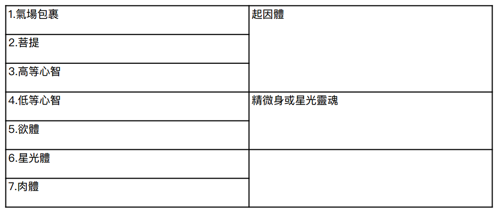

#  第三章：小宇宙

我們熟知且可見的人體是由化學物質組成的，許多人將其視為人類存在的全部，並滿足於此。然而，智慧傳統主張，我們所見、所觸的物質身體，只是人類組成中相對不重要的一個方面。正如冰山的大部分隱藏在海浪之下，只露冰山一角，人類的絕大部分存在於超越肉體的無形領域之中。

秘傳哲學提到七個「外殼」，形成不同密度的層層面紗，圍繞著內在神聖火花（即人類最深層本質）。此神聖火花是「神之子們」之一，是與邏各斯相連的光線。這七個載體或外殼彼此互相滲透，就像液體可以滲透固體，而液體又能被氣體滲透一樣。每個外殼都源自七種元素之一，乃從「原初質」分化出來。總體而言，這七個外殼都受神聖火花映照，列出如下：

神聖之光照耀在七重的人之中，此光是邏各斯未分離的火花。這就是神聖阿特曼或本體，即不朽之靈。布拉瓦茨基如此描述：
「每一個不朽之靈將其光輝投射到人類身上，每個人都是一位神靈 —— 是大宇宙中的小宇宙，是未知神的組成部分，是第一因的直接散發物，擁有其本源的所有屬性，其中包括全知與全能。」（《揭開伊西斯的面紗》第二卷，第 153 頁）

這些「外殼」可以用不同方式進行劃分和分類。本文採用的分類法，是布拉瓦茨基晚年所使用的。關於其他分類方式，請參見「問與答」以及附錄一。

需要記住的是，實際上只有一個阿特曼，人類看似獨立的靈魂，只是遍一靈的不同面向。雖然列出了七個相互滲透的載體或外殼，但可以加以簡化，因為其中一些原則是協同作用的。從最內層向外數的前三個 —— 氣場包裹、菩提和高等心智（受阿特曼映照） —— 共同構成了貫穿生生世世的恒久實體，或稱「單體」。這有時被稱為「起因身」。接下來的兩個 —— 低等心智和欲望 —— 同樣結合在一起，構成所謂的「星光靈魂」，在東方被稱為「微細身」或「幻身」。再往下一個載體，即星光體或雙體，是所謂的「模型體」，物質形體正是以此為藍本構建的。最低層則是粗顯的肉體。

現在會更加詳細地探討這些不同層次，從外向內逐步分析。我們在超越了物質世界的原子和亞原子粒子後，在其「內在」會發現一種狀態，僅比粗顯的物質略為精細，即星光體。在東方神秘學中，這一身體常被稱為「模型體」，因為肉體依據此能量場而建，也是生命力的載體。除此功能外，星光體還具備感知的屬性。據說，真正的感覺器官存在於星光體中。真正「看見」的是星光體之眼，真正「聽見」的是星光體之耳，等等。

當我們 深入到越來越精微的物質層次時，便將穿透星光界物質與欲界物質之間分隔的帷幕。梵文「 卡瑪 」意為「欲望」。在這第三種物質狀態中，生命展現出的意識層次高於感官。欲界物質激發出較低層次的情感、激情、本能和欲望。繼續向內探索，這種意識狀態逐漸過渡到智力、理性、或具體心智的層面。這種過渡極為細膩，以至於無法明確區分欲界與低等心智載體。這兩者共同作用，構成我們所謂的「精微身」或「星光靈魂」。低等心智有時被稱為「欲望 - 心智」，指的是與欲望交織在一起的具體思維。當我們進入第五種狀態時，就進入了靈性自我的領域。第五種狀態的特徵，是「理性」或「抽象心智」的更高層次思維過程。這是智性，而非單純的智力。每一世的記憶都得以在此完美保存。第六種狀態是「菩提」 ， 即靈性直覺或智慧。在這一意識層面上，此人不再說「我認為」，而是說「我知道」。「氣場包裹」包含並包圍著整個個體，帶著業力模式，決定了先前所列原則的靈性、心理和物質結構。

有些作者用「星光體」一詞來代指布拉瓦茨基所稱的「欲界」或「欲體」，即慾望和渴望的所在（見附錄一）。只要能注意到術語上的差異，就不會被混淆。在本書中，我們採用了布拉瓦茨基的用法。

重要的是要了解：載體越稠密，在該層面的印象就越強烈；載體越稀薄，在該層面的印象就越微妙和精細。我們的意識通常同時在七個層面（或稱七個「鞘」）中運作，而其中一個層面會是主要活動中心。由於內在世界的印象極為精細和微弱，人類自身具備一套「心靈感應中心」或稱「脈輪」系統，當這些中心被激活時，可以作為變壓器，將這些微妙意識層面的印象放大，而能被清醒的意識所感知。

在睡眠中，我們的意識會向內，逐漸從外部世界撤回。若了解夢境和睡眠的狀態，有助於我們理解內在層面的本質。當意識從物質層面逐漸分離，每個層面都越來越「全在於心」。正如一位神秘學家所言，在內在層面上，思想就是事物，情緒就是場所。嘗試冥想此概念，有助於理解人類意識的七個層次。

在古代神話中，睡眠被稱為死亡的兄弟。前文提到，在睡眠中我們經歷意識的向內。在「死亡」的那一刻，也會經歷類似的現象。死亡的過程涉及靈魂逐漸脫離其居住的易逝軀體，類似於人們丟棄已破舊的衣服。

肉體死亡後會釋放出「永久實體」，被包裹在星光體之中。在自然的正常過程中，在肉體死亡前，星光體的正常活動會先被破壞，星光體開始死亡。因此，星光體很快也會「死亡」並被遺棄。那些被丟棄的舊星光體，就是在墓地上空徘徊的幽靈或幻影，最終也會在自身的層面上自行瓦解，如同屍體在物質層面上分解。

一旦脫離星光體，此永久實體便被包裹在星光靈魂之中，進入了天主教所謂的「煉獄」，或東方神秘學家所謂的「欲界」。這個世界充滿了未滿足的激情與欲望，是自私、人格自我的世界。在此處，內在本質必需與外在外殼分離，並解開糾纏。此過程並不容易，伴隨著巨大的內在掙扎。最終的分離涉及到低等心智分裂為兩組不同的傾向。低等心智的某部分趨向於永久靈性存在，會獲得一種精微外衣，穿上前往下一階段旅程；而另一部分則附著於短暫世俗欲望和貪欲，與欲望原則的殘渣一起被捨棄。被遺棄的星光靈魂或「外殼」會在其自身層面上緩慢瓦解並消失。在通靈會中出現的靈體，往往是這種「外殼」偽裝成逝者的靈魂，它們借助靈媒提供的活力而被激活，欺騙許多人。

「脈輪」一詞源自梵文，意為「輪子」。在古代先知的靈視幻景中，看見微妙能量的旋轉漩渦，聯想到光之輪，因此稱之為「脈輪」。

靈性個體披著低等心智的精微元素，進入一種崇高的狀態，在東方稱為「天界」，這是一個藏語詞，意為「幸福之地」。此乃主觀的「夢境狀態」，自我在脫離肉體後，在此境界自行構建所處的景象。這是一種極其幸福的狀態，人格自我最深層的渴望都能在此實現。天界狀態有時被分為兩個層次，分別稱為「有形界」和「無形界」。天界狀態可能持續數年，甚至數千年，直到自我所有的靈性高尚情感與渴望都得以實現。這是完全幸福與極樂的時期，其目的之一，是消化和吸收在塵世所學到的經驗教訓，回顧那一生的經歷，為此存續的個體帶來寶貴的啟示。

在天界度過一段時間後，自我便準備好再次進入物質和形體的下界。生物的繁衍過程提供一套新的凡人外衣，在出生時，個體再次步入物質世界，準備在生死輪迴中開啟新的一輪旅程。

## 學生提問

問：您將人類描述為穿著七層「外殼」的神聖「火花」。此說法與所謂的七個人類「原則」有何關係？

答：布拉瓦茨基夫人得到她上師允許，才將七原則的教義經過多年逐步公開。在《揭開伊西斯的面紗》中，採用的是三重劃分：身體、靈魂和靈。後來，辛尼特獲准在其《密傳佛教》中概述一個初步的七重原則劃分，是上師們通過一系列信件所傳授的。這還不是最終、最完整的劃分，而是一個較為接近、方便交流的「半真理」，隱藏了一些當時人們尚未準備好接受的內容。但有了術語和交流的基礎，在接下來的幾年裡，神智學家們普遍採用了這一劃分，布拉瓦茨基夫人本人也是如此 —— 儘管她當然知道真正的劃分，但未被允許公開談論。

這七原則的劃分如下：

1\. 肉體

2\. 生命能量（氣）

3\.  星光體

4\.  欲望

5\.  心智

6\.  菩提

7\.  阿特曼

神聖火花被稱為阿特曼，列為「第七原則」。心智的高低兩個層面被合併為一個，氣場包裹則完全被省略，另外涵括了生命能量（此生命力賦予物質活力）。在布拉瓦茨基的人生最後幾年，她向誓約弟子們傳授了阿特曼及其七重外殼的劃分，這一點前文已有描述。菩提曾被用作障眼法，以掩飾氣場包裹的奧秘，這是僅向密傳學生提及的人體結構層面。心智被清楚地劃分為兩個方面，屬於宇宙中兩個獨立層面，但緊密相關。生命能量則作為普遍的生命活力，通過血液傳遞，並與欲望原則密切相關。去細讀布拉瓦茨基夫人的密傳教學，將有助於理解這些要點，收錄於《文集》第十二卷中。然而，先了解《密傳佛教》中使用的舊有七重原則劃分也至關重要，才能理解《秘密教義》及布拉瓦茨基的其他著作，大部分採用的正是此體系。查閱附錄一也有所幫助。

嚴格來說，在轉世時，高等層面的心智自我會從自身投射出一道光線，這束光線暫時穿上低層面物質外衣。

問：我們應如何將傳統的身體、靈魂、靈三分法與七重劃分體系聯繫起來？

答 ：這其實主要是語義上的問題：先定義某些事物，貼上標簽，然後據此展開討論。不同作者之間都不太一致。布拉瓦茨基常因前後不一致而受非議，在使用這些術語上也時常變化。但一般而言，可以把「靈」對應於阿特曼，也就是與邏各斯一體（至高阿特曼）的神聖火花。而「靈魂」指的是連接靈與肉體的中介外衣。就此意義上，靈魂有多個層次。菩提（暗指氣場包裹）常被稱為「靈性之魂」；心智的高低兩個面向被稱為「人類之魂」；而欲望原則是「動物之魂」。我們甚至可以再進一步，把星光體稱為「植物之魂」，因為植物界最發達就是此原則。布拉瓦茨基稱「靈魂」為「雙重體」，並指出其多個面向：

「實際上，只有一個 [ 雙重體 ] ，具有三種不同的層面或階段：最物質的部分隨肉體消亡；中間的部分作為獨立實體在『幽靈之地』存續；第三部分則在整個顯現期間是不朽的，除非達到涅槃提前結束。」（《文集》第 10 卷，第 219 頁）

問：據說在欲界度過的時期是極其掙扎的，這總是如此嗎？

答：這不適用於一位聖潔、在世時未被欲望和貪欲所牽絆之人。對此人而言，欲界的停留是一種夢幻般的無意識狀態，之後將在天界中甦醒。這種人很容易能拋下欲體，無需太多掙扎。但遺憾的是，大多人無法擺脫自己的欲望。

問：我聽說過「地縛靈」這個詞。這是什麽意思？

答：這個詞指幾種不同的情況。法國神秘學家埃利法斯 · 列維說：「當我們死去時，我們的靈魂首先必須擺脫不淨的星光界流質，這包裹並囚禁著靈魂。」（《超然魔法》第 153 頁）在加以擺脫之前，靈魂被困在塵世的星光界包裹中，成為「地縛靈」。對於極端物質主義的人而言，星光界的囚禁時期可能非常漫長。另外是一些完全不同的情況，比如意外死亡、謀殺或自殺。在正常情況下，星光體耗盡後會導致肉體死亡。但若是意外死亡、謀殺或自殺，則非如此。星光體依然完整且活躍，此人雖然從肉體中抽離，但並非通常意義上的「死亡」，而是會繼續被束縛在塵世的氛圍中，直到星光體活到其指定的壽命。對於善良無私的受害者來說，這段「地縛」時期是在無意識的幸福狀態中度過的；而對於那些較不純凈的人來說，這將是一次不愉快的經歷。對於自殺者則是痛苦的時期，充滿「哀哭切齒」，不斷回憶自殺前的情景。

問：我曾在一本神智學的書中讀到關於「失落的靈魂」。這是什麽意思？

答：生命中有一個令人遺憾的事實：有些人過於執著於物質，以至於自我在進入天界時，其人格沒有任何值得攜帶之事物。低等心智方面無一物可留，這一世的人格完全消亡。這一生徹底失敗，隨後的天界時期也一片空白。有人將這比作書中被撕掉的一頁。靈性自我會繼續前行並迅速轉世，但前一世的人格則進入一個被稱為「第八界」的地方，徹底湮滅。

而那些極度犯罪的邪惡之人，其本性無法進入天界，但潛在的靈性又使他們不會面臨人格完全消滅。這類人會進入噩夢般的星光界狀態，與天界相反，只能稱之為「地獄」。其中最糟糕的稱為「無間地獄」 ，是一 種永無止境的痛苦狀態。由於業力的作用，在因緣耗盡後，這些狀態最終會結束，而單體會再次投生。

為了完整起見，我再補充一點：如果一個人在一世世中毫無悔意、頑固的持續作惡，最終會導致更為嚴重的後果，此處不詳述。這些才是真正意義上的「失落靈魂」。關於這些可能發生的憾事，可以參考《大師給辛尼特書信》和布拉瓦茨基的《密傳教導》（《文集》第 12 卷，第 632-641 頁）。

問：如果天界只是幻覺或夢境，體驗它有什麽意義？

答：這就像問，既然睡眠和做夢也只是空白或幻象，有何意義。天界是靈性自我所需的休息時期，消化前一世所獲得經驗，並對來生最好準備。
問：有可能與逝者溝通嗎？
答：離世的自我在天界裡無法降臨人間。我們需要學習如何提升到他們所處的高等靈性境界。若知道方法的話，確實可以進行此交流。據說，在睡眠中，我們都能與在天界中的親人相會，只是通常無法將這些經歷帶回清醒意識中。另一方面，應當避免試圖通過靈媒與死者溝通。靈媒所接觸到的往往是「外殼」、各種地縛靈，包括自殺者、意外死亡者、以及頑皮的元素精靈等。這些存在既無法幫助詢問者，詢問者也無法幫助它們。神秘學者應避免與這些存在通靈交流，因為這是純粹的招魂術。

## 參考書目：

布拉瓦茨基：《文集》第 12 卷，「密傳教導」

布拉瓦茨基：《神聖智慧之鑰》第 6-11 章

## 問題思考：

1\.  為什麽人被稱為「小宇宙」？

2\.  為什麽說宇宙中只有一個阿特曼？

3\.  本章提出了高等心智和低等心智的概念。請解釋它們在功能上的不同，並盡可能舉例說明。

4\.  你能想像有比心智更高的存在嗎？你是否很難設想超越心智的主觀存在，而只能推測？對你而言，此超越心智的存在，作為我們此時此地的一部分，有何意義？

5\.  「有形」和「無形」這兩個術語有何區別？你認為哪些層面構成了人的「無形」層面？

6\.  請用你自己的語言討論「靈」、「靈魂」和「身體」的概念，以及它們對你的意義。

7\.  人的哪一部分是永恆的？哪些部分能從一世延續到下一世？哪些部分在每次轉世時會被更新？

8\.  脈輪在人類結構中起什麽作用？

9\.  請描述人一生結束到開始下一次轉世之間，會經歷哪些階段。
