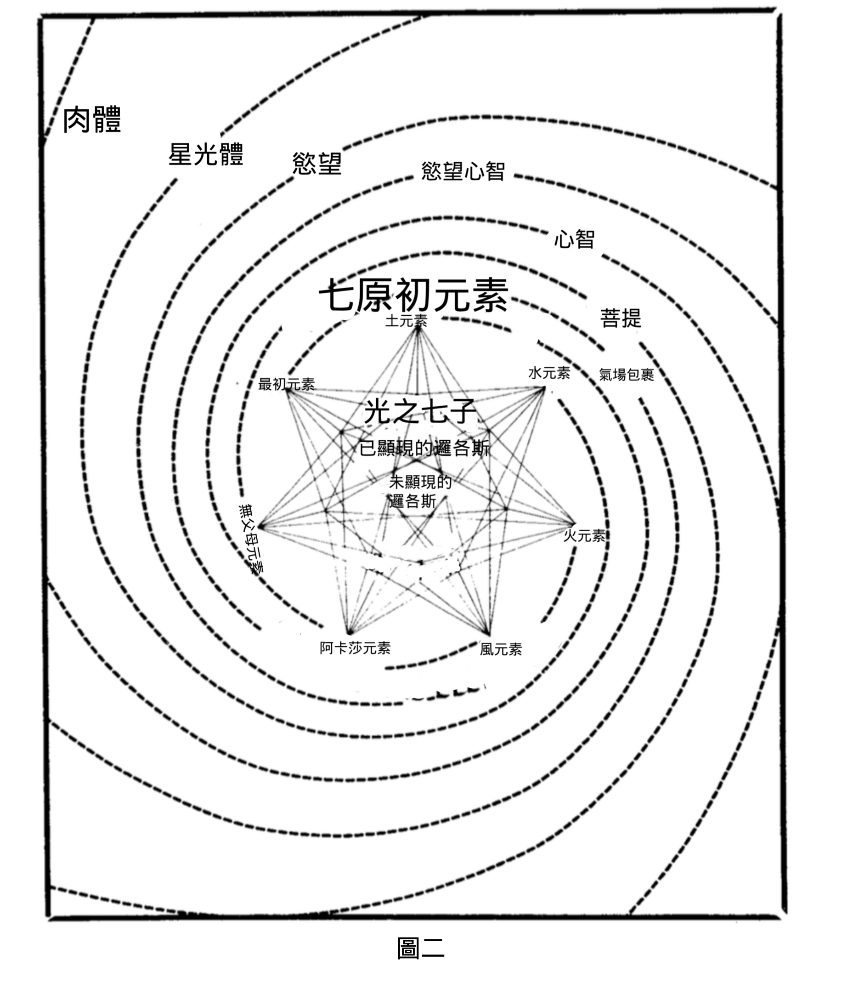
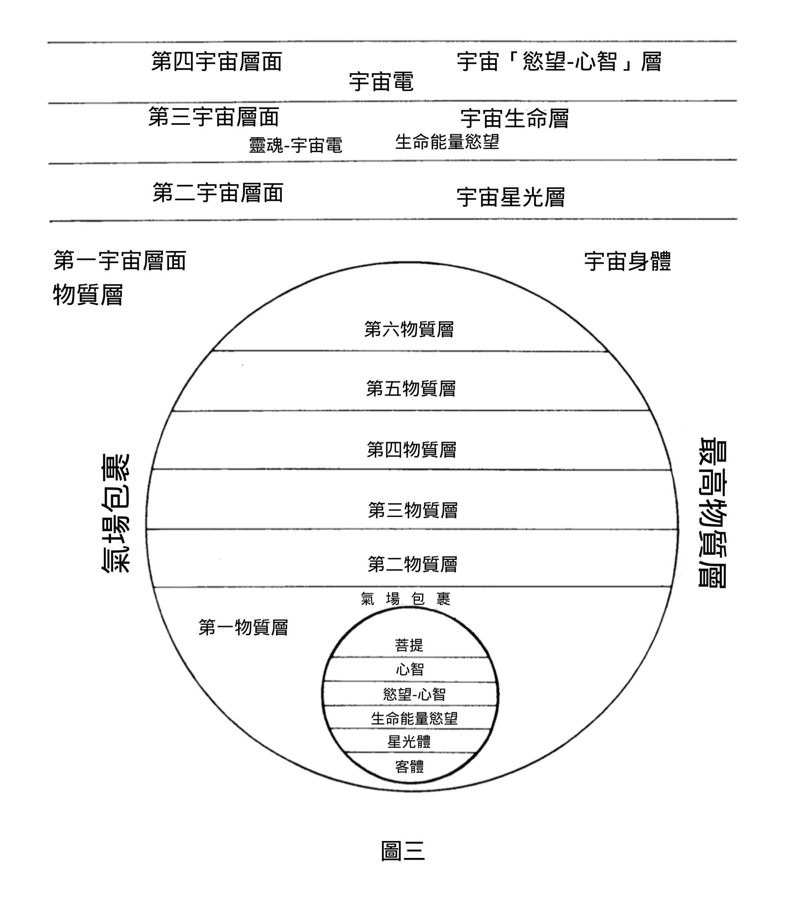

#  第五章：大宇宙

《秘密教義》的宇宙論追溯至宇宙尚未誕生的時期。前一個顯現期的各種形態已經消解；在消解的狀態下，萬物安息於原初質的懷抱之中。當漫長的普遍休止期結束後，原初質再次開始分化，宇宙便從無數劫的潛伏狀態中顯現出來。

這個新興的宇宙是二元的，一方面是宇宙物質，另一方面是宇宙意念 ——即 活化萬物的「邏各斯」及其無數活躍的輻射。在休止期期間，這兩種面向融合為一。到了新的顯現期黎明時，彼此分離，原初質的連續分化提供虛幻陰影，以襯托和顯現邏各斯之光。

智慧宗教描述了宇宙開展的三個初步階段，在古老教義中，這些階段通過幾何圖形來象徵。符號的基礎是黑暗背景中一個白色圓盤「 O 」。白色圓盤象徵著原初質，在宇宙之夜期間，意識沈睡其中。黑暗的背景則代表永遠不可知的梵。

分化的最初胚種由圓內一點「 ☉ 」來表示。就形體方面，這是原初質轉變為宇宙物質的第一個階段；就生命方面，這是「心智的胚種」 —— 顯現意識的純粹潛能。

橫貫圓心的直徑「 Ө 」象徵了第二階段的開展。宇宙物質的面紗變得更加分化，此時代表的是「無染的自然母親，存在於包羅萬象的無限中。」神之心智以更具體的形式顯現，此時成為「宇宙（潛在的）意念」。這是「隱藏在母親子宮中的父親」，在最初的潛能中，包含著七天界智性群體，如同七色光譜，隱藏在永恆之光的白光中。

第三個宇宙前進化階段則以圓內十字「㊉」象徵。宇宙物質達到此分化階段後（宇宙物質在第三顯現階段被稱為「偉大菩提」），此時隱藏的神之心智成為活躍的宇宙智性。豎線代表這種活躍的智性，是原初自然中的陽性元素，在此階段誕生為「子」 ——即 覺醒的宇宙心智。這三個原初進化階段被稱為「三邏各斯」，或更準確地說，是一個邏各斯的三個本質。

宇宙心智而後湧現出天界智性七群體（ 阿希 ），「蘊含」著神之心智，提供其顯現的載體。這些宇宙心智的群體被稱為從神聖火焰迸發出的「火花」，先前曾稱之為「聲音之軍」；這些智性力量賦予了自然法則，並在其中執行這些法則。這七群體有時被稱為七道「光芒」，從中央靈性太陽發出。這些連同三位一體的邏各斯，共同構成了畢達哥拉斯和卡巴拉傳統中的神聖數字十。在猶太 - 基督教傳統中，他們被稱為「上帝寶座前的七靈」，各自由一位大天使象徵。在藏傳密宗中，則以「禪那佛」為象徵，這些原型各自象徵神聖智慧某一特定面向。對於此教義，阿那加利卡 · 戈文達喇嘛解釋道：

「 禪那佛所顯現的形態 …… 被比作陽光穿過棱鏡後分解出的不同顏色，每一種顏色都展現了光的某種特質。這個比喻非常貼切，因為顏色在禪那佛的顯現中起著重要作用。他們的顏色代表著特定的屬性和靈性聯繫，對於啟蒙者而言，這些顏色的涵義極為重要，如同音符之於音樂家。這傳達了超然知識或智慧的特定振動，在聲音領域則通過相應的咒語振動表達，在物質領域通過相應的手勢或印契表達，而在內心深處，則通過相應的精神態度表達。」（引自《西藏密宗基礎》，第 115-116 頁）

在秘傳教義中，原初七者被稱為「精微元素」，即特定宇宙元素的靈性原型。布拉瓦茨基夫人寫道：「就字面上而言，精微元素是一種沒有屬性的元素類型或雛形；但在秘義上，指的是即將進化為宇宙元素的原初本體。此處的 『 宇宙元素 』是 古時的含義，而非物理學上的含義。這些就是諸邏各斯，即七道發自邏各斯的散發物或光線。」（《秘密教義》卷一，第 572 頁注釋）

當 邏各斯的七道「光線」及其群眾出現時，原初物質也同時以七種「元素」的形式顯現。每一種元素都由七道「光線」中的某一道所「主宰」。列舉如下：
1\.  最初元素 —— 「最初」或原初元素
2\.  無父母元素 —— 「無父母而生」
3\.  阿卡莎元素 —— 希臘人所稱的「父－以太」
4\.  風元素 —— 空靈或氣態元素
5\.  火元素 —— 火性或光輝元素
6\.  水元素 —— 水性、液態、流體元素
7\.  土元素 —— 土性元素（物質與能量）
這些是七種最純凈、最精微的原始元素。這些元素在無數次分化後，孕育出人類的七重「外殼」，繼承著各自偉大宇宙元素的力量，以及其背後的神聖智慧之 「 光線」。查爾斯 · 李德比特在其著作《內在生命》中，引用了舒巴羅解釋「精微元素」（ tanmātras ）與「元素」（ tattvas ）之間的關係：

「精微元素是指邏各斯意識中的一種變化，而元素則是此變化在物質中產生的效應。你可以想像，在沙灘上，一道小波浪靜靜地湧上來，滑過沙面後又退去。這在沙灘上留下了一道細小的痕跡，標記著海浪能到的極限。如果海水漲潮，下一波浪會沖得更遠一些，同樣留下痕跡，然後退去。精微元素可比作波浪，是海洋的暫時變化；而那道留在沙灘上的小痕跡，則象徵著這些元素。」（《內在的生命》，卷二，第 176 頁）

七道不同顏色的光線從中心螺旋狀向外擴展，七種元素在每一次循環中，都變得越來越粗顯（參見圖 二 ）。宇宙分化的波浪在周期性的旋轉中，向外擴展，每一種元素都變得越來越不具靈性，而獲得越來越多的物質性。與此同時，神聖的散發物如火舌般，從宏觀宇宙的中心噴湧而出，逐漸披上了這些元素的外衣。如此經過無數次的循環，便形成了宇宙的七大「層面」，每一層又可以不斷細分。這就是《往世書》中神學隱喻所描述的「包圍梵天之卵的七重外殼」。

 

《秘密教義》所依據的古老《德基安集》如此描述宇宙層面的形成：

「「父－母」紡織出一張網，其上端系於靈 ，即 遍一黑暗中的光，下端系於其陰影 —— 物質；這張網就是宇宙，由兩種基質織成，合為一體，這就是自性。」（《秘密教義》，卷一，第 29 頁）

此乃 所謂「宇宙基質的大鍵盤」。若要解釋宇宙的七個層面，幾乎是不可能達成的。據說，即使是我們太陽系中最高等的存在，也對第二宇宙層面以上的事物一無所知。這七個宇宙層面中最低的一組，包含了太陽系的七個層面（見圖 三 ）。 

布拉瓦茨基為太陽系的七個層面給出了以下名稱（《文集》第 12 卷第 658 頁）：

7\.  氣場層

6\.  阿賴耶層

5\.  宇宙心智層

4\.  宇宙電層

3\.  生命層

2\.  星光層

1\.  物質層

六個較高等的太陽系層面只有開悟者才能進入。據說，獨覺佛（即自證佛果但不度眾生者）的意識最多只能達到第三太陽層面（生命層），唯獨慈悲佛（即捨棄涅槃、發願度眾生者）才能超越此層。這些層面是我們太陽系天界眾生的居所。

人類所居住的行星處於物質層最低的四個亞層。地球和其他可見行星屬於同一分化物質層面，是最為物質化的亞層。我們正是在此層面以物質身體生活，並從事塵世的活動。

## 學生提問 

問：神秘學的教義與現代宇宙學理論（如「大爆炸」等）有什麽關係？ 

答：現代宇宙學理論中有許多觀點，讓人聯想到《秘密教義》。例如，有一種理論認為宇宙會周期性地膨脹和收縮。此時正處於膨脹階段，所有星系似乎都以極高的速度彼此遠離。如果此周期理論正確，未來某一天情況將會逆轉，所有星系將再次開始相互靠攏，直到宇宙中的所有能量被壓縮到極高的密度，然後再次「爆炸」，形成新的星系、恒星等。從許多方面來看，這與《德基安集》中描述的情形非常相似：

「母體膨脹，由內而外地擴展，如同蓮花的花蕾 …… 光輝的卵 …… 在母體的深處凝結，並擴散成乳白色的凝塊 …… 諸子分離並四散，最終在大日終結時，回歸母親的懷抱，與她重新合一。」（《秘密之書》卷一，第 28-30 頁）

科學理論中另一個有趣的觀點是，「宇宙膨脹」並不是從空間某個特定點開始向外擴展。不同星系中的觀察者，所見的膨脹情形都一樣。科學家常用一個氣球充氣來類比。氣球表面布滿斑點，以任意一斑點為準，其他斑點似乎都遠離它移動。氣球表面並無一個特定的點是膨脹的起點。依此理，宇宙的空間可以比作氣球的表面，而星系就像氣球上的斑點。氣球的表面是有限的，在任何時刻都有一個確切的表面積，但同時是無邊界的 —— 並無任何邊界包圍。氣球二維表面彎曲進入第三維，同理，我們所處的三維「延展」也彎曲進入第四維。「第四維」並不是我們通常理解的空間維度，最好視之為數學抽象，想像為特定事件的第四個量。因此，我們的三維空間如同球體表面，「有限但無邊界」。

現在來看看布拉瓦茨基在《秘密教義》中是怎麽說的。她在談到球體或圓的古老神秘象徵時說道：

「雖然此概念本身是一種抽象，一種象徵性的表達方式，但此象徵讓人聯想到無限，如同無盡的圓圈。心靈之眼呈現出此畫面，宇宙從無邊空間中顯現出來，在規模上無邊無際，在客體顯現上並非無限。卵的比喻同樣表達了神秘學教導的事實：一切顯現事物的原初形態都是球形的 ， 無論是原子還是星球、是人類還是天使。自古以來，各民族用球體來標志永恆與無限。」（《秘密教義》卷一，第 65 頁）

「在規模上無邊無際，在客體顯現上並非無限」這句話，與現代宇宙學中提出的「有限而無界」的宇宙觀念極為契合。有趣的是，這一觀點正是由愛因斯坦提出的，而他實際上曾研讀過《秘密教義》！更令人驚訝的是下方這段引文：

「宇宙中只有一個不可分割、絕對的全知與智性，貫穿於整個宇宙中的每一個原子和每一個微小點，此宇宙有限而無界、被人們稱為 『 空間 』 。」（同上，第 277 頁）

問：在您描述了宇宙層面後，我不太確定如何與我讀過的其他內容聯結。我原以為我們的「身體」是一個接一個地從太陽系的各個層面中衍生出來的。

答：這完全取決於你對「層面」的定義。人有各種外殼或「身體」，每一層外殼都源自某種特定的元素或「層面」。但每一種元素或層面都有其自身的顯現層級，從最低到最高、或從超球形宇宙的邊緣到中心（參見圖 二 ）。本章所描述的層面是指後者。

打個比方，如果我們從鋼琴鍵盤的最低音區開始，彈奏一段旋律，此段旋律可以視為我們的世界或層面。旋律中不同音符代表從物質到靈的七個原則。現在我們能在鍵盤上升一個八度，在更高的音區彈奏同樣的旋律。這代表著更高的「層面」，在此層面上，存在著我們感官無法察覺的行星，但能與此世界或層面共存。實際上，這些高等層面上確實存在此類行星，我們將在下一節中討論這個問題。我們可以依此類推不斷提升振動的層級，重覆此過程，直到超越行星等存在的層次。

布拉瓦茨基並未討論物質層第四層面之上的情況。她只是稱之為「神聖且無形的靈之世界」。但正如她所說，「人類意識的七種狀態與此處討論的不同。」顯然，太陽系七層面所涵蓋的內容遠比一些入門書籍所描述的更為豐富。我要補充一點，儘管這可能讓你更困惑：當布拉瓦茨基夫人使用「太陽系」這個詞時，指的並非只是可見的太陽系。相對於更宏大的太陽系而言，可見的太陽及可見太陽系中的最高禪那主和智性體，仍只是處於相對較低的層面。

問：您能進一步談談七種元素嗎？

答：印度教外傳的元素分類包括五種：阿卡沙（以太）、氣（風）、火、水和地。在此基礎上，密傳哲學又增加了兩種元素，總共七種。最高的兩種元素稱為「最初的」和「無父母的」。據說，每一種元素都由特定的精微元素（邏各斯主音）所主宰，儘管各自都包含其他六種主音。好比說，地元素是由振動能量組成，反映著邏各斯全部七道光，但會以主宰物質世界的那一道光為主。同理，水元素也包含七種元素的能量，但其主宰的元素與物質世界不同。每一種元素都會產生人類的七種「外殼」之一。每一種元素都對應一個音符、一種顏色、一顆行星、一道「神聖智慧之光」，以及無數其他事物。

問：元素對應於聲音和顏色的關係，是否類似於鋼琴鍵盤上的音階，或類似從紅到紫的光譜色序？

答 ：並非按照你所想像的順序。我們在地球上所感知的順序，其實是一種幻象。此順序在不同的層面上會發生變化（參見附錄三），這是一個非常複雜的主題，無法透露完整內容，否則會透露出產生魔法現象的關鍵，而世界尚未為此做好準備。關於此主題所有能公開的信息，都包含在布拉瓦茨基夫人的密傳教導中，這些內容收錄在她的《文集》第十二卷中。如果你有興趣深入研究這個主題，該卷包含所有能公開的內容，以及關於行星和太陽系七元劃分的大量信息。但這些信息零散並以筆記形式呈現，需運用直覺來理解。

問：我先前讀到第一、第二和第三邏各斯，這些難道不是太陽邏各斯的意志、智慧和活動嗎？

答：正如前文所提到的，關於「太陽邏各斯」的「面向」與「流出物」，存在著大量誤導性的信息。這些誤導性描述讓人想起大師對一位早期神智學者的話，此人無法擺脫對人格化上帝的固有信仰。大師寫道：「難道我還要再重覆說一遍嗎？最優秀的開悟者們用千百年的時間搜尋宇宙，連人格化上帝的一點蛛絲馬跡都沒發現 —— 所見的是始終不變、不可抗拒的法則。我堅決拒絕在這種幼稚的猜測上浪費時間，請你見諒。」（《大師致辛尼特信件》，第 283 頁）若試圖將神學中的「上帝」神秘學化，並以神秘的偽裝重新樹立起來，是不正當的行為。布拉瓦茨基夫人所提到的三邏各斯，其實是宇宙遍一的邏各斯從梵的未知黑暗中顯現出來，所經歷的三個階段：

「關於第一和第二邏各斯似乎存在很大的混淆和誤解。第一邏各斯是已經存在但尚未顯現的潛能，蘊藏於『母－父』之中；第二邏各斯是諸創造者的抽象集合體，希臘人稱之為『諸造物主』，即宇宙的諸建造者。第三邏各斯是第二邏各斯的最終分化，也是宇宙力量的個體化，宇宙電是其中的主導者；第三邏各斯發出七道創造之光稱為七禪那主，而宇宙電是其綜合體。」（《布拉瓦茨基學會談話錄》，第 33 頁）

問：我們應該把布拉瓦茨基視為絕對權威嗎？

答：絕對不應如此。泰姆尼對此有過非常清晰的闡述：

「永恆的智慧是一種超越性的實在，無法被灌注成為某種模式、保存起來，然後被當作偶像來崇拜 …… 闡述此智慧時一旦僵化，或被當作信條來虔誠地學習和遵循，它實際上就已經死亡 …… 因此，若把《秘密教義》中討論的神秘學教義當作信條，並將書中關於各種問題的論述視為最終結論，實際上是背叛了該書部分揭示的永恆智慧。我們須徹底明白這一點 …… 才能保有此智慧的新穎和動態特性。」（《人、神與宇宙》，第 379-380 頁）

但此問題還有另一面。我們必須記住，現代神智學運動本身就歸功於布拉瓦茨基、以及她所忠實效力的大師們。若還未真正理解她所傳達的教義，就貿然拒絕，是極其不明智的。若不去研讀她的著作，如何獲得此等理解呢？我們並不需要盲目接受她所說的一切，也不必把她的觀點當作最終的權威，但至少我們應該親自了解這些觀點，如此一來才能明智地拒絕或接受。例如一些後來的作家，自稱繼承布拉瓦茨基的事業，但其觀點和「啟示」與最初的教義直接相悖，我們就有理由質疑這些新主張的來源。因此，熟悉原著可以作為明智判斷的標準。

問：但是布拉瓦茨基的著作實在是太難讀了。

答：確實如此。學生在完全不了解相關背景的情況下，若試圖閱讀布拉瓦茨基的著作，會感到相當困難。這些學生從未聽說過各種東方哲學流派，也沒有讀過希臘古典著作，對斯賓諾莎、萊布尼茨、笛卡爾和牛頓的思想也很陌生；對卡巴拉、魔法和煉金術的傳統幾乎一無所知。一般人很容易被布拉瓦茨基的寫作風格弄得不知所措：她把上述內容混合在一起，再加上深奧神秘學中最珍貴的真理，最終呈現給讀者一道多元融合的「咖喱」，不僅讓嚴肅的學者感到惱火，也讓普通讀者目瞪口呆。然而，她的瘋狂中自有其道理，堅持不懈終會有回報。在她眾多著作中，散布著無數指向至高真理的路標。以下的觀點摘自羅伯特 · 鮑恩與布拉瓦茨基對話的筆記，或許會有所幫助：

「她說，若我們去找心目中的高階學生，請他們『解釋』《秘密教義》，這不僅毫無用處，甚至更糟。他們做不到。他們嘗試提供的也只是一些現成的、外傳的解釋，根本無法接近真理。若接受這樣的解釋，就意味著把自己束縛在固定的觀念上，但真理超越我們所能形成或表達的任何觀念 ……

她說在閱讀《秘密教義》時，不要指望從中獲得關於存在的最終真理；應觀察的是這在多大程度上引領我們走向真理，而不要抱有其他想法。把學習視為一種鍛煉和發展心智的方法，這是其他學科未曾涉及的 …… 」—— 布拉瓦茨基夫人《如何學習神智學》，第 8-9 頁

「她說這種思維方式就是印度人所謂的『智瑜伽』。在智瑜伽的修習過程中，修行者心中會浮現出一些觀念，雖然能夠覺察到，卻無法表達、或形成任何具體的心智圖像。隨著時間推移，這些觀念會逐漸形成心智圖像。此時，修行者需要保持警覺，不要被錯覺迷惑 ，誤 以為新出現的、奇妙的圖象是真實的。其實並非如此。繼續修習下去，這些讓人讚嘆的心智圖像會變得黯淡、無法滿足，最終消失或被捨棄。這又是一個危險的時刻，因為此時修行者會暫時陷入空無，沒有任何念頭可以依托；在缺乏依靠的情況下，想要重新拾起那些已經捨棄的心智圖像。然而，真正的修行者會毫不在意地繼續前行，不久又會有新的無形靈光閃現，隨著時間推移，靈光孕育出比之前更宏大、更美麗的心智圖像。但此時，修行者已經明白，沒有任何心智圖像能夠代表『真理』。這最後的壯麗心智圖像也會像之前一樣變得黯淡並最終消逝。如此循環往覆，直到最終超越了心智及其一切心智圖像，修行者進入並安住於『無形體之界』，而一切有形之物都只是此界的狹隘映像。

學習《秘密教義》的真正學生就是智瑜伽的修行者，而這條瑜伽之路正是西方學生的真正道路。《秘密教義》的寫作目的，就是為這條道路提供路標。」（同上，第 12-13 頁）

## 參考文獻： 

布拉瓦茨基，《文集》第 12 卷，「秘傳課程指導四」 

布拉瓦茨基，《秘密教義闡釋》

## 問題思考：

1\.  本章列出了七個太陽系層面，其中包含了「星光界」一詞，布拉瓦茨基此處所指的含義又有別以往。她說太陽系的行星存在於第七層面或稱物質層面，那麼你認為此處「星光層」這個詞所指的是什麼？

2\.  為什麽活躍的宇宙心智只在第三階段才被喚醒？

3\.  什麽是意識層面？

4\.  為什麽不要過度執著於宇宙的心智圖像？

5\.  以下是過去三章中出現的詞彙。請將 A 欄的詞語與 B 欄的定義進行匹配。

A 欄&nbsp;&nbsp;&nbsp;&nbsp;&nbsp;&nbsp;B 欄

顯現期&nbsp;&nbsp;&nbsp;&nbsp;&nbsp;&nbsp;連接各身鞘的能量輪，使各身鞘能夠相互作用。

單體&nbsp;&nbsp;&nbsp;&nbsp;&nbsp;&nbsp;靈 / 物質通過逐漸物質化而參與創造的過程。

有形&nbsp;&nbsp;&nbsp;&nbsp;&nbsp;&nbsp;欲望、情感、本能。

星光體&nbsp;&nbsp;&nbsp;&nbsp;&nbsp;&nbsp;生命周期顯現的時期。

脈輪&nbsp;&nbsp;&nbsp;&nbsp;&nbsp;&nbsp;包圍並滲透肉體的能量結構或身體，得以交換生命能量。

返本&nbsp;&nbsp;&nbsp;&nbsp;&nbsp;&nbsp;具有成形能力或已成形。 

欲望&nbsp;&nbsp;&nbsp;&nbsp;&nbsp;&nbsp; 定義為「單一單元」。可以指阿特曼；也常用來表示「阿特曼 - 菩提」，在許多著作中指「阿特曼 - 菩提 - 心智」。