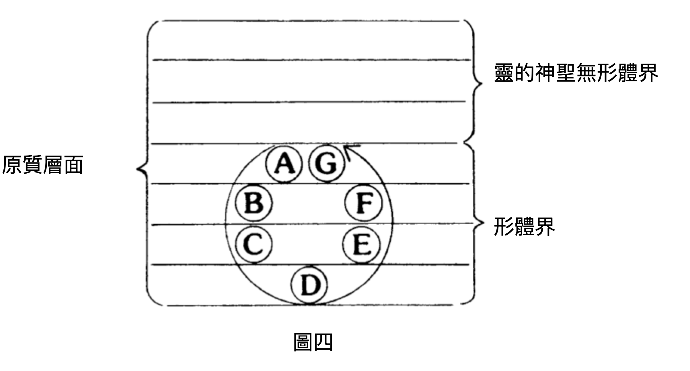

#  第六章：行星演化的範圍

據教導，我們太陽系的行星存在於太陽系宇宙的四個低等物質層面上。地球可見而有形，位於這四個層面中最低者。神秘學教義認為，有另外六個星球與地球的進化相關，這些星球位於最低物質層之上的三個層面。這六個不可見的世界加上可見的地球，共同組成了七個星球，合稱為「地球鏈」。我們太陽系中的每一個行星鏈都是由七個星球組成的七元組，而圍繞太陽運行的可見行星，都是七重星球鏈中最粗顯、最物質化的成員。 

據說，生命的沖動 —— 即進化的浪潮 —— 會逐步在這條世界鏈中流轉，在一個星球上居住一段時期後，便遷移到下一個星球，繼續其進化之旅。生命浪潮最先居住的星球，在圖四中標為 A 星球。在該世界度過漫長時期後，生命浪潮及其組成的眾單體會遷移到另一個世界，即標為 B 的星球。依次經過 C星 球，直到生命浪潮抵達七星球中最物質化的 D 星球，即我們的地球。

隨著宇宙生命之波向下穿越各個星球，人類七外殼及其所屬的元素越來越分化，並更具物質特性。因此，在地球層面，也就是 D 星球，所有元素都呈現出地球特徵，而這些特徵將在生命波移向下一個星球 E 時被拋棄。當生命之波最終到達星球  G  時，便回到了漫長星球活動周期的最初層面。從第一星球到第七星球的循環運動，被稱為一「輪次」。這承載著生命的浪潮，從最高的七界降至最低的世界，再返回到高處。據教導，七輪次構成了我們行星鏈的完整生命周期（註 九 ）。在前四輪次中，總體進化過程相同，每個階段都更具體；而在最後三輪次中，生命則變得越來越靈性化。我們的生命之波目前正處於第四輪次，且位於鏈中的第四個星球（ D 星球），因而大致處於此漫長進化旅程的中途。

這時出現了一個問題：「當七輪次完成後，生命波會變成什麽？」神秘學對此的解釋是，行星鏈如同人類及自然界萬物，都受生死輪迴的周期律支配。在一個活躍期之後，會有一個被動的休眠期，隨後又進入另一個活躍期，如此循環往覆，綿延不絕。因此，行星鏈在休眠一段時間後會重生；而構成生命波的各個單體，則會在新的行星鏈上繼續其進化歷程。事實上，神秘學教義認為，月球鏈先於地球鏈，且月球鏈上第四個星球的遺跡就是月亮。地球鏈的七個星球都有一顆衛星，目前正處於解體過程中 —— 確實是一具「屍體」，因為曾賦予生命的力量已轉移到更完美、更高層次的行星鏈 —— 也就是我們的地球鏈。數千萬年之後，當我們的行星鏈完成七輪循環後，構成地球鏈的星球也會成為七個新星球的「月亮」，生命波在重新投生後會構建這些新星球。

根據神秘學的教義，眾單體在行星鏈上進化，從舊的進化場所（月球鏈）轉移過來後，分為七個類別（註 十 ）。其中第一類被稱為「月亮祖靈」或「父靈」。月亮祖靈引領其他單體類別轉世。月亮祖靈在第一輪次中便穿梭行星生命的七個界域，從內部構建了各個界域的形態，然後再交給進化程度較低的單體類別（註 十一 ）。在第一輪次中，這些會在鏈上的每一個星球都這麼做。

某一群月亮祖靈會以人類形態留在每個星球上，作為下一輪新人類生命的「種子」，被稱為「留守者」。在每一輪次中都以此方式繼續作用，當生命波回到某一特定星球時，這些月亮祖靈便是新一輪人類生命的種子。

註 九 ：隨著每一輪次的推進，人類單體會經歷第四章所描述的七個進化階段。
註 十 ：見附錄二。
註 十一 ：因此，在每個星球的生命周期結束時，每一類單體都已經歷了各個界域，直至附錄二表格中所示的最終狀態。
在第一輪次之後，這些「建造者」（月亮祖靈）不再需要穿梭較低的界域，因為各種形態的原型已建立好，今後的周期只需進一步發展和擴展即可。
在這之後的三個類別單體，會在前三個半輪次內達到人類階段，此後「進入人類界之門」將會關閉，直到本次行星顯現期結束。剩下三類的單體則在本周期的其餘時間裡，繼續在動物、植物和礦物界中進化。 （註十二）

七類的「月亮單體」在月球鏈生命周期結束時，遷移到地球鏈；處此之外，還有更高階的禪那主積極參與我們世界的進化。其中一類被稱為「太陽祖靈」，也叫鳩摩羅、「火祖靈」、「火焰之主」、「心智之子」、「阿修羅」以及「智慧之子」。他們是高度發展的存在，進化已為久遠。這些「墮落天使」賦予人類真正的智性之火和自我意識。他們將自覺心智之光帶給了人類。就某種意義上來說，他們就是我們自身的高等自我，是我們的「神聖守護天使」。

有些 最高級的禪那主與我們行星鏈的發展相關，被稱為「意志與瑜伽之子」。這些偉大的存在在數百萬年前就曾投生地球。他們所投生的身體是通過心智之力創造的，這種神秘的力量在東方被稱為「思想力」。其首領常被稱為「大犧牲者」或「至一啟蒙者」，是地球進化的至高主宰。

人類單體在遷移至下一個星球前，必須經歷七個大進化時期，稱為「根種族」（ 註十三 ）。每一個「根種族」又細分為許多「亞種族」和「支族」。每一個單體都必須經歷所有這些階段，在人類生活的各個領域中獲得經驗。每一根種族都從前一根種族中分化出來，沿著自身的路線發展，孕育出下一種族，最終衰老並逐漸消亡。換句話說，眾單體在 A 星球上經歷七個根種族，接著在 B 星球上再經歷七個，如此一直到 G 星球。

註十二 ：  見附錄二，了解單體在每一輪次中的進展。在本學習指南中，作者遵循了《秘密教義筆記》中所概述的體系（由「兩位密傳學生」編寫，最初發表於布拉瓦茨基主編的《路西法》雜志上。）然而，也存在其他的解釋。（參見亞當 · 沃卡普著《周期進化》， 1987 年）。

註十三 ： 需要特別注意的是，「根種族」並不是世俗人類學中的種族分類，而是指人類意識在星球上逐步覺醒的不同階段。

關於地球本輪次（第四輪次）根種族的資料非常有限。第一根種族是月亮祖靈的後裔，這些祖靈在生命波環繞行星鏈一圈後仍留在地球上。據說，第一和第二根種族都擁有巨大的、空靈的身體，隨著時間推移逐漸變得更為凝實。

大約 1800 萬年前，即第三根種族雷姆利亞人時期，人類才開始擁有如今這種緻密、物質性的身體。在早期人種中，有著不同的繁殖方式；人類獲得緻密物質形態後，才出現現今的兩性生殖。在此之前，人類為雌雄同體，既非男性也非女性。在第三根種族時期，隨著性別的分化，太陽祖靈（即前一周期中已臻完善的人靈）喚醒了人類的自我意識，使人類開始對善惡負有責任。據說，火山和地震摧毀了第三根種族。雷姆利亞文明曾居住在現今太平洋和印度洋之下的陸地，最終被徹底毀滅。

新種族的核心在幾千年間逐漸形成，後來成為第四根種族 —— 亞特蘭蒂斯人。他們居住在雷姆利亞災變後新形成的大陸和島嶼上。亞特蘭蒂斯人發展出了高度的文明，但其靈性遠不及雷姆利亞人。這一時期是七根種族周期的最低谷，也是最物質性的階段。在該種族末期，亞特蘭蒂斯人分裂為兩大陣營 —— 黑魔法和白魔法的追隨者。前者因業力注定毀滅，後者則成為第五根種族 —— 雅利安種族的「種子」。

大約在一百萬年前，在偉大者的引導下，第五根種族的核心於中亞形成，逐漸成為一個獨特的種族類型。亞特蘭蒂斯在一系列災變中滅亡，柏拉圖描述的那座島嶼是最後沈沒的部分（大約一萬一千年前）。據說，第五根種族的第六亞種族 —— 即下一階段的意識種子，將從美國這個大熔爐中孕育而出。人類在遙遠未來還會進化為另外兩個根種族，之後才會進入 E 星球。

我們從此處可見，形體的進化只是反映了靈魂意識的進化，靈魂活化了形體。「朝聖者靈魂」在進化旅程中，從一個星球到另一個星球、從一個人種到另一個人種，不斷輪迴，始終努力認識自己的真實本性。它渴望真正了解自己，渴望覺察自身與宇宙生命、光明與愛（即所謂的「神」）本質上的一致，並努力響應自身內在的創造力。在累積了生命高低起伏的經驗後，朝聖者獲得覺悟；內在成長的過程，一點一滴喚醒與生俱來的神性潛能，被貼切的比喻為花朵生長綻放的過程（註十四）。佛陀或基督的屬性如種子般，潛藏在每個人的內在自我中。為了讓神聖生命的種子能夠發芽成長，便埋在了物質條件的土壤中。種子在此處發芽，長成植株，最終開出神性的花朵。在此成長過程中，個體逐漸成為極其強大的存在，能有意識的與進化過程共同合作。心智與靈性能力的擴展，使人類獲得神聖的力量，而「超感知」和「靈視力」只是此力量的些許預兆。

目前人類在整體上，只達到了第四輪次的靈性開展階段。然而，也有一些個體經歷了更高階段的生命輪次，涉及到人的不朽本性。在靈性進化的過程中，有極少數人遠遠領先大部分人。釋迦牟尼佛和耶穌基督便屬此類的光輝人物。耶穌、佛陀以及所有偉大人物（印度傳統稱他們為「大師」或「偉大的靈魂」）完全覺醒於內在的神聖光輝，在不同的時代以救世主的身份降臨於不同的民族，是人類的長兄長姐。他們是充滿慈悲與愛的引導者和導師，不知疲倦地努力喚醒人類認識靈性價值和理想，並揭示每個人內在所蘊藏的潛能。

「我所做的事，你們也要做。」這句話並非隨口而出，而是一句莊嚴的預言。在遙遠的過去，這些偉大者也經歷過我們所遭遇的種種考驗。他們也曾是凡人，會犯錯、受業力束縛、陷於自造的苦網。但他們找到了止息痛苦的道路，並遵循此道，此乃每個生命最終都必須走的路。未來眾生都將踏上這條向上的道路；最終，每個獲勝的自我都會像耶穌那樣說：「我已經戰勝了世界。」「我與父原為一。」他們曾經是人，如今已步入有意識神靈的行列，將開始攀登通往神聖本源的漫長階梯。他們現在是生命之主，而後成為宇宙中有意識的創造性代理者，在東方神秘學中稱為「禪那主」 —— 即「冥想之主」。不同等級和階層的禪那主組成了龐大體系，在所有神聖經典中稱為「天國之軍」。

註十四 ：這是玫瑰十字會的象徵。玫瑰盛開在十字架上，象徵在塵世生活的考驗與磨難中，靈性逐漸展開。

## 學生提問

問：我在一些神智學的書籍中讀到，此行星鏈包括火星和水星。據說，我們來自火星，完成地球階段後會前往水星。這是真的嗎？

答：這是一個由來已久的爭議。神智學家們為此爭論了一百多年。在神智學會早期，辛尼特依據一位大師信中的一段話，而認為火星和水星屬於地球鏈。他在《密傳佛教》一書中發表了這個錯誤的觀點，後來布拉瓦茨基夫人在《秘密教義》中不得不予以糾正（見第一卷第 162-170 頁）。你可以自己去讀她的原話。但辛尼特始終無法接受她的解釋。布拉瓦茨基夫人去世後，辛尼特借助一些自稱「通靈者」的人，聲稱曾前往火星驗證他的說法，說服其他人相信他的版本才是正確的。無論如何，許多神智學家從那時起一直延續並傳播這一觀點。

問：似乎還有一些書籍認為，行星鏈中不可見的星球位於更高和更低的心智層面以及情感層面上。

答：這也是誤解。布拉瓦茨基夫人在《神聖智慧之鑰》第六節中寫道，鏈中的每個星球都有自身主觀和客觀存在，有其可見和不可見的層面。無論人類投生在七重鏈的哪一個星球上，都擁有相同的七原則，只是在不同星球上處於不同的狀態。正如布拉瓦茨基夫人所解釋的，這是一個很難理解的問題：「只有開悟者才有權談論此類問題，他們知道心靈視野該看向何處，並將意識轉移到其他存在層面 ， 無論是物質的還是心靈的。」即便是這些開悟者也深知，「對他們而言，要與太陽系中其他意識層面完全交感是極其困難的 ， 這些層面的意識狀態與地球上能達到的完全不同；此處指的是鏈中地球之上的三個星球層面。」（《秘密教義》卷二，第 701 頁）

問：有些作家說，行星鏈的其他星球只是地球內在、不可見的其他「原則」而已。

答：我認為這是另一誤解。布拉瓦茨基夫人在寫給辛尼特的信中明確表示，這七個星球是「分散開來的」（見《布拉瓦茨基夫人致辛尼特書信集》第 92 頁）不論這句話如何解釋。事實上，用空間關係的觀念來理解是錯誤的。正如她在《神聖智慧之鑰》中所寫：「這些星球不僅僅是物質密度、重量或結構，與地球及其他已知行星完全不同；而且處於完全不同的空間層面（對我們而言） …… 我所謂的 『 層面 』 ，是指無限空間的層面，其本質無法透過我們日常清醒的感知所察覺，無論是心智還是生理上的感知；但它們確實存在於自然界中，超越了我們正常的心智與意識，超越了我們的三維空間，也超越了我們對時間的劃分。」（第 54 頁）

問：我們現在處於週期中的第四條鏈，對嗎？而月球鏈是第三個？

答：一般認為，在太陽系顯現期期間，我們的行星鏈會經歷七次再生。布拉瓦茨基夫人並沒有明確指出我們現在處於哪一個周期。許多作家推測，月球鏈是第三個，而我們的地球鏈是第四個。還有一種推測認為我們現在處於第五個，而月球鏈是第四個。這種推測可以追溯到威廉賈奇的一篇文章（《道路》， 1892 年 7 月，第 117-119 頁），傑弗里 · 巴博爾卡（《地球的居民》）也將這與《德基安集》中一段隱晦的陳述聯繫起來：

禪那主 們來了，觀望著 …… 禪那主 們來自光明的「父 - 母」 —— 來自白色（太陽 - 月亮）之域，來自不朽凡人的居所。（《秘密教義》，卷二，第 55 頁）

他們很不滿意。他們說，「我們的肉身不在這裡，這並非我們第五兄弟們適合的形體。此處沒有生命的居所。他們必須飲用清澈而非渾濁的水。讓我們把這些弄乾。」（同上，第 57 頁）

這些偈頌指的是第四輪次奠定人類進化基礎的時期。文中提到「這並非我們第五兄弟們適合的形體」，據推測，指的是我們行星鏈於第五顯現期再度投生。然而，這句話也可以有另一種解釋。「第五」並非指行星鏈周期，而是指第五創造階層，將「進入」人類並喚醒人類的心智。正如布拉瓦茨基夫人寫到：「第五階層的神秘存在主宰著摩羯座（印度和埃及稱之為 『 鱷魚 』 ），其任務是活化那些空洞而空靈的動物形體，並使之成為理性的人。」（同上，卷一，第 233 頁）因此，我們能合理的將「第五兄弟」理解為第五創造階層，而世界周期的問題則仍未有定論。《秘密教義會談》中有一句奇特的話：「太陽比任何行星都要古老，但又比月亮年輕。」（《文集》，卷十，第 401 頁）這似乎表明，我們此時的行星鏈位於一個嶄新的太陽系中，是七系列中的第一個！我們所能做的也只是推測而已。

問：月亮祖靈引領其他類別單體投生，究竟是什麼？

答：這些是月球鏈中最高等的人類單體，或者說能夠以人類身份進入我們行星鏈的最高等單體。

問：他們是「禪那主」嗎？ 

答：是的。月球鏈的高等人類成為了地球鏈的「創造者」或「建造者」，因此可以稱月球祖靈為禪那主，儘管屬於較低的階級。

問：那我就不太明白，他們如何在第一輪次中穿梭於低等界？如果他們已經是禪那主了，要如何辦到？ 

答：這裡所謂第一輪次穿梭低等界，並非如今所知的這些界。他們將宇宙物質聚集在自身周圍，然後再次拋出，成為各個界的原型。月亮禪那主所「脫下的外衣」發展為低等界，不知您是否能理解此比喻。依此行事的祖靈被稱為「建造者」。

問：他們現在在哪裡？變成什麽了？ 

答：這可能聽起來很奇怪，但我們人類的先軀者其實屬於較低階層的建造者。大師們則屬於更高階層。至於最高階層的已經進入涅槃了。

問：那些孕育第一根種族的禪那主呢？ 

答：他們是已經進入涅槃的更高階層。當生命波在上一輪次離開地球時，他們已經完成了人類周期。他們為了我們而自我犧牲，留在這裡，等待我們完成行星鏈上的循環。當我們再次回來時，他們投下了自身「星光體」，讓我們得以進入第一根種族。之後，他們便進入了涅槃。

問：你說我們當中有些人是「建造者」，那其他人呢？

答：我們人類的組成是來自月球鏈的前四類單體；若再加上現在的動物、植物和礦物三類，共同構成了七個主要類別。此外還有一些相對較新的成員，即自然精靈。第一類單體的人類被稱為「月亮祖靈」，在第一輪次中就獲得了人形，成為了人類的領袖或先驅。第二類則稍遜一籌，在第二輪次時從動物界中進化為人。剩下的兩類人類分別在第三輪次和第四輪次才開始投生為人類。

問：如果後面幾類是在較晚的輪次中才成為人類的，那如何能在地球上經歷七個輪次呢？

答：並非每個人都能在此顯現期中達成目標，有些人會「被學校淘汰」。但當他在下一個行星顯現期進入另一個「鏈」時，就會屬於更高等的群體。我們需要經歷好幾個顯現期，才能真能掌握作為「人」。為什麽大師們能在第四輪次就迅速地完成內在進化，而大多數人要到第五輪次才能達到同樣的階段？這是因為他們在之前許多顯現期中，已經積累了豐富的經驗。許多人對「內輪次」有過各種猜測，但總歸而言：在內在層面上，你可能已經處於第五輪次，但外在上，生命波才剛剛完成了鏈的四次循環。只要在過去的行星進化周期中積累了足夠的經驗，此輪地球生活的功課對你來說才會相對容易。

問：那麽，我們人類之中有沒有任何單體已經歷五輪次的世界鏈？

答：實際上是有這樣的單體。在過去幾千年裡，這些單體一直進入我們的星球。但這涉及到教義中的另一個階段，是極為深奧的內容。如果你去研讀《大師致辛尼特的信》和《布拉瓦茨基夫人致辛尼特的信》，你也許能稍微了解此概念。特別是在第二本書中，布拉瓦茨基夫人解釋關於「上界與下界」、七個和十四個「世界」構成行星鏈各個星球，值得你重點研究。

問：聽說月亮祖靈是我們的低等原則，而不是我們的單體自我。

答：在早期神智學著作中，許多詞彙從未被清晰、嚴格地定義過，「祖靈」便是其中一例。有時，所有來自月亮的單體類別都被稱為「祖靈」。若依此種用法，所有的界都是祖靈，且所有的界都在我們體內交融重疊，因而人類的低等原則是由低等祖靈所活化，而人類單體則屬於高等祖靈。我們在構建能表達自身的載體時，借鑒了所有界中的元素。你可以進一步理解這個圖景：太陽祖靈或心智之子們映照著月亮單體，點燃心智，並以我們為載體，推進他們在更高層次上的進化。

問：太陽祖靈來自金星嗎？我好像在哪兒讀到過。

答：有些作者確實這樣說過。然而，《秘密教義》中並無如此表述。書中所述的是，第三根種族是偉大心智覺醒的時期，是由金星的行星階層所主持，金星主宰著高等心智，也被稱為地球的姊妹星。

問：那麽，這些太陽祖靈究竟來自哪里？

答：他們來自無數劫前誕生並消亡的行星，也許屬於另一個太陽系。有關此問題，布拉瓦茨基如此寫道：

「人在成為一位禪那主之後，根據自然法則，他不會在本太陽系的其他行星鏈上轉世。整個太陽系都是他的家。他會繼續在本太陽系的管理中履行職責，直到太陽系的休止期到來。其單體在休息一段時間後，將在另一個太陽系中映照特定人類的生生世世，並在此人類最終成為禪那主時，與其高等原則結合。」（《文集》第 6 卷，第 248-249 頁）

問：那麽，太陽祖靈會成為我們自身組成的一部分嗎？

答：沒錯。他們就是我們的高等自我。他們映照並活化我們月亮部分，激發心智並使其活躍。他們傳遞自我意識的光芒，如同他們從別人那裡接受一樣，如此延續。布拉瓦茨基在《秘密教義》中詳細論述此主題，尤其是在「人類起源」部分。下述段落總結地很好：

「當人類從潛在的兩性同體狀態分化為男性和女性之後，才被賦予意識、理性、個體化的靈魂（心智），即『埃洛希姆的原則或智性』。若要獲得這些，必須吃下善惡樹上的知識之果。如何實現這一切呢？神秘學教義認為，當單體向下循環進入物質時，這些埃洛希姆（或稱祖靈，即較低階的禪那主）也在更高、更靈性的層面上與單體同步進化，同時也在自身意識層面上相對下降到物質中。當他們達到某一階段時，會與轉世的、尚無意識的單體相遇，後者被包裹在最粗顯的物質之中。兩種力量 —— 靈與物質 —— 融合後，就會產生空間中『天上人』的塵世象徵 —— 完美之人。」（《秘密教義》卷一，第 247 頁）

問：太陽祖靈將心智之火傳遞給人類，此過程是否在地球第四輪次的第三根種族中一次性、徹底地完成？

答：不是的，點燃心智是一個漸進的過程，且每一顆行星都會重演同樣的劇碼。不同類型的人類、不同等級的月亮單體，在進化程度上各不相同，因此對於太陽祖靈所激發的影響也有不同的接收能力。

問：這就是為什麽有些「被揀選者」不會墮入罪惡嗎？

答：正是如此。進化程度最高的單體從被「激發」的那一刻起，就成為禪那主映照的最完美「投生」。他們在過去已經無數次「墮落」並「得救」，因此再也不會屈服於自覺的塵世誘惑。他們成為人類中「被揀選者」，即人類的引導者、導師和大師。

問：意志與瑜伽之子是甚麼？你說他們的身體是由心智力量創造的。那麽是誰創造的呢？

答：「被揀選者」創造了他們。此類人被賦予了自我意識而未墮落罪惡，通過靈性意志創造出一個載體，使得最高禪那主能夠投生其中。布拉瓦茨基如此解釋：

「這種後代最初並不是一個種族，而是一個奇妙的存在，被稱為『啟蒙者』，在之後則是一群半神半人的存在。在古老的創世記中，他們被『特意分離』出來，承擔特定的使命。據說在地球本周期中，最高的禪那主（前一顯現期中的聖人和聖賢）投生於他們，以此作為人類未來開悟者的搖籃。這些『意志與瑜伽之子』可以說是以無染的方式誕生的，完全與其他人類分離。」（《秘密教義》卷一，第 207 頁）

問：換個話題，神秘學對進化的看法與達爾文理論有什麽關係？

答：達爾文理論並不承認建造者的存在（創造性禪那主）及其主導作用。達爾文理論把生物形態的分化歸因於偶然的分子相互作用，無法適應的生物體則被「自然選擇」或「適者生存」所淘汰。但神祕學認為，這一切背後是建造者的活動；他們為各個界提供了原型之後，自然選擇才開始發揮作用，淘汰不適合的變異，並讓適者生存。你可以參考戈弗雷·德·普魯克的《人類進化》以及 塔卡拉 的《進化與創造：神智學的綜合》，這兩本書有助於理解這些觀點。

問：你是否不同意人類是由某種猿類進化而來的觀點？

答：不同意。此輪次的地球進化周期開始時，人類的形態便已經存在。「留守者」在「晦暗期」中保存了人類形態，只需投射出自身的星光體影像，就形成第一根種族的身體。來自星球 C 的單體進入這些身體，開始其進化歷程。

所有哺乳動物的物種都可以追溯到早期人類的最初空靈種族。最早的人類通過「分裂」繁殖，有點類似於顯微鏡下的變形蟲。後來，他們從自身長出「芽」，並發育成新的人體。有些「芽」並沒有發育成人類，就像如今偶爾會有「畸形兒」；這些芽變成了其他類型的生物，這些生物再繁殖，便各自走上了獨立的進化道路，形成了各種新的物種。這就是所有哺乳動物物種的起源。

在第三根種族性別分化之後，人類的心智尚未完全覺醒，一些「無心智者」與早期哺乳動物交配，產生了一批類猿生物。後來，在亞特蘭蒂斯時期，又有人重覆此「無心智之罪」，與這些類猿生物的後代交配。但那時他們的心智已經覺醒，因此要為自己的行為承擔業力責任。無論如何，現今的猿類就是這種雜交的產物。

問：這確實是個奇怪的觀點，很難想像科學是否能接受。

答：這確實是一種奇特的觀點。不過，這正是大師們所教導的。我們只能等待看看科學是否能證實這一點，就像科學最終證實其他神秘學教義一樣。

問：我曾在某處讀到關於「七大創造性階層」的說法。據說人類是第四，對嗎？

答：多位作者確實提及此說法，但有趣的是，布拉瓦茨基從未明確這麼說。她真正說過的是，第四階層是「人類意識靈魂的搖籃」（《秘密教義》卷一，第 218 頁）。能理解為什麽有人會據此認為人類就是第四階層。這一切都取決於如何理解「搖籃」這個詞。之前曾引用過一段話，布拉瓦茨基說「意志與瑜伽之子」構成了未來人類開悟者的搖籃。但那段話並未指「意志與瑜伽之子」就是未來的開悟者，而是開悟者的神聖指引者。同理，我認為第四創造性階層並不是「人類意識的靈魂」，而是指引者和神聖原型。此觀點還可以從這段話中得到進一步支持：

「在存在的階梯上，無形體者在上層，向下移動到客體和形體的層級，逐漸物質化，最終成為階層中最粗糙和不完美的存在 —— 人類  …… 在我們的神秘學教導中，前者是純粹靈性群體，被視為人類的搖籃與源頭。」（《文集》第 14 卷，第 379 頁）

問：那麽，其他的創造性階層是什麼呢？

答：根據這種分類法（見附錄三），若將編號六視為第一階層，我們一直在討論的便是第四階層，太陽祖靈是第五階層，月亮祖靈是第六階層，第七階層則是地球上的人類以及較低等的地球生命 —— 各種元素精靈。這與印度教中「梵天的四身」相對應：「神靈、魔神、祖靈和人」。神靈是指高等禪那主；魔神是太陽祖靈，即「墮落的天使」，他們點燃了人類的自我意識，使人類須對善惡負責；月亮祖靈則是已經超越動物界的單體，但尚未完全實現人類潛能；最後一類則是地球上的人類或動物性人類，以及次於人類的元素精靈。

這些階層應視為同一意識流的不同層次。就某種意義上而言，它們彼此獨立，各自擁有自己的「原則」，但又相互滲透、聯合，共同構成了如今複雜的人類。我們從第七階層獲得了塵世性和元素性的面向。此階層由第六階層所激活，即月亮單體正在進化的人類意識（形體塑造方面），而第六階層又受到第五階層激活（完全自覺和理智方面），並受第四階層映照（原型和靈性方面）。就這個意義上而言，人類是所有這些階層的複合體。

問：您 提到元素精靈時讓我有些困惑。我原以為它們早於礦物界。

答 ：「元素精靈」這個詞本身就很模糊。從最廣義上講，這包括了所有較低層次的生命。布拉瓦茨基夫人在《秘密教義》中寫道：「這些界中的任何個體都不再由單體所活化（此單體將在下一階段成為人類），而是由各自領域的低級元素精靈驅動。」她還補充道：「只有在下一個偉大的行星顯現期時，才會輪到這些元素精靈成為人類單體。」（《秘密教義》卷一，第 184 頁）在我們這個周期中，其進化的大門已經關閉。

不過你說得對。在更狹義的意義上，「元素精靈」確實指生命的低等三個界，先於礦物界，被稱為自然精靈。

問：我們如何區分您所謂的自然精靈、和據說與人類平行進化的天神？我讀到有些說法認為，天神源自某些鳥類和昆蟲的物種，並從仙女等存在逐步發展成天使。

答：我要提醒您，本研究是基於布拉瓦茨基所傳授的教義，而她從未提及後輩作者所描述的那種平行進化。相反地，她明確指出，宇宙中所有的靈性智性體，要麽曾經是人類，要麽正朝著成為人類的方向進化。關於這個問題，她寫道：

「這些存在中的每一個，要麽曾經是人，要麽正準備成為人，若不是在現在的周期，就是在過去或未來的周期（顯現期）。他們要麼是已完善的人，要麼是萌芽階段的人 …… 從最高的大天使（禪那主）到最低等的建造者（較低等的靈性實體），這些存在都是人類，早在無數劫前，便在這個或其他星球的顯現期中生活過；而那些較低等、半智性或非智性的元素精靈 —— 都將在未來成為人。對神秘學者來說，憑著靈體擁有智性的這個事實，就足以證明該存在曾經是人，並在身為人的周期中獲得了知識和智性。」（同上， 1: 275-77 ）

換句話說，生命流在某個階段必須經歷人類階段。有人認為，「人類」可以指任何具有自我意識的存在，若「天神」的平行體系在某個階段獲得自我意識，似乎並不矛盾。從理論上講，這種觀點可能成立，但應留意到布拉瓦茨基的教義並未明確包含此說法。

問：你說第三根種族繁盛於一千八百萬年前。那麽第一根種族始於何時？

答：《秘密教義》中並沒有給出第一根種族起始的具體時間。書中只提到了「一千八百萬年」這個數字，布拉瓦茨基對此寫道：

「這一時間跨度只涵蓋了毗婆娑多摩奴的人類，即已經分化為男性和女性的實體。在此之前的兩個半根種族，按照科學目前所知，可能生活在三億年前。」（同上，第二卷，第 148-149 頁）

有一份此前未發表、由布拉瓦茨基夫人親筆書寫的手稿，是在《秘密教義》出版前四年寫成的，似乎暗示第三根種族開始的年代稍晚一些，並將「一千八百萬年」這個數字追溯到第一根種族的起點。然而，很難確定這份早期手稿中的數字到底有多大參考價值，因為《秘密教義》中多處聲明「一千八百萬年」是從第三根種族的某一時間點算起至今日。若有興趣研究 1884 年手稿中的世界周期年代學，可參考傑弗里 · 巴博爾卡所著《地球的居民》。（另見《文集》第 13 卷，第 301-306 頁。）

## 參考文獻：

\-  辛尼特，《密傳佛教》第三章「行星鏈」、第四章「世界周期」、第七章「人類潮流」及第八章「人類的進步」

\-  《秘密教義筆記》（ 兩位秘傳學生 ）

- 範 · 佩爾特，《人的神聖起源與命運》

## 問題思考：

1\.  誰是建造者？他們建造了什麽，又是如何建造的？

2\.  什麽是行星鏈？什麽是輪次？

3\.  就地球鏈的七個星球和七個輪次而言，當今人類正處於進化的哪個階段？

4\.  我們星球上的肉體人類大約有多古老？

5\.  什麽是墮落天使？它是以何種方式「墮落」的？

6\.  人類在智力、性格、能力等方面存在巨大差異。通常我們用業力來解釋這些差異，即前世的善惡行為發展了智力、藝術天賦等。本章還介紹了另一種說明這些差異的解釋，是什麽？

7\.  在本章的「學生提問」部分，提到有些單體「被學校淘汰」。聖經中稱之為「審判日」，且這引發了許多信仰爭議。你覺得「被學校淘汰」這種說法更好嗎？那些「不及格」的人類會怎樣？他們是否會如某些人認為在審判日永遠消失？

8\.  神秘學的進化理論與達爾文的進化論有何不同？
