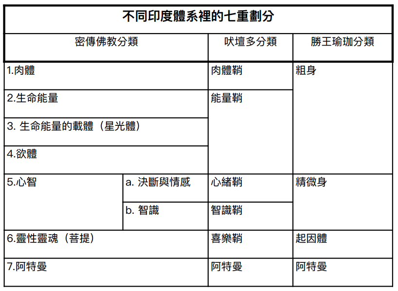
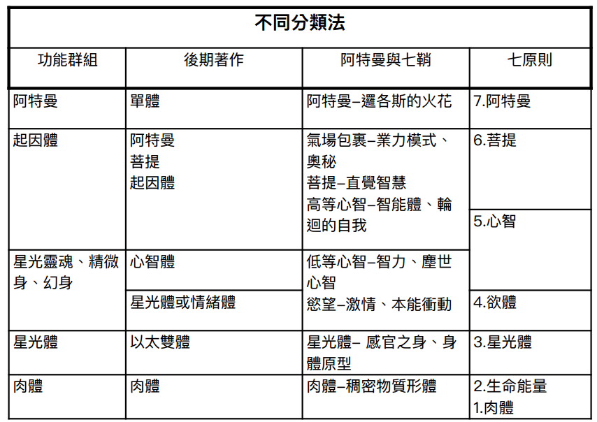
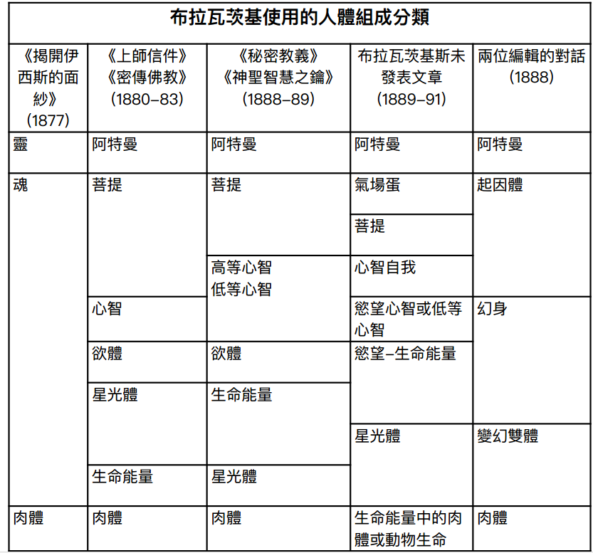

#  附錄一：七大原則

人類組成的不同劃分方式

#第七原則 —— 阿特曼（ Atma ，靈）

人類不朽的單體 —— 阿特曼，或稱每一個人類所擁有的光輝之靈。（《秘密教義》卷一，第 120 頁）

地上有多少人，天界就有多少神靈；然而這些神靈實際上是一體的，因為在每一個活動周期結束後，它們都會像落日餘暉般，收回到本源光體 —— 未顯現的邏各斯之中，而邏各斯最終又融入至一絕對者。（《文集》第 12 卷，第 533 頁）

阿特曼既不進展、不遺忘、也不記憶。它並不屬於這個層面：它只是那道永恆光芒，照耀並穿透物質的黑暗 —— 只要物質願意接受。（《秘密教義》卷一，第 244 頁）

## 第六原則 —— 菩提（ Buddhi ，靈性之魂）

當宇宙意念專注於某一原則或載體時，便會產生個體自我的意識。因載體的層次不同，而有不同的顯現 …… 通過心智載體而湧現為「心智 - 意識」；通過更為精微分化的結構（物質的第六狀態） ，成為 以心智經驗為基礎的菩提，如同一股靈性的直覺之流。（同上， 1:329 注）

菩提是一面映照絕對極樂的鏡子 …… 但這種映照本身仍未脫離無知，非至高靈，受制於條件，是原質的靈性變化和結果；唯有「阿特曼」才是真實且永恆的 …… 「至一見證者」。（同上， 1:570 ）

人的第六原則（菩提，神聖之魂）雖在我們的觀念中只是氣息，但相較於其承載的神聖之「靈」（阿特曼）而言，菩提仍屬物質。在寓言中，宇宙電試圖將純粹的靈（遍一絕對者不可分割的光線）與靈魂結合，這兩者在人成為「單體」。（同上， 1:119 ）

從嚴格的形而上學角度來看，將「阿特曼 - 菩提」稱為「單體」或許並不準確，因為從唯物主義觀點來看是二元的，因而是複合體。但 …… 如同宇宙與賦予其生命的神是不可分割，「阿特曼 - 菩提」」亦不可分割。（同上， 1:179 ）

「一位禪那主必然是 『 阿特曼—菩提 』 ；一旦 『 菩提 - 心智 』 脫離了其不朽的阿特曼（其載體是菩提），阿特曼便進入 『 非存在 』 ，即絕對存在。」（同上， 1:193 ）

## 第五原則 —— 心智（人類之魂）

神聖智慧彌漫於無限的宇宙之中，而我們非人格的本體又是其中不可分割的一部分，因此，本體的阿特曼之光只能集中於既永恆又是個體性的存在 —— 也就是說，集中於理智原則，即顯現於每一個理性存在內在的神，或是與菩提合一的高等心智。（《智慧的雙重面向》，《路西法》雜志， 1890 年 9 月，第 4 頁）

人類之魂 —— 心智 …… 是二元的 …… 因此，我們稱之為心智的兩個原則或面向，即高等與低等心智；高等心智是思考的、有意識的自我，趨向於靈性之魂（菩提）；低等心智則為本能原則，被吸引向慾望，即動物性欲望與激情的根源。（《神聖智慧之鑰》，第 73 頁）

心智 …… 才是真正投生且永恆的靈性自我，即「個體性」，而我們無數不同的人格只是其外在面具。（同上，第 83 頁注）

正是這個自我，這個「起因身」，籠罩著每個因業力而必須投生的個體；此自我在每一個新身體或人格所犯下的罪行，都須負起責任。人格是轉瞬即逝的面具，在漫長的輪迴中掩蓋了真正的個體。（同上，第 83-84 頁）

由於心智的低等方面是塵世心智，因此只能提供基於此心智的宇宙感知；無法給予靈性異象。（同上，第 100 頁）

「菩提 - 心智」是無制約且不朽的，但低等心智則非如此 …… 心智在其低等層面上，是塵世人格的質性屬性。（同上，第 100 頁）

在純粹形而上學的層面上，心智比菩提再低一階，但依然遠高於肉體之人，以至於無法與人格直接相聯繫，除非通過其映像 —— 低等心智 …… 「菩提 - 心智 」 在其周期性轉世期間，無法直接顯現，除非借助人類心智或稱低等心智 …… 因此，低等心智或思維人格的任務是，若想與其神（神聖自我）融合，就必須消除或削弱物質形體的屬性。（《文集》，第 12 卷，第 630-631 頁）

## 第四原則 —— 欲體（動物之魂）

「阿特曼-菩提」在塵世上若希望具有個體性，若要成為人，需有：（ a ）心智，即心智自我，能夠自我認知；以及（ b ）塵世的虛假人格，或稱由自私欲望和人格意志構成的身體，如同一個樞紐，將整體凝聚在人的物質形體上。（《秘密教義》，第二卷，第 241 頁）

欲體 …… 是動物欲望和激情的中心 …… 這是動物性人的核心，也是區分凡人與不朽實體的分界線。（《神聖智慧之鑰》，第 56 頁）
…… 動物欲望的原則，在物質生命中燃燒得極為熾烈，最終導致厭倦；這與動物性存在密不可分。（《秘密教義》，第二卷，第 593 頁）
…… 這是最危險、最狡詐的原則。（《最高科學的悖論》，第 123 頁注）
要擺脫欲望，我們必須徹底消除一切物質本能 —— 「消滅物質」。肉體具有習慣性，會機械性地重複好的衝動和壞的衝動。（《布拉瓦茨基夫人密傳團體教導》，第 41-42 頁）

## 第三原則 —— 星光體

星光體 …… 是不活躍的載體或形體，肉體正是依此塑造而成；這是生命的載體。在肉體分解後不久便會消散。（《秘密教義》，卷二，第 593 頁）

…… 人有自己的「雙體 」 或恰當的稱為「幽靈」，肉體胎兒（未來的人）正是圍繞此而形成。母親的想像力或孩子受的意外都會影響到星光體 …… 這個「雙體」與人俱生，隨人而亡，在有生之年永遠無法遠離肉體。雖然星光體在肉體死後依然存在，但會與屍體同步分解。在某些氛圍條件下，人們會在墳墓上方看到發光的人形，那正是逝者的星光體。（《兩位編輯的對話》，《路西法》雜志， 1888 年 12 月，第 328 頁）

星光體是生命能量與肉體之間的中介，負責注入生命力。（《布拉瓦茨基夫人秘傳團體教導》，第 120 頁）

## 第二原則 —— 生命能量（生命力）

「生命能量」或「生命」，嚴格來說，是阿特曼（普遍生命與遍一本體）的輻射力或能量，並顯現在較低層面，或者說（作用於）更為物質化的層面。生命能量滲透於客觀宇宙的整體存在；之所以被稱為「原則」，僅僅因為這是不可或缺的因素，是活人生命中的「幕後推手」。（《神聖智慧之鑰》，第 108 頁）

實際上，生命即是神，是梵。但要在物質層面顯現，必須將之吸收；而純粹的物質層面太過粗顯，因此必須有一個媒介，即星光體。（《布拉瓦茨基夫人密傳團體教導》，第 120 頁）

星光體支撐著生命；是生命的蓄水池或海綿，從周圍一切自然界中吸收生命力，是生命能量與物質之間的中介。（同上，第 119 頁）

生命能量是諸生命的根源。舉個例子，一塊海綿浸泡於海洋中，海綿內部的水可以比作生命能量，外部則是普遍生命。生命能量是生命中的動力原則。諸生物離開生命能量，但生命能量不會離開它們。把海綿從水中取出後，會變乾，這象徵著死亡。（同上，第 25 頁）

##第一原則 —— 肉體

身體的粗顯物質；基於星光體而形成與塑造，並受生命能量作用。（《秘密教義》，卷二，第 593 頁）

人的身體與其所處的行星體緊密相連，並永遠存在於其中。（《大師致辛尼特信》，第 119 頁）

