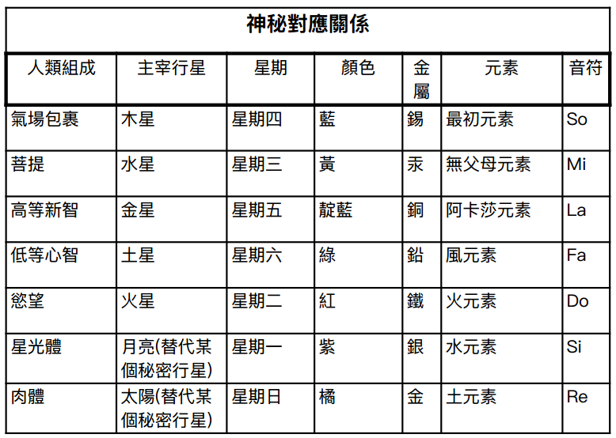

#  附錄二：月亮單體的發展進程

單體在七元鏈中循環，並根據各自的進化階段、意識和功德，分為七個等級或階層。（《秘密教義》，卷一，第 171 頁）

當行星鏈的 A 星球準備就緒時，來自月亮鏈的第一類單體會投生在最低界中，之後依次類推。在第一輪次結束後，只有第一類單體能夠達到人類的發展階段，因為第二類單體到達星球的時間較晚，來不及進化到人類階段。因此，第二類單體只有在第二輪次才能達到初步的人類階段，依此類推，直到第四輪次中期。到了第四輪次，人類階段將會完全發展 ， 「通往人類界的大門」也會關閉；從此以後，「人類」單體的數量，即處於人類發展階段的單體，將不再增加。此時還尚未達到人類階段的單體，由於人類持續進化而被遠遠甩在後頭，只有在最後第七輪次結束時，才能達到人類階段。因此，他們不會成為此鏈上的人類，而是在未來顯現期中形成新的人類，並在更高等的鏈上成為「人」，作為業力補償。對此，只有一個例外 …… （同上， 1:173 ）

眾單體大致可以分為三大類：

1\.  最為進化的單體（諸月神或印度所謂的「祖靈」），其職責是在第一輪次中，以最為空靈、朦朧和初始的形態，依次經歷礦物、植物和動物三重循環，以便能夠披上新行星鏈的本質並與之同化。這些是最早在第一輪次 A 星球上達到人類形體的存在（若能將「形體」這個詞用在幾乎是主觀領的域中）。因而在第二和第三輪次中，他們引領並代表著人類元素，並在第四輪次開始時，演化出「影體」給第二類單體（即緊隨其後的單體）。

2\. 第二類單體 在前三個半輪次中最先達到人類階段，並成為人的單體。

3\. 第三類是 落後的單體；由於業力障礙，這些單體在本輪次周期內將無法達到人類階段 …… （同上， 1:174-5 ）

最為進化的的單體（即「月亮單體」）在第一輪次中就到達了人類的胚芽階段；到了第三輪次末期，成為地球上的人類，但仍非常空靈，並在「休止期」內留在這個星球上，作為第四輪次未來人類的種子，因而在第四輪次開始時，成為人類的先軀者。其他單體則要到後來的輪次中，才進入人類階段，也就是在第二輪次、第三輪次、與第四輪次前半段。最後，發展最為遲緩的單體 —— 即在第四輪次中間轉捩點仍處於動物形態的 —— 在本次顯現期中將無法成為人類，只有在第七輪次結束時，才達到人類的邊緣。在休止期後，先驅者（在這些輪次結束時處於領導地位的人，或稱人類的始祖或種子人類）會引導他們進入新的行星鏈。（同上， 1:182 ）

在下降的尺度中，每一輪次都重演前一輪次，只是更為具體。在三個高等層面上，每個星球都是前一個空靈星球的複製品，只是更加粗顯、更物質化，直至我們的第四星球（即地球） …… 因此，很明顯，在地球當前輪次或生命周期中，所謂的人類「起源」，必須與前一輪次有著相同的地位和順序，只在時間與細節上相異，以符合當地條件。每一輪次的工作分配給了不同的「造物主」或「建築師」群體，不同星球也是如此；也就是說，每個星球都在特殊的「建造者」、「守望者」 、各種 禪那主的監督和指導下進行。其中有個特殊的階層被委派「創造」人類；在本輪次中，他們造出了「影子人」，如第三輪次中更高、更具靈性的群體所做的。（同上， 1:232-3 ）

在前幾輪次中，統治的諸君已完成自身在地球及其他世界的周期。在未來的顯現期中，他們將升入比此行星世界更高的體系；進行替補的是我們人類中「受揀選者」 —— 即在艱難進步道路上開拓前行的先驅者。在下一個大顯現期時，將見證此周期的人類成為新一代人類的導師和引導者。新一代人類的單體此時可能還囚禁在動物界中最聰慧的物種內，處於半覺知狀態，而其低等原則在植物界最高等物種中活化。（同上， 1:267 ）

